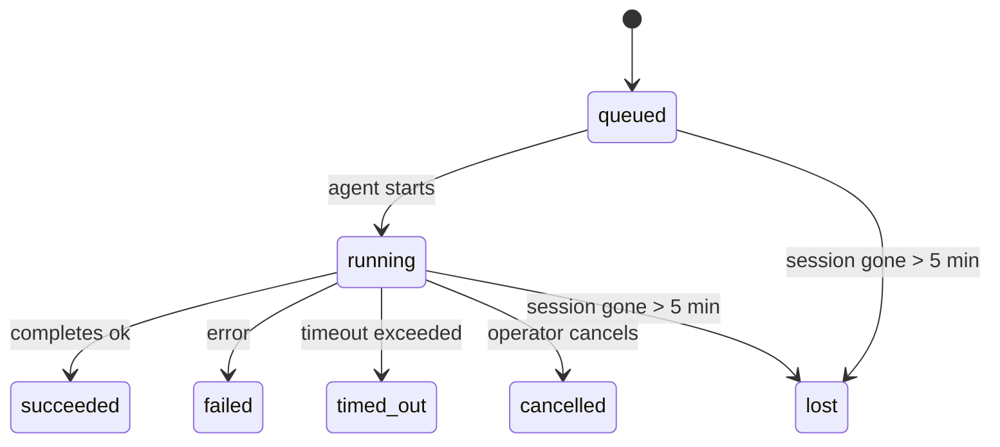

---
read_when:
    - فحص العمل الجاري في الخلفية أو الذي اكتمل مؤخرًا
    - تصحيح أخطاء فشل التسليم لعمليات تشغيل الوكيل المنفصلة
    - فهم كيفية ارتباط عمليات التشغيل في الخلفية بالجلسات وcron وإشارة النبض
summary: تتبّع المهام في الخلفية لعمليات ACP، والوكلاء الفرعيين، ووظائف cron المعزولة، وعمليات CLI
title: المهام في الخلفية
x-i18n:
    generated_at: "2026-04-10T07:17:39Z"
    model: gpt-5.4
    provider: openai
    source_hash: d7b5ba41f1025e0089986342ce85698bc62f676439c3ccf03f3ed146beb1b1ac
    source_path: automation/tasks.md
    workflow: 15
---

# المهام في الخلفية

> **هل تبحث عن الجدولة؟** راجع [الأتمتة والمهام](/ar/automation) لاختيار الآلية المناسبة. تغطي هذه الصفحة **تتبّع** العمل في الخلفية، وليس جدولته.

تتتبّع المهام في الخلفية العمل الذي يُشغَّل **خارج جلسة المحادثة الرئيسية**:
عمليات ACP، وتشغيل الوكلاء الفرعيين، وتنفيذ وظائف cron المعزولة، والعمليات التي يبدأها CLI.

لا تحل المهام محل الجلسات أو وظائف cron أو heartbeat — بل هي **سجل النشاط** الذي يسجّل ما الذي حدث من عمل منفصل، ومتى حدث، وما إذا كان قد نجح.

<Note>
ليست كل عمليات تشغيل الوكيل تُنشئ مهمة. عمليات heartbeat والمحادثة التفاعلية العادية لا تفعل ذلك. جميع عمليات تنفيذ cron، وعمليات تشغيل ACP، وعمليات تشغيل الوكلاء الفرعيين، وأوامر الوكيل عبر CLI تنشئ مهام.
</Note>

## باختصار

- المهام هي **سجلات** وليست مجدولات — cron وheartbeat يحددان _متى_ يُشغَّل العمل، بينما تتتبّع المهام _ما الذي حدث_.
- تنشئ ACP، والوكلاء الفرعيون، وجميع وظائف cron، وعمليات CLI مهام. أما عمليات heartbeat فلا تنشئها.
- تنتقل كل مهمة عبر `queued → running → terminal` (succeeded أو failed أو timed_out أو cancelled أو lost).
- تظل مهام cron نشطة ما دام وقت تشغيل cron لا يزال يملك الوظيفة؛ وتظل مهام CLI المدعومة بالدردشة نشطة فقط ما دام سياق التشغيل المالك لها لا يزال فعالًا.
- الاكتمال يعتمد على الدفع: يمكن للعمل المنفصل أن يُخطر مباشرة أو يوقظ جلسة الطالب/heartbeat عند انتهائه، لذلك تكون حلقات استطلاع الحالة عادةً الشكل غير المناسب.
- تُجري عمليات cron المعزولة وعمليات اكتمال الوكلاء الفرعيين تنظيفًا بأفضل جهد ممكن لعلامات تبويب/عمليات المتصفح المتتبَّعة الخاصة بالجلسة الفرعية قبل تسجيلات التنظيف النهائية.
- يمنع تسليم cron المعزول الردود المرحلية القديمة من الأصل بينما لا يزال عمل الوكيل الفرعي التابع قيد التصريف، ويفضّل مخرجات التابع النهائية عندما تصل قبل التسليم.
- تُسلَّم إشعارات الاكتمال مباشرة إلى قناة أو تُوضَع في قائمة انتظار heartbeat التالي.
- يعرض `openclaw tasks list` جميع المهام؛ ويُظهر `openclaw tasks audit` المشكلات.
- تُحتفَظ بالسجلات النهائية لمدة 7 أيام، ثم تُزال تلقائيًا.

## البدء السريع

```bash
# سرد جميع المهام (الأحدث أولًا)
openclaw tasks list

# التصفية حسب بيئة التشغيل أو الحالة
openclaw tasks list --runtime acp
openclaw tasks list --status running

# عرض تفاصيل مهمة محددة (بالمعرّف أو معرّف التشغيل أو مفتاح الجلسة)
openclaw tasks show <lookup>

# إلغاء مهمة قيد التشغيل (يُنهي الجلسة الفرعية)
openclaw tasks cancel <lookup>

# تغيير سياسة الإشعارات لمهمة
openclaw tasks notify <lookup> state_changes

# تشغيل تدقيق سلامة
openclaw tasks audit

# معاينة الصيانة أو تطبيقها
openclaw tasks maintenance
openclaw tasks maintenance --apply

# فحص حالة TaskFlow
openclaw tasks flow list
openclaw tasks flow show <lookup>
openclaw tasks flow cancel <lookup>
```

## ما الذي يُنشئ مهمة

| المصدر                 | نوع بيئة التشغيل | وقت إنشاء سجل المهمة                              | سياسة الإشعارات الافتراضية |
| ---------------------- | ---------------- | ------------------------------------------------- | -------------------------- |
| عمليات ACP في الخلفية  | `acp`            | تشغيل جلسة ACP فرعية                              | `done_only`                |
| تنظيم الوكلاء الفرعيين | `subagent`       | تشغيل وكيل فرعي عبر `sessions_spawn`              | `done_only`                |
| وظائف cron (كل الأنواع) | `cron`          | كل تنفيذ لـ cron (الجلسة الرئيسية والمعزولة)      | `silent`                   |
| عمليات CLI             | `cli`            | أوامر `openclaw agent` التي تعمل عبر البوابة      | `silent`                   |
| وظائف وسائط الوكيل     | `cli`            | عمليات `video_generate` المدعومة بالجلسة          | `silent`                   |

تستخدم مهام cron الخاصة بالجلسة الرئيسية سياسة الإشعارات `silent` افتراضيًا — فهي تُنشئ سجلات للتتبّع ولكنها لا تولّد إشعارات. كما تستخدم مهام cron المعزولة أيضًا `silent` افتراضيًا، لكنها أكثر وضوحًا لأنها تعمل في جلستها الخاصة.

تستخدم عمليات `video_generate` المدعومة بالجلسة أيضًا سياسة الإشعارات `silent`. ومع ذلك، فإنها تُنشئ سجلات مهام، لكن الاكتمال يُعاد إلى جلسة الوكيل الأصلية كتنبيه داخلي حتى يتمكّن الوكيل من كتابة رسالة المتابعة وإرفاق الفيديو المكتمل بنفسه. إذا فعّلت `tools.media.asyncCompletion.directSend`، فستحاول عمليات الاكتمال غير المتزامنة لـ `music_generate` و`video_generate` أولًا التسليم المباشر إلى القناة قبل الرجوع إلى مسار إيقاظ جلسة الطالب.

وأثناء استمرار مهمة `video_generate` المدعومة بالجلسة، تعمل الأداة أيضًا كحاجز حماية: إذ إن استدعاءات `video_generate` المتكررة في الجلسة نفسها تُرجع حالة المهمة النشطة بدلًا من بدء توليد ثانٍ متزامن. استخدم `action: "status"` عندما تريد بحثًا صريحًا عن التقدّم/الحالة من جهة الوكيل.

**ما الذي لا يُنشئ مهام:**

- عمليات heartbeat — الجلسة الرئيسية؛ راجع [Heartbeat](/ar/gateway/heartbeat)
- أدوار المحادثة التفاعلية العادية
- الاستجابات المباشرة لـ `/command`

## دورة حياة المهمة



| الحالة      | ما الذي تعنيه                                                               |
| ----------- | --------------------------------------------------------------------------- |
| `queued`    | أُنشئت وتنتظر بدء الوكيل                                                     |
| `running`   | دور الوكيل قيد التنفيذ الفعلي                                                |
| `succeeded` | اكتملت بنجاح                                                                |
| `failed`    | اكتملت مع حدوث خطأ                                                           |
| `timed_out` | تجاوزت المهلة المكوَّنة                                                      |
| `cancelled` | أوقفها المشغّل عبر `openclaw tasks cancel`                                  |
| `lost`      | فقدت بيئة التشغيل حالة الارتكاز المعتمدة بعد فترة سماح مدتها 5 دقائق         |

تحدث الانتقالات تلقائيًا — عندما ينتهي تشغيل الوكيل المرتبط، تتحدّث حالة المهمة لتطابقه.

تكون `lost` واعية ببيئة التشغيل:

- مهام ACP: اختفت بيانات جلسة ACP الفرعية الداعمة.
- مهام الوكيل الفرعي: اختفت الجلسة الفرعية الداعمة من مخزن الوكيل المستهدف.
- مهام cron: لم يعد وقت تشغيل cron يتتبّع الوظيفة على أنها نشطة.
- مهام CLI: تستخدم مهام الجلسات الفرعية المعزولة الجلسة الفرعية؛ أما مهام CLI المدعومة بالدردشة فتستخدم سياق التشغيل الحي المالك بدلًا من ذلك، لذلك فإن صفوف الجلسات العالقة للقناة/المجموعة/الرسائل المباشرة لا تُبقيها نشطة.

## التسليم والإشعارات

عندما تصل المهمة إلى حالة نهائية، يقوم OpenClaw بإخطارك. هناك مساران للتسليم:

**التسليم المباشر** — إذا كان للمهمة هدف قناة (أي `requesterOrigin`)، تُرسل رسالة الاكتمال مباشرة إلى تلك القناة (Telegram أو Discord أو Slack أو غيرها). وبالنسبة إلى عمليات اكتمال الوكلاء الفرعيين، يحافظ OpenClaw أيضًا على توجيه الخيط/الموضوع المرتبط عند توفره، ويمكنه ملء `to` / الحساب المفقود من المسار المخزَّن في جلسة الطالب (`lastChannel` / `lastTo` / `lastAccountId`) قبل التخلي عن التسليم المباشر.

**التسليم المُدرَج في قائمة انتظار الجلسة** — إذا فشل التسليم المباشر أو لم يكن هناك أصل مضبوط، يُوضَع التحديث في قائمة الانتظار كحدث نظام في جلسة الطالب ويظهر في heartbeat التالي.

<Tip>
يؤدي اكتمال المهمة إلى تشغيل إيقاظ heartbeat فوري حتى ترى النتيجة بسرعة — لا تحتاج إلى انتظار نبضة heartbeat المجدولة التالية.
</Tip>

وهذا يعني أن سير العمل المعتاد يعتمد على الدفع: ابدأ العمل المنفصل مرة واحدة، ثم دع وقت التشغيل يوقظك أو يخطرك عند الاكتمال. لا تستطلع حالة المهمة إلا عندما تحتاج إلى التصحيح أو التدخل أو تدقيق صريح.

### سياسات الإشعارات

تحكّم في مقدار ما تريد سماعه عن كل مهمة:

| السياسة              | ما الذي يتم تسليمه                                                          |
| -------------------- | --------------------------------------------------------------------------- |
| `done_only` (افتراضي) | الحالة النهائية فقط (succeeded أو failed أو غير ذلك) — **وهذا هو الافتراضي** |
| `state_changes`      | كل انتقال حالة وتحديث تقدّم                                                 |
| `silent`             | لا شيء على الإطلاق                                                          |

غيّر السياسة أثناء تشغيل المهمة:

```bash
openclaw tasks notify <lookup> state_changes
```

## مرجع CLI

### `tasks list`

```bash
openclaw tasks list [--runtime <acp|subagent|cron|cli>] [--status <status>] [--json]
```

أعمدة المخرجات: معرّف المهمة، النوع، الحالة، التسليم، معرّف التشغيل، الجلسة الفرعية، الملخّص.

### `tasks show`

```bash
openclaw tasks show <lookup>
```

يقبل رمز البحث معرّف المهمة أو معرّف التشغيل أو مفتاح الجلسة. ويعرض السجل الكامل بما في ذلك التوقيت، وحالة التسليم، والخطأ، والملخّص النهائي.

### `tasks cancel`

```bash
openclaw tasks cancel <lookup>
```

بالنسبة إلى مهام ACP ومهام الوكيل الفرعي، يؤدي هذا إلى إنهاء الجلسة الفرعية. أما بالنسبة إلى المهام المتتبَّعة عبر CLI، فيُسجَّل الإلغاء في سجل المهام (ولا يوجد مقبض منفصل لوقت تشغيل فرعي). وتنتقل الحالة إلى `cancelled` ويُرسل إشعار تسليم عند الاقتضاء.

### `tasks notify`

```bash
openclaw tasks notify <lookup> <done_only|state_changes|silent>
```

### `tasks audit`

```bash
openclaw tasks audit [--json]
```

يُظهر المشكلات التشغيلية. كما تظهر النتائج أيضًا في `openclaw status` عند اكتشاف مشكلات.

| النتيجة                    | الخطورة | المُشغِّل                                               |
| -------------------------- | ------- | ------------------------------------------------------- |
| `stale_queued`             | warn    | بقيت في حالة انتظار لأكثر من 10 دقائق                   |
| `stale_running`            | error   | بقيت في حالة تشغيل لأكثر من 30 دقيقة                    |
| `lost`                     | error   | اختفت ملكية المهمة المدعومة ببيئة التشغيل               |
| `delivery_failed`          | warn    | فشل التسليم وسياسة الإشعارات ليست `silent`              |
| `missing_cleanup`          | warn    | مهمة نهائية بلا طابع زمني للتنظيف                       |
| `inconsistent_timestamps`  | warn    | انتهاك في التسلسل الزمني (مثلًا انتهت قبل أن تبدأ)      |

### `tasks maintenance`

```bash
openclaw tasks maintenance [--json]
openclaw tasks maintenance --apply [--json]
```

استخدم هذا لمعاينة أو تطبيق التسوية، ووضع طابع زمني للتنظيف، والتقليم للمهام وحالة Task Flow.

التسوية واعية ببيئة التشغيل:

- تتحقق مهام ACP/الوكيل الفرعي من الجلسة الفرعية الداعمة.
- تتحقق مهام cron مما إذا كان وقت تشغيل cron لا يزال يملك الوظيفة.
- تتحقق مهام CLI المدعومة بالدردشة من سياق التشغيل الحي المالك، وليس فقط من صف جلسة الدردشة.

تنظيف الاكتمال واعٍ أيضًا ببيئة التشغيل:

- يجري اكتمال الوكيل الفرعي إغلاقًا بأفضل جهد ممكن لعلامات تبويب/عمليات المتصفح المتتبَّعة الخاصة بالجلسة الفرعية قبل متابعة تنظيف الإعلان.
- يجري اكتمال cron المعزول إغلاقًا بأفضل جهد ممكن لعلامات تبويب/عمليات المتصفح المتتبَّعة الخاصة بجلسة cron قبل إنهاء التشغيل بالكامل.
- ينتظر تسليم cron المعزول متابعة الوكيل الفرعي التابع عند الحاجة ويمنع نص الإقرار القديم من الأصل بدلًا من إعلانه.
- يفضّل تسليم اكتمال الوكيل الفرعي أحدث نص مرئي من المساعد؛ وإذا كان فارغًا، فإنه يرجع إلى أحدث نص من الأداة/نتيجة الأداة بعد تنقيته، ويمكن لعمليات استدعاء الأدوات التي تنتهي بالمهلة فقط أن تُختصر إلى ملخّص قصير للتقدّم الجزئي.
- لا تُخفي إخفاقات التنظيف النتيجة الحقيقية للمهمة.

### `tasks flow list|show|cancel`

```bash
openclaw tasks flow list [--status <status>] [--json]
openclaw tasks flow show <lookup> [--json]
openclaw tasks flow cancel <lookup>
```

استخدم هذه الأوامر عندما يكون Task Flow المنظِّم هو ما يهمك بدلًا من سجل مهمة خلفية فردي.

## لوحة مهام الدردشة (`/tasks`)

استخدم `/tasks` في أي جلسة دردشة لرؤية المهام في الخلفية المرتبطة بتلك الجلسة. تعرض اللوحة
المهام النشطة والتي اكتملت مؤخرًا مع بيئة التشغيل، والحالة، والتوقيت، وتفاصيل التقدّم أو الخطأ.

عندما لا تحتوي الجلسة الحالية على مهام مرتبطة مرئية، يعود `/tasks` إلى عدد المهام المحلية الخاصة بالوكيل
بحيث تظل تحصل على نظرة عامة من دون كشف تفاصيل الجلسات الأخرى.

للحصول على سجل المشغّل الكامل، استخدم CLI: `openclaw tasks list`.

## التكامل مع الحالة (ضغط المهام)

يتضمن `openclaw status` ملخّصًا سريعًا للمهام:

```
Tasks: 3 queued · 2 running · 1 issues
```

يبلّغ الملخّص عن:

- **active** — عدد `queued` + `running`
- **failures** — عدد `failed` + `timed_out` + `lost`
- **byRuntime** — تقسيم حسب `acp` و`subagent` و`cron` و`cli`

يستخدم كل من `/status` وأداة `session_status` لقطة مهام واعية بالتنظيف: تُفضَّل المهام النشطة،
وتُخفى الصفوف المكتملة القديمة، ولا تظهر الإخفاقات الأخيرة إلا عندما لا يبقى أي عمل نشط.
وهذا يُبقي بطاقة الحالة مركّزة على ما يهم الآن.

## التخزين والصيانة

### مكان وجود المهام

تُحفَظ سجلات المهام في SQLite في:

```
$OPENCLAW_STATE_DIR/tasks/runs.sqlite
```

يُحمَّل السجل إلى الذاكرة عند بدء تشغيل البوابة ويزامن عمليات الكتابة إلى SQLite لضمان الاستمرارية عبر إعادة التشغيل.

### الصيانة التلقائية

يعمل مُنظِّف كل **60 ثانية** ويتعامل مع ثلاثة أمور:

1. **التسوية** — يتحقق مما إذا كانت المهام النشطة لا تزال تملك ارتكازًا معتمدًا من بيئة التشغيل. تستخدم مهام ACP/الوكيل الفرعي حالة الجلسة الفرعية، وتستخدم مهام cron ملكية الوظيفة النشطة، وتستخدم مهام CLI المدعومة بالدردشة سياق التشغيل المالك. إذا اختفت حالة الارتكاز هذه لأكثر من 5 دقائق، تُعلَّم المهمة على أنها `lost`.
2. **وضع طابع زمني للتنظيف** — يضبط طابعًا زمنيًا `cleanupAfter` على المهام النهائية (`endedAt + 7 days`).
3. **التقليم** — يحذف السجلات التي تجاوزت تاريخ `cleanupAfter` الخاص بها.

**الاحتفاظ**: تُحفَظ سجلات المهام النهائية لمدة **7 أيام**، ثم تُقلَّم تلقائيًا. لا حاجة إلى أي إعداد.

## كيفية ارتباط المهام بالأنظمة الأخرى

### المهام وTask Flow

يشكّل [Task Flow](/ar/automation/taskflow) طبقة تنظيم التدفق فوق المهام في الخلفية. قد ينسّق تدفق واحد عدة مهام على مدى عمره باستخدام أوضاع مزامنة مُدارة أو معكوسة. استخدم `openclaw tasks` لفحص سجلات المهام الفردية، واستخدم `openclaw tasks flow` لفحص التدفق المنظِّم.

راجع [Task Flow](/ar/automation/taskflow) للحصول على التفاصيل.

### المهام وcron

يوجد **تعريف** وظيفة cron في `~/.openclaw/cron/jobs.json`. يُنشئ **كل** تنفيذ لـ cron سجل مهمة — سواء في الجلسة الرئيسية أو المعزولة. تستخدم مهام cron الخاصة بالجلسة الرئيسية سياسة الإشعارات `silent` افتراضيًا حتى تتتبّع من دون توليد إشعارات.

راجع [وظائف Cron](/ar/automation/cron-jobs).

### المهام وheartbeat

عمليات تشغيل heartbeat هي أدوار في الجلسة الرئيسية — ولا تُنشئ سجلات مهام. وعندما تكتمل مهمة، يمكنها تشغيل إيقاظ heartbeat حتى ترى النتيجة بسرعة.

راجع [Heartbeat](/ar/gateway/heartbeat).

### المهام والجلسات

قد تشير المهمة إلى `childSessionKey` (حيث يُشغَّل العمل) و`requesterSessionKey` (من الذي بدأها). الجلسات هي سياق المحادثة؛ أما المهام فهي طبقة تتبّع النشاط فوق ذلك.

### المهام وعمليات تشغيل الوكيل

يرتبط `runId` الخاص بالمهمة بعملية تشغيل الوكيل التي تنفّذ العمل. وتعمل أحداث دورة حياة الوكيل (البدء، والانتهاء، والخطأ) على تحديث حالة المهمة تلقائيًا — ولا تحتاج إلى إدارة دورة الحياة يدويًا.

## ذو صلة

- [الأتمتة والمهام](/ar/automation) — جميع آليات الأتمتة بنظرة سريعة
- [Task Flow](/ar/automation/taskflow) — تنظيم التدفق فوق المهام
- [المهام المجدولة](/ar/automation/cron-jobs) — جدولة العمل في الخلفية
- [Heartbeat](/ar/gateway/heartbeat) — أدوار دورية في الجلسة الرئيسية
- [CLI: المهام](/cli/index#tasks) — مرجع أوامر CLI
