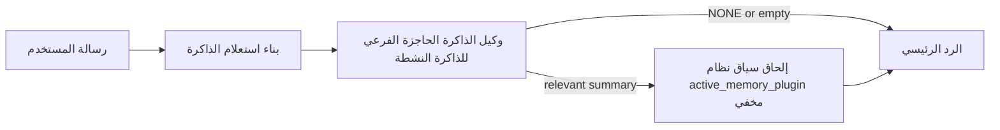

---
read_when:
    - تريد أن تفهم الغرض من الذاكرة النشطة
    - تريد تفعيل الذاكرة النشطة لوكيل محادثة
    - تريد ضبط سلوك الذاكرة النشطة دون تفعيلها في كل مكان
summary: وكيل فرعي للذاكرة الحاجزة مملوك للمكوّن الإضافي يحقن الذاكرة ذات الصلة في جلسات الدردشة التفاعلية
title: الذاكرة النشطة
x-i18n:
    generated_at: "2026-04-11T07:13:45Z"
    model: gpt-5.4
    provider: openai
    source_hash: e8b0e6539e09678e9e8def68795f8bcb992f98509423da3da3123eda88ec1dd5
    source_path: concepts/active-memory.md
    workflow: 15
---

# الذاكرة النشطة

الذاكرة النشطة هي وكيل فرعي اختياري للذاكرة الحاجزة مملوك للمكوّن الإضافي يعمل
قبل الرد الرئيسي في جلسات المحادثة المؤهلة.

وهي موجودة لأن معظم أنظمة الذاكرة قادرة ولكنها تفاعلية. فهي تعتمد على
الوكيل الرئيسي ليقرر متى يبحث في الذاكرة، أو على المستخدم ليقول أشياء
مثل "تذكّر هذا" أو "ابحث في الذاكرة". وعند تلك النقطة، تكون اللحظة التي كان
يمكن أن تجعل فيها الذاكرة الرد يبدو طبيعيًا قد مرّت بالفعل.

تمنح الذاكرة النشطة النظام فرصة واحدة محدودة لإبراز الذاكرة ذات الصلة
قبل إنشاء الرد الرئيسي.

## الصق هذا في وكيلك

الصق هذا في وكيلك إذا كنت تريد منه تفعيل الذاكرة النشطة باستخدام إعداد
مكتفٍ ذاتيًا وآمن افتراضيًا:

```json5
{
  plugins: {
    entries: {
      "active-memory": {
        enabled: true,
        config: {
          enabled: true,
          agents: ["main"],
          allowedChatTypes: ["direct"],
          modelFallbackPolicy: "default-remote",
          queryMode: "recent",
          promptStyle: "balanced",
          timeoutMs: 15000,
          maxSummaryChars: 220,
          persistTranscripts: false,
          logging: true,
        },
      },
    },
  },
}
```

يؤدي هذا إلى تشغيل المكوّن الإضافي لوكيل `main`، ويُبقيه مقصورًا افتراضيًا على
الجلسات بنمط الرسائل المباشرة، ويجعله يرث نموذج الجلسة الحالية أولًا، مع
السماح أيضًا بالرجوع الاحتياطي المدمج إلى النموذج البعيد إذا لم يتوفر أي نموذج
صريح أو موروث.

بعد ذلك، أعد تشغيل البوابة:

```bash
openclaw gateway
```

لفحصه مباشرة داخل محادثة:

```text
/verbose on
```

## تشغيل الذاكرة النشطة

أكثر إعداد أمانًا هو:

1. تفعيل المكوّن الإضافي
2. استهداف وكيل محادثة واحد
3. إبقاء التسجيل مفعّلًا فقط أثناء الضبط

ابدأ بهذا في `openclaw.json`:

```json5
{
  plugins: {
    entries: {
      "active-memory": {
        enabled: true,
        config: {
          agents: ["main"],
          allowedChatTypes: ["direct"],
          modelFallbackPolicy: "default-remote",
          queryMode: "recent",
          promptStyle: "balanced",
          timeoutMs: 15000,
          maxSummaryChars: 220,
          persistTranscripts: false,
          logging: true,
        },
      },
    },
  },
}
```

ثم أعد تشغيل البوابة:

```bash
openclaw gateway
```

ما يعنيه هذا:

- `plugins.entries.active-memory.enabled: true` يشغّل المكوّن الإضافي
- `config.agents: ["main"]` يفعّل الذاكرة النشطة لوكيل `main` فقط
- `config.allowedChatTypes: ["direct"]` يُبقي الذاكرة النشطة مفعّلة افتراضيًا فقط للجلسات بنمط الرسائل المباشرة
- إذا لم يتم تعيين `config.model`، فستَرِث الذاكرة النشطة نموذج الجلسة الحالية أولًا
- `config.modelFallbackPolicy: "default-remote"` يُبقي الرجوع الاحتياطي المدمج إلى النموذج البعيد هو الخيار الافتراضي عندما لا يتوفر نموذج صريح أو موروث
- `config.promptStyle: "balanced"` يستخدم نمط المطالبة الافتراضي للأغراض العامة لوضع `recent`
- تظل الذاكرة النشطة تعمل فقط في جلسات الدردشة التفاعلية الدائمة المؤهلة

## كيفية رؤيتها

تحقن الذاكرة النشطة سياق نظام مخفيًا للنموذج. وهي لا تعرض
وسوم `<active_memory_plugin>...</active_memory_plugin>` الخام للعميل.

## تبديل الجلسة

استخدم أمر المكوّن الإضافي عندما تريد إيقاف الذاكرة النشطة مؤقتًا أو استئنافها
لجلسة الدردشة الحالية دون تعديل الإعدادات:

```text
/active-memory status
/active-memory off
/active-memory on
```

هذا النطاق خاص بالجلسة. وهو لا يغيّر
`plugins.entries.active-memory.enabled` أو استهداف الوكيل أو أي إعداد
عام آخر.

إذا كنت تريد أن يكتب الأمر الإعدادات ويوقف الذاكرة النشطة مؤقتًا أو يستأنفها
لجميع الجلسات، فاستخدم الصيغة العامة الصريحة:

```text
/active-memory status --global
/active-memory off --global
/active-memory on --global
```

تكتب الصيغة العامة القيمة `plugins.entries.active-memory.config.enabled`. وهي تترك
`plugins.entries.active-memory.enabled` مفعّلًا حتى يظل الأمر متاحًا
لتشغيل الذاكرة النشطة مرة أخرى لاحقًا.

إذا كنت تريد رؤية ما تفعله الذاكرة النشطة في جلسة مباشرة، فعّل الوضع المفصل
لهذه الجلسة:

```text
/verbose on
```

عند تفعيل الوضع المفصل، يمكن لـ OpenClaw عرض ما يلي:

- سطر حالة للذاكرة النشطة مثل `Active Memory: ok 842ms recent 34 chars`
- ملخص تصحيح مقروء مثل `Active Memory Debug: Lemon pepper wings with blue cheese.`

هذه السطور مشتقة من نفس تمريرة الذاكرة النشطة التي تغذي سياق
النظام المخفي، لكنها منسقة للبشر بدلًا من عرض ترميز المطالبة الخام.

افتراضيًا، يكون نص وكيل الذاكرة الحاجزة الفرعي مؤقتًا ويُحذف
بعد اكتمال التشغيل.

مثال على التدفق:

```text
/verbose on
what wings should i order?
```

شكل الرد المرئي المتوقع:

```text
...normal assistant reply...

🧩 Active Memory: ok 842ms recent 34 chars
🔎 Active Memory Debug: Lemon pepper wings with blue cheese.
```

## متى يعمل

تستخدم الذاكرة النشطة بوابتين:

1. **الاشتراك عبر الإعدادات**
   يجب تفعيل المكوّن الإضافي، ويجب أن يظهر معرّف الوكيل الحالي في
   `plugins.entries.active-memory.config.agents`.
2. **أهلية تشغيل صارمة**
   حتى عند التفعيل والاستهداف، لا تعمل الذاكرة النشطة إلا في
   جلسات الدردشة التفاعلية الدائمة المؤهلة.

القاعدة الفعلية هي:

```text
plugin enabled
+
agent id targeted
+
allowed chat type
+
eligible interactive persistent chat session
=
active memory runs
```

إذا فشل أي من هذه الشروط، فلن تعمل الذاكرة النشطة.

## أنواع الجلسات

يتحكم `config.allowedChatTypes` في أنواع المحادثات التي يمكن أن تشغّل الذاكرة
النشطة أصلًا.

القيمة الافتراضية هي:

```json5
allowedChatTypes: ["direct"]
```

وهذا يعني أن الذاكرة النشطة تعمل افتراضيًا في الجلسات بنمط الرسائل المباشرة،
ولكن ليس في جلسات المجموعات أو القنوات إلا إذا فعّلتها لها صراحة.

أمثلة:

```json5
allowedChatTypes: ["direct"]
```

```json5
allowedChatTypes: ["direct", "group"]
```

```json5
allowedChatTypes: ["direct", "group", "channel"]
```

## أين تعمل

الذاكرة النشطة هي ميزة لإثراء المحادثة، وليست ميزة استدلال
على مستوى المنصة كلها.

| السطح | هل تعمل الذاكرة النشطة؟ |
| ------------------------------------------------------------------- | ------------------------------------------------------- |
| جلسات Control UI / دردشة الويب الدائمة | نعم، إذا كان المكوّن الإضافي مفعّلًا وكان الوكيل مستهدفًا |
| جلسات القنوات التفاعلية الأخرى على مسار الدردشة الدائمة نفسه | نعم، إذا كان المكوّن الإضافي مفعّلًا وكان الوكيل مستهدفًا |
| عمليات التشغيل الأحادية غير التفاعلية | لا |
| عمليات heartbeat / الخلفية | لا |
| مسارات `agent-command` الداخلية العامة | لا |
| تنفيذ الوكلاء الفرعيين/المساعدات الداخلية | لا |

## لماذا تستخدمها

استخدم الذاكرة النشطة عندما:

- تكون الجلسة دائمة وموجّهة للمستخدم
- يمتلك الوكيل ذاكرة طويلة الأمد ذات معنى للبحث فيها
- تكون الاستمرارية والتخصيص أهم من الحتمية الخام للمطالبة

وهي تعمل بشكل جيد خصوصًا مع:

- التفضيلات المستقرة
- العادات المتكررة
- سياق المستخدم طويل الأمد الذي ينبغي أن يظهر بصورة طبيعية

وهي غير مناسبة لـ:

- الأتمتة
- العاملين الداخليين
- مهام API الأحادية
- الأماكن التي سيكون فيها التخصيص المخفي مفاجئًا

## كيف تعمل

شكل التشغيل هو:



لا يمكن لوكيل الذاكرة الحاجزة الفرعي استخدام سوى:

- `memory_search`
- `memory_get`

إذا كان الاتصال ضعيفًا، فيجب أن يعيد `NONE`.

## أوضاع الاستعلام

يتحكم `config.queryMode` في مقدار المحادثة الذي يراه وكيل الذاكرة الحاجزة الفرعي.

## أنماط المطالبة

يتحكم `config.promptStyle` في مدى الحماس أو الصرامة لدى وكيل الذاكرة الحاجزة الفرعي
عند اتخاذ قرار ما إذا كان سيعيد ذاكرة أم لا.

الأنماط المتاحة:

- `balanced`: الخيار الافتراضي العام لوضع `recent`
- `strict`: الأقل حماسًا؛ الأفضل عندما تريد أقل قدر ممكن من التأثر بالسياق القريب
- `contextual`: الأكثر ملاءمة للاستمرارية؛ الأفضل عندما يكون لتاريخ المحادثة أهمية أكبر
- `recall-heavy`: أكثر استعدادًا لإبراز الذاكرة عند وجود تطابقات أضعف لكنها لا تزال معقولة
- `precision-heavy`: يفضّل `NONE` بشدة ما لم يكن التطابق واضحًا
- `preference-only`: مُحسّن للمفضلات والعادات والروتين والذوق والحقائق الشخصية المتكررة

التعيين الافتراضي عندما لا يتم تعيين `config.promptStyle`:

```text
message -> strict
recent -> balanced
full -> contextual
```

إذا عيّنت `config.promptStyle` صراحة، فستكون لهذا التعيين أولوية.

مثال:

```json5
promptStyle: "preference-only"
```

## سياسة الرجوع الاحتياطي للنموذج

إذا لم يتم تعيين `config.model`، تحاول الذاكرة النشطة تحديد نموذج بهذا الترتيب:

```text
explicit plugin model
-> current session model
-> agent primary model
-> optional built-in remote fallback
```

يتحكم `config.modelFallbackPolicy` في الخطوة الأخيرة.

الافتراضي:

```json5
modelFallbackPolicy: "default-remote"
```

خيار آخر:

```json5
modelFallbackPolicy: "resolved-only"
```

استخدم `resolved-only` إذا كنت تريد من الذاكرة النشطة تخطي الاسترجاع بدلًا من
الرجوع إلى الافتراضي البعيد المدمج عندما لا يتوفر نموذج صريح أو موروث.

## منافذ الهروب المتقدمة

هذه الخيارات ليست جزءًا من الإعداد الموصى به عن قصد.

يمكن لـ `config.thinking` تجاوز مستوى التفكير الخاص بوكيل الذاكرة الحاجزة الفرعي:

```json5
thinking: "medium"
```

الافتراضي:

```json5
thinking: "off"
```

لا تفعّل هذا افتراضيًا. تعمل الذاكرة النشطة في مسار الرد، لذا فإن وقت
التفكير الإضافي يزيد مباشرة من زمن الاستجابة الذي يراه المستخدم.

يضيف `config.promptAppend` تعليمات إضافية للمشغّل بعد مطالبة
الذاكرة النشطة الافتراضية وقبل سياق المحادثة:

```json5
promptAppend: "Prefer stable long-term preferences over one-off events."
```

يستبدل `config.promptOverride` مطالبة الذاكرة النشطة الافتراضية. ويواصل OpenClaw
إلحاق سياق المحادثة بعد ذلك:

```json5
promptOverride: "You are a memory search agent. Return NONE or one compact user fact."
```

لا يُنصح بتخصيص المطالبة إلا إذا كنت تختبر عمدًا
عقد استرجاع مختلفًا. فالمطالبة الافتراضية مضبوطة لإرجاع `NONE`
أو سياق مضغوط لحقائق المستخدم للنموذج الرئيسي.

### `message`

يتم إرسال أحدث رسالة للمستخدم فقط.

```text
Latest user message only
```

استخدم هذا عندما:

- تريد أسرع سلوك
- تريد أقوى انحياز نحو استرجاع التفضيلات المستقرة
- لا تحتاج المنعطفات اللاحقة إلى سياق المحادثة

المهلة الموصى بها:

- ابدأ بحوالي `3000` إلى `5000` مللي ثانية

### `recent`

يتم إرسال أحدث رسالة للمستخدم مع ذيل صغير من المحادثة الأخيرة.

```text
Recent conversation tail:
user: ...
assistant: ...
user: ...

Latest user message:
...
```

استخدم هذا عندما:

- تريد توازنًا أفضل بين السرعة والارتكاز إلى المحادثة
- تعتمد أسئلة المتابعة غالبًا على آخر بضع منعطفات

المهلة الموصى بها:

- ابدأ بحوالي `15000` مللي ثانية

### `full`

يتم إرسال المحادثة الكاملة إلى وكيل الذاكرة الحاجزة الفرعي.

```text
Full conversation context:
user: ...
assistant: ...
user: ...
...
```

استخدم هذا عندما:

- تكون أفضل جودة استرجاع أهم من زمن الاستجابة
- تحتوي المحادثة على إعداد مهم في موضع بعيد داخل السلسلة

المهلة الموصى بها:

- زدها بشكل ملحوظ مقارنةً مع `message` أو `recent`
- ابدأ بحوالي `15000` مللي ثانية أو أكثر حسب حجم السلسلة

بشكل عام، يجب أن تزداد المهلة مع زيادة حجم السياق:

```text
message < recent < full
```

## الاحتفاظ بالنصوص

تؤدي عمليات تشغيل وكيل الذاكرة الحاجزة الفرعي للذاكرة النشطة إلى إنشاء نص
`session.jsonl` حقيقي أثناء استدعاء وكيل الذاكرة الحاجزة الفرعي.

افتراضيًا، يكون هذا النص مؤقتًا:

- تتم كتابته في دليل مؤقت
- يُستخدم فقط لتشغيل وكيل الذاكرة الحاجزة الفرعي
- يُحذف فورًا بعد انتهاء التشغيل

إذا كنت تريد الاحتفاظ بنصوص وكيل الذاكرة الحاجزة الفرعي على القرص لأغراض التصحيح أو
الفحص، ففعّل الاستمرارية صراحة:

```json5
{
  plugins: {
    entries: {
      "active-memory": {
        enabled: true,
        config: {
          agents: ["main"],
          persistTranscripts: true,
          transcriptDir: "active-memory",
        },
      },
    },
  },
}
```

عند التفعيل، تخزّن الذاكرة النشطة النصوص في دليل منفصل ضمن
مجلد جلسات الوكيل المستهدف، وليس في مسار نص محادثة المستخدم الرئيسي.

يكون التخطيط الافتراضي من حيث المفهوم كما يلي:

```text
agents/<agent>/sessions/active-memory/<blocking-memory-sub-agent-session-id>.jsonl
```

يمكنك تغيير الدليل الفرعي النسبي باستخدام `config.transcriptDir`.

استخدم هذا بحذر:

- يمكن أن تتراكم نصوص وكيل الذاكرة الحاجزة الفرعي بسرعة في الجلسات النشطة
- يمكن لوضع الاستعلام `full` أن يكرر قدرًا كبيرًا من سياق المحادثة
- تحتوي هذه النصوص على سياق مطالبة مخفي وذكريات مسترجعة

## الإعدادات

توجد جميع إعدادات الذاكرة النشطة تحت:

```text
plugins.entries.active-memory
```

أهم الحقول هي:

| المفتاح | النوع | المعنى |
| --------------------------- | ---------------------------------------------------------------------------------------------------- | ------------------------------------------------------------------------------------------------------ |
| `enabled` | `boolean` | يفعّل المكوّن الإضافي نفسه |
| `config.agents` | `string[]` | معرّفات الوكلاء التي يمكنها استخدام الذاكرة النشطة |
| `config.model` | `string` | مرجع نموذج اختياري لوكيل الذاكرة الحاجزة الفرعي؛ عند عدم تعيينه، تستخدم الذاكرة النشطة نموذج الجلسة الحالية |
| `config.queryMode` | `"message" \| "recent" \| "full"` | يتحكم في مقدار المحادثة الذي يراه وكيل الذاكرة الحاجزة الفرعي |
| `config.promptStyle` | `"balanced" \| "strict" \| "contextual" \| "recall-heavy" \| "precision-heavy" \| "preference-only"` | يتحكم في مدى حماس أو صرامة وكيل الذاكرة الحاجزة الفرعي عند تقرير ما إذا كان سيعيد ذاكرة |
| `config.thinking` | `"off" \| "minimal" \| "low" \| "medium" \| "high" \| "xhigh" \| "adaptive"` | تجاوز متقدم لمستوى التفكير لوكيل الذاكرة الحاجزة الفرعي؛ الافتراضي `off` من أجل السرعة |
| `config.promptOverride` | `string` | استبدال كامل متقدم للمطالبة؛ غير موصى به للاستخدام العادي |
| `config.promptAppend` | `string` | تعليمات إضافية متقدمة تُلحق بالمطالبة الافتراضية أو المستبدلة |
| `config.timeoutMs` | `number` | مهلة قصوى صارمة لوكيل الذاكرة الحاجزة الفرعي |
| `config.maxSummaryChars` | `number` | الحد الأقصى لإجمالي الأحرف المسموح بها في ملخص الذاكرة النشطة |
| `config.logging` | `boolean` | يصدر سجلات الذاكرة النشطة أثناء الضبط |
| `config.persistTranscripts` | `boolean` | يحتفظ بنصوص وكيل الذاكرة الحاجزة الفرعي على القرص بدلًا من حذف الملفات المؤقتة |
| `config.transcriptDir` | `string` | دليل نسبي لنصوص وكيل الذاكرة الحاجزة الفرعي ضمن مجلد جلسات الوكيل |

حقول مفيدة للضبط:

| المفتاح | النوع | المعنى |
| ----------------------------- | -------- | ------------------------------------------------------------- |
| `config.maxSummaryChars` | `number` | الحد الأقصى لإجمالي الأحرف المسموح بها في ملخص الذاكرة النشطة |
| `config.recentUserTurns` | `number` | منعطفات المستخدم السابقة التي يجب تضمينها عندما يكون `queryMode` هو `recent` |
| `config.recentAssistantTurns` | `number` | منعطفات المساعد السابقة التي يجب تضمينها عندما يكون `queryMode` هو `recent` |
| `config.recentUserChars` | `number` | الحد الأقصى للأحرف لكل منعطف مستخدم حديث |
| `config.recentAssistantChars` | `number` | الحد الأقصى للأحرف لكل منعطف مساعد حديث |
| `config.cacheTtlMs` | `number` | إعادة استخدام ذاكرة التخزين المؤقت للاستعلامات المتطابقة المتكررة |

## الإعداد الموصى به

ابدأ باستخدام `recent`.

```json5
{
  plugins: {
    entries: {
      "active-memory": {
        enabled: true,
        config: {
          agents: ["main"],
          queryMode: "recent",
          promptStyle: "balanced",
          timeoutMs: 15000,
          maxSummaryChars: 220,
          logging: true,
        },
      },
    },
  },
}
```

إذا كنت تريد فحص السلوك المباشر أثناء الضبط، فاستخدم `/verbose on` في
الجلسة بدلًا من البحث عن أمر تصحيح منفصل للذاكرة النشطة.

ثم انتقل إلى:

- `message` إذا كنت تريد زمن استجابة أقل
- `full` إذا قررت أن السياق الإضافي يستحق بطء وكيل الذاكرة الحاجزة الفرعي

## تصحيح الأخطاء

إذا لم تظهر الذاكرة النشطة حيث تتوقع:

1. أكّد أن المكوّن الإضافي مفعّل ضمن `plugins.entries.active-memory.enabled`.
2. أكّد أن معرّف الوكيل الحالي مدرج في `config.agents`.
3. أكّد أنك تختبر من خلال جلسة دردشة تفاعلية دائمة.
4. فعّل `config.logging: true` وراقب سجلات البوابة.
5. تحقّق من أن البحث في الذاكرة نفسه يعمل باستخدام `openclaw memory status --deep`.

إذا كانت نتائج الذاكرة كثيرة الضجيج، فشدّد:

- `maxSummaryChars`

إذا كانت الذاكرة النشطة بطيئة جدًا:

- خفّض `queryMode`
- خفّض `timeoutMs`
- قلّل عدد المنعطفات الحديثة
- قلّل حدود الأحرف لكل منعطف

## الصفحات ذات الصلة

- [البحث في الذاكرة](/ar/concepts/memory-search)
- [مرجع إعدادات الذاكرة](/ar/reference/memory-config)
- [إعداد Plugin SDK](/ar/plugins/sdk-setup)
