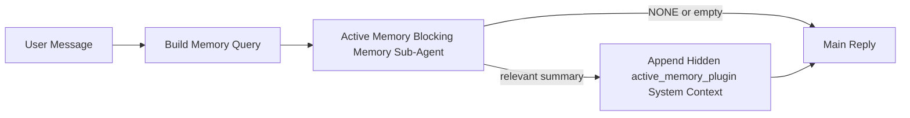

---
read_when:
    - تريد أن تفهم الغرض من Active Memory
    - تريد تشغيل Active Memory لوكيل محادثة
    - تريد ضبط سلوك Active Memory دون تمكينه في كل مكان
summary: وكيل فرعي لذاكرة الحظر مملوك لـ Plugin يحقن الذاكرة ذات الصلة في جلسات الدردشة التفاعلية
title: Active Memory
x-i18n:
    generated_at: "2026-04-12T23:28:00Z"
    model: gpt-5.4
    provider: openai
    source_hash: 11665dbc888b6d4dc667a47624cc1f2e4cc71e1d58e1f7d9b5fe4057ec4da108
    source_path: concepts/active-memory.md
    workflow: 15
---

# Active Memory

Active Memory هو وكيل فرعي اختياري لذاكرة الحظر مملوك لـ Plugin ويعمل
قبل الرد الرئيسي في الجلسات الحوارية المؤهلة.

وهو موجود لأن معظم أنظمة الذاكرة قادرة ولكنها تفاعلية. فهي تعتمد على
الوكيل الرئيسي ليقرر متى يبحث في الذاكرة، أو على المستخدم ليقول أشياء
مثل "تذكر هذا" أو "ابحث في الذاكرة". وبحلول ذلك الوقت، تكون اللحظة التي
كان من الممكن أن تجعل فيها الذاكرة الرد يبدو طبيعيًا قد فاتت بالفعل.

يمنح Active Memory النظام فرصة واحدة محدودة لإبراز الذاكرة ذات الصلة
قبل إنشاء الرد الرئيسي.

## الصق هذا في وكيلك

الصق هذا في وكيلك إذا كنت تريد منه تمكين Active Memory باستخدام إعداد
مستقل وآمن افتراضيًا:

```json5
{
  plugins: {
    entries: {
      "active-memory": {
        enabled: true,
        config: {
          enabled: true,
          agents: ["main"],
          allowedChatTypes: ["direct"],
          modelFallback: "google/gemini-3-flash",
          queryMode: "recent",
          promptStyle: "balanced",
          timeoutMs: 15000,
          maxSummaryChars: 220,
          persistTranscripts: false,
          logging: true,
        },
      },
    },
  },
}
```

يؤدي هذا إلى تشغيل Plugin للوكيل `main`، ويبقيه مقتصرًا افتراضيًا على
جلسات نمط الرسائل المباشرة، ويتيح له أن يرث نموذج الجلسة الحالية أولًا،
ويستخدم نموذج الرجوع الاحتياطي المُعد فقط إذا لم يتوفر نموذج صريح أو موروث.

بعد ذلك، أعد تشغيل Gateway:

```bash
openclaw gateway
```

لفحصه مباشرة داخل محادثة:

```text
/verbose on
/trace on
```

## تشغيل active memory

أكثر إعدادات الأمان هي:

1. تمكين Plugin
2. استهداف وكيل حواري واحد
3. إبقاء التسجيل مفعّلًا فقط أثناء الضبط

ابدأ بهذا في `openclaw.json`:

```json5
{
  plugins: {
    entries: {
      "active-memory": {
        enabled: true,
        config: {
          agents: ["main"],
          allowedChatTypes: ["direct"],
          modelFallback: "google/gemini-3-flash",
          queryMode: "recent",
          promptStyle: "balanced",
          timeoutMs: 15000,
          maxSummaryChars: 220,
          persistTranscripts: false,
          logging: true,
        },
      },
    },
  },
}
```

ثم أعد تشغيل Gateway:

```bash
openclaw gateway
```

ما الذي يعنيه هذا:

- `plugins.entries.active-memory.enabled: true` يشغّل Plugin
- `config.agents: ["main"]` يفعّل active memory للوكيل `main` فقط
- `config.allowedChatTypes: ["direct"]` يبقي active memory مفعّلًا افتراضيًا لجلسات نمط الرسائل المباشرة فقط
- إذا لم يتم تعيين `config.model`، فإن active memory يرث نموذج الجلسة الحالية أولًا
- يوفّر `config.modelFallback` اختياريًا مزود/نموذجًا احتياطيًا خاصًا بك للاستدعاء
- يستخدم `config.promptStyle: "balanced"` نمط Prompt الافتراضي للأغراض العامة لوضع `recent`
- يظل active memory يعمل فقط في جلسات الدردشة التفاعلية الدائمة المؤهلة

## كيفية رؤيته

يقوم Active memory بحقن سياق نظام مخفي للنموذج. وهو لا يكشف
عن وسوم `<active_memory_plugin>...</active_memory_plugin>` الخام للعميل.

## تبديل الجلسة

استخدم أمر Plugin عندما تريد إيقاف active memory مؤقتًا أو استئنافه
لجلسة الدردشة الحالية دون تعديل الإعدادات:

```text
/active-memory status
/active-memory off
/active-memory on
```

هذا النطاق خاص بالجلسة. ولا يغيّر
`plugins.entries.active-memory.enabled` أو استهداف الوكيل أو أي
إعداد عام آخر.

إذا كنت تريد أن يكتب الأمر الإعدادات ويوقف active memory مؤقتًا أو
يستأنفه لجميع الجلسات، فاستخدم الصيغة العامة الصريحة:

```text
/active-memory status --global
/active-memory off --global
/active-memory on --global
```

تقوم الصيغة العامة بكتابة `plugins.entries.active-memory.config.enabled`.
وهي تُبقي `plugins.entries.active-memory.enabled` مفعّلًا حتى يبقى
الأمر متاحًا لتشغيل active memory مرة أخرى لاحقًا.

إذا كنت تريد رؤية ما يفعله active memory في جلسة مباشرة، فقم بتشغيل
مفاتيح تبديل الجلسة المطابقة للمخرجات التي تريدها:

```text
/verbose on
/trace on
```

عند تمكينهما، يمكن لـ OpenClaw عرض:

- سطر حالة لـ active memory مثل `Active Memory: ok 842ms recent 34 chars` عند استخدام `/verbose on`
- ملخص تصحيح قابل للقراءة مثل `Active Memory Debug: Lemon pepper wings with blue cheese.` عند استخدام `/trace on`

تُشتق هذه الأسطر من نفس تمريرة active memory التي تغذي سياق
النظام المخفي، لكنها تُنسق للبشر بدلًا من كشف ترميز Prompt الخام.
ويتم إرسالها كرسالة تشخيصية لاحقة بعد رد المساعد العادي حتى لا تُظهر
عملاء القنوات مثل Telegram فقاعة تشخيص منفصلة قبل الرد.

افتراضيًا، يكون سجل وكيل الذاكرة الفرعي الحاجب مؤقتًا ويُحذف
بعد اكتمال التشغيل.

مثال على التدفق:

```text
/verbose on
/trace on
what wings should i order?
```

الشكل المتوقع للرد المرئي:

```text
...normal assistant reply...

🧩 Active Memory: ok 842ms recent 34 chars
🔎 Active Memory Debug: Lemon pepper wings with blue cheese.
```

## متى يعمل

يستخدم active memory بوابتين:

1. **الاشتراك عبر الإعدادات**
   يجب تمكين Plugin، ويجب أن يظهر معرّف الوكيل الحالي في
   `plugins.entries.active-memory.config.agents`.
2. **أهلية تشغيل صارمة**
   حتى عند التمكين والاستهداف، لا يعمل active memory إلا في
   جلسات الدردشة التفاعلية الدائمة المؤهلة.

القاعدة الفعلية هي:

```text
plugin enabled
+
agent id targeted
+
allowed chat type
+
eligible interactive persistent chat session
=
active memory runs
```

إذا فشل أي من هذه الشروط، فلن يعمل active memory.

## أنواع الجلسات

يتحكم `config.allowedChatTypes` في أنواع المحادثات التي يمكنها تشغيل Active
Memory من الأساس.

القيمة الافتراضية هي:

```json5
allowedChatTypes: ["direct"]
```

وهذا يعني أن Active Memory يعمل افتراضيًا في جلسات نمط الرسائل المباشرة،
ولكن ليس في الجلسات الجماعية أو جلسات القنوات ما لم تقم بضمّها صراحةً.

أمثلة:

```json5
allowedChatTypes: ["direct"]
```

```json5
allowedChatTypes: ["direct", "group"]
```

```json5
allowedChatTypes: ["direct", "group", "channel"]
```

## أين يعمل

active memory هو ميزة إثراء حواري، وليس ميزة استدلال على مستوى المنصة.

| السطح                                                             | هل يعمل active memory؟                                  |
| ----------------------------------------------------------------- | ------------------------------------------------------- |
| جلسات Control UI / دردشة الويب الدائمة                           | نعم، إذا كان Plugin مفعّلًا وكان الوكيل مستهدفًا        |
| جلسات القنوات التفاعلية الأخرى على مسار الدردشة الدائم نفسه      | نعم، إذا كان Plugin مفعّلًا وكان الوكيل مستهدفًا        |
| عمليات التشغيل أحادية اللقطة بلا واجهة                           | لا                                                      |
| عمليات Heartbeat/الخلفية                                          | لا                                                      |
| مسارات `agent-command` الداخلية العامة                            | لا                                                      |
| تنفيذ الوكيل الفرعي/المساعد الداخلي                               | لا                                                      |

## لماذا تستخدمه

استخدم active memory عندما:

- تكون الجلسة دائمة وموجّهة للمستخدم
- يمتلك الوكيل ذاكرة طويلة المدى ذات معنى للبحث فيها
- تكون الاستمرارية والتخصيص أهم من الحتمية الخام للـ Prompt

وهو يعمل بشكل جيد خصوصًا مع:

- التفضيلات المستقرة
- العادات المتكررة
- سياق المستخدم طويل المدى الذي يجب أن يظهر بصورة طبيعية

وهو غير مناسب لـ:

- الأتمتة
- العمال الداخليين
- مهام API أحادية اللقطة
- الأماكن التي قد يكون فيها التخصيص المخفي مفاجئًا

## كيف يعمل

شكل التشغيل هو:



يمكن لوكيل ذاكرة الحظر الفرعي استخدام ما يلي فقط:

- `memory_search`
- `memory_get`

إذا كان الاتصال ضعيفًا، فيجب أن يعيد `NONE`.

## أوضاع الاستعلام

يتحكم `config.queryMode` في مقدار المحادثة التي يراها وكيل ذاكرة الحظر الفرعي.

## أنماط Prompt

يتحكم `config.promptStyle` في مدى الحماس أو الصرامة لدى وكيل ذاكرة الحظر الفرعي
عند تقرير ما إذا كان سيعيد ذاكرة أم لا.

الأنماط المتاحة:

- `balanced`: الإعداد الافتراضي للأغراض العامة لوضع `recent`
- `strict`: الأقل حماسًا؛ الأفضل عندما تريد أقل قدر ممكن من التداخل من السياق القريب
- `contextual`: الأكثر ملاءمة للاستمرارية؛ الأفضل عندما يجب أن يكون لتاريخ المحادثة وزن أكبر
- `recall-heavy`: أكثر استعدادًا لإبراز الذاكرة عند وجود تطابقات أضعف ولكنها ما تزال معقولة
- `precision-heavy`: يفضل `NONE` بشدة ما لم يكن التطابق واضحًا
- `preference-only`: مُحسَّن للمفضلات، والعادات، والروتين، والذوق، والحقائق الشخصية المتكررة

التعيين الافتراضي عندما لا يتم تعيين `config.promptStyle`:

```text
message -> strict
recent -> balanced
full -> contextual
```

إذا قمت بتعيين `config.promptStyle` صراحةً، فسيكون لهذا التجاوز الأسبقية.

مثال:

```json5
promptStyle: "preference-only"
```

## سياسة النموذج الاحتياطي

إذا لم يتم تعيين `config.model`، فإن Active Memory يحاول حل نموذج بهذا الترتيب:

```text
explicit plugin model
-> current session model
-> agent primary model
-> optional configured fallback model
```

يتحكم `config.modelFallback` في خطوة الرجوع الاحتياطي المُعدّة.

رجوع احتياطي مخصص اختياري:

```json5
modelFallback: "google/gemini-3-flash"
```

إذا لم يتم حل أي نموذج صريح أو موروث أو احتياطي مُعد، فإن Active Memory
يتخطى الاستدعاء في تلك الدورة.

يتم الاحتفاظ بـ `config.modelFallbackPolicy` فقط كحقل توافق
مهجور للإعدادات الأقدم. ولم يعد يغيّر سلوك التشغيل.

## مخارج متقدمة

هذه الخيارات ليست جزءًا من الإعداد الموصى به عمدًا.

يمكن لـ `config.thinking` تجاوز مستوى التفكير لوكيل ذاكرة الحظر الفرعي:

```json5
thinking: "medium"
```

الافتراضي:

```json5
thinking: "off"
```

لا تقم بتمكين هذا افتراضيًا. يعمل Active Memory في مسار الرد، لذا فإن
وقت التفكير الإضافي يزيد مباشرة من زمن التأخير الذي يراه المستخدم.

يضيف `config.promptAppend` تعليمات تشغيل إضافية بعد Prompt الافتراضي لـ Active
Memory وقبل سياق المحادثة:

```json5
promptAppend: "Prefer stable long-term preferences over one-off events."
```

يستبدل `config.promptOverride` Prompt الافتراضي لـ Active Memory. ولا يزال OpenClaw
يضيف سياق المحادثة بعد ذلك:

```json5
promptOverride: "You are a memory search agent. Return NONE or one compact user fact."
```

لا يُوصى بتخصيص Prompt ما لم تكن تختبر عمدًا عقد استدعاء مختلفًا.
تم ضبط Prompt الافتراضي لإرجاع `NONE` أو سياق مدمج لحقائق المستخدم
للنموذج الرئيسي.

### `message`

يتم إرسال أحدث رسالة مستخدم فقط.

```text
Latest user message only
```

استخدم هذا عندما:

- تريد أسرع سلوك
- تريد أقوى انحياز نحو استدعاء التفضيلات المستقرة
- لا تحتاج الأدوار اللاحقة إلى سياق حواري

المهلة الموصى بها:

- ابدأ بحوالي `3000` إلى `5000` مللي ثانية

### `recent`

يتم إرسال أحدث رسالة مستخدم بالإضافة إلى ذيل حواري حديث صغير.

```text
Recent conversation tail:
user: ...
assistant: ...
user: ...

Latest user message:
...
```

استخدم هذا عندما:

- تريد توازنًا أفضل بين السرعة والارتكاز الحواري
- تعتمد أسئلة المتابعة غالبًا على آخر بضع أدوار

المهلة الموصى بها:

- ابدأ بحوالي `15000` مللي ثانية

### `full`

يتم إرسال المحادثة الكاملة إلى وكيل ذاكرة الحظر الفرعي.

```text
Full conversation context:
user: ...
assistant: ...
user: ...
...
```

استخدم هذا عندما:

- تكون أعلى جودة للاستدعاء أهم من زمن التأخير
- تحتوي المحادثة على إعداد مهم يعود إلى موضع بعيد في السلسلة

المهلة الموصى بها:

- زدها بشكل ملحوظ مقارنةً بـ `message` أو `recent`
- ابدأ بحوالي `15000` مللي ثانية أو أكثر بحسب حجم السلسلة

بشكل عام، يجب أن تزيد المهلة مع زيادة حجم السياق:

```text
message < recent < full
```

## استمرارية السجل

تقوم عمليات تشغيل وكيل ذاكرة الحظر الفرعي لـ active memory بإنشاء
سجل `session.jsonl` حقيقي أثناء استدعاء وكيل ذاكرة الحظر الفرعي.

افتراضيًا، يكون هذا السجل مؤقتًا:

- تتم كتابته في دليل مؤقت
- يُستخدم فقط لتشغيل وكيل ذاكرة الحظر الفرعي
- يُحذف فورًا بعد انتهاء التشغيل

إذا كنت تريد الاحتفاظ بسجلات وكيل ذاكرة الحظر الفرعي هذه على القرص لأغراض
التصحيح أو الفحص، فقم بتمكين الاستمرارية صراحةً:

```json5
{
  plugins: {
    entries: {
      "active-memory": {
        enabled: true,
        config: {
          agents: ["main"],
          persistTranscripts: true,
          transcriptDir: "active-memory",
        },
      },
    },
  },
}
```

عند التمكين، يخزن active memory السجلات في دليل منفصل ضمن
مجلد جلسات الوكيل المستهدف، وليس في مسار سجل محادثة المستخدم الرئيسي.

يكون التخطيط الافتراضي من حيث المفهوم:

```text
agents/<agent>/sessions/active-memory/<blocking-memory-sub-agent-session-id>.jsonl
```

يمكنك تغيير الدليل الفرعي النسبي باستخدام `config.transcriptDir`.

استخدم هذا بحذر:

- يمكن أن تتراكم سجلات وكيل ذاكرة الحظر الفرعي بسرعة في الجلسات المزدحمة
- يمكن أن يؤدي وضع الاستعلام `full` إلى تكرار الكثير من سياق المحادثة
- تحتوي هذه السجلات على سياق Prompt مخفي وذكريات تم استدعاؤها

## الإعدادات

توجد جميع إعدادات active memory ضمن:

```text
plugins.entries.active-memory
```

أهم الحقول هي:

| المفتاح                    | النوع                                                                                                | المعنى                                                                                                  |
| -------------------------- | ---------------------------------------------------------------------------------------------------- | ------------------------------------------------------------------------------------------------------- |
| `enabled`                  | `boolean`                                                                                            | يفعّل Plugin نفسه                                                                                       |
| `config.agents`            | `string[]`                                                                                           | معرّفات الوكلاء التي يمكنها استخدام active memory                                                       |
| `config.model`             | `string`                                                                                             | مرجع نموذج اختياري لوكيل ذاكرة الحظر الفرعي؛ وعند عدم تعيينه، يستخدم active memory نموذج الجلسة الحالية |
| `config.queryMode`         | `"message" \| "recent" \| "full"`                                                                    | يتحكم في مقدار المحادثة التي يراها وكيل ذاكرة الحظر الفرعي                                              |
| `config.promptStyle`       | `"balanced" \| "strict" \| "contextual" \| "recall-heavy" \| "precision-heavy" \| "preference-only"` | يتحكم في مدى الحماس أو الصرامة لدى وكيل ذاكرة الحظر الفرعي عند تقرير ما إذا كان سيعيد ذاكرة             |
| `config.thinking`          | `"off" \| "minimal" \| "low" \| "medium" \| "high" \| "xhigh" \| "adaptive"`                         | تجاوز تفكير متقدم لوكيل ذاكرة الحظر الفرعي؛ الافتراضي `off` للسرعة                                      |
| `config.promptOverride`    | `string`                                                                                             | استبدال كامل متقدم للـ Prompt؛ لا يُوصى به للاستخدام العادي                                             |
| `config.promptAppend`      | `string`                                                                                             | تعليمات إضافية متقدمة تُلحق بالـ Prompt الافتراضي أو المُتجاوز                                         |
| `config.timeoutMs`         | `number`                                                                                             | مهلة قصوى صارمة لوكيل ذاكرة الحظر الفرعي                                                                |
| `config.maxSummaryChars`   | `number`                                                                                             | الحد الأقصى لإجمالي الأحرف المسموح بها في ملخص active-memory                                            |
| `config.logging`           | `boolean`                                                                                            | يصدر سجلات active memory أثناء الضبط                                                                    |
| `config.persistTranscripts` | `boolean`                                                                                           | يحتفظ بسجلات وكيل ذاكرة الحظر الفرعي على القرص بدلًا من حذف الملفات المؤقتة                             |
| `config.transcriptDir`     | `string`                                                                                             | دليل نسبي لسجلات وكيل ذاكرة الحظر الفرعي ضمن مجلد جلسات الوكيل                                          |

حقول ضبط مفيدة:

| المفتاح                      | النوع    | المعنى                                                        |
| ---------------------------- | -------- | ------------------------------------------------------------- |
| `config.maxSummaryChars`     | `number` | الحد الأقصى لإجمالي الأحرف المسموح بها في ملخص active-memory  |
| `config.recentUserTurns`     | `number` | أدوار المستخدم السابقة التي سيتم تضمينها عندما يكون `queryMode` هو `recent` |
| `config.recentAssistantTurns` | `number` | أدوار المساعد السابقة التي سيتم تضمينها عندما يكون `queryMode` هو `recent` |
| `config.recentUserChars`     | `number` | الحد الأقصى للأحرف لكل دور مستخدم حديث                        |
| `config.recentAssistantChars` | `number` | الحد الأقصى للأحرف لكل دور مساعد حديث                         |
| `config.cacheTtlMs`          | `number` | إعادة استخدام ذاكرة التخزين المؤقت للاستعلامات المتطابقة المتكررة |

## الإعداد الموصى به

ابدأ بـ `recent`.

```json5
{
  plugins: {
    entries: {
      "active-memory": {
        enabled: true,
        config: {
          agents: ["main"],
          queryMode: "recent",
          promptStyle: "balanced",
          timeoutMs: 15000,
          maxSummaryChars: 220,
          logging: true,
        },
      },
    },
  },
}
```

إذا كنت تريد فحص السلوك المباشر أثناء الضبط، فاستخدم `/verbose on` من أجل
سطر الحالة العادي و`/trace on` من أجل ملخص تصحيح active-memory بدلًا
من البحث عن أمر تصحيح منفصل لـ active-memory. وفي قنوات الدردشة، تُرسل
أسطر التشخيص هذه بعد رد المساعد الرئيسي بدلًا من قبله.

ثم انتقل إلى:

- `message` إذا كنت تريد زمن تأخير أقل
- `full` إذا قررت أن السياق الإضافي يستحق وكيل ذاكرة الحظر الفرعي الأبطأ

## التصحيح

إذا لم يظهر active memory في الموضع الذي تتوقعه:

1. أكّد أن Plugin مفعّل ضمن `plugins.entries.active-memory.enabled`.
2. أكّد أن معرّف الوكيل الحالي مدرج في `config.agents`.
3. أكّد أنك تختبر من خلال جلسة دردشة تفاعلية دائمة.
4. فعّل `config.logging: true` وراقب سجلات Gateway.
5. تحقّق من أن البحث في الذاكرة نفسه يعمل باستخدام `openclaw memory status --deep`.

إذا كانت نتائج الذاكرة كثيرة التشويش، فشدّد:

- `maxSummaryChars`

إذا كان active memory بطيئًا جدًا:

- خفّض `queryMode`
- خفّض `timeoutMs`
- قلّل أعداد الأدوار الحديثة
- قلّل حدود الأحرف لكل دور

## المشكلات الشائعة

### تغيّر مزود التضمين بشكل غير متوقع

يستخدم Active Memory مسار `memory_search` العادي ضمن
`agents.defaults.memorySearch`. وهذا يعني أن إعداد مزود التضمين يكون
مطلوبًا فقط عندما يتطلب إعداد `memorySearch` لديك تضمينات للسلوك
الذي تريده.

عمليًا:

- يكون إعداد المزود الصريح **مطلوبًا** إذا كنت تريد مزودًا لا يتم
  اكتشافه تلقائيًا، مثل `ollama`
- يكون إعداد المزود الصريح **مطلوبًا** إذا لم يؤدِّ الاكتشاف التلقائي
  إلى حل أي مزود تضمين قابل للاستخدام في بيئتك
- يكون إعداد المزود الصريح **موصى به بشدة** إذا كنت تريد اختيار مزود
  حتميًا بدلًا من "أول مزود متاح يفوز"
- لا يكون إعداد المزود الصريح **مطلوبًا عادةً** إذا كان الاكتشاف التلقائي
  يحل بالفعل المزود الذي تريده وكان هذا المزود مستقرًا في بيئة النشر لديك

إذا لم يتم تعيين `memorySearch.provider`، فإن OpenClaw يكتشف تلقائيًا
أول مزود تضمين متاح.

قد يكون ذلك مربكًا في بيئات النشر الفعلية:

- قد يغيّر توفر مفتاح API جديد المزود الذي يستخدمه البحث في الذاكرة
- قد يجعل أحد الأوامر أو أسطح التشخيص المزود المحدد يبدو مختلفًا عن
  المسار الذي تصل إليه فعليًا أثناء مزامنة الذاكرة المباشرة أو تهيئة البحث
- قد تفشل المزودات المستضافة بسبب الحصة أو أخطاء تحديد المعدل التي لا تظهر
  إلا عندما يبدأ Active Memory بإصدار استعلامات استدعاء قبل كل رد

يمكن لـ Active Memory أن يعمل حتى بدون تضمينات عندما يستطيع `memory_search`
العمل في وضع متدهور يعتمد على المطابقة اللفظية فقط، وهو ما يحدث عادةً
عندما لا يمكن حل أي مزود تضمين.

لا تفترض وجود نفس الرجوع الاحتياطي عند فشل المزود أثناء التشغيل مثل
نفاد الحصة، أو حدود المعدل، أو أخطاء الشبكة/المزود، أو غياب النماذج
المحلية/البعيدة بعد أن يكون قد تم اختيار مزود بالفعل.

عمليًا:

- إذا تعذر حل أي مزود تضمين، فقد يتدهور `memory_search` إلى
  استرجاع لفظي فقط
- إذا تم حل مزود تضمين ثم فشل أثناء التشغيل، فإن OpenClaw
  لا يضمن حاليًا رجوعًا احتياطيًا لفظيًا لذلك الطلب
- إذا كنت تحتاج إلى اختيار مزود حتمي، فقم بتثبيت
  `agents.defaults.memorySearch.provider`
- إذا كنت تحتاج إلى تحويل تلقائي إلى مزود آخر عند أخطاء التشغيل، فقم بإعداد
  `agents.defaults.memorySearch.fallback` صراحةً

إذا كنت تعتمد على استدعاء مدعوم بالتضمين، أو فهرسة متعددة الوسائط، أو مزود
محلي/بعيد محدد، فقم بتثبيت المزود صراحةً بدلًا من الاعتماد على
الاكتشاف التلقائي.

أمثلة شائعة على التثبيت:

OpenAI:

```json5
{
  agents: {
    defaults: {
      memorySearch: {
        provider: "openai",
        model: "text-embedding-3-small",
      },
    },
  },
}
```

Gemini:

```json5
{
  agents: {
    defaults: {
      memorySearch: {
        provider: "gemini",
        model: "gemini-embedding-001",
      },
    },
  },
}
```

Ollama:

```json5
{
  agents: {
    defaults: {
      memorySearch: {
        provider: "ollama",
        model: "nomic-embed-text",
      },
    },
  },
}
```

إذا كنت تتوقع التحويل إلى مزود آخر عند أخطاء التشغيل مثل
نفاد الحصة، فإن تثبيت مزود وحده لا يكفي. قم بإعداد رجوع احتياطي صريح أيضًا:

```json5
{
  agents: {
    defaults: {
      memorySearch: {
        provider: "openai",
        fallback: "gemini",
      },
    },
  },
}
```

### تصحيح مشكلات المزود

إذا كان Active Memory بطيئًا، أو فارغًا، أو يبدو وكأنه يبدّل بين المزودات
بشكل غير متوقع:

- راقب سجلات Gateway أثناء إعادة إنتاج المشكلة؛ وابحث عن أسطر مثل
  `active-memory: ... start|done` أو `memory sync failed (search-bootstrap)` أو
  أخطاء التضمين الخاصة بالمزود
- فعّل `/trace on` لإظهار ملخص تصحيح Active Memory المملوك لـ Plugin
  في الجلسة
- فعّل `/verbose on` إذا كنت تريد أيضًا سطر الحالة العادي
  `🧩 Active Memory: ...` بعد كل رد
- شغّل `openclaw memory status --deep` لفحص الواجهة الخلفية الحالية
  للبحث في الذاكرة وحالة الفهرس
- تحقّق من `agents.defaults.memorySearch.provider` وما يرتبط به من إعدادات المصادقة/التهيئة للتأكد من أن المزود الذي تتوقعه هو فعليًا
  المزود الذي يمكن حله أثناء التشغيل
- إذا كنت تستخدم `ollama`، فتحقّق من أن نموذج التضمين المُعد مثبت،
  مثلًا باستخدام `ollama list`

مثال على دورة تصحيح:

```text
1. Start the gateway and watch its logs
2. In the chat session, run /trace on
3. Send one message that should trigger Active Memory
4. Compare the chat-visible debug line with the gateway log lines
5. If provider choice is ambiguous, pin agents.defaults.memorySearch.provider explicitly
```

مثال:

```json5
{
  agents: {
    defaults: {
      memorySearch: {
        provider: "ollama",
        model: "nomic-embed-text",
      },
    },
  },
}
```

أو، إذا كنت تريد تضمينات Gemini:

```json5
{
  agents: {
    defaults: {
      memorySearch: {
        provider: "gemini",
      },
    },
  },
}
```

بعد تغيير المزود، أعد تشغيل Gateway ونفّذ اختبارًا جديدًا باستخدام
`/trace on` حتى يعكس سطر تصحيح Active Memory مسار التضمين الجديد.

## الصفحات ذات الصلة

- [Memory Search](/ar/concepts/memory-search)
- [مرجع إعدادات الذاكرة](/ar/reference/memory-config)
- [إعداد Plugin SDK](/ar/plugins/sdk-setup)
