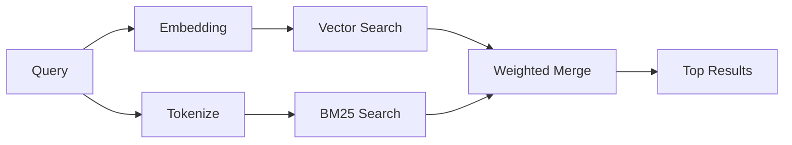

---
read_when:
    - تريد أن تفهم كيف يعمل `memory_search`
    - تريد اختيار موفّر تضمينات
    - تريد ضبط جودة البحث
summary: كيف يعثر بحث الذاكرة على الملاحظات ذات الصلة باستخدام التضمينات والاسترجاع الهجين
title: بحث الذاكرة
x-i18n:
    generated_at: "2026-04-12T23:28:00Z"
    model: gpt-5.4
    provider: openai
    source_hash: 71fde251b7d2dc455574aa458e7e09136f30613609ad8dafeafd53b2729a0310
    source_path: concepts/memory-search.md
    workflow: 15
---

# بحث الذاكرة

يعثر `memory_search` على الملاحظات ذات الصلة من ملفات الذاكرة لديك، حتى عندما
تختلف الصياغة عن النص الأصلي. ويعمل ذلك من خلال فهرسة الذاكرة إلى مقاطع صغيرة
والبحث فيها باستخدام التضمينات أو الكلمات المفتاحية أو كليهما.

## البدء السريع

إذا كان لديك مفتاح API مهيأ لـ OpenAI أو Gemini أو Voyage أو Mistral، فإن بحث
الذاكرة يعمل تلقائيًا. ولتعيين موفّر بشكل صريح:

```json5
{
  agents: {
    defaults: {
      memorySearch: {
        provider: "openai", // أو "gemini" أو "local" أو "ollama" وما إلى ذلك.
      },
    },
  },
}
```

للتضمينات المحلية من دون مفتاح API، استخدم `provider: "local"` (يتطلب
node-llama-cpp).

## الموفّرون المدعومون

| الموفّر | المعرّف        | يحتاج إلى مفتاح API | ملاحظات                                                |
| ------- | -------------- | ------------------- | ------------------------------------------------------ |
| OpenAI  | `openai`       | نعم                 | يُكتشف تلقائيًا، سريع                                  |
| Gemini  | `gemini`       | نعم                 | يدعم فهرسة الصور/الصوت                                 |
| Voyage  | `voyage`       | نعم                 | يُكتشف تلقائيًا                                        |
| Mistral | `mistral`      | نعم                 | يُكتشف تلقائيًا                                        |
| Bedrock | `bedrock`      | لا                  | يُكتشف تلقائيًا عند نجاح سلسلة بيانات اعتماد AWS       |
| Ollama  | `ollama`       | لا                  | محلي، ويجب تعيينه صراحةً                               |
| Local   | `local`        | لا                  | نموذج GGUF، تنزيل بحجم ~0.6 غيغابايت                   |

## كيف يعمل البحث

يشغّل OpenClaw مساري استرجاع بالتوازي ويدمج النتائج:



- **البحث المتجهي** يعثر على الملاحظات ذات المعنى المتشابه ("gateway host" يطابق
  "الجهاز الذي يشغّل OpenClaw").
- **بحث الكلمات المفتاحية BM25** يعثر على المطابقات الدقيقة (المعرّفات وسلاسل
  الأخطاء ومفاتيح الإعداد).

إذا كان أحد المسارين فقط متاحًا (لا توجد تضمينات أو لا توجد فهرسة نصية كاملة
FTS)، فسيعمل المسار الآخر وحده.

عندما لا تكون التضمينات متاحة، لا يزال OpenClaw يستخدم الترتيب المعجمي فوق نتائج
FTS بدلًا من الرجوع إلى ترتيب المطابقة الدقيقة الخام فقط. ويعزّز هذا الوضع
المتراجع المقاطع ذات التغطية الأقوى لعبارات الاستعلام ومسارات الملفات ذات الصلة،
مما يحافظ على فاعلية الاسترجاع حتى بدون `sqlite-vec` أو موفّر تضمينات.

## تحسين جودة البحث

تساعد ميزتان اختياريتان عندما يكون لديك سجل كبير من الملاحظات:

### التلاشي الزمني

تفقد الملاحظات القديمة وزنها في الترتيب تدريجيًا بحيث تظهر المعلومات الأحدث أولًا.
ومع نصف العمر الافتراضي البالغ 30 يومًا، تحصل الملاحظة من الشهر الماضي على 50%
من وزنها الأصلي. أما الملفات الدائمة مثل `MEMORY.md` فلا يطبَّق عليها التلاشي
أبدًا.

<Tip>
فعّل التلاشي الزمني إذا كان لدى الوكيل لديك أشهر من الملاحظات اليومية وكانت
المعلومات القديمة تستمر في التفوق على السياق الأحدث.
</Tip>

### MMR (التنوع)

يقلل النتائج المكررة. فإذا كانت خمس ملاحظات تذكر جميعها إعداد الموجّه نفسه، فإن
MMR يضمن أن تغطي النتائج العليا موضوعات مختلفة بدلًا من التكرار.

<Tip>
فعّل MMR إذا كان `memory_search` يستمر في إعادة مقاطع متشابهة جدًا من ملاحظات
يومية مختلفة.
</Tip>

### تفعيل الاثنين معًا

```json5
{
  agents: {
    defaults: {
      memorySearch: {
        query: {
          hybrid: {
            mmr: { enabled: true },
            temporalDecay: { enabled: true },
          },
        },
      },
    },
  },
}
```

## الذاكرة متعددة الوسائط

باستخدام Gemini Embedding 2، يمكنك فهرسة الصور والملفات الصوتية إلى جانب
Markdown. وتبقى استعلامات البحث نصية، لكنها تطابق المحتوى المرئي والصوتي. راجع
[مرجع إعدادات الذاكرة](/ar/reference/memory-config) لمعرفة الإعداد.

## بحث ذاكرة الجلسة

يمكنك اختياريًا فهرسة نصوص الجلسات حتى يتمكن `memory_search` من استدعاء
المحادثات السابقة. هذه الميزة تتطلب التفعيل الصريح عبر
`memorySearch.experimental.sessionMemory`. راجع
[المرجع الخاص بالإعدادات](/ar/reference/memory-config) للحصول على التفاصيل.

## استكشاف الأخطاء وإصلاحها

**لا توجد نتائج؟** شغّل `openclaw memory status` للتحقق من الفهرس. وإذا كان
فارغًا، شغّل `openclaw memory index --force`.

**مطابقات كلمات مفتاحية فقط؟** قد لا يكون موفّر التضمينات لديك مهيأً. تحقّق من
`openclaw memory status --deep`.

**لم يتم العثور على نص CJK؟** أعد بناء فهرس FTS باستخدام
`openclaw memory index --force`.

## قراءة إضافية

- [Active Memory](/ar/concepts/active-memory) -- ذاكرة الوكيل الفرعي لجلسات الدردشة التفاعلية
- [الذاكرة](/ar/concepts/memory) -- تخطيط الملفات، والواجهات الخلفية، والأدوات
- [مرجع إعدادات الذاكرة](/ar/reference/memory-config) -- جميع خيارات الإعداد
