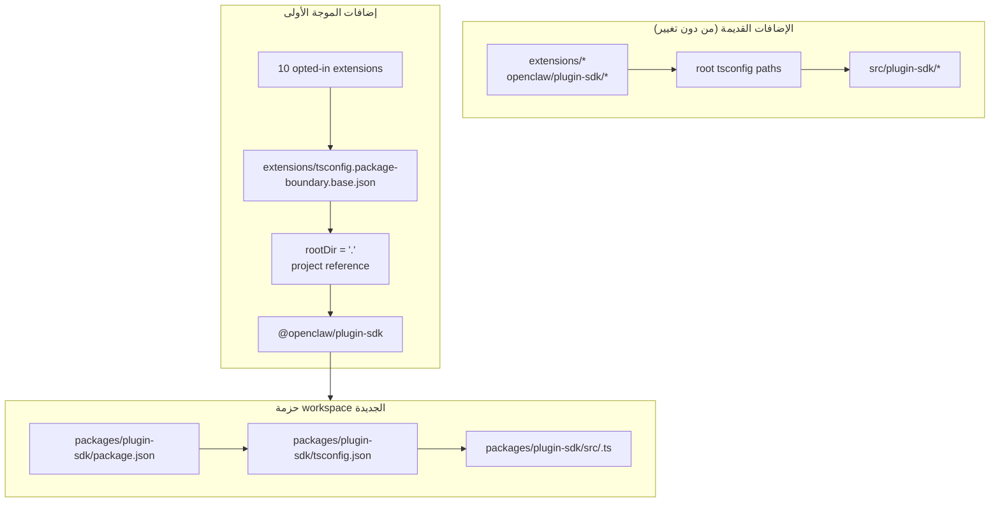

# إعادة هيكلة: اجعل plugin-sdk حزمة workspace حقيقية بشكل تدريجي

## نظرة عامة

تُقدّم هذه الخطة حزمة workspace حقيقية لـ plugin SDK في
`packages/plugin-sdk` وتستخدمها لتمكين موجة أولى صغيرة من الإضافات من
حدود الحزم المفروضة من المترجم. الهدف هو جعل عمليات الاستيراد النسبية غير
المسموح بها تفشل ضمن `tsc` العادي لمجموعة مختارة من إضافات المزوّدات
المضمّنة، من دون فرض ترحيل على مستوى المستودع كله أو خلق مساحة ضخمة
لتعارضات الدمج.

الخطوة التدريجية الأساسية هي تشغيل وضعين بالتوازي لفترة من الوقت:

| الوضع        | شكل الاستيراد           | من يستخدمه                           | آلية الفرض                                      |
| ------------ | ----------------------- | ------------------------------------ | ----------------------------------------------- |
| الوضع القديم | `openclaw/plugin-sdk/*` | كل الإضافات الحالية غير المنضمة      | يبقى السلوك الحالي المتسامح كما هو             |
| وضع الانضمام | `@openclaw/plugin-sdk/*` | إضافات الموجة الأولى فقط            | `rootDir` محلي للحزمة + مراجع المشاريع         |

## إطار المشكلة

يُصدّر المستودع الحالي سطح plugin SDK عامًا كبيرًا، لكنه ليس حزمة workspace
حقيقية. وبدلًا من ذلك:

- يقوم `tsconfig.json` في الجذر بربط `openclaw/plugin-sdk/*` مباشرةً إلى
  `src/plugin-sdk/*.ts`
- لا تزال الإضافات التي لم تنضم إلى التجربة السابقة تشترك في سلوك الاسم
  المستعار العام للمصدر
- لا تعمل إضافة `rootDir` إلا عندما تتوقف واردات SDK المسموح بها عن
  الانحلال إلى مصدر خام في المستودع

وهذا يعني أن المستودع يمكنه وصف سياسة الحدود المطلوبة، لكن TypeScript لا
يفرضها بشكل نظيف على معظم الإضافات.

المطلوب هو مسار تدريجي يقوم بما يلي:

- يجعل `plugin-sdk` حقيقيًا
- ينقل SDK نحو حزمة workspace باسم `@openclaw/plugin-sdk`
- يغيّر فقط نحو 10 إضافات في PR الأول
- يترك بقية شجرة الإضافات على المخطط القديم حتى مرحلة تنظيف لاحقة
- يتجنب استخدام سير العمل `tsconfig.plugin-sdk.dts.json` + التصريحات
  المولّدة بعد التثبيت بوصفه الآلية الأساسية لطرح الموجة الأولى

## تتبع المتطلبات

- R1. إنشاء حزمة workspace حقيقية لـ plugin SDK تحت `packages/`.
- R2. تسمية الحزمة الجديدة `@openclaw/plugin-sdk`.
- R3. منح حزمة SDK الجديدة `package.json` و`tsconfig.json` خاصين بها.
- R4. إبقاء واردات `openclaw/plugin-sdk/*` القديمة تعمل للإضافات غير المنضمة
  خلال نافذة الترحيل.
- R5. ضم موجة أولى صغيرة فقط من الإضافات في PR الأول.
- R6. يجب أن تفشل إضافات الموجة الأولى بشكل مغلق عند الاستيراد النسبي الذي
  يغادر جذر الحزمة.
- R7. يجب أن تستهلك إضافات الموجة الأولى SDK عبر اعتماد حزمة ومرجع مشروع TS،
  وليس عبر أسماء `paths` المستعارة في الجذر.
- R8. يجب أن تتجنب الخطة خطوة توليد إلزامية بعد التثبيت على مستوى المستودع
  من أجل صحة المحرر.
- R9. يجب أن يكون طرح الموجة الأولى قابلًا للمراجعة والدمج بوصفه PR متوسط
  الحجم، وليس إعادة هيكلة تشمل أكثر من 300 ملف على مستوى المستودع.

## حدود النطاق

- لا يوجد ترحيل كامل لكل الإضافات المضمّنة في PR الأول.
- لا يوجد شرط لحذف `src/plugin-sdk` في PR الأول.
- لا يوجد شرط لإعادة توصيل كل مسارات البناء أو الاختبار في الجذر لاستخدام
  الحزمة الجديدة فورًا.
- لا توجد محاولة لفرض أخطاء VS Code على كل إضافة غير منضمة.
- لا يوجد تنظيف lint واسع لبقية شجرة الإضافات.
- لا توجد تغييرات كبيرة في سلوك وقت التشغيل خارج انحلال الاستيراد وملكية
  الحزمة وفرض الحدود للإضافات المنضمة.

## السياق والبحث

### الشيفرة والأنماط ذات الصلة

- يتضمن `pnpm-workspace.yaml` بالفعل `packages/*` و`extensions/*`، لذا فإن
  حزمة workspace جديدة تحت `packages/plugin-sdk` تتناسب مع تخطيط المستودع
  الحالي.
- تستخدم حزم workspace الحالية مثل `packages/memory-host-sdk/package.json`
  و`packages/plugin-package-contract/package.json` بالفعل خرائط `exports`
  محلية للحزمة ومجذّرة في `src/*.ts`.
- يقوم `package.json` في الجذر حاليًا بنشر سطح SDK عبر `./plugin-sdk`
  و`./plugin-sdk/*` بالاعتماد على `dist/plugin-sdk/*.js` و
  `dist/plugin-sdk/*.d.ts`.
- يعمل `src/plugin-sdk/entrypoints.ts` و`scripts/lib/plugin-sdk-entrypoints.json`
  بالفعل كمخزون نقاط الدخول القانوني لسطح SDK.
- يقوم `tsconfig.json` في الجذر حاليًا بربط:
  - `openclaw/plugin-sdk` -> `src/plugin-sdk/index.ts`
  - `openclaw/plugin-sdk/*` -> `src/plugin-sdk/*.ts`
- أظهرت تجربة الحدود السابقة أن `rootDir` المحلي للحزمة يعمل مع عمليات
  الاستيراد النسبية غير القانونية فقط بعد أن تتوقف واردات SDK المسموح بها عن
  الانحلال إلى مصدر خام خارج حزمة الإضافة.

### مجموعة إضافات الموجة الأولى

تفترض هذه الخطة أن الموجة الأولى هي المجموعة الثقيلة على مستوى المزوّدات
والأقل احتمالًا في سحب حالات طرفية معقدة خاصة بوقت تشغيل القنوات:

- `extensions/anthropic`
- `extensions/exa`
- `extensions/firecrawl`
- `extensions/groq`
- `extensions/mistral`
- `extensions/openai`
- `extensions/perplexity`
- `extensions/tavily`
- `extensions/together`
- `extensions/xai`

### مخزون سطح SDK للموجة الأولى

تستورد إضافات الموجة الأولى حاليًا مجموعة فرعية يمكن التحكم بها من مسارات
SDK الفرعية. لا تحتاج حزمة `@openclaw/plugin-sdk` الأولية إلا إلى تغطية ما يلي:

- `agent-runtime`
- `cli-runtime`
- `config-runtime`
- `core`
- `image-generation`
- `media-runtime`
- `media-understanding`
- `plugin-entry`
- `plugin-runtime`
- `provider-auth`
- `provider-auth-api-key`
- `provider-auth-login`
- `provider-auth-runtime`
- `provider-catalog-shared`
- `provider-entry`
- `provider-http`
- `provider-model-shared`
- `provider-onboard`
- `provider-stream-family`
- `provider-stream-shared`
- `provider-tools`
- `provider-usage`
- `provider-web-fetch`
- `provider-web-search`
- `realtime-transcription`
- `realtime-voice`
- `runtime-env`
- `secret-input`
- `security-runtime`
- `speech`
- `testing`

### الدروس المؤسسية

- لم تكن هناك أي إدخالات ذات صلة في `docs/solutions/` ضمن شجرة العمل هذه.

### المراجع الخارجية

- لم تكن هناك حاجة إلى بحث خارجي لهذه الخطة. يحتوي المستودع بالفعل على
  أنماط حزمة workspace وتصدير SDK ذات الصلة.

## القرارات التقنية الأساسية

- تقديم `@openclaw/plugin-sdk` بوصفه حزمة workspace جديدة مع الإبقاء على
  سطح `openclaw/plugin-sdk/*` القديم فعّالًا خلال الترحيل.
  المبرر: يتيح هذا لمجموعة إضافات الموجة الأولى الانتقال إلى انحلال حزم
  حقيقي من دون فرض تغيير كل إضافة وكل مسار بناء في الجذر دفعة واحدة.

- استخدام إعداد أساسي مخصص لحدود الانضمام مثل
  `extensions/tsconfig.package-boundary.base.json` بدلًا من استبدال
  القاعدة الحالية للإضافات للجميع.
  المبرر: يحتاج المستودع إلى دعم وضعي الإضافات القديم ووضع الانضمام في
  الوقت نفسه خلال الترحيل.

- استخدام مراجع مشاريع TS من إضافات الموجة الأولى إلى
  `packages/plugin-sdk/tsconfig.json` وضبط
  `disableSourceOfProjectReferenceRedirect` لوضع حدود الانضمام.
  المبرر: يمنح هذا `tsc` رسمًا بيانيًا حقيقيًا للحزم مع تقليل احتمالات رجوع
  المحرر والمترجم إلى اجتياز المصدر الخام.

- إبقاء `@openclaw/plugin-sdk` خاصًا في الموجة الأولى.
  المبرر: الهدف الفوري هو فرض الحدود الداخلية وسلامة الترحيل، وليس نشر عقد
  SDK خارجي ثانٍ قبل استقرار السطح.

- نقل مسارات SDK الفرعية للموجة الأولى فقط في الشريحة الأولى من التنفيذ،
  مع الإبقاء على جسور توافق للبقية.
  المبرر: إن نقل جميع ملفات `src/plugin-sdk/*.ts` البالغ عددها 315 ملفًا
  فعليًا في PR واحد هو بالضبط مساحة تعارضات الدمج التي تحاول هذه الخطة
  تجنبها.

- عدم الاعتماد على `scripts/postinstall-bundled-plugins.mjs` لبناء تصريحات
  SDK للموجة الأولى.
  المبرر: من الأسهل فهم تدفقات البناء/المراجع الصريحة وتحافظ على سلوك
  المستودع أكثر قابلية للتنبؤ.

## الأسئلة المفتوحة

### ما تم حسمه أثناء التخطيط

- ما الإضافات التي ينبغي أن تكون في الموجة الأولى؟
  استخدم إضافات المزوّدات/البحث على الويب العشر المذكورة أعلاه لأنها أكثر
  عزلة بنيويًا من حزم القنوات الأثقل.

- هل يجب أن يستبدل PR الأول شجرة الإضافات بالكامل؟
  لا. يجب أن يدعم PR الأول وضعين بالتوازي وأن يضم الموجة الأولى فقط.

- هل يجب أن تتطلب الموجة الأولى بناء تصريحات بعد التثبيت؟
  لا. يجب أن يكون رسم الحزمة/المراجع صريحًا، ويجب أن يشغّل CI فحص النوع
  المحلي للحزمة ذات الصلة عن قصد.

### ما تم تأجيله إلى التنفيذ

- ما إذا كان يمكن لحزمة الموجة الأولى أن تشير مباشرةً إلى `src/*.ts`
  المحلية للحزمة عبر مراجع المشاريع فقط، أو ما إذا كانت لا تزال هناك حاجة
  إلى خطوة صغيرة لإخراج التصريحات لحزمة `@openclaw/plugin-sdk`.
  هذا سؤال متعلق بالتنفيذ حول التحقق من الرسم البياني في TS.

- ما إذا كان ينبغي لحزمة `openclaw` في الجذر أن توكل مسارات SDK الفرعية
  للموجة الأولى إلى مخرجات `packages/plugin-sdk` فورًا أو أن تستمر في
  استخدام حشوات توافق مولّدة تحت `src/plugin-sdk`.
  هذا تفصيل متعلق بالتوافق وشكل البناء يعتمد على أقل مسار تنفيذ يحافظ على
  CI باللون الأخضر.

## التصميم التقني عالي المستوى

> يوضّح هذا النهج المقصود ويُعد توجيهًا للمراجعة، وليس مواصفة تنفيذ. يجب على الوكيل المنفّذ التعامل معه بوصفه سياقًا، لا شيفرة لإعادة إنتاجها.

## وحدات التنفيذ

- [ ] **الوحدة 1: تقديم حزمة workspace حقيقية `@openclaw/plugin-sdk`**

**الهدف:** إنشاء حزمة workspace حقيقية لـ SDK يمكنها امتلاك سطح مسارات
الموجة الأولى الفرعية من دون فرض ترحيل على مستوى المستودع كله.

**المتطلبات:** R1 وR2 وR3 وR8 وR9

**التبعيات:** لا شيء

**الملفات:**

- إنشاء: `packages/plugin-sdk/package.json`
- إنشاء: `packages/plugin-sdk/tsconfig.json`
- إنشاء: `packages/plugin-sdk/src/index.ts`
- إنشاء: `packages/plugin-sdk/src/*.ts` لمسارات SDK الفرعية للموجة الأولى
- تعديل: `pnpm-workspace.yaml` فقط إذا لزم الأمر ضبط أنماط الحزم
- تعديل: `package.json`
- تعديل: `src/plugin-sdk/entrypoints.ts`
- تعديل: `scripts/lib/plugin-sdk-entrypoints.json`
- اختبار: `src/plugins/contracts/plugin-sdk-workspace-package.contract.test.ts`

**النهج:**

- أضف حزمة workspace جديدة باسم `@openclaw/plugin-sdk`.
- ابدأ بمسارات SDK الفرعية للموجة الأولى فقط، وليس شجرة الملفات الكاملة ذات
  315 ملفًا.
- إذا كان نقل نقطة دخول من الموجة الأولى مباشرةً سيؤدي إلى فرق ضخم، فيجوز
  أن يقدّم PR الأول هذا المسار الفرعي في `packages/plugin-sdk/src` أولًا
  بوصفه غلاف حزمة رقيقًا ثم يحوّل مصدر الحقيقة إلى الحزمة في PR لاحق لهذه
  المجموعة من المسارات الفرعية.
- أعد استخدام آلية مخزون نقاط الدخول الحالية بحيث يُصرَّح عن سطح حزمة
  الموجة الأولى في موضع قانوني واحد.
- أبقِ تصديرات الحزمة الجذرية فعّالة للمستخدمين القدامى بينما تصبح حزمة
  workspace هي العقد الجديد القابل للانضمام.

**الأنماط التي يجب اتباعها:**

- `packages/memory-host-sdk/package.json`
- `packages/plugin-package-contract/package.json`
- `src/plugin-sdk/entrypoints.ts`

**سيناريوهات الاختبار:**

- المسار السليم: تصدّر حزمة workspace كل مسار فرعي مطلوب في الموجة الأولى
  والمذكور في الخطة، ولا ينقص أي تصدير مطلوب.
- الحالة الطرفية: تبقى بيانات تصدير الحزمة مستقرة عندما يُعاد توليد قائمة
  إدخالات الموجة الأولى أو تُقارن بالمخزون القانوني.
- التكامل: تبقى تصديرات SDK القديمة للحزمة الجذرية موجودة بعد تقديم حزمة
  workspace الجديدة.

**التحقق:**

- يحتوي المستودع على حزمة workspace صالحة باسم `@openclaw/plugin-sdk` مع
  خريطة تصدير مستقرة للموجة الأولى ومن دون أي تراجع في التصديرات القديمة في
  `package.json` الجذري.

- [ ] **الوحدة 2: إضافة وضع حدود TS قابل للانضمام للإضافات المفروضة بالحزمة**

**الهدف:** تعريف وضع إعداد TS الذي ستستخدمه الإضافات المنضمة، مع ترك سلوك TS
الحالي للإضافات كما هو للجميع الآخرين.

**المتطلبات:** R4 وR6 وR7 وR8 وR9

**التبعيات:** الوحدة 1

**الملفات:**

- إنشاء: `extensions/tsconfig.package-boundary.base.json`
- إنشاء: `tsconfig.boundary-optin.json`
- تعديل: `extensions/xai/tsconfig.json`
- تعديل: `extensions/openai/tsconfig.json`
- تعديل: `extensions/anthropic/tsconfig.json`
- تعديل: `extensions/mistral/tsconfig.json`
- تعديل: `extensions/groq/tsconfig.json`
- تعديل: `extensions/together/tsconfig.json`
- تعديل: `extensions/perplexity/tsconfig.json`
- تعديل: `extensions/tavily/tsconfig.json`
- تعديل: `extensions/exa/tsconfig.json`
- تعديل: `extensions/firecrawl/tsconfig.json`
- اختبار: `src/plugins/contracts/extension-package-project-boundaries.test.ts`
- اختبار: `test/extension-package-tsc-boundary.test.ts`

**النهج:**

- اترك `extensions/tsconfig.base.json` في مكانه للإضافات القديمة.
- أضف إعدادًا أساسيًا جديدًا قابلًا للانضمام يقوم بما يلي:
  - يضبط `rootDir: "."`
  - يشير إلى `packages/plugin-sdk`
  - يفعّل `composite`
  - يعطّل إعادة توجيه المصدر لمراجع المشروع عند الحاجة
- أضف إعداد solution مخصصًا للرسم البياني لفحص النوع في الموجة الأولى بدلًا
  من إعادة تشكيل مشروع TS الخاص بالمستودع الجذري في PR نفسه.

**ملاحظة تنفيذ:** ابدأ بفحص نوع محلي للحزمة على شكل كناري فاشل لإضافة واحدة
منضمة قبل تطبيق النمط على الإضافات العشر كلها.

**الأنماط التي يجب اتباعها:**

- نمط `tsconfig.json` المحلي للإضافات الموجود من العمل السابق على الحدود
- نمط حزمة workspace من `packages/memory-host-sdk`

**سيناريوهات الاختبار:**

- المسار السليم: تنجح كل إضافة منضمة في فحص النوع عبر إعداد TS لحدود الحزمة.
- مسار الخطأ: يفشل استيراد نسبي كناري من `../../src/cli/acp-cli.ts` مع
  `TS6059` لإضافة منضمة.
- التكامل: تبقى الإضافات غير المنضمة كما هي، ولا تحتاج إلى المشاركة في
  إعداد solution الجديد.

**التحقق:**

- يوجد رسم بياني مخصص لفحص النوع للإضافات العشر المنضمة، وتفشل عمليات
  الاستيراد النسبية السيئة من إحدى هذه الإضافات عبر `tsc` العادي.

- [ ] **الوحدة 3: ترحيل إضافات الموجة الأولى إلى `@openclaw/plugin-sdk`**

**الهدف:** تغيير إضافات الموجة الأولى لتستهلك حزمة SDK الحقيقية عبر بيانات
الاعتماد الوصفية ومراجع المشاريع وعمليات الاستيراد باسم الحزمة.

**المتطلبات:** R5 وR6 وR7 وR9

**التبعيات:** الوحدة 2

**الملفات:**

- تعديل: `extensions/anthropic/package.json`
- تعديل: `extensions/exa/package.json`
- تعديل: `extensions/firecrawl/package.json`
- تعديل: `extensions/groq/package.json`
- تعديل: `extensions/mistral/package.json`
- تعديل: `extensions/openai/package.json`
- تعديل: `extensions/perplexity/package.json`
- تعديل: `extensions/tavily/package.json`
- تعديل: `extensions/together/package.json`
- تعديل: `extensions/xai/package.json`
- تعديل: عمليات الاستيراد الإنتاجية وعمليات استيراد الاختبارات تحت كل جذر من
  الجذور العشرة للإضافات التي تشير حاليًا إلى `openclaw/plugin-sdk/*`

**النهج:**

- أضف `@openclaw/plugin-sdk: workspace:*` إلى `devDependencies` لإضافات
  الموجة الأولى.
- استبدل واردات `openclaw/plugin-sdk/*` في تلك الحزم بـ
  `@openclaw/plugin-sdk/*`.
- أبقِ عمليات الاستيراد المحلية الداخلية للإضافة على الحواجز المحلية مثل
  `./api.ts` و`./runtime-api.ts`.
- لا تغيّر الإضافات غير المنضمة في هذا PR.

**الأنماط التي يجب اتباعها:**

- حواجز الاستيراد المحلية الموجودة في الإضافات (`api.ts` و`runtime-api.ts`)
- شكل اعتماد الحزمة المستخدم من حزم workspace الأخرى `@openclaw/*`

**سيناريوهات الاختبار:**

- المسار السليم: تظل كل إضافة مُرحّلة تُسجَّل/تُحمَّل من خلال اختبارات
  الإضافة الحالية بعد إعادة كتابة الاستيراد.
- الحالة الطرفية: تظل واردات SDK الخاصة بالاختبار فقط في مجموعة الإضافات
  المنضمة قابلة للانحلال بشكل صحيح عبر الحزمة الجديدة.
- التكامل: لا تحتاج الإضافات المُرحّلة إلى الأسماء المستعارة الجذرية
  `openclaw/plugin-sdk/*` من أجل فحص النوع.

**التحقق:**

- تبني إضافات الموجة الأولى وتُختبر مقابل `@openclaw/plugin-sdk` من دون
  الحاجة إلى مسار الاسم المستعار القديم في الجذر.

- [ ] **الوحدة 4: الحفاظ على التوافق القديم بينما يكون الترحيل جزئيًا**

**الهدف:** إبقاء بقية المستودع عاملًا بينما يوجد SDK في شكلين: الشكل القديم
وشكل الحزمة الجديدة أثناء الترحيل.

**المتطلبات:** R4 وR8 وR9

**التبعيات:** الوحدات 1-3

**الملفات:**

- تعديل: `src/plugin-sdk/*.ts` لحشوات التوافق الخاصة بالموجة الأولى حسب الحاجة
- تعديل: `package.json`
- تعديل: بناء أو تصدير التوصيلات التي تجمع عناصر SDK
- اختبار: `src/plugins/contracts/plugin-sdk-runtime-api-guardrails.test.ts`
- اختبار: `src/plugins/contracts/plugin-sdk-index.bundle.test.ts`

**النهج:**

- أبقِ `openclaw/plugin-sdk/*` في الجذر بوصفه سطح التوافق للإضافات القديمة
  وللمستهلكين الخارجيين الذين لم ينتقلوا بعد.
- استخدم إما حشوات مولّدة أو توصيلات وكيلة لتصدير الجذر لمسارات الموجة
  الأولى الفرعية التي انتقلت إلى `packages/plugin-sdk`.
- لا تحاول إيقاف سطح SDK الجذري في هذه المرحلة.

**الأنماط التي يجب اتباعها:**

- آلية توليد تصديرات SDK الجذرية الموجودة عبر `src/plugin-sdk/entrypoints.ts`
- توافق تصدير الحزم الموجود في `package.json` الجذري

**سيناريوهات الاختبار:**

- المسار السليم: يظل استيراد SDK قديم من الجذر قابلًا للانحلال لإضافة غير
  منضمة بعد وجود الحزمة الجديدة.
- الحالة الطرفية: يعمل مسار فرعي من الموجة الأولى عبر سطح الجذر القديم وعبر
  سطح الحزمة الجديدة معًا خلال نافذة الترحيل.
- التكامل: تظل اختبارات عقد الفهرس/الحزمة الخاصة بـ plugin-sdk ترى سطحًا
  عامًا متماسكًا.

**التحقق:**

- يدعم المستودع وضعي استهلاك SDK القديم والقابل للانضمام من دون كسر
  الإضافات غير المعدلة.

- [ ] **الوحدة 5: إضافة فرض محدود النطاق وتوثيق عقد الترحيل**

**الهدف:** إنزال توجيهات CI والمساهمين التي تفرض السلوك الجديد للموجة الأولى
من دون الادعاء بأن شجرة الإضافات كلها قد رُحّلت.

**المتطلبات:** R5 وR6 وR8 وR9

**التبعيات:** الوحدات 1-4

**الملفات:**

- تعديل: `package.json`
- تعديل: ملفات سير عمل CI التي يجب أن تشغّل فحص النوع لحدود الانضمام
- تعديل: `AGENTS.md`
- تعديل: `docs/plugins/sdk-overview.md`
- تعديل: `docs/plugins/sdk-entrypoints.md`
- تعديل: `docs/plans/2026-04-05-001-refactor-extension-package-resolution-boundary-plan.md`

**النهج:**

- أضف بوابة صريحة للموجة الأولى، مثل تشغيل solution مخصص لـ `tsc -b`
  لحزمة `packages/plugin-sdk` بالإضافة إلى الإضافات العشر المنضمة.
- وثّق أن المستودع يدعم الآن وضعي الإضافات القديم والقابل للانضمام، وأن
  أعمال حدود الإضافات الجديدة يجب أن تفضّل مسار الحزمة الجديدة.
- سجّل قاعدة ترحيل الموجة التالية حتى تتمكن PRات لاحقة من إضافة مزيد من
  الإضافات من دون إعادة مناقشة البنية.

**الأنماط التي يجب اتباعها:**

- اختبارات العقود الحالية تحت `src/plugins/contracts/`
- تحديثات الوثائق الحالية التي تشرح الترحيلات المرحلية

**سيناريوهات الاختبار:**

- المسار السليم: تنجح بوابة فحص النوع الجديدة للموجة الأولى لحزمة workspace
  والإضافات المنضمة.
- مسار الخطأ: يؤدي إدخال استيراد نسبي غير قانوني جديد في إضافة منضمة إلى
  فشل بوابة فحص النوع المحدودة.
- التكامل: لا يتطلب CI من الإضافات غير المنضمة أن تستوفي وضع حدود الحزمة
  الجديد حتى الآن.

**التحقق:**

- مسار فرض الموجة الأولى موثّق ومختبر وقابل للتشغيل من دون فرض ترحيل شجرة
  الإضافات بالكامل.

## الأثر على مستوى النظام

- **رسم التفاعل البياني:** يمس هذا العمل مصدر الحقيقة لـ SDK وتصديرات
  الحزمة الجذرية وبيانات الإضافة الوصفية وتخطيط الرسم البياني لـ TS
  والتحقق في CI.
- **انتشار الأخطاء:** يصبح وضع الفشل المقصود الأساسي أخطاء TS وقت الترجمة
  (`TS6059`) في الإضافات المنضمة بدلًا من الإخفاقات المعتمدة على السكربتات فقط.
- **مخاطر دورة حياة الحالة:** يقدم الترحيل ثنائي السطح خطر الانجراف بين
  تصديرات التوافق الجذرية وحزمة workspace الجديدة.
- **تكافؤ السطح البرمجي:** يجب أن تبقى مسارات الموجة الأولى الفرعية
  متطابقة دلاليًا عبر كل من `openclaw/plugin-sdk/*` و
  `@openclaw/plugin-sdk/*` خلال الانتقال.
- **تغطية التكامل:** لا تكفي اختبارات الوحدات؛ فهناك حاجة إلى فحوصات نوع
  محدودة للرسم البياني للحزمة لإثبات الحدود.
- **الثوابت غير المتغيرة:** تحتفظ الإضافات غير المنضمة بسلوكها الحالي في
  PR 1. لا تدّعي هذه الخطة فرض حدود الاستيراد على مستوى المستودع كله.

## المخاطر والتبعيات

| الخطر                                                                                                  | التخفيف                                                                                                                |
| ------------------------------------------------------------------------------------------------------ | ---------------------------------------------------------------------------------------------------------------------- |
| لا تزال حزمة الموجة الأولى تنحل مرة أخرى إلى المصدر الخام ولا يؤدي `rootDir` فعليًا إلى فشل مغلق     | اجعل أول خطوة تنفيذية هي كناري مرجع حزمة على إضافة واحدة منضمة قبل توسيعها إلى المجموعة كاملة                     |
| يؤدي نقل الكثير من مصدر SDK دفعة واحدة إلى إعادة إنشاء مشكلة تعارضات الدمج الأصلية                  | انقل فقط مسارات الموجة الأولى الفرعية في PR الأول وأبقِ جسور التوافق الجذرية                                        |
| ينجرف السطحان القديم والجديد لـ SDK دلاليًا                                                            | احتفظ بمخزون واحد لنقاط الدخول، وأضف اختبارات عقد التوافق، واجعل تكافؤ السطحين الصريح أمرًا واضحًا                |
| تبدأ مسارات البناء/الاختبار في الجذر بالاعتماد على الحزمة الجديدة بطرق غير مضبوطة                    | استخدم إعداد solution مخصصًا للانضمام وأبقِ تغييرات بنية TS على مستوى الجذر خارج PR الأول                          |

## التسليم المرحلي

### المرحلة 1

- تقديم `@openclaw/plugin-sdk`
- تعريف سطح المسارات الفرعية للموجة الأولى
- إثبات أن إضافة واحدة منضمة يمكن أن تفشل بشكل مغلق عبر `rootDir`

### المرحلة 2

- ضم الإضافات العشر للموجة الأولى
- إبقاء التوافق الجذري فعّالًا للجميع الآخرين

### المرحلة 3

- إضافة مزيد من الإضافات في PRات لاحقة
- نقل مزيد من مسارات SDK الفرعية إلى حزمة workspace
- إيقاف التوافق الجذري فقط بعد اختفاء مجموعة الإضافات القديمة

## ملاحظات تشغيلية / توثيقية

- يجب أن يصف PR الأول نفسه صراحةً بوصفه ترحيلًا ثنائي الوضع، لا إكمالًا
  لفرض على مستوى المستودع كله.
- يجب أن يجعل دليل الترحيل من السهل على PRات لاحقة إضافة مزيد من الإضافات
  باتباع نمط الحزمة/الاعتماد/المرجع نفسه.

## المصادر والمراجع

- الخطة السابقة: `docs/plans/2026-04-05-001-refactor-extension-package-resolution-boundary-plan.md`
- إعداد workspace: `pnpm-workspace.yaml`
- مخزون نقاط دخول SDK الحالي: `src/plugin-sdk/entrypoints.ts`
- تصديرات SDK الجذرية الحالية: `package.json`
- أنماط حزم workspace الحالية:
  - `packages/memory-host-sdk/package.json`
  - `packages/plugin-package-contract/package.json`
