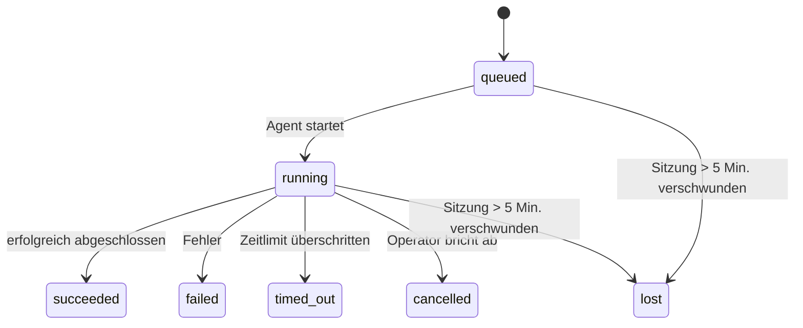

---
read_when:
    - Prüfen von laufenden oder kürzlich abgeschlossenen Hintergrundarbeiten
    - Fehlerbehebung bei Zustellungsfehlern für getrennte Agent-Läufe
    - Verstehen, wie Hintergrundläufe mit Sitzungen, Cron und Heartbeat zusammenhängen
summary: Hintergrund-Task-Tracking für ACP-Läufe, Subagents, isolierte Cron-Jobs und CLI-Operationen
title: Hintergrund-Tasks
x-i18n:
    generated_at: "2026-04-10T06:21:14Z"
    model: gpt-5.4
    provider: openai
    source_hash: d7b5ba41f1025e0089986342ce85698bc62f676439c3ccf03f3ed146beb1b1ac
    source_path: automation/tasks.md
    workflow: 15
---

# Hintergrund-Tasks

> **Du suchst nach Planung?** Siehe [Automatisierung & Tasks](/de/automation), um den richtigen Mechanismus auszuwählen. Diese Seite behandelt das **Tracking** von Hintergrundarbeit, nicht deren Planung.

Hintergrund-Tasks verfolgen Arbeit, die **außerhalb deiner Haupt-Konversationssitzung** läuft:
ACP-Läufe, Subagent-Starts, isolierte Cron-Job-Ausführungen und durch die CLI initiierte Operationen.

Tasks ersetzen **keine** Sitzungen, Cron-Jobs oder Heartbeats — sie sind das **Aktivitätsprotokoll**, das erfasst, welche entkoppelte Arbeit stattgefunden hat, wann sie stattgefunden hat und ob sie erfolgreich war.

<Note>
Nicht jeder Agent-Lauf erzeugt einen Task. Heartbeat-Durchläufe und normaler interaktiver Chat tun das nicht. Alle Cron-Ausführungen, ACP-Starts, Subagent-Starts und CLI-Agent-Befehle tun es.
</Note>

## Kurzfassung

- Tasks sind **Einträge**, keine Planer — Cron und Heartbeat entscheiden, _wann_ Arbeit ausgeführt wird, Tasks verfolgen, _was passiert ist_.
- ACP, Subagents, alle Cron-Jobs und CLI-Operationen erzeugen Tasks. Heartbeat-Durchläufe nicht.
- Jeder Task durchläuft `queued → running → terminal` (succeeded, failed, timed_out, cancelled oder lost).
- Cron-Tasks bleiben aktiv, solange die Cron-Laufzeitumgebung den Job noch besitzt; chat-gestützte CLI-Tasks bleiben nur aktiv, solange ihr zugehöriger Laufkontext noch aktiv ist.
- Abschluss ist push-gesteuert: Entkoppelte Arbeit kann direkt benachrichtigen oder die anfordernde Sitzung bzw. den Heartbeat wecken, wenn sie beendet ist, daher sind Status-Polling-Schleifen meist die falsche Form.
- Isolierte Cron-Läufe und Subagent-Abschlüsse bereinigen nach bestem Bemühen verfolgte Browser-Tabs/Prozesse für ihre untergeordnete Sitzung vor der abschließenden Bereinigungsbuchführung.
- Die Zustellung isolierter Cron-Läufe unterdrückt veraltete vorläufige Antworten des Elternteils, während untergeordnete Subagent-Arbeit noch ausläuft, und bevorzugt die endgültige Ausgabe von Nachkommen, wenn sie vor der Zustellung eintrifft.
- Abschlussbenachrichtigungen werden direkt an einen Kanal zugestellt oder für den nächsten Heartbeat in die Warteschlange gestellt.
- `openclaw tasks list` zeigt alle Tasks; `openclaw tasks audit` zeigt Probleme an.
- Terminal-Einträge werden 7 Tage lang aufbewahrt und danach automatisch entfernt.

## Schnellstart

```bash
# Alle Tasks auflisten (neueste zuerst)
openclaw tasks list

# Nach Laufzeitumgebung oder Status filtern
openclaw tasks list --runtime acp
openclaw tasks list --status running

# Details zu einem bestimmten Task anzeigen (nach ID, Run-ID oder Sitzungsschlüssel)
openclaw tasks show <lookup>

# Einen laufenden Task abbrechen (beendet die untergeordnete Sitzung)
openclaw tasks cancel <lookup>

# Benachrichtigungsrichtlinie für einen Task ändern
openclaw tasks notify <lookup> state_changes

# Einen Zustandsaudit ausführen
openclaw tasks audit

# Wartung in der Vorschau oder anwenden
openclaw tasks maintenance
openclaw tasks maintenance --apply

# TaskFlow-Zustand prüfen
openclaw tasks flow list
openclaw tasks flow show <lookup>
openclaw tasks flow cancel <lookup>
```

## Was einen Task erzeugt

| Quelle                  | Laufzeittyp | Wann ein Task-Eintrag erzeugt wird                     | Standard-Benachrichtigungsrichtlinie |
| ----------------------- | ----------- | ------------------------------------------------------ | ------------------------------------ |
| ACP-Hintergrundläufe    | `acp`       | Beim Starten einer untergeordneten ACP-Sitzung         | `done_only`                          |
| Subagent-Orchestrierung | `subagent`  | Beim Starten eines Subagents über `sessions_spawn`     | `done_only`                          |
| Cron-Jobs (alle Typen)  | `cron`      | Bei jeder Cron-Ausführung (Hauptsitzung und isoliert)  | `silent`                             |
| CLI-Operationen         | `cli`       | `openclaw agent`-Befehle, die über das Gateway laufen  | `silent`                             |
| Agent-Medienjobs        | `cli`       | Sitzungsgestützte `video_generate`-Läufe               | `silent`                             |

Cron-Tasks der Hauptsitzung verwenden standardmäßig die Benachrichtigungsrichtlinie `silent` — sie erzeugen Einträge für das Tracking, generieren aber keine Benachrichtigungen. Isolierte Cron-Tasks verwenden ebenfalls standardmäßig `silent`, sind aber sichtbarer, weil sie in ihrer eigenen Sitzung laufen.

Sitzungsgestützte `video_generate`-Läufe verwenden ebenfalls die Benachrichtigungsrichtlinie `silent`. Sie erzeugen weiterhin Task-Einträge, aber der Abschluss wird als internes Wecksignal an die ursprüngliche Agent-Sitzung zurückgegeben, damit der Agent die Folgemeldung schreiben und das fertige Video selbst anhängen kann. Wenn du `tools.media.asyncCompletion.directSend` aktivierst, versuchen asynchrone `music_generate`- und `video_generate`-Abschlüsse zuerst die direkte Kanalzustellung, bevor sie auf den Weckpfad der anfordernden Sitzung zurückfallen.

Solange ein sitzungsgestützter `video_generate`-Task noch aktiv ist, fungiert das Tool auch als Schutzmechanismus: Wiederholte `video_generate`-Aufrufe in derselben Sitzung geben den aktiven Task-Status zurück, statt eine zweite gleichzeitige Generierung zu starten. Verwende `action: "status"`, wenn du auf Agent-Seite eine explizite Fortschritts-/Statusabfrage möchtest.

**Was keine Tasks erzeugt:**

- Heartbeat-Durchläufe — Hauptsitzung; siehe [Heartbeat](/de/gateway/heartbeat)
- Normale interaktive Chat-Durchläufe
- Direkte `/command`-Antworten

## Task-Lebenszyklus



| Status      | Bedeutung                                                                  |
| ----------- | -------------------------------------------------------------------------- |
| `queued`    | Erstellt, wartet auf den Start des Agents                                  |
| `running`   | Der Agent-Durchlauf wird aktiv ausgeführt                                  |
| `succeeded` | Erfolgreich abgeschlossen                                                   |
| `failed`    | Mit einem Fehler abgeschlossen                                             |
| `timed_out` | Das konfigurierte Zeitlimit wurde überschritten                            |
| `cancelled` | Vom Operator über `openclaw tasks cancel` gestoppt                         |
| `lost`      | Die Laufzeit hat nach einer Schonfrist von 5 Minuten den maßgeblichen Trägerzustand verloren |

Übergänge passieren automatisch — wenn der zugehörige Agent-Lauf endet, wird der Task-Status entsprechend aktualisiert.

`lost` ist laufzeitbewusst:

- ACP-Tasks: Metadaten der zugehörigen ACP-Unterordnungssitzung sind verschwunden.
- Subagent-Tasks: Die zugehörige untergeordnete Sitzung ist aus dem Ziel-Agent-Store verschwunden.
- Cron-Tasks: Die Cron-Laufzeit verfolgt den Job nicht mehr als aktiv.
- CLI-Tasks: Isolierte Child-Session-Tasks verwenden die untergeordnete Sitzung; chat-gestützte CLI-Tasks verwenden stattdessen den Live-Laufkontext, sodass verbleibende Sitzungszeilen für Kanal/Gruppe/Direkt sie nicht aktiv halten.

## Zustellung und Benachrichtigungen

Wenn ein Task einen terminalen Zustand erreicht, benachrichtigt dich OpenClaw. Es gibt zwei Zustellpfade:

**Direkte Zustellung** — wenn der Task ein Kanalziel hat (der `requesterOrigin`), geht die Abschlussmeldung direkt an diesen Kanal (Telegram, Discord, Slack usw.). Bei Subagent-Abschlüssen bewahrt OpenClaw außerdem gebundenes Thread-/Topic-Routing, wenn verfügbar, und kann ein fehlendes `to` / Konto aus der gespeicherten Route der anfordernden Sitzung (`lastChannel` / `lastTo` / `lastAccountId`) ergänzen, bevor die direkte Zustellung aufgegeben wird.

**In die Sitzung eingereihte Zustellung** — wenn die direkte Zustellung fehlschlägt oder kein Ursprung gesetzt ist, wird das Update als Systemereignis in die Sitzung des Anfordernden eingereiht und beim nächsten Heartbeat angezeigt.

<Tip>
Der Abschluss eines Tasks löst ein sofortiges Heartbeat-Wecksignal aus, damit du das Ergebnis schnell siehst — du musst nicht auf den nächsten geplanten Heartbeat-Tick warten.
</Tip>

Das bedeutet, dass der übliche Ablauf push-basiert ist: Starte entkoppelte Arbeit einmal und lass dann die Laufzeit dich bei Abschluss wecken oder benachrichtigen. Frage den Task-Status nur ab, wenn du Debugging, einen Eingriff oder einen expliziten Audit brauchst.

### Benachrichtigungsrichtlinien

Steuere, wie viel du über jeden Task erfährst:

| Richtlinie            | Was zugestellt wird                                                        |
| --------------------- | -------------------------------------------------------------------------- |
| `done_only` (Standard) | Nur der terminale Zustand (succeeded, failed usw.) — **dies ist der Standard** |
| `state_changes`       | Jeder Zustandsübergang und jede Fortschrittsaktualisierung                 |
| `silent`              | Gar nichts                                                                 |

Ändere die Richtlinie, während ein Task läuft:

```bash
openclaw tasks notify <lookup> state_changes
```

## CLI-Referenz

### `tasks list`

```bash
openclaw tasks list [--runtime <acp|subagent|cron|cli>] [--status <status>] [--json]
```

Ausgabespalten: Task-ID, Typ, Status, Zustellung, Run-ID, untergeordnete Sitzung, Zusammenfassung.

### `tasks show`

```bash
openclaw tasks show <lookup>
```

Das Lookup-Token akzeptiert eine Task-ID, Run-ID oder einen Sitzungsschlüssel. Es zeigt den vollständigen Eintrag einschließlich Zeitangaben, Zustellstatus, Fehler und terminaler Zusammenfassung.

### `tasks cancel`

```bash
openclaw tasks cancel <lookup>
```

Bei ACP- und Subagent-Tasks beendet dies die untergeordnete Sitzung. Bei CLI-verfolgten Tasks wird der Abbruch in der Task-Registry vermerkt (es gibt keinen separaten Child-Runtime-Handle). Der Status wechselt zu `cancelled`, und falls zutreffend wird eine Zustellbenachrichtigung gesendet.

### `tasks notify`

```bash
openclaw tasks notify <lookup> <done_only|state_changes|silent>
```

### `tasks audit`

```bash
openclaw tasks audit [--json]
```

Zeigt betriebliche Probleme an. Ergebnisse erscheinen auch in `openclaw status`, wenn Probleme erkannt werden.

| Befund                    | Schweregrad | Auslöser                                              |
| ------------------------- | ----------- | ----------------------------------------------------- |
| `stale_queued`            | warn        | Mehr als 10 Minuten in der Warteschlange              |
| `stale_running`           | error       | Mehr als 30 Minuten laufend                           |
| `lost`                    | error       | Laufzeitgestützte Task-Zuständigkeit ist verschwunden |
| `delivery_failed`         | warn        | Zustellung fehlgeschlagen und Richtlinie ist nicht `silent` |
| `missing_cleanup`         | warn        | Terminaler Task ohne Bereinigungszeitstempel          |
| `inconsistent_timestamps` | warn        | Verletzung der Zeitachse (zum Beispiel Ende vor Start) |

### `tasks maintenance`

```bash
openclaw tasks maintenance [--json]
openclaw tasks maintenance --apply [--json]
```

Verwende dies, um Abgleich, Setzen von Bereinigungsmarkierungen und Entfernen für Tasks und den Task-Flow-Zustand in der Vorschau zu sehen oder anzuwenden.

Der Abgleich ist laufzeitbewusst:

- ACP-/Subagent-Tasks prüfen ihre zugehörige untergeordnete Sitzung.
- Cron-Tasks prüfen, ob die Cron-Laufzeit den Job noch besitzt.
- Chat-gestützte CLI-Tasks prüfen den zugehörigen Live-Laufkontext, nicht nur die Chat-Sitzungszeile.

Die Abschlussbereinigung ist ebenfalls laufzeitbewusst:

- Beim Abschluss eines Subagents werden nach bestem Bemühen verfolgte Browser-Tabs/Prozesse für die untergeordnete Sitzung geschlossen, bevor die Bereinigung der Bekanntgabe fortgesetzt wird.
- Beim Abschluss eines isolierten Cron-Laufs werden nach bestem Bemühen verfolgte Browser-Tabs/Prozesse für die Cron-Sitzung geschlossen, bevor der Lauf vollständig heruntergefahren wird.
- Die Zustellung isolierter Cron-Läufe wartet bei Bedarf auf nachgelagerte Subagent-Nacharbeit und unterdrückt veralteten Bestätigungstext des Elternteils, anstatt ihn anzukündigen.
- Die Zustellung beim Subagent-Abschluss bevorzugt den neuesten sichtbaren Assistant-Text; wenn dieser leer ist, greift sie auf bereinigten neuesten Tool-/toolResult-Text zurück, und reine Tool-Call-Läufe mit Zeitüberschreitung können auf eine kurze Teilfortschrittszusammenfassung reduziert werden.
- Bereinigungsfehler verdecken nicht das tatsächliche Task-Ergebnis.

### `tasks flow list|show|cancel`

```bash
openclaw tasks flow list [--status <status>] [--json]
openclaw tasks flow show <lookup> [--json]
openclaw tasks flow cancel <lookup>
```

Verwende diese Befehle, wenn dich der orchestrierende Task-Flow interessiert und nicht ein einzelner Hintergrund-Task-Eintrag.

## Chat-Task-Board (`/tasks`)

Verwende `/tasks` in jeder Chat-Sitzung, um mit dieser Sitzung verknüpfte Hintergrund-Tasks anzuzeigen. Das Board zeigt aktive und kürzlich abgeschlossene Tasks mit Laufzeit, Status, Zeitangaben sowie Fortschritts- oder Fehlerdetails.

Wenn die aktuelle Sitzung keine sichtbaren verknüpften Tasks hat, fällt `/tasks` auf agent-lokale Task-Anzahlen zurück, sodass du trotzdem einen Überblick bekommst, ohne Details anderer Sitzungen preiszugeben.

Für das vollständige Operator-Protokoll verwende die CLI: `openclaw tasks list`.

## Statusintegration (Task-Druck)

`openclaw status` enthält eine Task-Zusammenfassung auf einen Blick:

```
Tasks: 3 queued · 2 running · 1 issues
```

Die Zusammenfassung meldet:

- **active** — Anzahl von `queued` + `running`
- **failures** — Anzahl von `failed` + `timed_out` + `lost`
- **byRuntime** — Aufschlüsselung nach `acp`, `subagent`, `cron`, `cli`

Sowohl `/status` als auch das Tool `session_status` verwenden einen bereinigungsbewussten Task-Snapshot: Aktive Tasks werden bevorzugt, veraltete abgeschlossene Zeilen werden ausgeblendet, und aktuelle Fehler werden nur angezeigt, wenn keine aktive Arbeit mehr verbleibt. So bleibt die Statuskarte auf das fokussiert, was gerade wichtig ist.

## Speicherung und Wartung

### Wo Tasks gespeichert werden

Task-Einträge werden in SQLite gespeichert unter:

```
$OPENCLAW_STATE_DIR/tasks/runs.sqlite
```

Die Registry wird beim Gateway-Start in den Speicher geladen und synchronisiert Schreibvorgänge nach SQLite, damit die Daten über Neustarts hinweg erhalten bleiben.

### Automatische Wartung

Ein Sweeper läuft alle **60 Sekunden** und übernimmt drei Dinge:

1. **Abgleich** — prüft, ob aktive Tasks noch einen maßgeblichen Laufzeit-Trägerzustand haben. ACP-/Subagent-Tasks verwenden den Status der untergeordneten Sitzung, Cron-Tasks verwenden den Besitz aktiver Jobs, und chat-gestützte CLI-Tasks verwenden den zugehörigen Laufkontext. Wenn dieser Trägerzustand länger als 5 Minuten fehlt, wird der Task als `lost` markiert.
2. **Setzen von Bereinigungsmarkierungen** — setzt einen Zeitstempel `cleanupAfter` auf terminale Tasks (`endedAt + 7 days`).
3. **Entfernen** — löscht Einträge nach ihrem `cleanupAfter`-Datum.

**Aufbewahrung**: Terminale Task-Einträge werden **7 Tage** lang aufbewahrt und danach automatisch entfernt. Keine Konfiguration erforderlich.

## Wie Tasks mit anderen Systemen zusammenhängen

### Tasks und Task Flow

[Task Flow](/de/automation/taskflow) ist die Flow-Orchestrierungsebene über Hintergrund-Tasks. Ein einzelner Flow kann über seine Lebensdauer mehrere Tasks koordinieren, wobei verwaltete oder gespiegelte Synchronisierungsmodi verwendet werden. Verwende `openclaw tasks`, um einzelne Task-Einträge zu prüfen, und `openclaw tasks flow`, um den orchestrierenden Flow zu prüfen.

Siehe [Task Flow](/de/automation/taskflow) für Details.

### Tasks und Cron

Eine Cron-Job-**Definition** befindet sich in `~/.openclaw/cron/jobs.json`. **Jede** Cron-Ausführung erzeugt einen Task-Eintrag — sowohl in der Hauptsitzung als auch isoliert. Cron-Tasks der Hauptsitzung verwenden standardmäßig die Benachrichtigungsrichtlinie `silent`, sodass sie verfolgt werden, ohne Benachrichtigungen zu erzeugen.

Siehe [Cron-Jobs](/de/automation/cron-jobs).

### Tasks und Heartbeat

Heartbeat-Läufe sind Durchläufe der Hauptsitzung — sie erzeugen keine Task-Einträge. Wenn ein Task abgeschlossen wird, kann er ein Heartbeat-Wecksignal auslösen, damit du das Ergebnis zeitnah siehst.

Siehe [Heartbeat](/de/gateway/heartbeat).

### Tasks und Sitzungen

Ein Task kann auf einen `childSessionKey` verweisen (wo die Arbeit ausgeführt wird) und auf einen `requesterSessionKey` (wer sie gestartet hat). Sitzungen sind der Gesprächskontext; Tasks sind das darüberliegende Aktivitäts-Tracking.

### Tasks und Agent-Läufe

Die `runId` eines Tasks verweist auf den Agent-Lauf, der die Arbeit ausführt. Ereignisse aus dem Agent-Lebenszyklus (Start, Ende, Fehler) aktualisieren den Task-Status automatisch — du musst den Lebenszyklus nicht manuell verwalten.

## Verwandt

- [Automatisierung & Tasks](/de/automation) — alle Automatisierungsmechanismen auf einen Blick
- [Task Flow](/de/automation/taskflow) — Flow-Orchestrierung über Tasks
- [Geplante Tasks](/de/automation/cron-jobs) — Planung von Hintergrundarbeit
- [Heartbeat](/de/gateway/heartbeat) — periodische Durchläufe der Hauptsitzung
- [CLI: Tasks](/cli/index#tasks) — CLI-Befehlsreferenz
