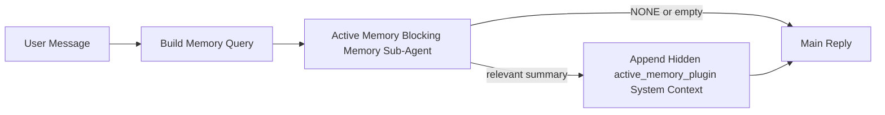

---
read_when:
    - Sie möchten verstehen, wofür der aktive Speicher da ist
    - Sie möchten den aktiven Speicher für einen Konversationsagenten aktivieren
    - Sie möchten das Verhalten des aktiven Speichers abstimmen, ohne ihn überall zu aktivieren
summary: Ein plugin-eigener blockierender Speicher-Sub-Agent, der relevanten Speicher in interaktive Chat-Sitzungen einspeist
title: Aktiver Speicher
x-i18n:
    generated_at: "2026-04-11T06:08:36Z"
    model: gpt-5.4
    provider: openai
    source_hash: e8b0e6539e09678e9e8def68795f8bcb992f98509423da3da3123eda88ec1dd5
    source_path: concepts/active-memory.md
    workflow: 15
---

# Aktiver Speicher

Der aktive Speicher ist ein optionaler plugin-eigener blockierender Speicher-Sub-Agent, der
vor der Hauptantwort für berechtigte Konversationssitzungen ausgeführt wird.

Er existiert, weil die meisten Speichersysteme leistungsfähig, aber reaktiv sind. Sie verlassen sich darauf,
dass der Haupt-Agent entscheidet, wann der Speicher durchsucht werden soll, oder darauf, dass der Benutzer Dinge sagt
wie „Merke dir das“ oder „Durchsuche den Speicher“. Dann ist der Moment, in dem der Speicher die Antwort natürlich
hätte wirken lassen, bereits vorbei.

Der aktive Speicher gibt dem System eine begrenzte Gelegenheit, relevanten Speicher sichtbar zu machen,
bevor die Hauptantwort erzeugt wird.

## Fügen Sie dies in Ihren Agenten ein

Fügen Sie dies in Ihren Agenten ein, wenn Sie den aktiven Speicher mit einer
eigenständigen Einrichtung mit sicheren Standardwerten aktivieren möchten:

```json5
{
  plugins: {
    entries: {
      "active-memory": {
        enabled: true,
        config: {
          enabled: true,
          agents: ["main"],
          allowedChatTypes: ["direct"],
          modelFallbackPolicy: "default-remote",
          queryMode: "recent",
          promptStyle: "balanced",
          timeoutMs: 15000,
          maxSummaryChars: 220,
          persistTranscripts: false,
          logging: true,
        },
      },
    },
  },
}
```

Dadurch wird das Plugin für den `main`-Agenten aktiviert, standardmäßig auf Sitzungen im Stil von Direktnachrichten
beschränkt, es kann zunächst das aktuelle Sitzungsmodell erben, und
der integrierte Remote-Fallback ist weiterhin erlaubt, wenn kein explizites oder geerbtes Modell verfügbar ist.

Starten Sie danach das Gateway neu:

```bash
openclaw gateway
```

So prüfen Sie es live in einer Unterhaltung:

```text
/verbose on
```

## Aktiven Speicher aktivieren

Die sicherste Einrichtung ist:

1. das Plugin aktivieren
2. einen Konversationsagenten anvisieren
3. die Protokollierung nur während der Abstimmung eingeschaltet lassen

Beginnen Sie mit Folgendem in `openclaw.json`:

```json5
{
  plugins: {
    entries: {
      "active-memory": {
        enabled: true,
        config: {
          agents: ["main"],
          allowedChatTypes: ["direct"],
          modelFallbackPolicy: "default-remote",
          queryMode: "recent",
          promptStyle: "balanced",
          timeoutMs: 15000,
          maxSummaryChars: 220,
          persistTranscripts: false,
          logging: true,
        },
      },
    },
  },
}
```

Starten Sie dann das Gateway neu:

```bash
openclaw gateway
```

Das bedeutet Folgendes:

- `plugins.entries.active-memory.enabled: true` aktiviert das Plugin
- `config.agents: ["main"]` meldet nur den `main`-Agenten für den aktiven Speicher an
- `config.allowedChatTypes: ["direct"]` lässt den aktiven Speicher standardmäßig nur für Sitzungen im Stil von Direktnachrichten aktiviert
- wenn `config.model` nicht gesetzt ist, erbt der aktive Speicher zunächst das aktuelle Sitzungsmodell
- `config.modelFallbackPolicy: "default-remote"` behält den integrierten Remote-Fallback als Standard bei, wenn kein explizites oder geerbtes Modell verfügbar ist
- `config.promptStyle: "balanced"` verwendet den allgemeinen Standard-Prompt-Stil für den `recent`-Modus
- der aktive Speicher wird weiterhin nur in berechtigten interaktiven persistenten Chat-Sitzungen ausgeführt

## Wie Sie ihn sehen können

Der aktive Speicher fügt verborgenen Systemkontext für das Modell ein. Er zeigt
keine rohen `<active_memory_plugin>...</active_memory_plugin>`-Tags an den Client an.

## Sitzungsumschaltung

Verwenden Sie den Plugin-Befehl, wenn Sie den aktiven Speicher für die
aktuelle Chat-Sitzung pausieren oder fortsetzen möchten, ohne die Konfiguration zu bearbeiten:

```text
/active-memory status
/active-memory off
/active-memory on
```

Dies ist auf die Sitzung beschränkt. Es ändert nicht
`plugins.entries.active-memory.enabled`, die Agentenausrichtung oder andere globale
Konfigurationen.

Wenn Sie möchten, dass der Befehl die Konfiguration schreibt und den aktiven Speicher für
alle Sitzungen pausiert oder fortsetzt, verwenden Sie die explizite globale Form:

```text
/active-memory status --global
/active-memory off --global
/active-memory on --global
```

Die globale Form schreibt `plugins.entries.active-memory.config.enabled`. Sie lässt
`plugins.entries.active-memory.enabled` aktiviert, sodass der Befehl weiterhin verfügbar bleibt, um den aktiven Speicher später wieder einzuschalten.

Wenn Sie sehen möchten, was der aktive Speicher in einer Live-Sitzung tut, schalten Sie den ausführlichen
Modus für diese Sitzung ein:

```text
/verbose on
```

Wenn der ausführliche Modus aktiviert ist, kann OpenClaw Folgendes anzeigen:

- eine Statuszeile für den aktiven Speicher wie `Active Memory: ok 842ms recent 34 chars`
- eine lesbare Debug-Zusammenfassung wie `Active Memory Debug: Lemon pepper wings with blue cheese.`

Diese Zeilen stammen aus demselben Durchlauf des aktiven Speichers, der den verborgenen
Systemkontext speist, sind aber für Menschen formatiert, statt rohes Prompt-Markup anzuzeigen.

Standardmäßig ist das Transkript des blockierenden Speicher-Sub-Agenten temporär und wird gelöscht,
nachdem der Durchlauf abgeschlossen ist.

Beispielablauf:

```text
/verbose on
what wings should i order?
```

Erwartete sichtbare Form der Antwort:

```text
...normal assistant reply...

🧩 Active Memory: ok 842ms recent 34 chars
🔎 Active Memory Debug: Lemon pepper wings with blue cheese.
```

## Wann er ausgeführt wird

Der aktive Speicher verwendet zwei Gates:

1. **Konfigurations-Opt-in**
   Das Plugin muss aktiviert sein, und die aktuelle Agenten-ID muss in
   `plugins.entries.active-memory.config.agents` erscheinen.
2. **Strenge Laufzeitberechtigung**
   Selbst wenn der aktive Speicher aktiviert und anvisiert ist, wird er nur für berechtigte
   interaktive persistente Chat-Sitzungen ausgeführt.

Die tatsächliche Regel lautet:

```text
plugin enabled
+
agent id targeted
+
allowed chat type
+
eligible interactive persistent chat session
=
active memory runs
```

Wenn eine dieser Bedingungen fehlschlägt, wird der aktive Speicher nicht ausgeführt.

## Sitzungstypen

`config.allowedChatTypes` steuert, in welchen Arten von Unterhaltungen der aktive
Speicher überhaupt ausgeführt werden darf.

Der Standard ist:

```json5
allowedChatTypes: ["direct"]
```

Das bedeutet, dass der aktive Speicher standardmäßig in Sitzungen im Stil von Direktnachrichten ausgeführt wird, aber
nicht in Gruppen- oder Kanalsitzungen, es sei denn, Sie melden diese ausdrücklich an.

Beispiele:

```json5
allowedChatTypes: ["direct"]
```

```json5
allowedChatTypes: ["direct", "group"]
```

```json5
allowedChatTypes: ["direct", "group", "channel"]
```

## Wo er ausgeführt wird

Der aktive Speicher ist eine Funktion zur Anreicherung von Unterhaltungen, keine plattformweite
Inferenzfunktion.

| Oberfläche                                                          | Wird der aktive Speicher ausgeführt?                    |
| ------------------------------------------------------------------- | ------------------------------------------------------- |
| Control UI / persistente Web-Chat-Sitzungen                         | Ja, wenn das Plugin aktiviert ist und der Agent anvisiert ist |
| Andere interaktive Kanalsitzungen auf demselben persistenten Chat-Pfad | Ja, wenn das Plugin aktiviert ist und der Agent anvisiert ist |
| Headless-Einmaldurchläufe                                           | Nein                                                    |
| Heartbeat-/Hintergrunddurchläufe                                    | Nein                                                    |
| Generische interne `agent-command`-Pfade                            | Nein                                                    |
| Ausführung von Sub-Agenten/internen Hilfsfunktionen                 | Nein                                                    |

## Warum Sie ihn verwenden sollten

Verwenden Sie den aktiven Speicher, wenn:

- die Sitzung persistent und benutzerorientiert ist
- der Agent über sinnvollen Langzeitspeicher verfügt, der durchsucht werden kann
- Kontinuität und Personalisierung wichtiger sind als rohe Prompt-Deterministik

Er funktioniert besonders gut für:

- stabile Präferenzen
- wiederkehrende Gewohnheiten
- langfristigen Benutzerkontext, der natürlich sichtbar werden soll

Er passt schlecht zu:

- Automatisierung
- internen Workern
- einmaligen API-Aufgaben
- Orten, an denen verborgene Personalisierung überraschend wäre

## Wie er funktioniert

Die Laufzeitform ist:



Der blockierende Speicher-Sub-Agent kann nur Folgendes verwenden:

- `memory_search`
- `memory_get`

Wenn die Verbindung schwach ist, sollte er `NONE` zurückgeben.

## Abfragemodi

`config.queryMode` steuert, wie viel von der Unterhaltung der blockierende Speicher-Sub-Agent sieht.

## Prompt-Stile

`config.promptStyle` steuert, wie eifrig oder streng der blockierende Speicher-Sub-Agent ist,
wenn er entscheidet, ob Speicher zurückgegeben werden soll.

Verfügbare Stile:

- `balanced`: allgemeiner Standard für den `recent`-Modus
- `strict`: am wenigsten eifrig; am besten, wenn Sie sehr wenig Übersprechen aus dem nahen Kontext möchten
- `contextual`: am kontinuitätsfreundlichsten; am besten, wenn der Unterhaltungsverlauf stärker zählen soll
- `recall-heavy`: eher bereit, Speicher bei weicheren, aber weiterhin plausiblen Übereinstimmungen sichtbar zu machen
- `precision-heavy`: bevorzugt aggressiv `NONE`, es sei denn, die Übereinstimmung ist offensichtlich
- `preference-only`: optimiert für Favoriten, Gewohnheiten, Routinen, Geschmack und wiederkehrende persönliche Fakten

Standardzuordnung, wenn `config.promptStyle` nicht gesetzt ist:

```text
message -> strict
recent -> balanced
full -> contextual
```

Wenn Sie `config.promptStyle` explizit setzen, hat diese Überschreibung Vorrang.

Beispiel:

```json5
promptStyle: "preference-only"
```

## Modell-Fallback-Richtlinie

Wenn `config.model` nicht gesetzt ist, versucht der aktive Speicher, ein Modell in dieser Reihenfolge aufzulösen:

```text
explicit plugin model
-> current session model
-> agent primary model
-> optional built-in remote fallback
```

`config.modelFallbackPolicy` steuert den letzten Schritt.

Standard:

```json5
modelFallbackPolicy: "default-remote"
```

Andere Option:

```json5
modelFallbackPolicy: "resolved-only"
```

Verwenden Sie `resolved-only`, wenn Sie möchten, dass der aktive Speicher das Erinnern überspringt, statt
auf den integrierten Standard-Remote-Fallback zurückzugreifen, wenn kein explizites oder geerbtes Modell
verfügbar ist.

## Erweiterte Ausweichmöglichkeiten

Diese Optionen sind absichtlich nicht Teil der empfohlenen Einrichtung.

`config.thinking` kann die Denkstufe des blockierenden Speicher-Sub-Agenten überschreiben:

```json5
thinking: "medium"
```

Standard:

```json5
thinking: "off"
```

Aktivieren Sie dies nicht standardmäßig. Der aktive Speicher läuft im Antwortpfad, daher erhöht zusätzliche
Denkzeit direkt die für den Benutzer sichtbare Latenz.

`config.promptAppend` fügt nach dem Standard-Prompt für den aktiven
Speicher und vor dem Unterhaltungskontext zusätzliche Bedieneranweisungen hinzu:

```json5
promptAppend: "Prefer stable long-term preferences over one-off events."
```

`config.promptOverride` ersetzt den Standard-Prompt für den aktiven Speicher. OpenClaw
hängt den Unterhaltungskontext danach weiterhin an:

```json5
promptOverride: "You are a memory search agent. Return NONE or one compact user fact."
```

Eine Anpassung des Prompts wird nicht empfohlen, es sei denn, Sie testen bewusst einen
anderen Erinnerungsvertrag. Der Standard-Prompt ist darauf abgestimmt, entweder `NONE`
oder kompakten Benutzerfakten-Kontext für das Hauptmodell zurückzugeben.

### `message`

Nur die neueste Benutzernachricht wird gesendet.

```text
Latest user message only
```

Verwenden Sie dies, wenn:

- Sie das schnellste Verhalten möchten
- Sie die stärkste Ausrichtung auf das Erinnern stabiler Präferenzen möchten
- Folgerunden keinen Unterhaltungskontext benötigen

Empfohlenes Timeout:

- beginnen Sie bei etwa `3000` bis `5000` ms

### `recent`

Die neueste Benutzernachricht plus ein kurzer aktueller Unterhaltungsverlauf wird gesendet.

```text
Recent conversation tail:
user: ...
assistant: ...
user: ...

Latest user message:
...
```

Verwenden Sie dies, wenn:

- Sie eine bessere Balance aus Geschwindigkeit und Verankerung in der Unterhaltung möchten
- Anschlussfragen oft von den letzten wenigen Runden abhängen

Empfohlenes Timeout:

- beginnen Sie bei etwa `15000` ms

### `full`

Die vollständige Unterhaltung wird an den blockierenden Speicher-Sub-Agenten gesendet.

```text
Full conversation context:
user: ...
assistant: ...
user: ...
...
```

Verwenden Sie dies, wenn:

- die bestmögliche Erinnerungsqualität wichtiger ist als Latenz
- die Unterhaltung weit hinten im Thread wichtige Vorbereitung enthält

Empfohlenes Timeout:

- erhöhen Sie es deutlich im Vergleich zu `message` oder `recent`
- beginnen Sie bei etwa `15000` ms oder höher, abhängig von der Thread-Größe

Im Allgemeinen sollte das Timeout mit der Kontextgröße zunehmen:

```text
message < recent < full
```

## Transkriptpersistenz

Durchläufe des blockierenden Speicher-Sub-Agenten des aktiven Speichers erzeugen während des Aufrufs des blockierenden Speicher-Sub-Agenten ein echtes `session.jsonl`-
Transkript.

Standardmäßig ist dieses Transkript temporär:

- es wird in ein temporäres Verzeichnis geschrieben
- es wird nur für den Durchlauf des blockierenden Speicher-Sub-Agenten verwendet
- es wird sofort gelöscht, nachdem der Durchlauf abgeschlossen ist

Wenn Sie diese Transkripte des blockierenden Speicher-Sub-Agenten zur Fehlerbehebung oder
Inspektion auf dem Datenträger behalten möchten, aktivieren Sie die Persistenz ausdrücklich:

```json5
{
  plugins: {
    entries: {
      "active-memory": {
        enabled: true,
        config: {
          agents: ["main"],
          persistTranscripts: true,
          transcriptDir: "active-memory",
        },
      },
    },
  },
}
```

Wenn dies aktiviert ist, speichert der aktive Speicher Transkripte in einem separaten Verzeichnis unter dem
Sitzungsordner des Ziel-Agenten, nicht im Transkriptpfad der Haupt-Benutzerunterhaltung.

Das Standardlayout ist konzeptionell:

```text
agents/<agent>/sessions/active-memory/<blocking-memory-sub-agent-session-id>.jsonl
```

Sie können das relative Unterverzeichnis mit `config.transcriptDir` ändern.

Verwenden Sie dies mit Vorsicht:

- Transkripte des blockierenden Speicher-Sub-Agenten können sich in stark genutzten Sitzungen schnell ansammeln
- der Abfragemodus `full` kann viel Unterhaltungskontext duplizieren
- diese Transkripte enthalten verborgenen Prompt-Kontext und abgerufene Erinnerungen

## Konfiguration

Die gesamte Konfiguration des aktiven Speichers befindet sich unter:

```text
plugins.entries.active-memory
```

Die wichtigsten Felder sind:

| Schlüssel                    | Typ                                                                                                  | Bedeutung                                                                                                     |
| ---------------------------- | ---------------------------------------------------------------------------------------------------- | ------------------------------------------------------------------------------------------------------------- |
| `enabled`                    | `boolean`                                                                                            | Aktiviert das Plugin selbst                                                                                   |
| `config.agents`              | `string[]`                                                                                           | Agenten-IDs, die den aktiven Speicher verwenden dürfen                                                       |
| `config.model`               | `string`                                                                                             | Optionale Modellreferenz für den blockierenden Speicher-Sub-Agenten; wenn nicht gesetzt, verwendet der aktive Speicher das aktuelle Sitzungsmodell |
| `config.queryMode`           | `"message" \| "recent" \| "full"`                                                                    | Steuert, wie viel Unterhaltung der blockierende Speicher-Sub-Agent sieht                                     |
| `config.promptStyle`         | `"balanced" \| "strict" \| "contextual" \| "recall-heavy" \| "precision-heavy" \| "preference-only"` | Steuert, wie eifrig oder streng der blockierende Speicher-Sub-Agent ist, wenn er entscheidet, ob Speicher zurückgegeben werden soll |
| `config.thinking`            | `"off" \| "minimal" \| "low" \| "medium" \| "high" \| "xhigh" \| "adaptive"`                         | Erweiterte Überschreibung der Denkstufe für den blockierenden Speicher-Sub-Agenten; Standard ist `off` für Geschwindigkeit |
| `config.promptOverride`      | `string`                                                                                             | Erweiterter vollständiger Prompt-Ersatz; für den normalen Gebrauch nicht empfohlen                           |
| `config.promptAppend`        | `string`                                                                                             | Erweiterte zusätzliche Anweisungen, die an den Standard- oder überschriebenen Prompt angehängt werden        |
| `config.timeoutMs`           | `number`                                                                                             | Harte Zeitüberschreitung für den blockierenden Speicher-Sub-Agenten                                          |
| `config.maxSummaryChars`     | `number`                                                                                             | Maximal zulässige Gesamtzahl von Zeichen in der Active-Memory-Zusammenfassung                                |
| `config.logging`             | `boolean`                                                                                            | Gibt während der Abstimmung Logs des aktiven Speichers aus                                                   |
| `config.persistTranscripts`  | `boolean`                                                                                            | Behält Transkripte des blockierenden Speicher-Sub-Agenten auf dem Datenträger, statt temporäre Dateien zu löschen |
| `config.transcriptDir`       | `string`                                                                                             | Relatives Transkriptverzeichnis des blockierenden Speicher-Sub-Agenten unter dem Sitzungsordner des Agenten |

Nützliche Felder zur Abstimmung:

| Schlüssel                      | Typ      | Bedeutung                                                    |
| ----------------------------- | -------- | ------------------------------------------------------------ |
| `config.maxSummaryChars`      | `number` | Maximal zulässige Gesamtzahl von Zeichen in der Active-Memory-Zusammenfassung |
| `config.recentUserTurns`      | `number` | Vorherige Benutzerrunden, die eingeschlossen werden, wenn `queryMode` auf `recent` gesetzt ist |
| `config.recentAssistantTurns` | `number` | Vorherige Assistentenrunden, die eingeschlossen werden, wenn `queryMode` auf `recent` gesetzt ist |
| `config.recentUserChars`      | `number` | Maximale Zeichen pro aktueller Benutzerrunde                 |
| `config.recentAssistantChars` | `number` | Maximale Zeichen pro aktueller Assistentenrunde              |
| `config.cacheTtlMs`           | `number` | Cache-Wiederverwendung für wiederholte identische Abfragen   |

## Empfohlene Einrichtung

Beginnen Sie mit `recent`.

```json5
{
  plugins: {
    entries: {
      "active-memory": {
        enabled: true,
        config: {
          agents: ["main"],
          queryMode: "recent",
          promptStyle: "balanced",
          timeoutMs: 15000,
          maxSummaryChars: 220,
          logging: true,
        },
      },
    },
  },
}
```

Wenn Sie das Live-Verhalten während der Abstimmung prüfen möchten, verwenden Sie `/verbose on` in der
Sitzung, anstatt nach einem separaten Debug-Befehl für den aktiven Speicher zu suchen.

Wechseln Sie dann zu:

- `message`, wenn Sie eine geringere Latenz möchten
- `full`, wenn Sie entscheiden, dass zusätzlicher Kontext den langsameren blockierenden Speicher-Sub-Agenten wert ist

## Fehlerbehebung

Wenn der aktive Speicher nicht dort angezeigt wird, wo Sie ihn erwarten:

1. Bestätigen Sie, dass das Plugin unter `plugins.entries.active-memory.enabled` aktiviert ist.
2. Bestätigen Sie, dass die aktuelle Agenten-ID in `config.agents` aufgeführt ist.
3. Bestätigen Sie, dass Sie über eine interaktive persistente Chat-Sitzung testen.
4. Aktivieren Sie `config.logging: true` und beobachten Sie die Gateway-Logs.
5. Vergewissern Sie sich mit `openclaw memory status --deep`, dass die Speichersuche selbst funktioniert.

Wenn Speichertreffer verrauscht sind, verringern Sie:

- `maxSummaryChars`

Wenn der aktive Speicher zu langsam ist:

- verringern Sie `queryMode`
- verringern Sie `timeoutMs`
- reduzieren Sie die Anzahl der aktuellen Runden
- reduzieren Sie die Zeichenobergrenzen pro Runde

## Verwandte Seiten

- [Speichersuche](/de/concepts/memory-search)
- [Referenz zur Speicherkonfiguration](/de/reference/memory-config)
- [Plugin SDK-Einrichtung](/de/plugins/sdk-setup)
