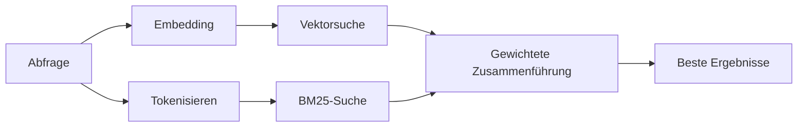

---
read_when:
    - Sie möchten verstehen, wie `memory_search` funktioniert
    - Sie möchten einen Embedding-Anbieter auswählen
    - Sie möchten die Suchqualität optimieren
summary: Wie die Speichersuche mithilfe von Embeddings und hybrider Suche relevante Notizen findet
title: Speichersuche
x-i18n:
    generated_at: "2026-04-15T14:40:34Z"
    model: gpt-5.4
    provider: openai
    source_hash: f5757aa8fe8f7fec30ef5c826f72230f591ce4cad591d81a091189d50d4262ed
    source_path: concepts/memory-search.md
    workflow: 15
---

# Speichersuche

`memory_search` findet relevante Notizen aus Ihren Speicherdateien, auch wenn
die Formulierung vom Originaltext abweicht. Dazu wird der Speicher in kleine
Abschnitte indexiert und diese mit Embeddings, Schlüsselwörtern oder beidem
durchsucht.

## Schnellstart

Wenn Sie ein GitHub Copilot-Abonnement oder einen konfigurierten API-Schlüssel
für OpenAI, Gemini, Voyage oder Mistral haben, funktioniert die Speichersuche
automatisch. Um einen Anbieter explizit festzulegen:

```json5
{
  agents: {
    defaults: {
      memorySearch: {
        provider: "openai", // oder "gemini", "local", "ollama" usw.
      },
    },
  },
}
```

Für lokale Embeddings ohne API-Schlüssel verwenden Sie `provider: "local"` (erfordert
node-llama-cpp).

## Unterstützte Anbieter

| Anbieter        | ID               | API-Schlüssel erforderlich | Hinweise                                              |
| ---------------- | ---------------- | ------------------------- | ----------------------------------------------------- |
| Bedrock          | `bedrock`        | Nein                      | Automatisch erkannt, wenn die AWS-Anmeldedatenkette aufgelöst wird |
| Gemini           | `gemini`         | Ja                        | Unterstützt Bild-/Audio-Indexierung                   |
| GitHub Copilot   | `github-copilot` | Nein                      | Automatisch erkannt, verwendet das Copilot-Abonnement |
| Local            | `local`          | Nein                      | GGUF-Modell, Download von ca. 0,6 GB                  |
| Mistral          | `mistral`        | Ja                        | Automatisch erkannt                                   |
| Ollama           | `ollama`         | Nein                      | Lokal, muss explizit festgelegt werden                |
| OpenAI           | `openai`         | Ja                        | Automatisch erkannt, schnell                          |
| Voyage           | `voyage`         | Ja                        | Automatisch erkannt                                   |

## So funktioniert die Suche

OpenClaw führt zwei Abrufpfade parallel aus und führt die Ergebnisse zusammen:



- **Vektorsuche** findet Notizen mit ähnlicher Bedeutung („Gateway-Host“ passt
  zu „der Rechner, auf dem OpenClaw läuft“).
- **BM25-Schlüsselwortsuche** findet exakte Treffer (IDs, Fehlerzeichenfolgen, Konfigurations-
  schlüssel).

Wenn nur ein Pfad verfügbar ist (keine Embeddings oder kein FTS), läuft der
andere allein.

Wenn keine Embeddings verfügbar sind, verwendet OpenClaw weiterhin ein
lexikalisches Ranking über FTS-Ergebnisse, anstatt nur auf die rohe Reihenfolge
exakter Treffer zurückzufallen. Dieser eingeschränkte Modus hebt Abschnitte mit
stärkerer Abdeckung der Abfragebegriffe und relevanten Dateipfaden hervor,
wodurch der Recall auch ohne `sqlite-vec` oder einen Embedding-Anbieter
nützlich bleibt.

## Suchqualität verbessern

Zwei optionale Funktionen helfen, wenn Sie eine lange Notizenhistorie haben:

### Zeitlicher Verfall

Alte Notizen verlieren schrittweise an Ranking-Gewicht, sodass neuere
Informationen zuerst angezeigt werden. Mit der Standard-Halbwertszeit von 30
Tagen erreicht eine Notiz vom letzten Monat 50 % ihres ursprünglichen Gewichts.
Evergreen-Dateien wie `MEMORY.md` unterliegen nie dem Verfall.

<Tip>
Aktivieren Sie den zeitlichen Verfall, wenn Ihr Agent monatelange tägliche
Notizen hat und veraltete Informationen immer wieder höher eingestuft werden als
aktueller Kontext.
</Tip>

### MMR (Diversität)

Verringert redundante Ergebnisse. Wenn fünf Notizen dieselbe Router-Konfiguration
erwähnen, sorgt MMR dafür, dass die besten Ergebnisse unterschiedliche Themen
abdecken, anstatt sich zu wiederholen.

<Tip>
Aktivieren Sie MMR, wenn `memory_search` immer wieder nahezu identische Snippets
aus verschiedenen täglichen Notizen zurückgibt.
</Tip>

### Beide aktivieren

```json5
{
  agents: {
    defaults: {
      memorySearch: {
        query: {
          hybrid: {
            mmr: { enabled: true },
            temporalDecay: { enabled: true },
          },
        },
      },
    },
  },
}
```

## Multimodaler Speicher

Mit Gemini Embedding 2 können Sie Bilder und Audiodateien zusammen mit
Markdown indexieren. Suchanfragen bleiben Text, gleichen aber mit visuellen und
Audioinhalten ab. Informationen zur Einrichtung finden Sie in der
[Referenz zur Speicherkonfiguration](/de/reference/memory-config).

## Suche im Sitzungsspeicher

Sie können Sitzungsprotokolle optional indexieren, damit `memory_search`
frühere Gespräche abrufen kann. Dies ist per Opt-in über
`memorySearch.experimental.sessionMemory` verfügbar. Details finden Sie in der
[Konfigurationsreferenz](/de/reference/memory-config).

## Fehlerbehebung

**Keine Ergebnisse?** Führen Sie `openclaw memory status` aus, um den Index zu
prüfen. Falls er leer ist, führen Sie `openclaw memory index --force` aus.

**Nur Schlüsselworttreffer?** Ihr Embedding-Anbieter ist möglicherweise nicht
konfiguriert. Prüfen Sie `openclaw memory status --deep`.

**CJK-Text wird nicht gefunden?** Erstellen Sie den FTS-Index mit
`openclaw memory index --force` neu.

## Weiterführende Informationen

- [Active Memory](/de/concepts/active-memory) -- Unteragenten-Speicher für interaktive Chat-Sitzungen
- [Memory](/de/concepts/memory) -- Dateilayout, Backends, Tools
- [Referenz zur Speicherkonfiguration](/de/reference/memory-config) -- alle Konfigurationsoptionen
