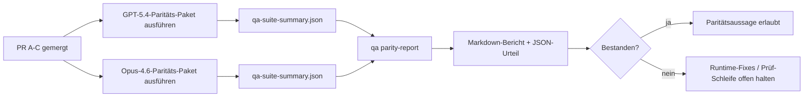

---
x-i18n:
    generated_at: "2026-04-11T15:15:49Z"
    model: gpt-5.4
    provider: openai
    source_hash: 910bcf7668becf182ef48185b43728bf2fa69629d6d50189d47d47b06f807a9e
    source_path: help/gpt54-codex-agentic-parity-maintainers.md
    workflow: 15
---

# Hinweise für Maintainer zur GPT-5.4 / Codex-Parität

Diese Notiz erklärt, wie das GPT-5.4 / Codex-Paritätsprogramm als vier Merge-Einheiten geprüft werden kann, ohne die ursprüngliche Architektur mit sechs Verträgen zu verlieren.

## Merge-Einheiten

### PR A: strikt-agentische Ausführung

Verantwortet:

- `executionContract`
- GPT-5-first Follow-through im selben Turn
- `update_plan` als nicht-terminales Fortschrittstracking
- explizite Blockiert-Zustände statt stiller Stopps nur mit Plan

Verantwortet nicht:

- Klassifizierung von Auth-/Runtime-Fehlern
- Wahrhaftigkeit bei Berechtigungen
- Neugestaltung von Replay/Fortsetzung
- Paritäts-Benchmarking

### PR B: Wahrhaftigkeit der Runtime

Verantwortet:

- Korrektheit der Codex OAuth-Scopes
- typisierte Klassifizierung von Provider-/Runtime-Fehlern
- wahrheitsgemäße Verfügbarkeit von `/elevated full` und Blockiert-Gründe

Verantwortet nicht:

- Normalisierung von Tool-Schemas
- Replay-/Liveness-Zustand
- Benchmark-Gating

### PR C: Korrektheit der Ausführung

Verantwortet:

- providerseitige OpenAI-/Codex-Tool-Kompatibilität
- parameterfreie strikte Schema-Behandlung
- Sichtbarmachung von Replay-Invalid
- Sichtbarkeit von pausierten, blockierten und aufgegebenen Langzeit-Task-Zuständen

Verantwortet nicht:

- selbstgewählte Fortsetzung
- generisches Codex-Dialektverhalten außerhalb von Provider-Hooks
- Benchmark-Gating

### PR D: Paritäts-Harness

Verantwortet:

- erste Welle des GPT-5.4-vs-Opus-4.6-Szenariopakets
- Paritätsdokumentation
- Paritätsbericht und Release-Gate-Mechanik

Verantwortet nicht:

- Änderungen des Runtime-Verhaltens außerhalb von QA-lab
- Auth-/Proxy-/DNS-Simulation innerhalb des Harness

## Rückabbildung auf die ursprünglichen sechs Verträge

| Ursprünglicher Vertrag                   | Merge-Einheit |
| ---------------------------------------- | ------------- |
| Korrektheit von Provider-Transport/Auth  | PR B          |
| Kompatibilität von Tool-Vertrag/Schema   | PR C          |
| Ausführung im selben Turn                | PR A          |
| Wahrhaftigkeit bei Berechtigungen        | PR B          |
| Korrektheit von Replay/Fortsetzung/Liveness | PR C       |
| Benchmark-/Release-Gate                  | PR D          |

## Prüf-Reihenfolge

1. PR A
2. PR B
3. PR C
4. PR D

PR D ist die Nachweis-Schicht. Sie sollte nicht der Grund sein, warum PRs zur Runtime-Korrektheit verzögert werden.

## Worauf zu achten ist

### PR A

- GPT-5-Läufe handeln oder scheitern geschlossen, statt bei Kommentaren zu stoppen
- `update_plan` sieht für sich allein nicht mehr wie Fortschritt aus
- das Verhalten bleibt GPT-5-first und auf Embedded-Pi beschränkt

### PR B

- Auth-/Proxy-/Runtime-Fehler werden nicht mehr in generische „Modell fehlgeschlagen“-Behandlung zusammengefasst
- `/elevated full` wird nur dann als verfügbar beschrieben, wenn es tatsächlich verfügbar ist
- Blockiert-Gründe sind sowohl für das Modell als auch für die benutzerseitige Runtime sichtbar

### PR C

- strikte OpenAI-/Codex-Tool-Registrierung verhält sich vorhersehbar
- parameterfreie Tools scheitern nicht an strikten Schema-Prüfungen
- Replay- und Compaction-Ergebnisse bewahren einen wahrheitsgemäßen Liveness-Zustand

### PR D

- das Szenariopaket ist verständlich und reproduzierbar
- das Paket enthält eine mutierende Replay-Sicherheits-Lane, nicht nur schreibgeschützte Abläufe
- Berichte sind für Menschen und Automatisierung lesbar
- Paritätsaussagen sind durch Belege gestützt, nicht anekdotisch

Erwartete Artefakte aus PR D:

- `qa-suite-report.md` / `qa-suite-summary.json` für jeden Modelllauf
- `qa-agentic-parity-report.md` mit Aggregat- und szenariobezogenem Vergleich
- `qa-agentic-parity-summary.json` mit einem maschinenlesbaren Urteil

## Release-Gate

Keine Parität oder Überlegenheit von GPT-5.4 gegenüber Opus 4.6 behaupten, bis:

- PR A, PR B und PR C gemergt sind
- PR D das Paritäts-Paket der ersten Welle fehlerfrei ausführt
- Regressions-Suites zur Runtime-Wahrhaftigkeit grün bleiben
- der Paritätsbericht keine Fake-Success-Fälle und keine Regression im Stopp-Verhalten zeigt

Das Paritäts-Harness ist nicht die einzige Belegquelle. Diese Aufteilung in der Prüfung klar beibehalten:

- PR D verantwortet den szenariobasierten Vergleich GPT-5.4 vs Opus 4.6
- deterministische Suites aus PR B verantworten weiterhin den Nachweis für Auth/Proxy/DNS und Wahrhaftigkeit bei vollem Zugriff

## Zuordnung Ziel zu Nachweis

| Element des Completion-Gates             | Hauptverantwortlicher | Prüfartefakt                                                        |
| ---------------------------------------- | --------------------- | ------------------------------------------------------------------- |
| Keine Stopps nur mit Plan                | PR A                  | strict-agentic-Runtime-Tests und `approval-turn-tool-followthrough` |
| Kein Fake-Fortschritt oder Fake-Tool-Abschluss | PR A + PR D     | Anzahl der Fake-Success-Fälle bei Parität plus szenariobezogene Berichtsdetails |
| Keine falsche `/elevated full`-Anleitung | PR B                  | deterministische Runtime-Wahrhaftigkeits-Suites                     |
| Replay-/Liveness-Fehler bleiben explizit | PR C + PR D           | Lifecycle-/Replay-Suites plus `compaction-retry-mutating-tool`      |
| GPT-5.4 entspricht Opus 4.6 oder übertrifft es | PR D            | `qa-agentic-parity-report.md` und `qa-agentic-parity-summary.json`  |

## Prüfer-Kurzform: vorher vs nachher

| Zuvor benutzersichtbares Problem                            | Prüfsignal nachher                                                                      |
| ----------------------------------------------------------- | --------------------------------------------------------------------------------------- |
| GPT-5.4 stoppte nach der Planung                            | PR A zeigt Handeln-oder-Blockieren-Verhalten statt Abschluss nur mit Kommentar          |
| Tool-Nutzung wirkte mit strikten OpenAI-/Codex-Schemas fragil | PR C hält Tool-Registrierung und parameterfreie Aufrufe vorhersehbar                 |
| Hinweise zu `/elevated full` waren manchmal irreführend     | PR B bindet Hinweise an die tatsächliche Runtime-Fähigkeit und Blockiert-Gründe         |
| Langzeit-Tasks konnten in Replay-/Compaction-Mehrdeutigkeit verschwinden | PR C gibt explizite Zustände für pausiert, blockiert, aufgegeben und replay-invalid aus |
| Paritätsaussagen waren anekdotisch                          | PR D erstellt einen Bericht plus JSON-Urteil mit derselben Szenarioabdeckung für beide Modelle |
