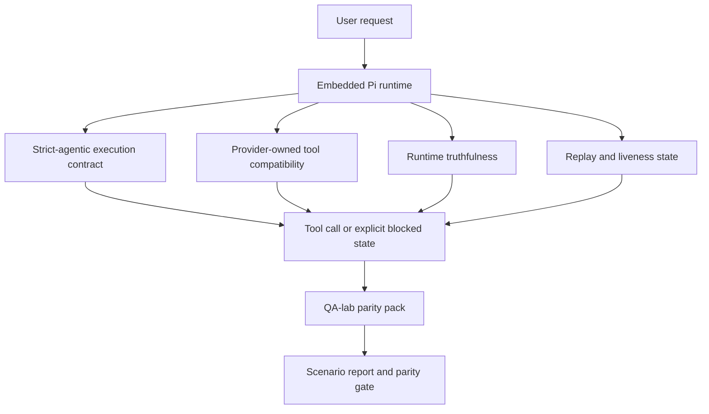
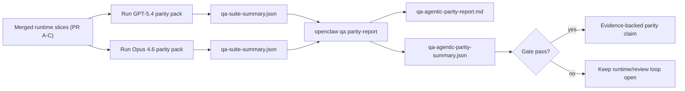

---
x-i18n:
    generated_at: "2026-04-11T15:15:49Z"
    model: gpt-5.4
    provider: openai
    source_hash: 7ee6b925b8a0f8843693cea9d50b40544657b5fb8a9e0860e2ff5badb273acb6
    source_path: help/gpt54-codex-agentic-parity.md
    workflow: 15
---

# GPT-5.4 / Codex Agentic-Parität in OpenClaw

OpenClaw funktionierte bereits gut mit Frontier-Modellen, die Tools verwenden, aber GPT-5.4- und Codex-ähnliche Modelle blieben in einigen praktischen Punkten noch hinter den Erwartungen zurück:

- sie konnten nach der Planung aufhören, statt die Arbeit auszuführen
- sie konnten strikte OpenAI/Codex-Tool-Schemata falsch verwenden
- sie konnten nach `/elevated full` fragen, selbst wenn voller Zugriff unmöglich war
- sie konnten bei Replay oder Kompaktierung den Status langlaufender Aufgaben verlieren
- Paritätsaussagen gegenüber Claude Opus 4.6 basierten auf Anekdoten statt auf wiederholbaren Szenarien

Dieses Paritätsprogramm schließt diese Lücken in vier überprüfbaren Teilbereichen.

## Was sich geändert hat

### PR A: strikte agentische Ausführung

Dieser Teilbereich ergänzt einen optionalen `strict-agentic`-Ausführungsvertrag für eingebettete Pi-GPT-5-Läufe.

Wenn aktiviert, akzeptiert OpenClaw rein planbasierte Züge nicht mehr als „ausreichend gute“ Fertigstellung. Wenn das Modell nur sagt, was es tun will, und weder tatsächlich Tools verwendet noch Fortschritt macht, versucht OpenClaw es erneut mit einer „jetzt handeln“-Steuerung und schlägt dann explizit mit einem blockierten Status fehl, statt die Aufgabe stillschweigend zu beenden.

Das verbessert die GPT-5.4-Erfahrung besonders bei:

- kurzen „ok mach es“-Nachfassaktionen
- Code-Aufgaben, bei denen der erste Schritt offensichtlich ist
- Abläufen, bei denen `update_plan` Fortschrittsverfolgung statt Fülltext sein sollte

### PR B: Laufzeitwahrhaftigkeit

Dieser Teilbereich sorgt dafür, dass OpenClaw in zwei Punkten die Wahrheit sagt:

- warum der Provider-/Laufzeitaufruf fehlgeschlagen ist
- ob `/elevated full` tatsächlich verfügbar ist

Das bedeutet, dass GPT-5.4 bessere Laufzeitsignale für fehlenden Scope, fehlgeschlagene Auth-Aktualisierungen, HTML-403-Auth-Fehler, Proxy-Probleme, DNS- oder Timeout-Fehler und blockierte Vollzugriffsmodi erhält. Das Modell halluziniert dadurch seltener die falsche Abhilfemaßnahme oder fordert weiter einen Berechtigungsmodus an, den die Laufzeit nicht bereitstellen kann.

### PR C: Ausführungskorrektheit

Dieser Teilbereich verbessert zwei Arten von Korrektheit:

- provider-eigene OpenAI/Codex-Tool-Schema-Kompatibilität
- Sichtbarmachung von Replay und Langzeitaufgaben-Lebendigkeit

Die Tool-Kompatibilitätsarbeit reduziert Schema-Reibung bei strikter OpenAI/Codex-Tool-Registrierung, insbesondere bei parameterlosen Tools und strikten Erwartungen an ein Object-Root. Die Replay-/Lebendigkeitsarbeit macht langlaufende Aufgaben besser beobachtbar, sodass pausierte, blockierte und aufgegebene Zustände sichtbar sind, statt in generischem Fehlertext zu verschwinden.

### PR D: Paritätsharness

Dieser Teilbereich fügt das erste QA-lab-Paritätspaket hinzu, damit GPT-5.4 und Opus 4.6 durch dieselben Szenarien geführt und anhand gemeinsamer Belege verglichen werden können.

Das Paritätspaket ist die Nachweisebene. Es verändert das Laufzeitverhalten selbst nicht.

Sobald zwei `qa-suite-summary.json`-Artefakte vorliegen, erzeugen Sie den Vergleich für das Release-Gate mit:

```bash
pnpm openclaw qa parity-report \
  --repo-root . \
  --candidate-summary .artifacts/qa-e2e/gpt54/qa-suite-summary.json \
  --baseline-summary .artifacts/qa-e2e/opus46/qa-suite-summary.json \
  --output-dir .artifacts/qa-e2e/parity
```

Dieser Befehl schreibt:

- einen menschenlesbaren Markdown-Bericht
- ein maschinenlesbares JSON-Urteil
- ein explizites `pass`- / `fail`-Gate-Ergebnis

## Warum das GPT-5.4 in der Praxis verbessert

Vor dieser Arbeit konnte sich GPT-5.4 auf OpenClaw in realen Coding-Sitzungen weniger agentisch anfühlen als Opus, weil die Laufzeit Verhaltensweisen tolerierte, die für Modelle im GPT-5-Stil besonders schädlich sind:

- rein kommentierende Züge
- Schema-Reibung bei Tools
- vages Berechtigungsfeedback
- stilles Versagen bei Replay oder Kompaktierung

Das Ziel ist nicht, GPT-5.4 dazu zu bringen, Opus zu imitieren. Das Ziel ist, GPT-5.4 einen Laufzeitvertrag zu geben, der echten Fortschritt belohnt, klarere Tool- und Berechtigungssemantik liefert und Fehlermodi in explizite, maschinen- und menschenlesbare Zustände verwandelt.

Dadurch ändert sich die Benutzererfahrung von:

- „das Modell hatte einen guten Plan, hat aber aufgehört“

zu:

- „das Modell hat entweder gehandelt, oder OpenClaw hat den genauen Grund angezeigt, warum es nicht konnte“

## Vorher vs. nachher für GPT-5.4-Nutzer

| Vor diesem Programm                                                                          | Nach PR A-D                                                                             |
| -------------------------------------------------------------------------------------------- | --------------------------------------------------------------------------------------- |
| GPT-5.4 konnte nach einem vernünftigen Plan aufhören, ohne den nächsten Tool-Schritt zu tun | PR A macht aus „nur planen“ „jetzt handeln oder einen blockierten Status anzeigen“     |
| Strikte Tool-Schemata konnten parameterlose oder OpenAI/Codex-geformte Tools verwirrend ablehnen | PR C macht provider-eigene Tool-Registrierung und -Aufruf vorhersehbarer           |
| Die Anleitung zu `/elevated full` konnte in blockierten Laufzeiten vage oder falsch sein    | PR B gibt GPT-5.4 und dem Nutzer wahrheitsgemäße Laufzeit- und Berechtigungshinweise   |
| Replay- oder Kompaktierungsfehler konnten wirken, als sei die Aufgabe still verschwunden    | PR C zeigt pausierte, blockierte, aufgegebene und replay-ungültige Ergebnisse explizit |
| „GPT-5.4 fühlt sich schlechter an als Opus“ war meist anekdotisch                           | PR D macht daraus dasselbe Szenariopaket, dieselben Metriken und ein hartes Pass/Fail-Gate |

## Architektur



## Release-Ablauf



## Szenariopaket

Das Paritätspaket der ersten Welle deckt derzeit fünf Szenarien ab:

### `approval-turn-tool-followthrough`

Prüft, dass das Modell nach einer kurzen Zustimmung nicht bei „Ich mache das“ stehen bleibt. Es sollte im selben Zug die erste konkrete Aktion ausführen.

### `model-switch-tool-continuity`

Prüft, dass Tool-gestützte Arbeit über Modell-/Laufzeitwechsel hinweg kohärent bleibt, statt in Kommentare zurückzufallen oder den Ausführungskontext zu verlieren.

### `source-docs-discovery-report`

Prüft, dass das Modell Quellcode und Dokumentation lesen, Ergebnisse synthetisieren und die Aufgabe agentisch fortsetzen kann, statt nur eine dünne Zusammenfassung zu liefern und früh zu stoppen.

### `image-understanding-attachment`

Prüft, dass gemischte Aufgaben mit Anhängen handlungsfähig bleiben und nicht in vage Beschreibung zusammenbrechen.

### `compaction-retry-mutating-tool`

Prüft, dass eine Aufgabe mit einer echten verändernden Schreiboperation Replay-Unsicherheit explizit hält, statt stillschweigend replay-sicher zu wirken, wenn der Lauf unter Druck kompaktiert, erneut versucht wird oder den Antwortstatus verliert.

## Szenariomatrix

| Szenario                           | Was es testet                              | Gutes GPT-5.4-Verhalten                                                         | Fehlersignal                                                                    |
| ---------------------------------- | ------------------------------------------ | ------------------------------------------------------------------------------- | ------------------------------------------------------------------------------- |
| `approval-turn-tool-followthrough` | Kurze Zustimmungszüge nach einem Plan      | Startet die erste konkrete Tool-Aktion sofort, statt nur die Absicht zu wiederholen | nur planbasierte Nachfolge, keine Tool-Aktivität oder blockierter Zug ohne echten Blocker |
| `model-switch-tool-continuity`     | Laufzeit-/Modellwechsel unter Tool-Nutzung | Behält den Aufgabenkontext bei und handelt kohärent weiter                      | fällt in Kommentare zurück, verliert Tool-Kontext oder stoppt nach dem Wechsel  |
| `source-docs-discovery-report`     | Quellcode lesen + synthetisieren + handeln | Findet Quellen, verwendet Tools und erstellt einen nützlichen Bericht ohne Stocken | dünne Zusammenfassung, fehlende Tool-Arbeit oder unvollständiger Zug-Stopp      |
| `image-understanding-attachment`   | agentische Arbeit auf Basis von Anhängen   | Interpretiert den Anhang, verbindet ihn mit Tools und setzt die Aufgabe fort    | vage Beschreibung, Anhang ignoriert oder keine konkrete nächste Aktion          |
| `compaction-retry-mutating-tool`   | verändernde Arbeit unter Kompaktierungsdruck | Führt eine echte Schreiboperation aus und hält Replay-Unsicherheit nach dem Seiteneffekt explizit | verändernde Schreiboperation passiert, aber Replay-Sicherheit wird impliziert, fehlt oder ist widersprüchlich |

## Release-Gate

GPT-5.4 kann nur dann als auf Parität oder besser betrachtet werden, wenn die zusammengeführte Laufzeit gleichzeitig das Paritätspaket und die Regressionen zur Laufzeitwahrhaftigkeit besteht.

Erforderliche Ergebnisse:

- kein rein planbasierter Stillstand, wenn die nächste Tool-Aktion klar ist
- keine vorgetäuschte Fertigstellung ohne echte Ausführung
- keine falsche `/elevated full`-Anleitung
- kein stilles Aufgeben bei Replay oder Kompaktierung
- Paritätspaket-Metriken, die mindestens so stark sind wie die vereinbarte Opus-4.6-Baseline

Für das Harness der ersten Welle vergleicht das Gate:

- Abschlussrate
- Rate unbeabsichtigter Stopps
- Rate gültiger Tool-Aufrufe
- Anzahl vorgetäuschter Erfolge

Die Paritätsbelege sind absichtlich auf zwei Ebenen aufgeteilt:

- PR D belegt mit QA-lab dasselbe Szenarioverhalten von GPT-5.4 vs. Opus 4.6
- deterministische Suiten aus PR B belegen Auth-, Proxy-, DNS- und `/elevated full`-Wahrhaftigkeit außerhalb des Harness

## Ziel-zu-Beleg-Matrix

| Element des Abschluss-Gates                               | Zuständige PR | Belegquelle                                                         | Pass-Signal                                                                              |
| --------------------------------------------------------- | ------------- | ------------------------------------------------------------------- | ---------------------------------------------------------------------------------------- |
| GPT-5.4 bleibt nach der Planung nicht länger stehen       | PR A          | `approval-turn-tool-followthrough` plus PR-A-Laufzeitsuiten         | Zustimmungszüge lösen echte Arbeit oder einen explizit blockierten Status aus            |
| GPT-5.4 täuscht keinen Fortschritt und keine Tool-Fertigstellung mehr vor | PR A + PR D | Szenarioergebnisse des Paritätsberichts und Anzahl vorgetäuschter Erfolge | keine verdächtigen Pass-Ergebnisse und keine rein kommentierende Fertigstellung          |
| GPT-5.4 gibt keine falsche `/elevated full`-Anleitung mehr | PR B        | deterministische Wahrhaftigkeitssuiten                              | blockierte Gründe und Vollzugriffshinweise bleiben laufzeitgenau                         |
| Replay-/Lebendigkeitsfehler bleiben explizit              | PR C + PR D   | PR-C-Lebenszyklus-/Replay-Suiten plus `compaction-retry-mutating-tool` | verändernde Arbeit hält Replay-Unsicherheit explizit, statt stillschweigend zu verschwinden |
| GPT-5.4 erreicht oder übertrifft Opus 4.6 bei den vereinbarten Metriken | PR D | `qa-agentic-parity-report.md` und `qa-agentic-parity-summary.json` | dieselbe Szenarioabdeckung und keine Regression bei Abschluss, Stoppverhalten oder gültiger Tool-Nutzung |

## So lesen Sie das Paritätsurteil

Verwenden Sie das Urteil in `qa-agentic-parity-summary.json` als endgültige maschinenlesbare Entscheidung für das Paritätspaket der ersten Welle.

- `pass` bedeutet, dass GPT-5.4 dieselben Szenarien wie Opus 4.6 abgedeckt hat und bei den vereinbarten aggregierten Metriken keine Regression gezeigt hat.
- `fail` bedeutet, dass mindestens ein hartes Gate ausgelöst wurde: schwächerer Abschluss, schlechtere unbeabsichtigte Stopps, schwächere gültige Tool-Nutzung, ein beliebiger Fall von vorgetäuschtem Erfolg oder nicht übereinstimmende Szenarioabdeckung.
- „shared/base CI issue“ ist für sich genommen kein Paritätsergebnis. Wenn CI-Rauschen außerhalb von PR D einen Lauf blockiert, sollte das Urteil auf eine saubere Ausführung der zusammengeführten Laufzeit warten, statt aus Logs aus der Branch-Ära abgeleitet zu werden.
- Auth-, Proxy-, DNS- und `/elevated full`-Wahrhaftigkeit kommen weiterhin aus den deterministischen Suiten von PR B, daher benötigt die endgültige Release-Aussage beides: ein bestehendes PR-D-Paritätsurteil und grüne PR-B-Wahrhaftigkeitsabdeckung.

## Wer `strict-agentic` aktivieren sollte

Verwenden Sie `strict-agentic`, wenn:

- vom Agenten erwartet wird, dass er sofort handelt, wenn ein nächster Schritt offensichtlich ist
- Modelle der GPT-5.4- oder Codex-Familie die primäre Laufzeit sind
- Sie explizite blockierte Zustände gegenüber „hilfreichen“ Antworten bevorzugen, die nur zusammenfassen

Behalten Sie den Standardvertrag bei, wenn:

- Sie das bisherige lockerere Verhalten möchten
- Sie keine Modelle der GPT-5-Familie verwenden
- Sie Prompts statt Laufzeitdurchsetzung testen
