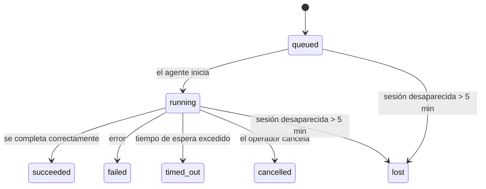

---
read_when:
    - Inspeccionando trabajo en segundo plano en curso o completado recientemente
    - Depuración de fallos de entrega para ejecuciones de agentes desacopladas
    - Comprender cómo las ejecuciones en segundo plano se relacionan con las sesiones, cron y heartbeat
summary: Seguimiento de tareas en segundo plano para ejecuciones de ACP, subagentes, trabajos cron aislados y operaciones de CLI
title: Tareas en segundo plano
x-i18n:
    generated_at: "2026-04-10T05:12:08Z"
    model: gpt-5.4
    provider: openai
    source_hash: d7b5ba41f1025e0089986342ce85698bc62f676439c3ccf03f3ed146beb1b1ac
    source_path: automation/tasks.md
    workflow: 15
---

# Tareas en segundo plano

> **¿Buscas programación?** Consulta [Automation & Tasks](/es/automation) para elegir el mecanismo adecuado. Esta página cubre el **seguimiento** del trabajo en segundo plano, no su programación.

Las tareas en segundo plano hacen seguimiento del trabajo que se ejecuta **fuera de tu sesión principal de conversación**:
ejecuciones de ACP, lanzamientos de subagentes, ejecuciones aisladas de trabajos cron y operaciones iniciadas por la CLI.

Las tareas **no** reemplazan las sesiones, los trabajos cron ni los heartbeats; son el **registro de actividad** que deja constancia de qué trabajo desacoplado ocurrió, cuándo ocurrió y si se completó correctamente.

<Note>
No todas las ejecuciones de agentes crean una tarea. Los turnos de heartbeat y el chat interactivo normal no lo hacen. Todas las ejecuciones de cron, lanzamientos de ACP, lanzamientos de subagentes y comandos de agente de CLI sí lo hacen.
</Note>

## Resumen rápido

- Las tareas son **registros**, no programadores: cron y heartbeat deciden _cuándo_ se ejecuta el trabajo; las tareas hacen seguimiento de _qué ocurrió_.
- ACP, subagentes, todos los trabajos cron y las operaciones de CLI crean tareas. Los turnos de heartbeat no.
- Cada tarea pasa por `queued → running → terminal` (`succeeded`, `failed`, `timed_out`, `cancelled` o `lost`).
- Las tareas cron permanecen activas mientras el runtime de cron siga siendo propietario del trabajo; las tareas de CLI respaldadas por chat permanecen activas solo mientras su contexto de ejecución propietario siga activo.
- La finalización se impulsa por eventos push: el trabajo desacoplado puede notificar directamente o despertar la sesión solicitante/el heartbeat cuando termina, por lo que los bucles de sondeo de estado normalmente no son la forma correcta.
- Las ejecuciones cron aisladas y las finalizaciones de subagentes limpian, en la medida de lo posible, las pestañas/procesos de navegador rastreados de su sesión hija antes de la contabilidad final de limpieza.
- La entrega cron aislada suprime respuestas parent intermedias obsoletas mientras el trabajo de subagentes descendientes aún se está vaciando, y prefiere la salida final del descendiente cuando esta llega antes de la entrega.
- Las notificaciones de finalización se entregan directamente a un canal o se ponen en cola para el siguiente heartbeat.
- `openclaw tasks list` muestra todas las tareas; `openclaw tasks audit` muestra problemas.
- Los registros terminales se conservan durante 7 días y luego se eliminan automáticamente.

## Inicio rápido

```bash
# Lista todas las tareas (las más recientes primero)
openclaw tasks list

# Filtra por runtime o estado
openclaw tasks list --runtime acp
openclaw tasks list --status running

# Muestra detalles de una tarea específica (por ID, ID de ejecución o clave de sesión)
openclaw tasks show <lookup>

# Cancela una tarea en ejecución (mata la sesión hija)
openclaw tasks cancel <lookup>

# Cambia la política de notificación de una tarea
openclaw tasks notify <lookup> state_changes

# Ejecuta una auditoría de estado
openclaw tasks audit

# Previsualiza o aplica mantenimiento
openclaw tasks maintenance
openclaw tasks maintenance --apply

# Inspecciona el estado de TaskFlow
openclaw tasks flow list
openclaw tasks flow show <lookup>
openclaw tasks flow cancel <lookup>
```

## Qué crea una tarea

| Origen                 | Tipo de runtime | Cuándo se crea un registro de tarea                    | Política de notificación predeterminada |
| ---------------------- | --------------- | ------------------------------------------------------ | --------------------------------------- |
| Ejecuciones en segundo plano de ACP | `acp`        | Al lanzar una sesión ACP hija                          | `done_only`                             |
| Orquestación de subagentes | `subagent`   | Al lanzar un subagente mediante `sessions_spawn`       | `done_only`                             |
| Trabajos cron (todos los tipos)  | `cron`       | En cada ejecución cron (sesión principal y aislada)    | `silent`                                |
| Operaciones de CLI         | `cli`        | Comandos `openclaw agent` que se ejecutan a través del gateway | `silent`                         |
| Trabajos de medios del agente       | `cli`        | Ejecuciones `video_generate` respaldadas por sesión    | `silent`                                |

Las tareas cron de la sesión principal usan la política de notificación `silent` de forma predeterminada: crean registros para seguimiento, pero no generan notificaciones. Las tareas cron aisladas también usan `silent` de forma predeterminada, pero son más visibles porque se ejecutan en su propia sesión.

Las ejecuciones `video_generate` respaldadas por sesión también usan la política de notificación `silent`. Siguen creando registros de tarea, pero la finalización se devuelve a la sesión original del agente como un wake interno para que el agente pueda escribir el mensaje de seguimiento y adjuntar el video terminado por sí mismo. Si activas `tools.media.asyncCompletion.directSend`, las finalizaciones asíncronas de `music_generate` y `video_generate` intentan primero una entrega directa al canal antes de volver a la ruta de wake de la sesión solicitante.

Mientras una tarea `video_generate` respaldada por sesión siga activa, la herramienta también actúa como una barrera de protección: las llamadas repetidas a `video_generate` en esa misma sesión devuelven el estado de la tarea activa en lugar de iniciar una segunda generación simultánea. Usa `action: "status"` cuando quieras una consulta explícita de progreso/estado desde el lado del agente.

**Qué no crea tareas:**

- Turnos de heartbeat: sesión principal; consulta [Heartbeat](/es/gateway/heartbeat)
- Turnos normales de chat interactivo
- Respuestas directas de `/command`

## Ciclo de vida de la tarea



| Estado      | Qué significa                                                              |
| ----------- | -------------------------------------------------------------------------- |
| `queued`    | Creada, en espera de que el agente inicie                                  |
| `running`   | El turno del agente se está ejecutando activamente                         |
| `succeeded` | Se completó correctamente                                                  |
| `failed`    | Se completó con un error                                                   |
| `timed_out` | Excedió el tiempo de espera configurado                                    |
| `cancelled` | La detuvo el operador mediante `openclaw tasks cancel`                     |
| `lost`      | El runtime perdió el estado de respaldo autoritativo tras un período de gracia de 5 minutos |

Las transiciones ocurren automáticamente: cuando termina la ejecución del agente asociada, el estado de la tarea se actualiza para reflejarlo.

`lost` depende del runtime:

- Tareas de ACP: desaparecieron los metadatos de la sesión hija de ACP de respaldo.
- Tareas de subagentes: la sesión hija de respaldo desapareció del almacén del agente de destino.
- Tareas cron: el runtime de cron ya no rastrea el trabajo como activo.
- Tareas de CLI: las tareas de sesión hija aislada usan la sesión hija; las tareas de CLI respaldadas por chat usan en su lugar el contexto de ejecución activo, de modo que las filas persistentes de sesión de canal/grupo/directa no las mantienen activas.

## Entrega y notificaciones

Cuando una tarea alcanza un estado terminal, OpenClaw te notifica. Hay dos rutas de entrega:

**Entrega directa**: si la tarea tiene un destino de canal (el `requesterOrigin`), el mensaje de finalización va directamente a ese canal (Telegram, Discord, Slack, etc.). Para las finalizaciones de subagentes, OpenClaw también conserva el enrutamiento enlazado de hilo/tema cuando está disponible y puede completar un `to` o una cuenta faltantes a partir de la ruta almacenada de la sesión solicitante (`lastChannel` / `lastTo` / `lastAccountId`) antes de abandonar la entrega directa.

**Entrega en cola de sesión**: si la entrega directa falla o no hay un origen establecido, la actualización se pone en cola como un evento del sistema en la sesión del solicitante y aparece en el siguiente heartbeat.

<Tip>
La finalización de una tarea activa un wake inmediato del heartbeat para que veas el resultado rápidamente; no tienes que esperar al siguiente intervalo programado de heartbeat.
</Tip>

Eso significa que el flujo de trabajo habitual se basa en eventos push: inicia el trabajo desacoplado una sola vez y luego deja que el runtime te despierte o te notifique al completarse. Sondea el estado de la tarea solo cuando necesites depuración, intervención o una auditoría explícita.

### Políticas de notificación

Controla cuánto escuchas sobre cada tarea:

| Política                | Qué se entrega                                                            |
| ----------------------- | ------------------------------------------------------------------------- |
| `done_only` (predeterminada) | Solo el estado terminal (`succeeded`, `failed`, etc.); **esta es la predeterminada** |
| `state_changes`         | Cada transición de estado y actualización de progreso                    |
| `silent`                | Nada en absoluto                                                         |

Cambia la política mientras una tarea está en ejecución:

```bash
openclaw tasks notify <lookup> state_changes
```

## Referencia de CLI

### `tasks list`

```bash
openclaw tasks list [--runtime <acp|subagent|cron|cli>] [--status <status>] [--json]
```

Columnas de salida: ID de tarea, tipo, estado, entrega, ID de ejecución, sesión hija, resumen.

### `tasks show`

```bash
openclaw tasks show <lookup>
```

El token de búsqueda acepta un ID de tarea, un ID de ejecución o una clave de sesión. Muestra el registro completo, incluidos el tiempo, el estado de entrega, el error y el resumen terminal.

### `tasks cancel`

```bash
openclaw tasks cancel <lookup>
```

Para tareas de ACP y subagentes, esto mata la sesión hija. Para las tareas rastreadas por CLI, la cancelación se registra en el registro de tareas (no hay un identificador independiente del runtime hijo). El estado pasa a `cancelled` y se envía una notificación de entrega cuando corresponde.

### `tasks notify`

```bash
openclaw tasks notify <lookup> <done_only|state_changes|silent>
```

### `tasks audit`

```bash
openclaw tasks audit [--json]
```

Muestra problemas operativos. Los hallazgos también aparecen en `openclaw status` cuando se detectan problemas.

| Hallazgo                   | Severidad | Activador                                            |
| -------------------------- | --------- | ---------------------------------------------------- |
| `stale_queued`             | warn      | En cola durante más de 10 minutos                    |
| `stale_running`            | error     | En ejecución durante más de 30 minutos               |
| `lost`                     | error     | Desapareció la propiedad de la tarea respaldada por runtime |
| `delivery_failed`          | warn      | La entrega falló y la política de notificación no es `silent` |
| `missing_cleanup`          | warn      | Tarea terminal sin marca de tiempo de limpieza       |
| `inconsistent_timestamps`  | warn      | Violación de la línea de tiempo (por ejemplo, terminó antes de comenzar) |

### `tasks maintenance`

```bash
openclaw tasks maintenance [--json]
openclaw tasks maintenance --apply [--json]
```

Úsalo para previsualizar o aplicar reconciliación, marcado de limpieza y depuración para tareas y el estado de Task Flow.

La reconciliación depende del runtime:

- Las tareas de ACP/subagentes comprueban su sesión hija de respaldo.
- Las tareas cron comprueban si el runtime de cron sigue siendo propietario del trabajo.
- Las tareas de CLI respaldadas por chat comprueban el contexto de ejecución activo propietario, no solo la fila de sesión de chat.

La limpieza tras la finalización también depende del runtime:

- La finalización de subagentes cierra, en la medida de lo posible, las pestañas/procesos de navegador rastreados para la sesión hija antes de que continúe la limpieza del anuncio.
- La finalización de cron aislado cierra, en la medida de lo posible, las pestañas/procesos de navegador rastreados para la sesión cron antes de que la ejecución se desmonte por completo.
- La entrega cron aislada espera el seguimiento de subagentes descendientes cuando es necesario y suprime el texto obsoleto de acuse de recibo del parent en lugar de anunciarlo.
- La entrega de finalización de subagentes prefiere el texto visible más reciente del asistente; si está vacío, recurre al texto saneado más reciente de tool/toolResult, y las ejecuciones con llamadas a herramientas que solo terminan por tiempo de espera pueden reducirse a un breve resumen de progreso parcial.
- Los fallos de limpieza no ocultan el resultado real de la tarea.

### `tasks flow list|show|cancel`

```bash
openclaw tasks flow list [--status <status>] [--json]
openclaw tasks flow show <lookup> [--json]
openclaw tasks flow cancel <lookup>
```

Úsalos cuando lo que te importa es el Task Flow de orquestación en lugar de un registro individual de tarea en segundo plano.

## Tablero de tareas de chat (`/tasks`)

Usa `/tasks` en cualquier sesión de chat para ver las tareas en segundo plano vinculadas a esa sesión. El tablero muestra tareas activas y completadas recientemente con runtime, estado, tiempo y detalles de progreso o error.

Cuando la sesión actual no tiene tareas vinculadas visibles, `/tasks` recurre a los recuentos de tareas locales del agente para que sigas teniendo una visión general sin filtrar detalles de otras sesiones.

Para el registro completo del operador, usa la CLI: `openclaw tasks list`.

## Integración de estado (presión de tareas)

`openclaw status` incluye un resumen de tareas de un vistazo:

```
Tasks: 3 queued · 2 running · 1 issues
```

El resumen informa:

- **active**: recuento de `queued` + `running`
- **failures**: recuento de `failed` + `timed_out` + `lost`
- **byRuntime**: desglose por `acp`, `subagent`, `cron`, `cli`

Tanto `/status` como la herramienta `session_status` usan una instantánea de tareas con conocimiento de limpieza: se priorizan las tareas activas, se ocultan las filas completadas obsoletas y los fallos recientes solo aparecen cuando ya no queda trabajo activo.
Esto mantiene la tarjeta de estado centrada en lo que importa ahora mismo.

## Almacenamiento y mantenimiento

### Dónde viven las tareas

Los registros de tareas persisten en SQLite en:

```
$OPENCLAW_STATE_DIR/tasks/runs.sqlite
```

El registro se carga en memoria al iniciar el gateway y sincroniza las escrituras con SQLite para garantizar durabilidad entre reinicios.

### Mantenimiento automático

Un proceso de limpieza se ejecuta cada **60 segundos** y se encarga de tres cosas:

1. **Reconciliación**: comprueba si las tareas activas siguen teniendo respaldo autoritativo del runtime. Las tareas de ACP/subagentes usan el estado de la sesión hija, las tareas cron usan la propiedad del trabajo activo y las tareas de CLI respaldadas por chat usan el contexto de ejecución propietario. Si ese estado de respaldo desaparece durante más de 5 minutos, la tarea se marca como `lost`.
2. **Marcado de limpieza**: establece una marca de tiempo `cleanupAfter` en las tareas terminales (`endedAt` + 7 días).
3. **Depuración**: elimina los registros que hayan superado su fecha `cleanupAfter`.

**Retención**: los registros de tareas terminales se conservan durante **7 días** y luego se eliminan automáticamente. No se necesita configuración.

## Cómo se relacionan las tareas con otros sistemas

### Tareas y Task Flow

[Task Flow](/es/automation/taskflow) es la capa de orquestación de flujos por encima de las tareas en segundo plano. Un único flujo puede coordinar varias tareas a lo largo de su ciclo de vida usando modos de sincronización gestionados o reflejados. Usa `openclaw tasks` para inspeccionar registros individuales de tareas y `openclaw tasks flow` para inspeccionar el flujo de orquestación.

Consulta [Task Flow](/es/automation/taskflow) para más detalles.

### Tareas y cron

La **definición** de un trabajo cron vive en `~/.openclaw/cron/jobs.json`. **Cada** ejecución cron crea un registro de tarea, tanto en la sesión principal como en modo aislado. Las tareas cron de la sesión principal usan la política de notificación `silent` de forma predeterminada, por lo que hacen seguimiento sin generar notificaciones.

Consulta [Cron Jobs](/es/automation/cron-jobs).

### Tareas y heartbeat

Las ejecuciones de heartbeat son turnos de la sesión principal; no crean registros de tarea. Cuando una tarea se completa, puede activar un wake de heartbeat para que veas el resultado con rapidez.

Consulta [Heartbeat](/es/gateway/heartbeat).

### Tareas y sesiones

Una tarea puede hacer referencia a una `childSessionKey` (donde se ejecuta el trabajo) y a una `requesterSessionKey` (quién la inició). Las sesiones son el contexto de conversación; las tareas son la capa de seguimiento de actividad por encima de ese contexto.

### Tareas y ejecuciones de agentes

El `runId` de una tarea enlaza con la ejecución del agente que está realizando el trabajo. Los eventos del ciclo de vida del agente (inicio, fin, error) actualizan automáticamente el estado de la tarea; no necesitas gestionar manualmente el ciclo de vida.

## Relacionado

- [Automation & Tasks](/es/automation): todos los mecanismos de automatización de un vistazo
- [Task Flow](/es/automation/taskflow): orquestación de flujos por encima de las tareas
- [Scheduled Tasks](/es/automation/cron-jobs): programación de trabajo en segundo plano
- [Heartbeat](/es/gateway/heartbeat): turnos periódicos de la sesión principal
- [CLI: Tasks](/cli/index#tasks): referencia de comandos de CLI
