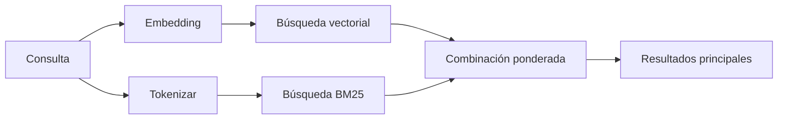

---
read_when:
    - Quieres entender cómo funciona `memory_search`
    - Quieres elegir un proveedor de embeddings
    - Quieres ajustar la calidad de la búsqueda
summary: Cómo la búsqueda de memoria encuentra notas relevantes usando embeddings y recuperación híbrida
title: Búsqueda de memoria
x-i18n:
    generated_at: "2026-04-10T05:12:07Z"
    model: gpt-5.4
    provider: openai
    source_hash: ca0237f4f1ee69dcbfb12e6e9527a53e368c0bf9b429e506831d4af2f3a3ac6f
    source_path: concepts/memory-search.md
    workflow: 15
---

# Búsqueda de memoria

`memory_search` encuentra notas relevantes de tus archivos de memoria, incluso cuando la redacción difiere del texto original. Funciona indexando la memoria en fragmentos pequeños y buscándolos mediante embeddings, palabras clave o ambos.

## Inicio rápido

Si tienes configurada una clave de API de OpenAI, Gemini, Voyage o Mistral, la búsqueda de memoria funciona automáticamente. Para establecer un proveedor de forma explícita:

```json5
{
  agents: {
    defaults: {
      memorySearch: {
        provider: "openai", // o "gemini", "local", "ollama", etc.
      },
    },
  },
}
```

Para embeddings locales sin clave de API, usa `provider: "local"` (requiere `node-llama-cpp`).

## Proveedores compatibles

| Proveedor | ID        | Necesita clave de API | Notas                                                |
| --------- | --------- | --------------------- | ---------------------------------------------------- |
| OpenAI    | `openai`  | Sí                    | Detectado automáticamente, rápido                    |
| Gemini    | `gemini`  | Sí                    | Admite indexación de imágenes/audio                  |
| Voyage    | `voyage`  | Sí                    | Detectado automáticamente                            |
| Mistral   | `mistral` | Sí                    | Detectado automáticamente                            |
| Bedrock   | `bedrock` | No                    | Detectado automáticamente cuando se resuelve la cadena de credenciales de AWS |
| Ollama    | `ollama`  | No                    | Local, debe establecerse explícitamente              |
| Local     | `local`   | No                    | Modelo GGUF, descarga de ~0.6 GB                     |

## Cómo funciona la búsqueda

OpenClaw ejecuta dos rutas de recuperación en paralelo y combina los resultados:



- **La búsqueda vectorial** encuentra notas con significado similar ("gateway host" coincide con "la máquina que ejecuta OpenClaw").
- **La búsqueda de palabras clave BM25** encuentra coincidencias exactas (ID, cadenas de error, claves de configuración).

Si solo una ruta está disponible (sin embeddings o sin FTS), la otra se ejecuta sola.

## Mejorar la calidad de la búsqueda

Dos funciones opcionales ayudan cuando tienes un historial amplio de notas:

### Decaimiento temporal

Las notas antiguas pierden gradualmente peso en la clasificación para que la información reciente aparezca primero. Con la vida media predeterminada de 30 días, una nota del mes pasado obtiene el 50% de su peso original. Los archivos permanentes como `MEMORY.md` nunca se degradan.

<Tip>
Activa el decaimiento temporal si tu agente tiene meses de notas diarias y la información obsoleta sigue superando al contexto reciente.
</Tip>

### MMR (diversidad)

Reduce los resultados redundantes. Si cinco notas mencionan la misma configuración del router, MMR garantiza que los resultados principales cubran temas diferentes en lugar de repetirse.

<Tip>
Activa MMR si `memory_search` sigue devolviendo fragmentos casi duplicados de distintas notas diarias.
</Tip>

### Activar ambos

```json5
{
  agents: {
    defaults: {
      memorySearch: {
        query: {
          hybrid: {
            mmr: { enabled: true },
            temporalDecay: { enabled: true },
          },
        },
      },
    },
  },
}
```

## Memoria multimodal

Con Gemini Embedding 2, puedes indexar imágenes y archivos de audio junto con Markdown. Las consultas de búsqueda siguen siendo texto, pero coinciden con contenido visual y de audio. Consulta la [referencia de configuración de memoria](/es/reference/memory-config) para la configuración.

## Búsqueda en la memoria de sesión

Opcionalmente, puedes indexar transcripciones de sesiones para que `memory_search` pueda recuperar conversaciones anteriores. Esto es opcional mediante `memorySearch.experimental.sessionMemory`. Consulta la [referencia de configuración](/es/reference/memory-config) para más detalles.

## Solución de problemas

**¿No hay resultados?** Ejecuta `openclaw memory status` para comprobar el índice. Si está vacío, ejecuta `openclaw memory index --force`.

**¿Solo coincidencias por palabras clave?** Puede que tu proveedor de embeddings no esté configurado. Comprueba `openclaw memory status --deep`.

**¿No se encuentra texto CJK?** Reconstruye el índice FTS con `openclaw memory index --force`.

## Lecturas adicionales

- [Memoria activa](/es/concepts/active-memory) -- memoria de subagentes para sesiones de chat interactivas
- [Memoria](/es/concepts/memory) -- diseño de archivos, backends, herramientas
- [Referencia de configuración de memoria](/es/reference/memory-config) -- todos los ajustes de configuración
