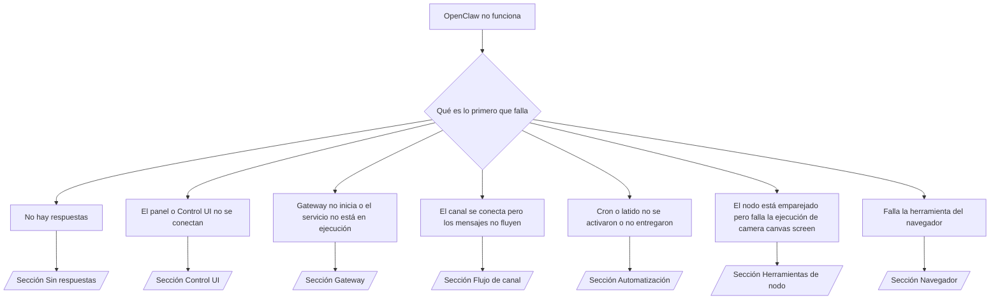

---
read_when:
    - OpenClaw no funciona y necesitas la vía más rápida para solucionarlo
    - Quieres un flujo de triaje antes de profundizar en runbooks detallados
summary: Centro de solución de problemas de OpenClaw orientado por síntomas
title: Solución general de problemas
x-i18n:
    generated_at: "2026-04-11T02:45:44Z"
    model: gpt-5.4
    provider: openai
    source_hash: 16b38920dbfdc8d4a79bbb5d6fab2c67c9f218a97c36bb4695310d7db9c4614a
    source_path: help/troubleshooting.md
    workflow: 15
---

# Solución de problemas

Si solo tienes 2 minutos, usa esta página como puerta de entrada de triaje.

## Primeros 60 segundos

Ejecuta esta secuencia exacta en orden:

```bash
openclaw status
openclaw status --all
openclaw gateway probe
openclaw gateway status
openclaw doctor
openclaw channels status --probe
openclaw logs --follow
```

Salida correcta en una línea:

- `openclaw status` → muestra los canales configurados y ningún error de autenticación evidente.
- `openclaw status --all` → el informe completo está presente y se puede compartir.
- `openclaw gateway probe` → el destino esperado de Gateway es accesible (`Reachable: yes`). `RPC: limited - missing scope: operator.read` indica un diagnóstico degradado, no un fallo de conexión.
- `openclaw gateway status` → `Runtime: running` y `RPC probe: ok`.
- `openclaw doctor` → no hay errores de configuración/servicio que bloqueen.
- `openclaw channels status --probe` → si el gateway es accesible, devuelve el estado de transporte en vivo por cuenta junto con resultados de sondeo/auditoría como `works` o `audit ok`; si el
  gateway no es accesible, el comando vuelve a resúmenes basados solo en configuración.
- `openclaw logs --follow` → actividad constante, sin errores fatales repetidos.

## Anthropic long context 429

Si ves:
`HTTP 429: rate_limit_error: Extra usage is required for long context requests`,
ve a [/gateway/troubleshooting#anthropic-429-extra-usage-required-for-long-context](/es/gateway/troubleshooting#anthropic-429-extra-usage-required-for-long-context).

## Un backend local compatible con OpenAI funciona directamente pero falla en OpenClaw

Si tu backend local o autoalojado `/v1` responde a pequeñas
sondas directas a `/v1/chat/completions` pero falla en `openclaw infer model run` o en turnos
normales del agente:

1. Si el error menciona que `messages[].content` espera una cadena, establece
   `models.providers.<provider>.models[].compat.requiresStringContent: true`.
2. Si el backend sigue fallando solo en los turnos del agente de OpenClaw, establece
   `models.providers.<provider>.models[].compat.supportsTools: false` y vuelve a intentarlo.
3. Si las llamadas directas pequeñas siguen funcionando pero prompts más grandes de OpenClaw hacen fallar el
   backend, trata el problema restante como una limitación ascendente del modelo/servidor y
   continúa en el runbook detallado:
   [/gateway/troubleshooting#local-openai-compatible-backend-passes-direct-probes-but-agent-runs-fail](/es/gateway/troubleshooting#local-openai-compatible-backend-passes-direct-probes-but-agent-runs-fail)

## La instalación del plugin falla con openclaw extensions faltantes

Si la instalación falla con `package.json missing openclaw.extensions`, el paquete del plugin
está usando una forma antigua que OpenClaw ya no acepta.

Corrígelo en el paquete del plugin:

1. Agrega `openclaw.extensions` a `package.json`.
2. Haz que las entradas apunten a archivos de runtime compilados (normalmente `./dist/index.js`).
3. Vuelve a publicar el plugin y ejecuta `openclaw plugins install <package>` otra vez.

Ejemplo:

```json
{
  "name": "@openclaw/my-plugin",
  "version": "1.2.3",
  "openclaw": {
    "extensions": ["./dist/index.js"]
  }
}
```

Referencia: [Arquitectura de plugins](/es/plugins/architecture)

## Árbol de decisiones



<AccordionGroup>
  <Accordion title="Sin respuestas">
    ```bash
    openclaw status
    openclaw gateway status
    openclaw channels status --probe
    openclaw pairing list --channel <channel> [--account <id>]
    openclaw logs --follow
    ```

    Una salida correcta se ve así:

    - `Runtime: running`
    - `RPC probe: ok`
    - Tu canal muestra el transporte conectado y, cuando se admite, `works` o `audit ok` en `channels status --probe`
    - El remitente aparece como aprobado (o la política de MD está abierta/allowlist)

    Firmas comunes en logs:

    - `drop guild message (mention required` → la restricción por mención bloqueó el mensaje en Discord.
    - `pairing request` → el remitente no está aprobado y está esperando aprobación de emparejamiento por MD.
    - `blocked` / `allowlist` en los logs del canal → el remitente, la sala o el grupo están filtrados.

    Páginas detalladas:

    - [/gateway/troubleshooting#no-replies](/es/gateway/troubleshooting#no-replies)
    - [/channels/troubleshooting](/es/channels/troubleshooting)
    - [/channels/pairing](/es/channels/pairing)

  </Accordion>

  <Accordion title="El panel o Control UI no se conectan">
    ```bash
    openclaw status
    openclaw gateway status
    openclaw logs --follow
    openclaw doctor
    openclaw channels status --probe
    ```

    Una salida correcta se ve así:

    - `Dashboard: http://...` se muestra en `openclaw gateway status`
    - `RPC probe: ok`
    - No hay bucle de autenticación en los logs

    Firmas comunes en logs:

    - `device identity required` → el contexto HTTP/no seguro no puede completar la autenticación del dispositivo.
    - `origin not allowed` → el `Origin` del navegador no está permitido para el destino de gateway de Control UI.
    - `AUTH_TOKEN_MISMATCH` con sugerencias de reintento (`canRetryWithDeviceToken=true`) → puede producirse automáticamente un reintento con token de dispositivo de confianza.
    - Ese reintento con token en caché reutiliza el conjunto de scopes en caché almacenado con el
      token de dispositivo emparejado. Los llamadores con `deviceToken` explícito / `scopes` explícitos conservan
      en cambio el conjunto de scopes solicitado.
    - En la ruta asíncrona de Tailscale Serve para Control UI, los intentos fallidos para el mismo
      `{scope, ip}` se serializan antes de que el limitador registre el fallo, por lo que un
      segundo mal reintento concurrente ya puede mostrar `retry later`.
    - `too many failed authentication attempts (retry later)` desde un origen de navegador localhost
      → fallos repetidos desde ese mismo `Origin` quedan bloqueados temporalmente; otro origen localhost usa un bucket separado.
    - `unauthorized` repetido después de ese reintento → token/contraseña incorrectos, incompatibilidad de modo de autenticación o token de dispositivo emparejado obsoleto.
    - `gateway connect failed:` → la interfaz apunta a la URL/puerto equivocados o a un gateway inaccesible.

    Páginas detalladas:

    - [/gateway/troubleshooting#dashboard-control-ui-connectivity](/es/gateway/troubleshooting#dashboard-control-ui-connectivity)
    - [/web/control-ui](/web/control-ui)
    - [/gateway/authentication](/es/gateway/authentication)

  </Accordion>

  <Accordion title="Gateway no inicia o el servicio está instalado pero no en ejecución">
    ```bash
    openclaw status
    openclaw gateway status
    openclaw logs --follow
    openclaw doctor
    openclaw channels status --probe
    ```

    Una salida correcta se ve así:

    - `Service: ... (loaded)`
    - `Runtime: running`
    - `RPC probe: ok`

    Firmas comunes en logs:

    - `Gateway start blocked: set gateway.mode=local` o `existing config is missing gateway.mode` → el modo del gateway es remoto, o al archivo de configuración le falta la marca de modo local y debe repararse.
    - `refusing to bind gateway ... without auth` → bind no loopback sin una ruta de autenticación válida del gateway (token/contraseña, o trusted-proxy cuando esté configurado).
    - `another gateway instance is already listening` o `EADDRINUSE` → el puerto ya está ocupado.

    Páginas detalladas:

    - [/gateway/troubleshooting#gateway-service-not-running](/es/gateway/troubleshooting#gateway-service-not-running)
    - [/gateway/background-process](/es/gateway/background-process)
    - [/gateway/configuration](/es/gateway/configuration)

  </Accordion>

  <Accordion title="El canal se conecta pero los mensajes no fluyen">
    ```bash
    openclaw status
    openclaw gateway status
    openclaw logs --follow
    openclaw doctor
    openclaw channels status --probe
    ```

    Una salida correcta se ve así:

    - El transporte del canal está conectado.
    - Las comprobaciones de emparejamiento/allowlist pasan.
    - Las menciones se detectan donde se requieren.

    Firmas comunes en logs:

    - `mention required` → la restricción por mención en grupos bloqueó el procesamiento.
    - `pairing` / `pending` → el remitente de MD aún no está aprobado.
    - `not_in_channel`, `missing_scope`, `Forbidden`, `401/403` → problema de token de permisos del canal.

    Páginas detalladas:

    - [/gateway/troubleshooting#channel-connected-messages-not-flowing](/es/gateway/troubleshooting#channel-connected-messages-not-flowing)
    - [/channels/troubleshooting](/es/channels/troubleshooting)

  </Accordion>

  <Accordion title="Cron o latido no se activaron o no entregaron">
    ```bash
    openclaw status
    openclaw gateway status
    openclaw cron status
    openclaw cron list
    openclaw cron runs --id <jobId> --limit 20
    openclaw logs --follow
    ```

    Una salida correcta se ve así:

    - `cron.status` aparece como habilitado con una próxima activación.
    - `cron runs` muestra entradas recientes `ok`.
    - El latido está habilitado y no está fuera de horas activas.

    Firmas comunes en logs:

    - `cron: scheduler disabled; jobs will not run automatically` → cron está deshabilitado.
    - `heartbeat skipped` con `reason=quiet-hours` → fuera de las horas activas configuradas.
    - `heartbeat skipped` con `reason=empty-heartbeat-file` → `HEARTBEAT.md` existe pero solo contiene andamiaje vacío/de solo encabezados.
    - `heartbeat skipped` con `reason=no-tasks-due` → el modo de tareas de `HEARTBEAT.md` está activo, pero ninguno de los intervalos de tareas aún venció.
    - `heartbeat skipped` con `reason=alerts-disabled` → toda la visibilidad del latido está deshabilitada (`showOk`, `showAlerts` y `useIndicator` están todos apagados).
    - `requests-in-flight` → la ruta principal está ocupada; la activación del latido fue diferida.
    - `unknown accountId` → la cuenta de destino de entrega del latido no existe.

    Páginas detalladas:

    - [/gateway/troubleshooting#cron-and-heartbeat-delivery](/es/gateway/troubleshooting#cron-and-heartbeat-delivery)
    - [/automation/cron-jobs#troubleshooting](/es/automation/cron-jobs#troubleshooting)
    - [/gateway/heartbeat](/es/gateway/heartbeat)

    </Accordion>

    <Accordion title="El nodo está emparejado pero falla la ejecución de la herramienta camera canvas screen">
      ```bash
      openclaw status
      openclaw gateway status
      openclaw nodes status
      openclaw nodes describe --node <idOrNameOrIp>
      openclaw logs --follow
      ```

      Una salida correcta se ve así:

      - El nodo aparece como conectado y emparejado para el rol `node`.
      - La capacidad existe para el comando que estás invocando.
      - El estado de permiso está concedido para la herramienta.

      Firmas comunes en logs:

      - `NODE_BACKGROUND_UNAVAILABLE` → lleva la app del nodo al primer plano.
      - `*_PERMISSION_REQUIRED` → el permiso del sistema operativo fue denegado o falta.
      - `SYSTEM_RUN_DENIED: approval required` → la aprobación de exec está pendiente.
      - `SYSTEM_RUN_DENIED: allowlist miss` → el comando no está en la allowlist de exec.

      Páginas detalladas:

      - [/gateway/troubleshooting#node-paired-tool-fails](/es/gateway/troubleshooting#node-paired-tool-fails)
      - [/nodes/troubleshooting](/es/nodes/troubleshooting)
      - [/tools/exec-approvals](/es/tools/exec-approvals)

    </Accordion>

    <Accordion title="Exec de repente pide aprobación">
      ```bash
      openclaw config get tools.exec.host
      openclaw config get tools.exec.security
      openclaw config get tools.exec.ask
      openclaw gateway restart
      ```

      Qué cambió:

      - Si `tools.exec.host` no está establecido, el valor predeterminado es `auto`.
      - `host=auto` se resuelve como `sandbox` cuando un runtime sandbox está activo, y como `gateway` en caso contrario.
      - `host=auto` solo controla el enrutamiento; el comportamiento “YOLO” sin prompt proviene de `security=full` más `ask=off` en gateway/node.
      - En `gateway` y `node`, si `tools.exec.security` no está establecido, el valor predeterminado es `full`.
      - Si `tools.exec.ask` no está establecido, el valor predeterminado es `off`.
      - Resultado: si estás viendo aprobaciones, alguna política local del host o por sesión endureció exec y se apartó de los valores predeterminados actuales.

      Restaurar el comportamiento actual predeterminado sin aprobación:

      ```bash
      openclaw config set tools.exec.host gateway
      openclaw config set tools.exec.security full
      openclaw config set tools.exec.ask off
      openclaw gateway restart
      ```

      Alternativas más seguras:

      - Establece solo `tools.exec.host=gateway` si solo quieres un enrutamiento estable del host.
      - Usa `security=allowlist` con `ask=on-miss` si quieres exec en el host pero aun así quieres revisión en fallos de allowlist.
      - Habilita el modo sandbox si quieres que `host=auto` vuelva a resolverse como `sandbox`.

      Firmas comunes en logs:

      - `Approval required.` → el comando está esperando `/approve ...`.
      - `SYSTEM_RUN_DENIED: approval required` → la aprobación de exec en el host del nodo está pendiente.
      - `exec host=sandbox requires a sandbox runtime for this session` → selección implícita/explícita de sandbox, pero el modo sandbox está desactivado.

      Páginas detalladas:

      - [/tools/exec](/es/tools/exec)
      - [/tools/exec-approvals](/es/tools/exec-approvals)
      - [/gateway/security#what-the-audit-checks-high-level](/es/gateway/security#what-the-audit-checks-high-level)

    </Accordion>

    <Accordion title="Falla la herramienta del navegador">
      ```bash
      openclaw status
      openclaw gateway status
      openclaw browser status
      openclaw logs --follow
      openclaw doctor
      ```

      Una salida correcta se ve así:

      - El estado del navegador muestra `running: true` y un navegador/perfil elegidos.
      - `openclaw` inicia, o `user` puede ver pestañas locales de Chrome.

      Firmas comunes en logs:

      - `unknown command "browser"` o `unknown command 'browser'` → `plugins.allow` está establecido y no incluye `browser`.
      - `Failed to start Chrome CDP on port` → falló el inicio local del navegador.
      - `browser.executablePath not found` → la ruta binaria configurada es incorrecta.
      - `browser.cdpUrl must be http(s) or ws(s)` → la URL de CDP configurada usa un esquema no compatible.
      - `browser.cdpUrl has invalid port` → la URL de CDP configurada tiene un puerto incorrecto o fuera de rango.
      - `No Chrome tabs found for profile="user"` → el perfil de adjuntar de Chrome MCP no tiene pestañas locales de Chrome abiertas.
      - `Remote CDP for profile "<name>" is not reachable` → el endpoint remoto de CDP configurado no es accesible desde este host.
      - `Browser attachOnly is enabled ... not reachable` o `Browser attachOnly is enabled and CDP websocket ... is not reachable` → el perfil de solo adjuntar no tiene un destino CDP activo.
      - anulaciones obsoletas de viewport / modo oscuro / locale / sin conexión en perfiles de solo adjuntar o CDP remoto → ejecuta `openclaw browser stop --browser-profile <name>` para cerrar la sesión de control activa y liberar el estado de emulación sin reiniciar el gateway.

      Páginas detalladas:

      - [/gateway/troubleshooting#browser-tool-fails](/es/gateway/troubleshooting#browser-tool-fails)
      - [/tools/browser#missing-browser-command-or-tool](/es/tools/browser#missing-browser-command-or-tool)
      - [/tools/browser-linux-troubleshooting](/es/tools/browser-linux-troubleshooting)
      - [/tools/browser-wsl2-windows-remote-cdp-troubleshooting](/es/tools/browser-wsl2-windows-remote-cdp-troubleshooting)

    </Accordion>

  </AccordionGroup>

## Relacionado

- [Preguntas frecuentes](/es/help/faq) — preguntas frecuentes
- [Solución de problemas de Gateway](/es/gateway/troubleshooting) — problemas específicos de gateway
- [Doctor](/es/gateway/doctor) — comprobaciones automáticas de estado y reparaciones
- [Solución de problemas de canales](/es/channels/troubleshooting) — problemas de conectividad de canales
- [Solución de problemas de automatización](/es/automation/cron-jobs#troubleshooting) — problemas de cron y latido
