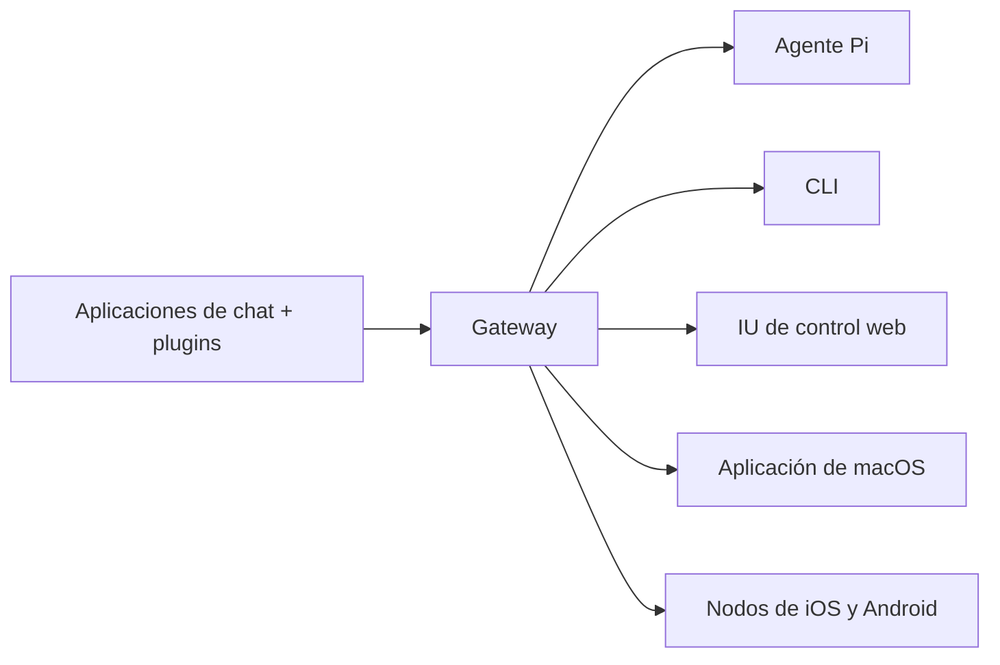

---
read_when:
    - Presentar OpenClaw a personas nuevas
summary: OpenClaw es una puerta de enlace multicanal para agentes de IA que se ejecuta en cualquier SO.
title: OpenClaw
x-i18n:
    generated_at: "2026-04-05T10:46:38Z"
    model: gpt-5.4
    provider: openai
    source_hash: 9c29a8d9fc41a94b650c524bb990106f134345560e6d615dac30e8815afff481
    source_path: index.md
    workflow: 15
---

# OpenClaw 🦞

<p align="center">
    
    
</p>

> _"¡MUDA! ¡MUDA!"_ — Una langosta espacial, probablemente

<p align="center">
  <strong>Puerta de enlace para agentes de IA en cualquier SO a través de Discord, Google Chat, iMessage, Matrix, Microsoft Teams, Signal, Slack, Telegram, WhatsApp, Zalo y más.</strong><br />
  Envía un mensaje y recibe una respuesta del agente desde tu bolsillo. Ejecuta una sola Gateway en canales integrados, plugins de canal incluidos, WebChat y nodos móviles.
</p>

<Columns>
  <Card title="Primeros pasos" href="/start/getting-started" icon="rocket">
    Instala OpenClaw y pon en marcha la Gateway en minutos.
  </Card>
  <Card title="Ejecutar la incorporación" href="/start/wizard" icon="sparkles">
    Configuración guiada con `openclaw onboard` y flujos de emparejamiento.
  </Card>
  <Card title="Abrir la IU de control" href="/web/control-ui" icon="layout-dashboard">
    Inicia el panel del navegador para chat, configuración y sesiones.
  </Card>
</Columns>

## ¿Qué es OpenClaw?

OpenClaw es una **puerta de enlace autoalojada** que conecta tus aplicaciones de chat y superficies de canal favoritas —canales integrados más plugins de canal incluidos o externos como Discord, Google Chat, iMessage, Matrix, Microsoft Teams, Signal, Slack, Telegram, WhatsApp, Zalo y más— con agentes de programación con IA como Pi. Ejecutas un único proceso Gateway en tu propia máquina (o en un servidor), y este se convierte en el puente entre tus aplicaciones de mensajería y un asistente de IA siempre disponible.

**¿Para quién es?** Desarrolladores y usuarios avanzados que quieren un asistente de IA personal al que puedan enviar mensajes desde cualquier lugar, sin renunciar al control de sus datos ni depender de un servicio alojado.

**¿Qué lo hace diferente?**

- **Autoalojado**: se ejecuta en tu hardware, bajo tus reglas
- **Multicanal**: una Gateway sirve simultáneamente canales integrados y plugins de canal incluidos o externos
- **Nativo para agentes**: creado para agentes de programación con uso de herramientas, sesiones, memoria y enrutamiento multiagente
- **Código abierto**: con licencia MIT e impulsado por la comunidad

**¿Qué necesitas?** Node 24 (recomendado), o Node 22 LTS (`22.14+`) para compatibilidad, una clave de API de tu proveedor elegido y 5 minutos. Para obtener la mejor calidad y seguridad, usa el modelo más sólido de última generación disponible.

## Cómo funciona



La Gateway es la única fuente de verdad para sesiones, enrutamiento y conexiones de canal.

## Capacidades clave

<Columns>
  <Card title="Puerta de enlace multicanal" icon="network">
    Discord, iMessage, Signal, Slack, Telegram, WhatsApp, WebChat y más con un solo proceso Gateway.
  </Card>
  <Card title="Canales de plugin" icon="plug">
    Los plugins incluidos agregan Matrix, Nostr, Twitch, Zalo y más en las versiones actuales normales.
  </Card>
  <Card title="Enrutamiento multiagente" icon="route">
    Sesiones aisladas por agente, espacio de trabajo o remitente.
  </Card>
  <Card title="Compatibilidad multimedia" icon="image">
    Envía y recibe imágenes, audio y documentos.
  </Card>
  <Card title="IU de control web" icon="monitor">
    Panel del navegador para chat, configuración, sesiones y nodos.
  </Card>
  <Card title="Nodos móviles" icon="smartphone">
    Empareja nodos de iOS y Android para flujos de trabajo con Canvas, cámara y voz.
  </Card>
</Columns>

## Inicio rápido

<Steps>
  <Step title="Instalar OpenClaw">
    ```bash
    npm install -g openclaw@latest
    ```
  </Step>
  <Step title="Realizar la incorporación e instalar el servicio">
    ```bash
    openclaw onboard --install-daemon
    ```
  </Step>
  <Step title="Chatear">
    Abre la IU de control en tu navegador y envía un mensaje:

    ```bash
    openclaw dashboard
    ```

    O conecta un canal ([Telegram](/channels/telegram) es el más rápido) y chatea desde tu teléfono.

  </Step>
</Steps>

¿Necesitas la instalación completa y la configuración de desarrollo? Consulta [Getting Started](/start/getting-started).

## Panel

Abre la IU de control del navegador después de que se inicie la Gateway.

- Valor predeterminado local: [http://127.0.0.1:18789/](http://127.0.0.1:18789/)
- Acceso remoto: [Superficies web](/web) y [Tailscale](/gateway/tailscale)

<p align="center">
  
</p>

## Configuración (opcional)

La configuración se encuentra en `~/.openclaw/openclaw.json`.

- Si **no haces nada**, OpenClaw usa el binario Pi incluido en modo RPC con sesiones por remitente.
- Si quieres restringirlo, empieza con `channels.whatsapp.allowFrom` y las reglas de menciones (para grupos).

Ejemplo:

```json5
{
  channels: {
    whatsapp: {
      allowFrom: ["+15555550123"],
      groups: { "*": { requireMention: true } },
    },
  },
  messages: { groupChat: { mentionPatterns: ["@openclaw"] } },
}
```

## Empieza aquí

<Columns>
  <Card title="Centros de documentación" href="/start/hubs" icon="book-open">
    Toda la documentación y las guías, organizadas por caso de uso.
  </Card>
  <Card title="Configuración" href="/gateway/configuration" icon="settings">
    Ajustes principales de la Gateway, tokens y configuración del proveedor.
  </Card>
  <Card title="Acceso remoto" href="/gateway/remote" icon="globe">
    Patrones de acceso mediante SSH y tailnet.
  </Card>
  <Card title="Canales" href="/channels/telegram" icon="message-square">
    Configuración específica por canal para Feishu, Microsoft Teams, WhatsApp, Telegram, Discord y más.
  </Card>
  <Card title="Nodos" href="/nodes" icon="smartphone">
    Nodos de iOS y Android con emparejamiento, Canvas, cámara y acciones del dispositivo.
  </Card>
  <Card title="Ayuda" href="/help" icon="life-buoy">
    Correcciones comunes y punto de entrada para la resolución de problemas.
  </Card>
</Columns>

## Más información

<Columns>
  <Card title="Lista completa de funciones" href="/concepts/features" icon="list">
    Capacidades completas de canales, enrutamiento y multimedia.
  </Card>
  <Card title="Enrutamiento multiagente" href="/concepts/multi-agent" icon="route">
    Aislamiento por espacio de trabajo y sesiones por agente.
  </Card>
  <Card title="Seguridad" href="/gateway/security" icon="shield">
    Tokens, listas de permitidos y controles de seguridad.
  </Card>
  <Card title="Resolución de problemas" href="/gateway/troubleshooting" icon="wrench">
    Diagnóstico de Gateway y errores comunes.
  </Card>
  <Card title="Acerca de y créditos" href="/reference/credits" icon="info">
    Orígenes del proyecto, colaboradores y licencia.
  </Card>
</Columns>
