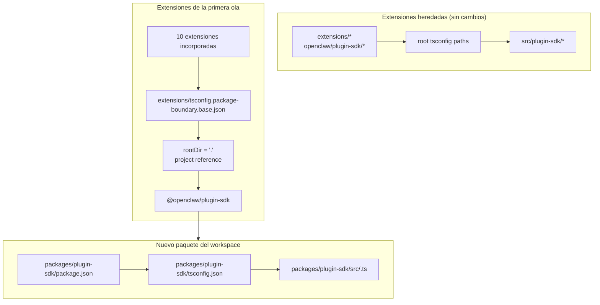

# refactor: Convertir plugin-sdk en un paquete real del workspace de forma incremental

## Descripción general

Este plan introduce un paquete real del workspace para el SDK de plugins en
`packages/plugin-sdk` y lo usa para incorporar una pequeña primera ola de extensiones a
límites de paquetes aplicados por el compilador. El objetivo es hacer que las
importaciones relativas no permitidas fallen bajo `tsc` normal para un conjunto seleccionado de extensiones
de proveedor empaquetadas, sin forzar una migración en todo el repositorio ni una enorme
superficie de conflictos de fusión.

El movimiento incremental clave es ejecutar dos modos en paralelo durante un tiempo:

| Modo legado | Forma de importación       | Quién lo usa                         | Aplicación                                    |
| ----------- | -------------------------- | ------------------------------------ | --------------------------------------------- |
| Modo legado | `openclaw/plugin-sdk/*`    | todas las extensiones existentes no incorporadas | se mantiene el comportamiento permisivo actual |
| Modo opt-in | `@openclaw/plugin-sdk/*`   | solo las extensiones de la primera ola | `rootDir` local al paquete + referencias de proyecto |

## Planteamiento del problema

El repositorio actual exporta una gran superficie pública del SDK de plugins, pero no es un
paquete real del workspace. En su lugar:

- el `tsconfig.json` raíz asigna `openclaw/plugin-sdk/*` directamente a
  `src/plugin-sdk/*.ts`
- las extensiones que no se incorporaron al experimento anterior siguen compartiendo ese
  comportamiento global de alias de origen
- agregar `rootDir` solo funciona cuando las importaciones permitidas del SDK dejan de resolverse hacia código fuente
  sin procesar del repositorio

Eso significa que el repositorio puede describir la política de límites deseada, pero TypeScript
no la aplica limpiamente para la mayoría de las extensiones.

Quieres una ruta incremental que:

- convierta `plugin-sdk` en algo real
- mueva el SDK hacia un paquete del workspace llamado `@openclaw/plugin-sdk`
- cambie solo alrededor de 10 extensiones en el primer PR
- deje el resto del árbol de extensiones en el esquema antiguo hasta una limpieza posterior
- evite el flujo de trabajo `tsconfig.plugin-sdk.dts.json` + declaraciones generadas en postinstall
  como mecanismo principal para el despliegue de la primera ola

## Trazabilidad de requisitos

- R1. Crear un paquete real del workspace para el SDK bajo `packages/`.
- R2. Nombrar el nuevo paquete `@openclaw/plugin-sdk`.
- R3. Dar al nuevo paquete SDK su propio `package.json` y `tsconfig.json`.
- R4. Mantener las importaciones heredadas `openclaw/plugin-sdk/*` funcionando para las extensiones
  no incorporadas durante la ventana de migración.
- R5. Incorporar solo una pequeña primera ola de extensiones en el primer PR.
- R6. Las extensiones de la primera ola deben fallar de forma cerrada para las importaciones relativas que salgan
  de la raíz de su paquete.
- R7. Las extensiones de la primera ola deben consumir el SDK mediante una
  dependencia de paquete y una referencia de proyecto de TS, no mediante alias `paths` de la raíz.
- R8. El plan debe evitar un paso obligatorio de generación en postinstall para todo el repositorio
  para la corrección en el editor.
- R9. El despliegue de la primera ola debe ser revisable e integrable como un PR moderado,
  no como una refactorización de más de 300 archivos en todo el repositorio.

## Límites del alcance

- No migrar completamente todas las extensiones empaquetadas en el primer PR.
- No es necesario eliminar `src/plugin-sdk` en el primer PR.
- No es necesario reconfigurar inmediatamente cada ruta de compilación o prueba raíz para usar el nuevo paquete.
- No se intenta forzar errores visuales de VS Code para todas las extensiones no incorporadas.
- No hay limpieza amplia de lint para el resto del árbol de extensiones.
- No hay cambios grandes en el comportamiento en tiempo de ejecución más allá de la resolución de importaciones, la
  propiedad del paquete y la aplicación de límites para las extensiones incorporadas.

## Contexto e investigación

### Código y patrones relevantes

- `pnpm-workspace.yaml` ya incluye `packages/*` y `extensions/*`, por lo que un
  nuevo paquete del workspace bajo `packages/plugin-sdk` encaja en el diseño existente del
  repositorio.
- Los paquetes existentes del workspace, como `packages/memory-host-sdk/package.json`
  y `packages/plugin-package-contract/package.json`, ya usan mapas `exports` locales al paquete
  enraizados en `src/*.ts`.
- El `package.json` raíz actualmente publica la superficie del SDK mediante `./plugin-sdk`
  y `./plugin-sdk/*` exports respaldados por `dist/plugin-sdk/*.js` y
  `dist/plugin-sdk/*.d.ts`.
- `src/plugin-sdk/entrypoints.ts` y `scripts/lib/plugin-sdk-entrypoints.json`
  ya actúan como el inventario canónico de entrypoints para la superficie del SDK.
- El `tsconfig.json` raíz actualmente asigna:
  - `openclaw/plugin-sdk` -> `src/plugin-sdk/index.ts`
  - `openclaw/plugin-sdk/*` -> `src/plugin-sdk/*.ts`
- El experimento anterior de límites mostró que `rootDir` local al paquete funciona para
  importaciones relativas no permitidas solo después de que las importaciones permitidas del SDK dejan de resolverse hacia código fuente
  sin procesar fuera del paquete de extensión.

### Conjunto de extensiones de la primera ola

Este plan asume que la primera ola es el conjunto con muchos proveedores que tiene menos probabilidades
de arrastrar casos límite complejos del tiempo de ejecución de canales:

- `extensions/anthropic`
- `extensions/exa`
- `extensions/firecrawl`
- `extensions/groq`
- `extensions/mistral`
- `extensions/openai`
- `extensions/perplexity`
- `extensions/tavily`
- `extensions/together`
- `extensions/xai`

### Inventario de superficie del SDK de la primera ola

Las extensiones de la primera ola actualmente importan un subconjunto manejable de subrutas del SDK.
El paquete inicial `@openclaw/plugin-sdk` solo necesita cubrir estas:

- `agent-runtime`
- `cli-runtime`
- `config-runtime`
- `core`
- `image-generation`
- `media-runtime`
- `media-understanding`
- `plugin-entry`
- `plugin-runtime`
- `provider-auth`
- `provider-auth-api-key`
- `provider-auth-login`
- `provider-auth-runtime`
- `provider-catalog-shared`
- `provider-entry`
- `provider-http`
- `provider-model-shared`
- `provider-onboard`
- `provider-stream-family`
- `provider-stream-shared`
- `provider-tools`
- `provider-usage`
- `provider-web-fetch`
- `provider-web-search`
- `realtime-transcription`
- `realtime-voice`
- `runtime-env`
- `secret-input`
- `security-runtime`
- `speech`
- `testing`

### Aprendizajes institucionales

- No había entradas relevantes en `docs/solutions/` en este árbol de trabajo.

### Referencias externas

- No fue necesaria investigación externa para este plan. El repositorio ya contiene los
  patrones relevantes de paquete del workspace y exportación del SDK.

## Decisiones técnicas clave

- Introducir `@openclaw/plugin-sdk` como un nuevo paquete del workspace mientras se mantiene activa la
  superficie heredada raíz `openclaw/plugin-sdk/*` durante la migración.
  Justificación: esto permite que un conjunto de extensiones de la primera ola pase a una resolución real de paquetes
  sin forzar que todas las extensiones y todas las rutas de compilación raíz cambien
  de una sola vez.

- Usar una configuración base dedicada de límites opt-in, como
  `extensions/tsconfig.package-boundary.base.json`, en lugar de reemplazar la
  base existente de extensiones para todos.
  Justificación: el repositorio necesita admitir simultáneamente tanto el modo heredado como el opt-in para extensiones
  durante la migración.

- Usar referencias de proyecto de TS desde las extensiones de la primera ola hacia
  `packages/plugin-sdk/tsconfig.json` y establecer
  `disableSourceOfProjectReferenceRedirect` para el modo opt-in de límites.
  Justificación: esto da a `tsc` un grafo real de paquetes mientras desalienta al editor y
  al compilador de recurrir al recorrido del código fuente sin procesar.

- Mantener `@openclaw/plugin-sdk` como privado en la primera ola.
  Justificación: el objetivo inmediato es la aplicación interna de límites y la seguridad de migración,
  no publicar un segundo contrato externo del SDK antes de que la superficie sea
  estable.

- Mover solo las subrutas del SDK de la primera ola en el primer corte de implementación, y
  mantener puentes de compatibilidad para el resto.
  Justificación: mover físicamente los 315 archivos `src/plugin-sdk/*.ts` en un solo PR es
  exactamente la superficie de conflicto de fusión que este plan intenta evitar.

- No depender de `scripts/postinstall-bundled-plugins.mjs` para construir
  declaraciones del SDK para la primera ola.
  Justificación: los flujos explícitos de compilación/referencia son más fáciles de razonar y mantienen
  el comportamiento del repositorio más predecible.

## Preguntas abiertas

### Resueltas durante la planificación

- ¿Qué extensiones deben estar en la primera ola?
  Usar las 10 extensiones de proveedor/búsqueda web enumeradas arriba porque están más
  aisladas estructuralmente que los paquetes de canal más pesados.

- ¿Debe el primer PR reemplazar todo el árbol de extensiones?
  No. El primer PR debe admitir dos modos en paralelo e incorporar solo la
  primera ola.

- ¿Debe la primera ola requerir una compilación de declaraciones en postinstall?
  No. El grafo de paquete/referencia debe ser explícito, y CI debe ejecutar
  intencionalmente la verificación de tipos local al paquete correspondiente.

### Aplazadas para la implementación

- Si el paquete de la primera ola puede apuntar directamente a `src/*.ts` local al paquete
  solo mediante referencias de proyecto, o si aún se requiere un pequeño paso de emisión de declaraciones
  para el paquete `@openclaw/plugin-sdk`.
  Esta es una cuestión de validación del grafo de TS propia de la implementación.

- Si el paquete raíz `openclaw` debe redirigir inmediatamente las subrutas del SDK de la primera ola a
  las salidas de `packages/plugin-sdk` o seguir usando shims de compatibilidad generados bajo `src/plugin-sdk`.
  Este es un detalle de compatibilidad y forma de compilación que depende de la
  ruta mínima de implementación que mantenga CI en verde.

## Diseño técnico de alto nivel

> Esto ilustra el enfoque previsto y sirve como guía direccional para la revisión, no como especificación de implementación. El agente encargado de implementar debe tratarlo como contexto, no como código para reproducir.

## Unidades de implementación

- [ ] **Unidad 1: Introducir el paquete real del workspace `@openclaw/plugin-sdk`**

**Objetivo:** Crear un paquete real del workspace para el SDK que pueda ser propietario de la
superficie de subrutas de la primera ola sin forzar una migración en todo el repositorio.

**Requisitos:** R1, R2, R3, R8, R9

**Dependencias:** Ninguna

**Archivos:**

- Crear: `packages/plugin-sdk/package.json`
- Crear: `packages/plugin-sdk/tsconfig.json`
- Crear: `packages/plugin-sdk/src/index.ts`
- Crear: `packages/plugin-sdk/src/*.ts` para las subrutas del SDK de la primera ola
- Modificar: `pnpm-workspace.yaml` solo si se necesitan ajustes en los globs de paquetes
- Modificar: `package.json`
- Modificar: `src/plugin-sdk/entrypoints.ts`
- Modificar: `scripts/lib/plugin-sdk-entrypoints.json`
- Probar: `src/plugins/contracts/plugin-sdk-workspace-package.contract.test.ts`

**Enfoque:**

- Agregar un nuevo paquete del workspace llamado `@openclaw/plugin-sdk`.
- Comenzar solo con las subrutas del SDK de la primera ola, no con todo el árbol de 315 archivos.
- Si mover directamente un entrypoint de la primera ola creara un diff demasiado grande, el
  primer PR puede introducir primero esa subruta en `packages/plugin-sdk/src` como un wrapper
  delgado del paquete y luego cambiar la fuente de verdad al paquete en un PR de seguimiento
  para ese grupo de subrutas.
- Reutilizar la maquinaria existente de inventario de entrypoints para que la superficie del paquete de la primera ola
  se declare en un único lugar canónico.
- Mantener activas las exportaciones del paquete raíz para los usuarios heredados mientras el paquete del workspace
  se convierte en el nuevo contrato opt-in.

**Patrones a seguir:**

- `packages/memory-host-sdk/package.json`
- `packages/plugin-package-contract/package.json`
- `src/plugin-sdk/entrypoints.ts`

**Escenarios de prueba:**

- Caso satisfactorio: el paquete del workspace exporta cada subruta de la primera ola enumerada
  en el plan y no falta ninguna exportación requerida de la primera ola.
- Caso límite: los metadatos de exportación del paquete permanecen estables cuando la lista de entradas de la primera ola
  se vuelve a generar o se compara con el inventario canónico.
- Integración: las exportaciones heredadas del SDK en el paquete raíz siguen presentes tras introducir
  el nuevo paquete del workspace.

**Verificación:**

- El repositorio contiene un paquete válido del workspace `@openclaw/plugin-sdk` con un
  mapa estable de exportaciones de la primera ola y sin regresión de exportaciones heredadas en el
  `package.json` raíz.

- [ ] **Unidad 2: Agregar un modo opt-in de límites de TS para extensiones con aplicación por paquete**

**Objetivo:** Definir el modo de configuración de TS que usarán las extensiones incorporadas,
mientras se deja sin cambios el comportamiento existente de TS para extensiones del resto.

**Requisitos:** R4, R6, R7, R8, R9

**Dependencias:** Unidad 1

**Archivos:**

- Crear: `extensions/tsconfig.package-boundary.base.json`
- Crear: `tsconfig.boundary-optin.json`
- Modificar: `extensions/xai/tsconfig.json`
- Modificar: `extensions/openai/tsconfig.json`
- Modificar: `extensions/anthropic/tsconfig.json`
- Modificar: `extensions/mistral/tsconfig.json`
- Modificar: `extensions/groq/tsconfig.json`
- Modificar: `extensions/together/tsconfig.json`
- Modificar: `extensions/perplexity/tsconfig.json`
- Modificar: `extensions/tavily/tsconfig.json`
- Modificar: `extensions/exa/tsconfig.json`
- Modificar: `extensions/firecrawl/tsconfig.json`
- Probar: `src/plugins/contracts/extension-package-project-boundaries.test.ts`
- Probar: `test/extension-package-tsc-boundary.test.ts`

**Enfoque:**

- Dejar `extensions/tsconfig.base.json` en su lugar para las extensiones heredadas.
- Agregar una nueva configuración base opt-in que:
  - establezca `rootDir: "."`
  - haga referencia a `packages/plugin-sdk`
  - habilite `composite`
  - deshabilite la redirección de fuente de referencia de proyecto cuando sea necesario
- Agregar una configuración de solución dedicada para el grafo de typecheck de la primera ola en lugar de
  reformar el proyecto TS raíz del repositorio en el mismo PR.

**Nota de ejecución:** comenzar con una comprobación canaria fallida de typecheck local al paquete para una
extensión incorporada antes de aplicar el patrón a las 10.

**Patrones a seguir:**

- Patrón existente de `tsconfig.json` local a extensiones del trabajo anterior
  de límites
- Patrón de paquete del workspace de `packages/memory-host-sdk`

**Escenarios de prueba:**

- Caso satisfactorio: cada extensión incorporada supera correctamente el typecheck mediante la
  configuración TS de límites de paquete.
- Ruta de error: una importación relativa canaria desde `../../src/cli/acp-cli.ts` falla
  con `TS6059` para una extensión incorporada.
- Integración: las extensiones no incorporadas permanecen intactas y no necesitan
  participar todavía en la nueva configuración de solución.

**Verificación:**

- Existe un grafo de typecheck dedicado para las 10 extensiones incorporadas, y las
  malas importaciones relativas desde una de ellas fallan mediante `tsc` normal.

- [ ] **Unidad 3: Migrar las extensiones de la primera ola a `@openclaw/plugin-sdk`**

**Objetivo:** Cambiar las extensiones de la primera ola para que consuman el paquete real del SDK
mediante metadatos de dependencia, referencias de proyecto e importaciones por nombre de paquete.

**Requisitos:** R5, R6, R7, R9

**Dependencias:** Unidad 2

**Archivos:**

- Modificar: `extensions/anthropic/package.json`
- Modificar: `extensions/exa/package.json`
- Modificar: `extensions/firecrawl/package.json`
- Modificar: `extensions/groq/package.json`
- Modificar: `extensions/mistral/package.json`
- Modificar: `extensions/openai/package.json`
- Modificar: `extensions/perplexity/package.json`
- Modificar: `extensions/tavily/package.json`
- Modificar: `extensions/together/package.json`
- Modificar: `extensions/xai/package.json`
- Modificar: las importaciones de producción y prueba bajo cada una de las 10 raíces de extensión que
  actualmente hacen referencia a `openclaw/plugin-sdk/*`

**Enfoque:**

- Agregar `@openclaw/plugin-sdk: workspace:*` a `devDependencies` de las extensiones
  de la primera ola.
- Reemplazar las importaciones `openclaw/plugin-sdk/*` en esos paquetes por
  `@openclaw/plugin-sdk/*`.
- Mantener las importaciones internas locales de la extensión en barriles locales como `./api.ts` y
  `./runtime-api.ts`.
- No cambiar las extensiones no incorporadas en este PR.

**Patrones a seguir:**

- Barriles existentes de importación local de extensiones (`api.ts`, `runtime-api.ts`)
- Forma de dependencia de paquete usada por otros paquetes del workspace `@openclaw/*`

**Escenarios de prueba:**

- Caso satisfactorio: cada extensión migrada sigue registrándose/cargándose mediante sus pruebas
  existentes del plugin después de la reescritura de importaciones.
- Caso límite: las importaciones del SDK solo para pruebas en el conjunto de extensiones incorporadas siguen resolviéndose
  correctamente mediante el nuevo paquete.
- Integración: las extensiones migradas no requieren alias raíz `openclaw/plugin-sdk/*`
  para el typechecking.

**Verificación:**

- Las extensiones de la primera ola compilan y se prueban contra `@openclaw/plugin-sdk`
  sin necesitar la ruta heredada de alias del SDK en la raíz.

- [ ] **Unidad 4: Preservar la compatibilidad heredada mientras la migración es parcial**

**Objetivo:** Mantener el resto del repositorio funcionando mientras el SDK existe tanto en forma heredada
como en forma de nuevo paquete durante la migración.

**Requisitos:** R4, R8, R9

**Dependencias:** Unidades 1-3

**Archivos:**

- Modificar: `src/plugin-sdk/*.ts` para shims de compatibilidad de la primera ola según sea necesario
- Modificar: `package.json`
- Modificar: la infraestructura de compilación o exportación que ensambla los artefactos del SDK
- Probar: `src/plugins/contracts/plugin-sdk-runtime-api-guardrails.test.ts`
- Probar: `src/plugins/contracts/plugin-sdk-index.bundle.test.ts`

**Enfoque:**

- Mantener `openclaw/plugin-sdk/*` en la raíz como superficie de compatibilidad para las
  extensiones heredadas y para consumidores externos que aún no se están moviendo.
- Usar ya sea shims generados o cableado de proxy de exportación raíz para las subrutas
  de la primera ola que se hayan movido a `packages/plugin-sdk`.
- No intentar retirar la superficie del SDK en la raíz en esta fase.

**Patrones a seguir:**

- Generación existente de exportaciones del SDK raíz mediante `src/plugin-sdk/entrypoints.ts`
- Compatibilidad existente de exportación de paquetes en el `package.json` raíz

**Escenarios de prueba:**

- Caso satisfactorio: una importación heredada del SDK raíz sigue resolviéndose para una extensión
  no incorporada después de que exista el nuevo paquete.
- Caso límite: una subruta de la primera ola funciona tanto mediante la superficie heredada raíz como
  mediante la nueva superficie del paquete durante la ventana de migración.
- Integración: las pruebas de contrato del índice/bundle de plugin-sdk siguen viendo una
  superficie pública coherente.

**Verificación:**

- El repositorio admite tanto modos heredados como modos opt-in de consumo del SDK sin
  romper las extensiones no modificadas.

- [ ] **Unidad 5: Agregar aplicación acotada y documentar el contrato de migración**

**Objetivo:** Incorporar CI y una guía para contribuidores que apliquen el nuevo comportamiento para la
primera ola sin fingir que todo el árbol de extensiones ya está migrado.

**Requisitos:** R5, R6, R8, R9

**Dependencias:** Unidades 1-4

**Archivos:**

- Modificar: `package.json`
- Modificar: los archivos de workflow de CI que deben ejecutar el typecheck opt-in de límites
- Modificar: `AGENTS.md`
- Modificar: `docs/plugins/sdk-overview.md`
- Modificar: `docs/plugins/sdk-entrypoints.md`
- Modificar: `docs/plans/2026-04-05-001-refactor-extension-package-resolution-boundary-plan.md`

**Enfoque:**

- Agregar una compuerta explícita para la primera ola, como una ejecución dedicada de `tsc -b` para
  `packages/plugin-sdk` más las 10 extensiones incorporadas.
- Documentar que el repositorio ahora admite tanto modos heredados como modos opt-in de extensiones,
  y que el nuevo trabajo de límites de extensiones debe preferir la nueva ruta de paquete.
- Registrar la regla de migración de la siguiente ola para que PR posteriores puedan agregar más extensiones
  sin volver a debatir la arquitectura.

**Patrones a seguir:**

- Pruebas de contrato existentes bajo `src/plugins/contracts/`
- Actualizaciones existentes de documentación que explican migraciones por etapas

**Escenarios de prueba:**

- Caso satisfactorio: la nueva compuerta de typecheck de la primera ola pasa para el paquete del workspace
  y las extensiones incorporadas.
- Ruta de error: introducir una nueva importación relativa no permitida en una
  extensión incorporada hace fallar la compuerta de typecheck acotada.
- Integración: CI aún no exige que las extensiones no incorporadas satisfagan el nuevo
  modo de límites de paquete.

**Verificación:**

- La ruta de aplicación de la primera ola está documentada, probada y se puede ejecutar sin
  obligar a migrar todo el árbol de extensiones.

## Impacto en todo el sistema

- **Grafo de interacción:** este trabajo toca la fuente de verdad del SDK, las
  exportaciones del paquete raíz, los metadatos de paquetes de extensiones, el diseño del grafo de TS y la verificación en CI.
- **Propagación de errores:** el modo principal de fallo previsto pasa a ser errores de TS en tiempo de compilación
  (`TS6059`) en extensiones incorporadas en lugar de fallos solo de scripts personalizados.
- **Riesgos del ciclo de vida del estado:** la migración de doble superficie introduce riesgo de divergencia entre
  las exportaciones de compatibilidad raíz y el nuevo paquete del workspace.
- **Paridad de superficie de API:** las subrutas de la primera ola deben seguir siendo semánticamente idénticas
  tanto a través de `openclaw/plugin-sdk/*` como de `@openclaw/plugin-sdk/*` durante la
  transición.
- **Cobertura de integración:** las pruebas unitarias no son suficientes; se requieren typechecks
  acotados del grafo de paquetes para demostrar el límite.
- **Invariantes sin cambios:** las extensiones no incorporadas mantienen su comportamiento actual
  en el PR 1. Este plan no afirma una aplicación de límites de importación en todo el repositorio.

## Riesgos y dependencias

| Riesgo                                                                                                   | Mitigación                                                                                                              |
| -------------------------------------------------------------------------------------------------------- | ----------------------------------------------------------------------------------------------------------------------- |
| El paquete de la primera ola sigue resolviéndose hacia código fuente sin procesar y `rootDir` en realidad no falla de forma cerrada | Hacer que el primer paso de implementación sea un canario de referencia de paquete sobre una extensión incorporada antes de ampliarlo al conjunto completo |
| Mover demasiado código fuente del SDK de una vez recrea el problema original de conflictos de fusión    | Mover solo las subrutas de la primera ola en el primer PR y mantener puentes de compatibilidad en la raíz              |
| Las superficies heredadas y nuevas del SDK divergen semánticamente                                       | Mantener un único inventario de entrypoints, agregar pruebas de contrato de compatibilidad y hacer explícita la paridad de doble superficie |
| Las rutas de compilación/prueba del repositorio raíz empiezan accidentalmente a depender del nuevo paquete de formas no controladas | Usar una configuración de solución opt-in dedicada y mantener fuera del primer PR los cambios de topología TS para todo el repositorio |

## Entrega por fases

### Fase 1

- Introducir `@openclaw/plugin-sdk`
- Definir la superficie de subrutas de la primera ola
- Demostrar que una extensión incorporada puede fallar de forma cerrada mediante `rootDir`

### Fase 2

- Incorporar las 10 extensiones de la primera ola
- Mantener activa la compatibilidad en la raíz para todos los demás

### Fase 3

- Agregar más extensiones en PR posteriores
- Mover más subrutas del SDK al paquete del workspace
- Retirar la compatibilidad en la raíz solo después de que desaparezca el conjunto heredado de extensiones

## Notas operativas / de documentación

- El primer PR debe describirse explícitamente como una migración de modo dual, no como la
  finalización de la aplicación en todo el repositorio.
- La guía de migración debe facilitar que PR posteriores agreguen más extensiones
  siguiendo el mismo patrón de paquete/dependencia/referencia.

## Fuentes y referencias

- Plan previo: `docs/plans/2026-04-05-001-refactor-extension-package-resolution-boundary-plan.md`
- Configuración del workspace: `pnpm-workspace.yaml`
- Inventario existente de entrypoints del SDK: `src/plugin-sdk/entrypoints.ts`
- Exportaciones existentes del SDK raíz: `package.json`
- Patrones existentes de paquetes del workspace:
  - `packages/memory-host-sdk/package.json`
  - `packages/plugin-package-contract/package.json`
