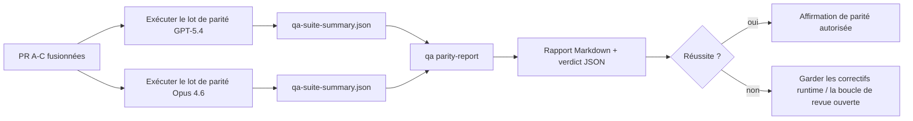

---
x-i18n:
    generated_at: "2026-04-11T15:15:53Z"
    model: gpt-5.4
    provider: openai
    source_hash: 910bcf7668becf182ef48185b43728bf2fa69629d6d50189d47d47b06f807a9e
    source_path: help/gpt54-codex-agentic-parity-maintainers.md
    workflow: 15
---

# Notes de maintenance sur la parité GPT-5.4 / Codex

Cette note explique comment examiner le programme de parité GPT-5.4 / Codex comme quatre unités de fusion sans perdre l’architecture originale en six contrats.

## Unités de fusion

### PR A : exécution agentique stricte

Possède :

- `executionContract`
- suivi dans le même tour, d’abord GPT-5
- `update_plan` comme suivi de progression non terminal
- états bloqués explicites au lieu d’arrêts silencieux limités au plan

Ne possède pas :

- classification des échecs d’authentification/runtime
- véracité des permissions
- refonte du rejeu/de la continuation
- benchmarking de parité

### PR B : véracité du runtime

Possède :

- exactitude des scopes OAuth Codex
- classification typée des échecs provider/runtime
- disponibilité véridique de `/elevated full` et raisons de blocage

Ne possède pas :

- normalisation du schéma des outils
- état de rejeu/vivacité
- contrôle du benchmark

### PR C : exactitude de l’exécution

Possède :

- compatibilité des outils OpenAI/Codex possédée par le provider
- gestion stricte des schémas sans paramètres
- exposition des rejeux invalides
- visibilité des états de tâche longue en pause, bloquée et abandonnée

Ne possède pas :

- continuation auto-élue
- comportement générique du dialecte Codex en dehors des hooks du provider
- contrôle du benchmark

### PR D : harnais de parité

Possède :

- premier lot de scénarios GPT-5.4 vs Opus 4.6
- documentation de la parité
- rapport de parité et mécanismes de contrôle à la publication

Ne possède pas :

- changements de comportement du runtime en dehors de QA-lab
- simulation auth/proxy/DNS dans le harnais

## Correspondance avec les six contrats d’origine

| Contrat d’origine                       | Unité de fusion |
| --------------------------------------- | --------------- |
| Exactitude du transport/auth provider   | PR B            |
| Compatibilité contrat/schéma des outils | PR C            |
| Exécution dans le même tour             | PR A            |
| Véracité des permissions                | PR B            |
| Exactitude rejeu/continuation/vivacité  | PR C            |
| Contrôle benchmark/publication          | PR D            |

## Ordre de revue

1. PR A
2. PR B
3. PR C
4. PR D

PR D est la couche de preuve. Elle ne doit pas être la raison pour laquelle les PR de correction du runtime sont retardées.

## Points à vérifier

### PR A

- les exécutions GPT-5 agissent ou échouent de manière fermée au lieu de s’arrêter au commentaire
- `update_plan` ne ressemble plus à lui seul à une progression
- le comportement reste d’abord GPT-5 et limité au périmètre Pi embarqué

### PR B

- les échecs auth/proxy/runtime ne sont plus ramenés à une gestion générique de type « le modèle a échoué »
- `/elevated full` n’est décrit comme disponible que lorsqu’il l’est réellement
- les raisons de blocage sont visibles à la fois pour le modèle et pour le runtime exposé à l’utilisateur

### PR C

- l’enregistrement strict des outils OpenAI/Codex se comporte de manière prévisible
- les outils sans paramètres n’échouent pas aux vérifications strictes du schéma
- les résultats de rejeu et de compaction préservent un état de vivacité véridique

### PR D

- le lot de scénarios est compréhensible et reproductible
- le lot inclut une voie mutante de sécurité de rejeu, pas seulement des flux en lecture seule
- les rapports sont lisibles par les humains et par l’automatisation
- les affirmations de parité sont étayées par des preuves, pas anecdotiques

Artéfacts attendus de PR D :

- `qa-suite-report.md` / `qa-suite-summary.json` pour chaque exécution de modèle
- `qa-agentic-parity-report.md` avec comparaison agrégée et au niveau des scénarios
- `qa-agentic-parity-summary.json` avec un verdict lisible par machine

## Contrôle de publication

Ne pas affirmer la parité ou la supériorité de GPT-5.4 sur Opus 4.6 tant que :

- PR A, PR B et PR C ne sont pas fusionnées
- PR D n’exécute pas proprement le premier lot de parité
- les suites de régression de véracité du runtime restent vertes
- le rapport de parité ne montre aucun cas de faux succès et aucune régression du comportement d’arrêt

Le harnais de parité n’est pas la seule source de preuve. Gardez cette séparation explicite dans la revue :

- PR D possède la comparaison par scénarios entre GPT-5.4 et Opus 4.6
- les suites déterministes de PR B possèdent toujours les preuves auth/proxy/DNS et de véracité d’accès complet

## Cartographie objectif-preuve

| Élément du critère d’achèvement          | Propriétaire principal | Artéfact de revue                                                    |
| ---------------------------------------- | ---------------------- | -------------------------------------------------------------------- |
| Aucun blocage limité au plan             | PR A                   | tests runtime agentiques stricts et `approval-turn-tool-followthrough` |
| Aucun faux progrès ni fausse exécution d’outil | PR A + PR D            | nombre de faux succès de parité plus détails du rapport au niveau des scénarios |
| Aucun faux guidage `/elevated full`      | PR B                   | suites déterministes de véracité du runtime                          |
| Les échecs de rejeu/vivacité restent explicites | PR C + PR D            | suites cycle de vie/rejeu plus `compaction-retry-mutating-tool`      |
| GPT-5.4 égale ou dépasse Opus 4.6        | PR D                   | `qa-agentic-parity-report.md` et `qa-agentic-parity-summary.json`    |

## Abréviation pour les reviewers : avant vs après

| Problème visible par l’utilisateur avant                      | Signal de revue après                                                                  |
| ------------------------------------------------------------- | -------------------------------------------------------------------------------------- |
| GPT-5.4 s’arrêtait après la planification                     | PR A montre un comportement agir-ou-bloquer au lieu d’une fin limitée au commentaire  |
| L’usage des outils semblait fragile avec les schémas stricts OpenAI/Codex | PR C garde un enregistrement des outils et une invocation sans paramètres prévisibles |
| Les indications `/elevated full` étaient parfois trompeuses  | PR B relie les indications à la capacité réelle du runtime et aux raisons de blocage  |
| Les tâches longues pouvaient disparaître dans l’ambiguïté du rejeu/de la compaction | PR C émet des états explicites : en pause, bloquée, abandonnée et rejeu invalide |
| Les affirmations de parité étaient anecdotiques               | PR D produit un rapport plus un verdict JSON avec la même couverture de scénarios sur les deux modèles |
