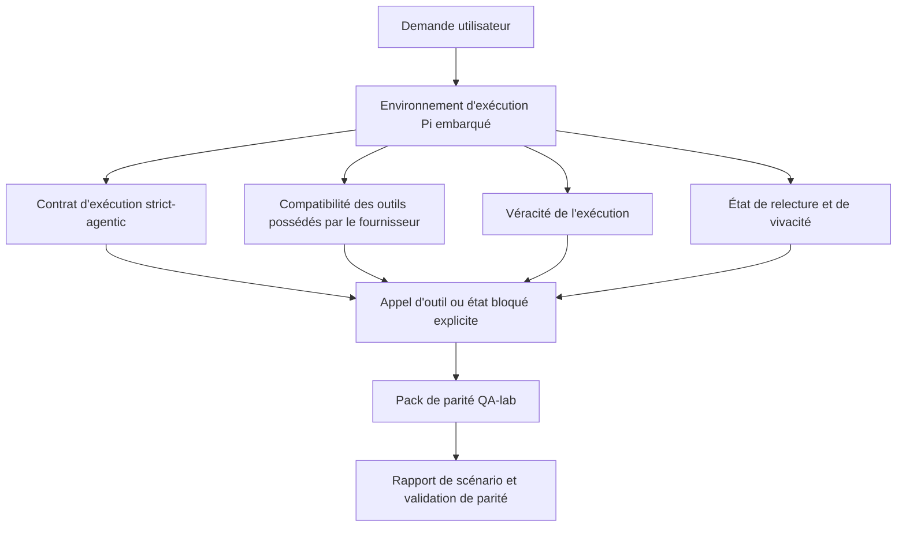
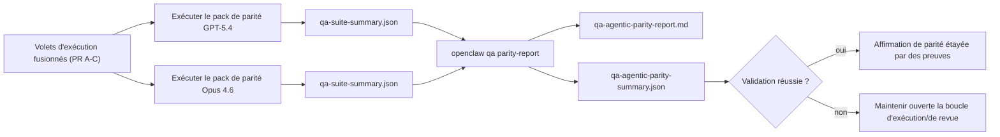

---
x-i18n:
    generated_at: "2026-04-11T15:15:53Z"
    model: gpt-5.4
    provider: openai
    source_hash: 7ee6b925b8a0f8843693cea9d50b40544657b5fb8a9e0860e2ff5badb273acb6
    source_path: help/gpt54-codex-agentic-parity.md
    workflow: 15
---

# GPT-5.4 / Parité agentique Codex dans OpenClaw

OpenClaw fonctionnait déjà bien avec les modèles de pointe utilisant des outils, mais les modèles de type GPT-5.4 et Codex restaient moins performants dans quelques cas pratiques :

- ils pouvaient s'arrêter après la planification au lieu d'effectuer le travail
- ils pouvaient utiliser incorrectement les schémas d'outils stricts d'OpenAI/Codex
- ils pouvaient demander `/elevated full` même lorsque l'accès complet était impossible
- ils pouvaient perdre l'état des tâches longues pendant la relecture ou la compaction
- les affirmations de parité avec Claude Opus 4.6 reposaient sur des anecdotes plutôt que sur des scénarios reproductibles

Ce programme de parité corrige ces lacunes en quatre volets révisables.

## Ce qui a changé

### PR A : exécution stricte agentique

Ce volet ajoute un contrat d'exécution `strict-agentic` optionnel pour les exécutions GPT-5 embarquées sur Pi.

Lorsqu'il est activé, OpenClaw n'accepte plus les tours de planification seule comme une complétion « suffisante ». Si le modèle dit seulement ce qu'il a l'intention de faire sans réellement utiliser d'outils ni progresser, OpenClaw réessaie avec une instruction de passage immédiat à l'action, puis échoue en mode fermé avec un état bloqué explicite au lieu de terminer silencieusement la tâche.

Cela améliore surtout l'expérience GPT-5.4 dans les cas suivants :

- courts suivis du type « ok fais-le »
- tâches de code où la première étape est évidente
- flux où `update_plan` doit servir au suivi de progression plutôt qu'à du texte de remplissage

### PR B : véracité de l'exécution

Ce volet fait en sorte qu'OpenClaw dise la vérité sur deux points :

- pourquoi l'appel au fournisseur/à l'environnement d'exécution a échoué
- si `/elevated full` est réellement disponible

Cela signifie que GPT-5.4 reçoit de meilleurs signaux d'exécution pour les portées manquantes, les échecs de rafraîchissement d'authentification, les échecs d'authentification HTML 403, les problèmes de proxy, les échecs DNS ou de délai d'expiration, ainsi que les modes d'accès complet bloqués. Le modèle est moins susceptible d'halluciner une mauvaise remédiation ou de continuer à demander un mode d'autorisation que l'environnement d'exécution ne peut pas fournir.

### PR C : exactitude de l'exécution

Ce volet améliore deux types d'exactitude :

- la compatibilité des schémas d'outils OpenAI/Codex possédés par le fournisseur
- l'exposition de la relecture et de la vivacité des tâches longues

Le travail de compatibilité des outils réduit les frictions de schéma pour l'enregistrement strict des outils OpenAI/Codex, en particulier autour des outils sans paramètres et des attentes strictes de racine objet. Le travail sur la relecture et la vivacité rend les tâches longues plus observables, de sorte que les états en pause, bloqués et abandonnés sont visibles au lieu de disparaître dans un texte d'échec générique.

### PR D : harnais de parité

Ce volet ajoute le premier pack de parité QA-lab afin que GPT-5.4 et Opus 4.6 puissent être exercés à travers les mêmes scénarios et comparés à l'aide d'éléments de preuve partagés.

Le pack de parité constitue la couche de preuve. Il ne modifie pas à lui seul le comportement d'exécution.

Après avoir obtenu deux artefacts `qa-suite-summary.json`, générez la comparaison de validation de release avec :

```bash
pnpm openclaw qa parity-report \
  --repo-root . \
  --candidate-summary .artifacts/qa-e2e/gpt54/qa-suite-summary.json \
  --baseline-summary .artifacts/qa-e2e/opus46/qa-suite-summary.json \
  --output-dir .artifacts/qa-e2e/parity
```

Cette commande écrit :

- un rapport Markdown lisible par des humains
- un verdict JSON lisible par machine
- un résultat de validation explicite `pass` / `fail`

## Pourquoi cela améliore GPT-5.4 en pratique

Avant ce travail, GPT-5.4 sur OpenClaw pouvait sembler moins agentique qu'Opus dans de vraies sessions de codage, car l'environnement d'exécution tolérait des comportements particulièrement nuisibles aux modèles de type GPT-5 :

- tours contenant uniquement des commentaires
- friction de schéma autour des outils
- retours vagues sur les autorisations
- rupture silencieuse de la relecture ou de la compaction

L'objectif n'est pas de faire imiter Opus à GPT-5.4. L'objectif est de donner à GPT-5.4 un contrat d'exécution qui récompense les vrais progrès, fournit des sémantiques plus nettes pour les outils et les autorisations, et transforme les modes d'échec en états explicites lisibles à la fois par des machines et par des humains.

Cela fait passer l'expérience utilisateur de :

- « le modèle avait un bon plan mais s'est arrêté »

à :

- « le modèle a soit agi, soit OpenClaw a exposé la raison exacte pour laquelle il ne pouvait pas le faire »

## Avant / après pour les utilisateurs de GPT-5.4

| Avant ce programme                                                                            | Après les PR A-D                                                                        |
| --------------------------------------------------------------------------------------------- | --------------------------------------------------------------------------------------- |
| GPT-5.4 pouvait s'arrêter après un plan raisonnable sans effectuer l'étape d'outil suivante  | PR A transforme « plan uniquement » en « agir maintenant ou exposer un état bloqué »   |
| Les schémas d'outils stricts pouvaient rejeter les outils sans paramètres ou au format OpenAI/Codex de façon déroutante | PR C rend l'enregistrement et l'invocation des outils possédés par le fournisseur plus prévisibles |
| Les indications sur `/elevated full` pouvaient être vagues ou incorrectes dans des environnements bloqués | PR B fournit à GPT-5.4 et à l'utilisateur des indications d'exécution et d'autorisation véridiques |
| Les échecs de relecture ou de compaction pouvaient donner l'impression que la tâche avait silencieusement disparu | PR C expose explicitement les résultats en pause, bloqués, abandonnés et invalides pour relecture |
| « GPT-5.4 semble moins bon qu'Opus » était surtout anecdotique                                | PR D transforme cela en un même pack de scénarios, les mêmes métriques et une validation dure de type pass/fail |

## Architecture



## Flux de release



## Pack de scénarios

Le pack de parité de première vague couvre actuellement cinq scénarios :

### `approval-turn-tool-followthrough`

Vérifie que le modèle ne s'arrête pas à « Je vais le faire » après une approbation courte. Il doit entreprendre la première action concrète dans le même tour.

### `model-switch-tool-continuity`

Vérifie que le travail utilisant des outils reste cohérent à travers les limites de changement de modèle ou d'environnement d'exécution, au lieu de se réinitialiser en commentaire ou de perdre le contexte d'exécution.

### `source-docs-discovery-report`

Vérifie que le modèle peut lire le code source et la documentation, synthétiser ses constats et poursuivre la tâche de manière agentique plutôt que de produire un résumé mince et de s'arrêter prématurément.

### `image-understanding-attachment`

Vérifie que les tâches en mode mixte impliquant des pièces jointes restent actionnables et ne se réduisent pas à une narration vague.

### `compaction-retry-mutating-tool`

Vérifie qu'une tâche avec une véritable écriture mutante garde l'insécurité de relecture explicite au lieu de paraître silencieusement sûre à relire si l'exécution compacte, réessaie ou perd l'état de réponse sous pression.

## Matrice des scénarios

| Scénario                           | Ce qu'il teste                            | Bon comportement GPT-5.4                                                       | Signal d'échec                                                                  |
| ---------------------------------- | ----------------------------------------- | ------------------------------------------------------------------------------ | ------------------------------------------------------------------------------- |
| `approval-turn-tool-followthrough` | Tours d'approbation courts après un plan  | Démarre immédiatement la première action d'outil concrète au lieu de reformuler son intention | suivi en plan uniquement, aucune activité d'outil, ou tour bloqué sans vrai bloqueur |
| `model-switch-tool-continuity`     | Changement d'environnement/modèle sous utilisation d'outils | Préserve le contexte de la tâche et continue à agir de manière cohérente       | se réinitialise en commentaire, perd le contexte d'outil, ou s'arrête après le changement |
| `source-docs-discovery-report`     | Lecture du code source + synthèse + action | Trouve les sources, utilise les outils et produit un rapport utile sans bloquer | résumé mince, travail d'outil manquant, ou arrêt en tour incomplet             |
| `image-understanding-attachment`   | Travail agentique piloté par pièce jointe | Interprète la pièce jointe, la relie aux outils et poursuit la tâche           | narration vague, pièce jointe ignorée, ou absence d'action concrète suivante   |
| `compaction-retry-mutating-tool`   | Travail mutant sous pression de compaction | Effectue une vraie écriture et garde l'insécurité de relecture explicite après l'effet de bord | une écriture mutante a lieu mais la sûreté de relecture est implicite, absente ou contradictoire |

## Validation de release

GPT-5.4 ne peut être considéré à parité ou meilleur que lorsque l'environnement d'exécution fusionné réussit le pack de parité et les régressions de véracité de l'exécution en même temps.

Résultats requis :

- aucun blocage sur plan uniquement lorsque l'action d'outil suivante est claire
- aucune fausse complétion sans exécution réelle
- aucune indication incorrecte sur `/elevated full`
- aucun abandon silencieux de relecture ou de compaction
- des métriques du pack de parité au moins aussi solides que la référence Opus 4.6 convenue

Pour le harnais de première vague, la validation compare :

- le taux de complétion
- le taux d'arrêts non intentionnels
- le taux d'appels d'outil valides
- le nombre de faux succès

Les preuves de parité sont délibérément réparties en deux couches :

- la PR D prouve le comportement GPT-5.4 vs Opus 4.6 sur les mêmes scénarios avec QA-lab
- les suites déterministes de la PR B prouvent la véracité de l'authentification, du proxy, du DNS et de `/elevated full` en dehors du harnais

## Matrice objectif-preuve

| Élément de validation de complétion                      | PR responsable | Source de preuve                                                   | Signal de réussite                                                                       |
| -------------------------------------------------------- | -------------- | ------------------------------------------------------------------ | ---------------------------------------------------------------------------------------- |
| GPT-5.4 ne bloque plus après la planification            | PR A           | `approval-turn-tool-followthrough` plus suites d'exécution PR A    | les tours d'approbation déclenchent un vrai travail ou un état bloqué explicite         |
| GPT-5.4 ne simule plus des progrès ou une fausse complétion d'outil | PR A + PR D    | résultats de scénarios du rapport de parité et nombre de faux succès | aucun résultat de réussite suspect et aucune complétion basée uniquement sur des commentaires |
| GPT-5.4 ne donne plus de fausses indications sur `/elevated full` | PR B           | suites déterministes de véracité                                   | les raisons de blocage et les indications d'accès complet restent exactes vis-à-vis de l'environnement d'exécution |
| Les échecs de relecture/vivacité restent explicites      | PR C + PR D    | suites de cycle de vie/relecture PR C plus `compaction-retry-mutating-tool` | le travail mutant garde l'insécurité de relecture explicite au lieu de disparaître silencieusement |
| GPT-5.4 égale ou dépasse Opus 4.6 sur les métriques convenues | PR D           | `qa-agentic-parity-report.md` et `qa-agentic-parity-summary.json` | même couverture de scénarios et aucune régression sur la complétion, le comportement d'arrêt ou l'utilisation valide des outils |

## Comment lire le verdict de parité

Utilisez le verdict dans `qa-agentic-parity-summary.json` comme décision finale lisible par machine pour le pack de parité de première vague.

- `pass` signifie que GPT-5.4 a couvert les mêmes scénarios qu'Opus 4.6 et n'a pas régressé sur les métriques agrégées convenues.
- `fail` signifie qu'au moins une validation stricte a échoué : complétion plus faible, davantage d'arrêts non intentionnels, utilisation valide des outils plus faible, au moins un cas de faux succès, ou couverture de scénarios non concordante.
- « shared/base CI issue » n'est pas en soi un résultat de parité. Si du bruit CI en dehors de la PR D bloque une exécution, le verdict doit attendre une exécution propre sur l'environnement d'exécution fusionné au lieu d'être déduit à partir de journaux d'époque de branche.
- La véracité de l'authentification, du proxy, du DNS et de `/elevated full` continue de provenir des suites déterministes de la PR B, donc l'affirmation finale de release nécessite les deux : un verdict de parité PR D réussi et une couverture de véracité PR B au vert.

## Qui doit activer `strict-agentic`

Utilisez `strict-agentic` lorsque :

- l'agent est censé agir immédiatement lorsqu'une étape suivante est évidente
- les modèles de la famille GPT-5.4 ou Codex constituent l'environnement d'exécution principal
- vous préférez des états bloqués explicites à des réponses de récapitulatif uniquement « utiles »

Conservez le contrat par défaut lorsque :

- vous souhaitez conserver le comportement existant plus souple
- vous n'utilisez pas de modèles de la famille GPT-5
- vous testez des prompts plutôt que l'application des règles par l'environnement d'exécution
