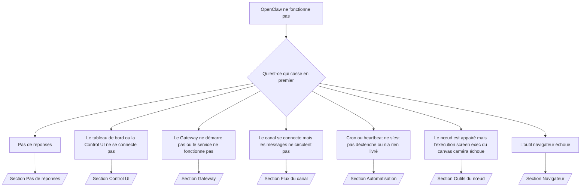

---
read_when:
    - OpenClaw ne fonctionne pas et vous avez besoin du chemin le plus rapide vers une correction
    - Vous voulez un flux de triage avant de vous plonger dans des guides détaillés
summary: Centre de dépannage d’OpenClaw orienté symptômes
title: Dépannage général
x-i18n:
    generated_at: "2026-04-11T02:45:09Z"
    model: gpt-5.4
    provider: openai
    source_hash: 16b38920dbfdc8d4a79bbb5d6fab2c67c9f218a97c36bb4695310d7db9c4614a
    source_path: help/troubleshooting.md
    workflow: 15
---

# Dépannage

Si vous n’avez que 2 minutes, utilisez cette page comme point d’entrée de triage.

## Les 60 premières secondes

Exécutez exactement cette séquence dans l’ordre :

```bash
openclaw status
openclaw status --all
openclaw gateway probe
openclaw gateway status
openclaw doctor
openclaw channels status --probe
openclaw logs --follow
```

Bon résultat en une ligne :

- `openclaw status` → affiche les canaux configurés et aucune erreur d’authentification évidente.
- `openclaw status --all` → le rapport complet est présent et partageable.
- `openclaw gateway probe` → la cible gateway attendue est accessible (`Reachable: yes`). `RPC: limited - missing scope: operator.read` indique des diagnostics dégradés, pas un échec de connexion.
- `openclaw gateway status` → `Runtime: running` et `RPC probe: ok`.
- `openclaw doctor` → aucune erreur bloquante de configuration/service.
- `openclaw channels status --probe` → si le gateway est accessible, renvoie l’état de transport en direct par compte ainsi que les résultats de sonde/audit comme `works` ou `audit ok` ; si le gateway est inaccessible, la commande revient à des résumés basés uniquement sur la configuration.
- `openclaw logs --follow` → activité régulière, aucune erreur fatale répétée.

## 429 Anthropic sur contexte long

Si vous voyez :
`HTTP 429: rate_limit_error: Extra usage is required for long context requests`,
allez à [/gateway/troubleshooting#anthropic-429-extra-usage-required-for-long-context](/fr/gateway/troubleshooting#anthropic-429-extra-usage-required-for-long-context).

## Le backend local compatible OpenAI fonctionne directement mais échoue dans OpenClaw

Si votre backend local ou auto-hébergé `/v1` répond à de petites sondes directes
`/v1/chat/completions` mais échoue sur `openclaw infer model run` ou sur des
tours d’agent normaux :

1. Si l’erreur mentionne `messages[].content` qui attend une chaîne, définissez
   `models.providers.<provider>.models[].compat.requiresStringContent: true`.
2. Si le backend échoue toujours uniquement sur les tours d’agent OpenClaw, définissez
   `models.providers.<provider>.models[].compat.supportsTools: false` et réessayez.
3. Si de minuscules appels directs fonctionnent toujours mais que des prompts OpenClaw plus volumineux font planter le backend, traitez le problème restant comme une limitation amont du modèle/serveur et poursuivez dans le guide détaillé :
   [/gateway/troubleshooting#local-openai-compatible-backend-passes-direct-probes-but-agent-runs-fail](/fr/gateway/troubleshooting#local-openai-compatible-backend-passes-direct-probes-but-agent-runs-fail)

## L’installation du plugin échoue avec des extensions openclaw manquantes

Si l’installation échoue avec `package.json missing openclaw.extensions`, le package du plugin
utilise une ancienne forme qu’OpenClaw n’accepte plus.

Corrigez dans le package du plugin :

1. Ajoutez `openclaw.extensions` à `package.json`.
2. Faites pointer les entrées vers les fichiers runtime compilés (généralement `./dist/index.js`).
3. Republiez le plugin et exécutez de nouveau `openclaw plugins install <package>`.

Exemple :

```json
{
  "name": "@openclaw/my-plugin",
  "version": "1.2.3",
  "openclaw": {
    "extensions": ["./dist/index.js"]
  }
}
```

Référence : [Architecture des plugins](/fr/plugins/architecture)

## Arbre de décision



<AccordionGroup>
  <Accordion title="Pas de réponses">
    ```bash
    openclaw status
    openclaw gateway status
    openclaw channels status --probe
    openclaw pairing list --channel <channel> [--account <id>]
    openclaw logs --follow
    ```

    Un bon résultat ressemble à ceci :

    - `Runtime: running`
    - `RPC probe: ok`
    - Votre canal affiche un transport connecté et, là où c’est pris en charge, `works` ou `audit ok` dans `channels status --probe`
    - L’expéditeur apparaît comme approuvé (ou la politique de DM est ouverte / en allowlist)

    Signatures de logs courantes :

    - `drop guild message (mention required` → le filtrage par mention a bloqué le message dans Discord.
    - `pairing request` → l’expéditeur n’est pas approuvé et attend l’approbation de l’appairage DM.
    - `blocked` / `allowlist` dans les logs du canal → l’expéditeur, le salon ou le groupe est filtré.

    Pages détaillées :

    - [/gateway/troubleshooting#no-replies](/fr/gateway/troubleshooting#no-replies)
    - [/channels/troubleshooting](/fr/channels/troubleshooting)
    - [/channels/pairing](/fr/channels/pairing)

  </Accordion>

  <Accordion title="Le tableau de bord ou la Control UI ne se connecte pas">
    ```bash
    openclaw status
    openclaw gateway status
    openclaw logs --follow
    openclaw doctor
    openclaw channels status --probe
    ```

    Un bon résultat ressemble à ceci :

    - `Dashboard: http://...` est affiché dans `openclaw gateway status`
    - `RPC probe: ok`
    - Aucune boucle d’authentification dans les logs

    Signatures de logs courantes :

    - `device identity required` → le contexte HTTP / non sécurisé ne peut pas terminer l’authentification de l’appareil.
    - `origin not allowed` → l’`Origin` du navigateur n’est pas autorisé pour la cible gateway de la Control UI.
    - `AUTH_TOKEN_MISMATCH` avec des indications de nouvelle tentative (`canRetryWithDeviceToken=true`) → une nouvelle tentative avec un device token approuvé peut avoir lieu automatiquement.
    - Cette nouvelle tentative avec token en cache réutilise l’ensemble de scopes mis en cache, stocké avec le device token appairé. Les appelants `deviceToken` explicites / `scopes` explicites conservent à la place l’ensemble de scopes demandé.
    - Sur le chemin async Tailscale Serve de la Control UI, les tentatives échouées pour le même `{scope, ip}` sont sérialisées avant que le limiteur n’enregistre l’échec, donc une deuxième mauvaise tentative concurrente peut déjà afficher `retry later`.
    - `too many failed authentication attempts (retry later)` depuis une origine de navigateur localhost → les échecs répétés depuis cette même `Origin` sont temporairement bloqués ; une autre origine localhost utilise un compartiment distinct.
    - `unauthorized` répété après cette nouvelle tentative → mauvais token/mot de passe, incompatibilité de mode d’authentification ou device token appairé obsolète.
    - `gateway connect failed:` → l’UI cible la mauvaise URL/le mauvais port ou un gateway inaccessible.

    Pages détaillées :

    - [/gateway/troubleshooting#dashboard-control-ui-connectivity](/fr/gateway/troubleshooting#dashboard-control-ui-connectivity)
    - [/web/control-ui](/web/control-ui)
    - [/gateway/authentication](/fr/gateway/authentication)

  </Accordion>

  <Accordion title="Le Gateway ne démarre pas ou le service est installé mais ne fonctionne pas">
    ```bash
    openclaw status
    openclaw gateway status
    openclaw logs --follow
    openclaw doctor
    openclaw channels status --probe
    ```

    Un bon résultat ressemble à ceci :

    - `Service: ... (loaded)`
    - `Runtime: running`
    - `RPC probe: ok`

    Signatures de logs courantes :

    - `Gateway start blocked: set gateway.mode=local` ou `existing config is missing gateway.mode` → le mode gateway est distant, ou le fichier de configuration n’a pas l’indication de mode local et doit être réparé.
    - `refusing to bind gateway ... without auth` → liaison hors loopback sans chemin d’authentification gateway valide (token/mot de passe, ou trusted-proxy si configuré).
    - `another gateway instance is already listening` ou `EADDRINUSE` → le port est déjà pris.

    Pages détaillées :

    - [/gateway/troubleshooting#gateway-service-not-running](/fr/gateway/troubleshooting#gateway-service-not-running)
    - [/gateway/background-process](/fr/gateway/background-process)
    - [/gateway/configuration](/fr/gateway/configuration)

  </Accordion>

  <Accordion title="Le canal se connecte mais les messages ne circulent pas">
    ```bash
    openclaw status
    openclaw gateway status
    openclaw logs --follow
    openclaw doctor
    openclaw channels status --probe
    ```

    Un bon résultat ressemble à ceci :

    - Le transport du canal est connecté.
    - Les vérifications d’appairage / d’allowlist réussissent.
    - Les mentions sont détectées lorsque nécessaire.

    Signatures de logs courantes :

    - `mention required` → le filtrage par mention dans le groupe a bloqué le traitement.
    - `pairing` / `pending` → l’expéditeur du DM n’est pas encore approuvé.
    - `not_in_channel`, `missing_scope`, `Forbidden`, `401/403` → problème de permissions du canal ou du token.

    Pages détaillées :

    - [/gateway/troubleshooting#channel-connected-messages-not-flowing](/fr/gateway/troubleshooting#channel-connected-messages-not-flowing)
    - [/channels/troubleshooting](/fr/channels/troubleshooting)

  </Accordion>

  <Accordion title="Cron ou heartbeat ne s’est pas déclenché ou n’a rien livré">
    ```bash
    openclaw status
    openclaw gateway status
    openclaw cron status
    openclaw cron list
    openclaw cron runs --id <jobId> --limit 20
    openclaw logs --follow
    ```

    Un bon résultat ressemble à ceci :

    - `cron.status` indique qu’il est activé avec un prochain réveil.
    - `cron runs` montre des entrées récentes `ok`.
    - Heartbeat est activé et n’est pas en dehors des heures actives.

    Signatures de logs courantes :

    - `cron: scheduler disabled; jobs will not run automatically` → cron est désactivé.
    - `heartbeat skipped` avec `reason=quiet-hours` → en dehors des heures actives configurées.
    - `heartbeat skipped` avec `reason=empty-heartbeat-file` → `HEARTBEAT.md` existe mais ne contient qu’une structure vide ou uniquement des en-têtes.
    - `heartbeat skipped` avec `reason=no-tasks-due` → le mode tâche de `HEARTBEAT.md` est actif mais aucun intervalle de tâche n’est encore arrivé à échéance.
    - `heartbeat skipped` avec `reason=alerts-disabled` → toute la visibilité heartbeat est désactivée (`showOk`, `showAlerts` et `useIndicator` sont tous désactivés).
    - `requests-in-flight` → la voie principale est occupée ; le réveil heartbeat a été différé.
    - `unknown accountId` → le compte cible de livraison heartbeat n’existe pas.

    Pages détaillées :

    - [/gateway/troubleshooting#cron-and-heartbeat-delivery](/fr/gateway/troubleshooting#cron-and-heartbeat-delivery)
    - [/automation/cron-jobs#troubleshooting](/fr/automation/cron-jobs#troubleshooting)
    - [/gateway/heartbeat](/fr/gateway/heartbeat)

    </Accordion>

    <Accordion title="Le nœud est appairé mais l’outil échoue sur camera canvas screen exec">
      ```bash
      openclaw status
      openclaw gateway status
      openclaw nodes status
      openclaw nodes describe --node <idOrNameOrIp>
      openclaw logs --follow
      ```

      Un bon résultat ressemble à ceci :

      - Le nœud apparaît comme connecté et appairé pour le rôle `node`.
      - La capacité existe pour la commande que vous invoquez.
      - L’état de permission est accordé pour l’outil.

      Signatures de logs courantes :

      - `NODE_BACKGROUND_UNAVAILABLE` → amenez l’application du nœud au premier plan.
      - `*_PERMISSION_REQUIRED` → la permission du système d’exploitation a été refusée ou est manquante.
      - `SYSTEM_RUN_DENIED: approval required` → l’approbation d’exécution est en attente.
      - `SYSTEM_RUN_DENIED: allowlist miss` → la commande n’est pas dans l’allowlist d’exécution.

      Pages détaillées :

      - [/gateway/troubleshooting#node-paired-tool-fails](/fr/gateway/troubleshooting#node-paired-tool-fails)
      - [/nodes/troubleshooting](/fr/nodes/troubleshooting)
      - [/tools/exec-approvals](/fr/tools/exec-approvals)

    </Accordion>

    <Accordion title="Exec demande soudainement une approbation">
      ```bash
      openclaw config get tools.exec.host
      openclaw config get tools.exec.security
      openclaw config get tools.exec.ask
      openclaw gateway restart
      ```

      Ce qui a changé :

      - Si `tools.exec.host` n’est pas défini, la valeur par défaut est `auto`.
      - `host=auto` se résout en `sandbox` lorsqu’un runtime sandbox est actif, sinon en `gateway`.
      - `host=auto` ne gère que le routage ; le comportement sans invite « YOLO » vient de `security=full` plus `ask=off` sur gateway/node.
      - Sur `gateway` et `node`, si `tools.exec.security` n’est pas défini, la valeur par défaut est `full`.
      - Si `tools.exec.ask` n’est pas défini, la valeur par défaut est `off`.
      - Résultat : si vous voyez des approbations, une politique locale à l’hôte ou propre à la session a renforcé exec par rapport aux valeurs par défaut actuelles.

      Restaurer le comportement actuel par défaut sans approbation :

      ```bash
      openclaw config set tools.exec.host gateway
      openclaw config set tools.exec.security full
      openclaw config set tools.exec.ask off
      openclaw gateway restart
      ```

      Alternatives plus sûres :

      - Définissez uniquement `tools.exec.host=gateway` si vous voulez seulement un routage hôte stable.
      - Utilisez `security=allowlist` avec `ask=on-miss` si vous voulez l’exécution sur l’hôte tout en conservant une revue lors des absences dans l’allowlist.
      - Activez le mode sandbox si vous voulez que `host=auto` se résolve de nouveau vers `sandbox`.

      Signatures de logs courantes :

      - `Approval required.` → la commande attend `/approve ...`.
      - `SYSTEM_RUN_DENIED: approval required` → l’approbation de l’exécution exec sur l’hôte du nœud est en attente.
      - `exec host=sandbox requires a sandbox runtime for this session` → sélection implicite/explicite du sandbox alors que le mode sandbox est désactivé.

      Pages détaillées :

      - [/tools/exec](/fr/tools/exec)
      - [/tools/exec-approvals](/fr/tools/exec-approvals)
      - [/gateway/security#what-the-audit-checks-high-level](/fr/gateway/security#what-the-audit-checks-high-level)

    </Accordion>

    <Accordion title="L’outil navigateur échoue">
      ```bash
      openclaw status
      openclaw gateway status
      openclaw browser status
      openclaw logs --follow
      openclaw doctor
      ```

      Un bon résultat ressemble à ceci :

      - L’état du navigateur affiche `running: true` et un navigateur/profil choisi.
      - `openclaw` démarre, ou `user` peut voir les onglets Chrome locaux.

      Signatures de logs courantes :

      - `unknown command "browser"` ou `unknown command 'browser'` → `plugins.allow` est défini et n’inclut pas `browser`.
      - `Failed to start Chrome CDP on port` → le lancement du navigateur local a échoué.
      - `browser.executablePath not found` → le chemin du binaire configuré est incorrect.
      - `browser.cdpUrl must be http(s) or ws(s)` → l’URL CDP configurée utilise un schéma non pris en charge.
      - `browser.cdpUrl has invalid port` → l’URL CDP configurée a un port incorrect ou hors plage.
      - `No Chrome tabs found for profile="user"` → le profil d’attachement Chrome MCP n’a aucun onglet Chrome local ouvert.
      - `Remote CDP for profile "<name>" is not reachable` → l’endpoint CDP distant configuré n’est pas accessible depuis cet hôte.
      - `Browser attachOnly is enabled ... not reachable` ou `Browser attachOnly is enabled and CDP websocket ... is not reachable` → le profil attach-only n’a pas de cible CDP active.
      - remplacements obsolètes de viewport / mode sombre / langue / hors ligne sur des profils attach-only ou CDP distants → exécutez `openclaw browser stop --browser-profile <name>` pour fermer la session de contrôle active et libérer l’état d’émulation sans redémarrer le gateway.

      Pages détaillées :

      - [/gateway/troubleshooting#browser-tool-fails](/fr/gateway/troubleshooting#browser-tool-fails)
      - [/tools/browser#missing-browser-command-or-tool](/fr/tools/browser#missing-browser-command-or-tool)
      - [/tools/browser-linux-troubleshooting](/fr/tools/browser-linux-troubleshooting)
      - [/tools/browser-wsl2-windows-remote-cdp-troubleshooting](/fr/tools/browser-wsl2-windows-remote-cdp-troubleshooting)

    </Accordion>

  </AccordionGroup>

## Liens associés

- [FAQ](/fr/help/faq) — questions fréquemment posées
- [Dépannage du Gateway](/fr/gateway/troubleshooting) — problèmes spécifiques au gateway
- [Doctor](/fr/gateway/doctor) — vérifications automatiques de l’état et réparations
- [Dépannage des canaux](/fr/channels/troubleshooting) — problèmes de connectivité des canaux
- [Dépannage de l’automatisation](/fr/automation/cron-jobs#troubleshooting) — problèmes de cron et heartbeat
