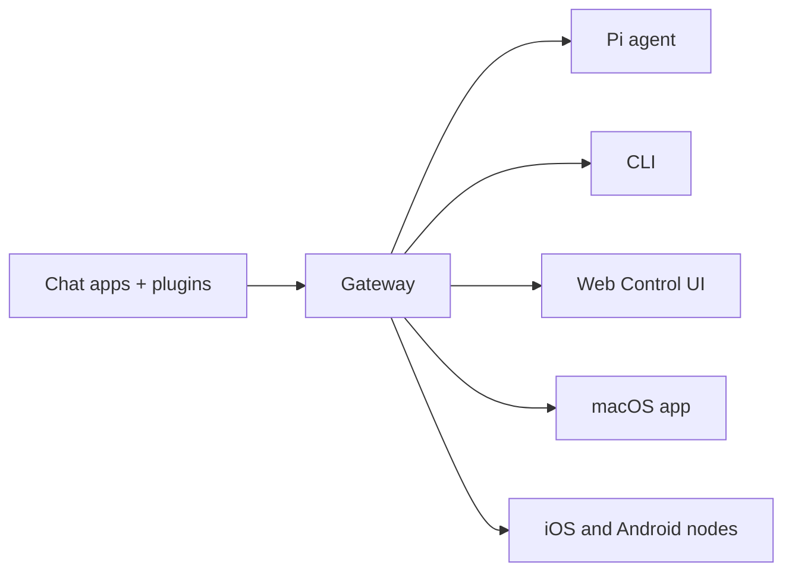

---
read_when:
    - Présenter OpenClaw aux nouveaux utilisateurs
summary: OpenClaw est une passerelle multicanale pour les agents IA qui fonctionne sur n’importe quel OS.
title: OpenClaw
x-i18n:
    generated_at: "2026-04-05T10:51:08Z"
    model: gpt-5.4
    provider: openai
    source_hash: 9c29a8d9fc41a94b650c524bb990106f134345560e6d615dac30e8815afff481
    source_path: index.md
    workflow: 15
---

# OpenClaw 🦞

<p align="center">
    
    
</p>

> _"EXFOLIATE! EXFOLIATE!"_ — Un homard de l’espace, probablement

<p align="center">
  <strong>Passerelle pour agents IA sur n’importe quel OS, pour Discord, Google Chat, iMessage, Matrix, Microsoft Teams, Signal, Slack, Telegram, WhatsApp, Zalo, et plus encore.</strong><br />
  Envoyez un message, obtenez la réponse d’un agent depuis votre poche. Exécutez une seule Gateway sur les canaux intégrés, les plugins de canal groupés, WebChat et les nœuds mobiles.
</p>

<Columns>
  <Card title="Commencer" href="/start/getting-started" icon="rocket">
    Installez OpenClaw et démarrez la Gateway en quelques minutes.
  </Card>
  <Card title="Lancer l’onboarding" href="/start/wizard" icon="sparkles">
    Configuration guidée avec `openclaw onboard` et les flux d’appairage.
  </Card>
  <Card title="Ouvrir l’interface de contrôle" href="/web/control-ui" icon="layout-dashboard">
    Lancez le tableau de bord dans le navigateur pour le chat, la configuration et les sessions.
  </Card>
</Columns>

## Qu’est-ce qu’OpenClaw ?

OpenClaw est une **passerelle auto-hébergée** qui connecte vos applications de chat et surfaces de canal préférées — canaux intégrés, plus plugins de canal groupés ou externes comme Discord, Google Chat, iMessage, Matrix, Microsoft Teams, Signal, Slack, Telegram, WhatsApp, Zalo, et plus encore — à des agents IA de codage comme Pi. Vous exécutez un unique processus Gateway sur votre propre machine (ou sur un serveur), et il devient le pont entre vos applications de messagerie et un assistant IA toujours disponible.

**À qui s’adresse-t-il ?** Aux développeurs et utilisateurs avancés qui veulent un assistant IA personnel auquel ils peuvent envoyer des messages depuis n’importe où — sans renoncer au contrôle de leurs données ni dépendre d’un service hébergé.

**Qu’est-ce qui le distingue ?**

- **Auto-hébergé** : fonctionne sur votre matériel, selon vos règles
- **Multicanal** : une seule Gateway sert simultanément les canaux intégrés ainsi que les plugins de canal groupés ou externes
- **Natif pour les agents** : conçu pour les agents de codage avec usage d’outils, sessions, mémoire et routage multi-agent
- **Open source** : sous licence MIT, porté par la communauté

**De quoi avez-vous besoin ?** Node 24 (recommandé), ou Node 22 LTS (`22.14+`) pour la compatibilité, une clé API de votre fournisseur choisi et 5 minutes. Pour une qualité et une sécurité optimales, utilisez le modèle de dernière génération le plus performant disponible.

## Comment ça fonctionne



La Gateway est la source de vérité unique pour les sessions, le routage et les connexions aux canaux.

## Capacités clés

<Columns>
  <Card title="Passerelle multicanale" icon="network">
    Discord, iMessage, Signal, Slack, Telegram, WhatsApp, WebChat, et plus encore avec un seul processus Gateway.
  </Card>
  <Card title="Canaux de plugin" icon="plug">
    Les plugins groupés ajoutent Matrix, Nostr, Twitch, Zalo, et plus encore dans les versions courantes normales.
  </Card>
  <Card title="Routage multi-agent" icon="route">
    Sessions isolées par agent, espace de travail ou expéditeur.
  </Card>
  <Card title="Prise en charge des médias" icon="image">
    Envoyez et recevez des images, de l’audio et des documents.
  </Card>
  <Card title="Web Control UI" icon="monitor">
    Tableau de bord dans le navigateur pour le chat, la configuration, les sessions et les nœuds.
  </Card>
  <Card title="Nœuds mobiles" icon="smartphone">
    Appairez des nœuds iOS et Android pour des workflows avec Canvas, caméra et voix.
  </Card>
</Columns>

## Démarrage rapide

<Steps>
  <Step title="Installer OpenClaw">
    ```bash
    npm install -g openclaw@latest
    ```
  </Step>
  <Step title="Effectuer l’onboarding et installer le service">
    ```bash
    openclaw onboard --install-daemon
    ```
  </Step>
  <Step title="Discuter">
    Ouvrez l’interface de contrôle dans votre navigateur et envoyez un message :

    ```bash
    openclaw dashboard
    ```

    Ou connectez un canal ([Telegram](/channels/telegram) est le plus rapide) et discutez depuis votre téléphone.

  </Step>
</Steps>

Vous avez besoin de l’installation complète et de l’environnement de développement ? Consultez [Getting Started](/start/getting-started).

## Tableau de bord

Ouvrez la Web Control UI dans le navigateur après le démarrage de la Gateway.

- Par défaut en local : [http://127.0.0.1:18789/](http://127.0.0.1:18789/)
- Accès à distance : [Surfaces Web](/web) et [Tailscale](/gateway/tailscale)

<p align="center">
  
</p>

## Configuration (facultatif)

La configuration se trouve dans `~/.openclaw/openclaw.json`.

- Si vous **ne faites rien**, OpenClaw utilise le binaire Pi groupé en mode RPC avec des sessions par expéditeur.
- Si vous voulez le verrouiller, commencez par `channels.whatsapp.allowFrom` et les règles de mention (pour les groupes).

Exemple :

```json5
{
  channels: {
    whatsapp: {
      allowFrom: ["+15555550123"],
      groups: { "*": { requireMention: true } },
    },
  },
  messages: { groupChat: { mentionPatterns: ["@openclaw"] } },
}
```

## Commencez ici

<Columns>
  <Card title="Centres de documentation" href="/start/hubs" icon="book-open">
    Toute la documentation et les guides, organisés par cas d’usage.
  </Card>
  <Card title="Configuration" href="/gateway/configuration" icon="settings">
    Paramètres principaux de la Gateway, jetons et configuration du fournisseur.
  </Card>
  <Card title="Accès à distance" href="/gateway/remote" icon="globe">
    Modèles d’accès SSH et tailnet.
  </Card>
  <Card title="Canaux" href="/channels/telegram" icon="message-square">
    Configuration spécifique aux canaux pour Feishu, Microsoft Teams, WhatsApp, Telegram, Discord, et plus encore.
  </Card>
  <Card title="Nœuds" href="/nodes" icon="smartphone">
    Nœuds iOS et Android avec appairage, Canvas, caméra et actions sur l’appareil.
  </Card>
  <Card title="Aide" href="/help" icon="life-buoy">
    Correctifs courants et point d’entrée pour le dépannage.
  </Card>
</Columns>

## En savoir plus

<Columns>
  <Card title="Liste complète des fonctionnalités" href="/concepts/features" icon="list">
    Capacités complètes en matière de canaux, de routage et de médias.
  </Card>
  <Card title="Routage multi-agent" href="/concepts/multi-agent" icon="route">
    Isolation des espaces de travail et sessions par agent.
  </Card>
  <Card title="Sécurité" href="/gateway/security" icon="shield">
    Jetons, listes d’autorisation et contrôles de sécurité.
  </Card>
  <Card title="Dépannage" href="/gateway/troubleshooting" icon="wrench">
    Diagnostics de la Gateway et erreurs courantes.
  </Card>
  <Card title="À propos et crédits" href="/reference/credits" icon="info">
    Origines du projet, contributeurs et licence.
  </Card>
</Columns>
