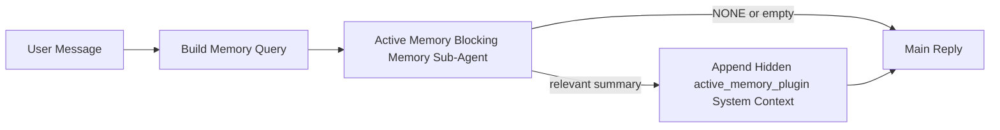

---
read_when:
    - Anda ingin memahami untuk apa Active Memory digunakan
    - Anda ingin mengaktifkan Active Memory untuk agen percakapan
    - Anda ingin menyesuaikan perilaku Active Memory tanpa mengaktifkannya di mana-mana
summary: Sub-agen memori pemblokiran milik plugin yang menyuntikkan memori yang relevan ke dalam sesi obrolan interaktif
title: Active Memory
x-i18n:
    generated_at: "2026-04-12T23:28:11Z"
    model: gpt-5.4
    provider: openai
    source_hash: 11665dbc888b6d4dc667a47624cc1f2e4cc71e1d58e1f7d9b5fe4057ec4da108
    source_path: concepts/active-memory.md
    workflow: 15
---

# Active Memory

Active Memory adalah sub-agen memori pemblokiran opsional milik plugin yang berjalan
sebelum balasan utama untuk sesi percakapan yang memenuhi syarat.

Ini ada karena sebagian besar sistem memori mampu tetapi reaktif. Mereka bergantung pada
agen utama untuk memutuskan kapan harus mencari memori, atau pada pengguna untuk mengatakan hal-hal
seperti "ingat ini" atau "cari memori". Pada saat itu, momen ketika memori akan
membuat balasan terasa alami sudah lewat.

Active Memory memberi sistem satu kesempatan yang dibatasi untuk menampilkan memori yang relevan
sebelum balasan utama dibuat.

## Tempelkan Ini Ke Agen Anda

Tempelkan ini ke agen Anda jika Anda ingin mengaktifkan Active Memory dengan
pengaturan default-aman yang mandiri:

```json5
{
  plugins: {
    entries: {
      "active-memory": {
        enabled: true,
        config: {
          enabled: true,
          agents: ["main"],
          allowedChatTypes: ["direct"],
          modelFallback: "google/gemini-3-flash",
          queryMode: "recent",
          promptStyle: "balanced",
          timeoutMs: 15000,
          maxSummaryChars: 220,
          persistTranscripts: false,
          logging: true,
        },
      },
    },
  },
}
```

Ini menyalakan plugin untuk agen `main`, membuatnya tetap terbatas pada sesi
bergaya pesan langsung secara default, membiarkannya mewarisi model sesi saat ini terlebih dahulu, dan
menggunakan model fallback yang dikonfigurasi hanya jika tidak ada model eksplisit atau turunan yang tersedia.

Setelah itu, mulai ulang Gateway:

```bash
openclaw gateway
```

Untuk memeriksanya secara langsung dalam percakapan:

```text
/verbose on
/trace on
```

## Aktifkan active memory

Pengaturan yang paling aman adalah:

1. aktifkan plugin
2. targetkan satu agen percakapan
3. biarkan logging tetap aktif hanya saat penyesuaian

Mulailah dengan ini di `openclaw.json`:

```json5
{
  plugins: {
    entries: {
      "active-memory": {
        enabled: true,
        config: {
          agents: ["main"],
          allowedChatTypes: ["direct"],
          modelFallback: "google/gemini-3-flash",
          queryMode: "recent",
          promptStyle: "balanced",
          timeoutMs: 15000,
          maxSummaryChars: 220,
          persistTranscripts: false,
          logging: true,
        },
      },
    },
  },
}
```

Lalu mulai ulang Gateway:

```bash
openclaw gateway
```

Arti konfigurasi ini:

- `plugins.entries.active-memory.enabled: true` menyalakan plugin
- `config.agents: ["main"]` hanya mengikutsertakan agen `main` ke dalam active memory
- `config.allowedChatTypes: ["direct"]` membuat active memory tetap aktif hanya untuk sesi bergaya pesan langsung secara default
- jika `config.model` tidak disetel, active memory mewarisi model sesi saat ini terlebih dahulu
- `config.modelFallback` secara opsional menyediakan provider/model fallback Anda sendiri untuk recall
- `config.promptStyle: "balanced"` menggunakan gaya prompt default serbaguna untuk mode `recent`
- active memory tetap hanya berjalan pada sesi obrolan persisten interaktif yang memenuhi syarat

## Cara melihatnya

Active memory menyuntikkan konteks sistem tersembunyi untuk model. Fitur ini tidak mengekspos
tag mentah `<active_memory_plugin>...</active_memory_plugin>` ke klien.

## Toggle sesi

Gunakan perintah plugin ketika Anda ingin menjeda atau melanjutkan active memory untuk
sesi obrolan saat ini tanpa mengedit konfigurasi:

```text
/active-memory status
/active-memory off
/active-memory on
```

Ini berlaku pada lingkup sesi. Ini tidak mengubah
`plugins.entries.active-memory.enabled`, penargetan agen, atau konfigurasi
global lainnya.

Jika Anda ingin perintah menulis konfigurasi dan menjeda atau melanjutkan active memory untuk
semua sesi, gunakan bentuk global yang eksplisit:

```text
/active-memory status --global
/active-memory off --global
/active-memory on --global
```

Bentuk global menulis `plugins.entries.active-memory.config.enabled`. Ini membiarkan
`plugins.entries.active-memory.enabled` tetap aktif agar perintah tetap tersedia untuk
mengaktifkan kembali active memory nanti.

Jika Anda ingin melihat apa yang dilakukan active memory dalam sesi langsung, aktifkan
toggle sesi yang sesuai dengan output yang Anda inginkan:

```text
/verbose on
/trace on
```

Dengan itu diaktifkan, OpenClaw dapat menampilkan:

- baris status active memory seperti `Active Memory: ok 842ms recent 34 chars` saat `/verbose on`
- ringkasan debug yang dapat dibaca seperti `Active Memory Debug: Lemon pepper wings with blue cheese.` saat `/trace on`

Baris-baris tersebut diturunkan dari pass active memory yang sama yang memberi makan konteks
sistem tersembunyi, tetapi diformat untuk manusia alih-alih mengekspos markup prompt
mentah. Baris-baris itu dikirim sebagai pesan diagnostik tindak lanjut setelah balasan
asisten normal sehingga klien channel seperti Telegram tidak menampilkan gelembung diagnostik
terpisah sebelum balasan.

Secara default, transkrip sub-agen memori pemblokiran bersifat sementara dan dihapus
setelah proses selesai.

Contoh alur:

```text
/verbose on
/trace on
what wings should i order?
```

Bentuk balasan yang terlihat yang diharapkan:

```text
...normal assistant reply...

🧩 Active Memory: ok 842ms recent 34 chars
🔎 Active Memory Debug: Lemon pepper wings with blue cheese.
```

## Kapan ini berjalan

Active memory menggunakan dua gerbang:

1. **Opt-in konfigurasi**
   Plugin harus diaktifkan, dan id agen saat ini harus muncul di
   `plugins.entries.active-memory.config.agents`.
2. **Kelayakan runtime yang ketat**
   Bahkan ketika diaktifkan dan ditargetkan, active memory hanya berjalan untuk sesi obrolan persisten interaktif yang memenuhi syarat.

Aturan sebenarnya adalah:

```text
plugin enabled
+
agent id targeted
+
allowed chat type
+
eligible interactive persistent chat session
=
active memory runs
```

Jika salah satu dari itu gagal, active memory tidak berjalan.

## Jenis sesi

`config.allowedChatTypes` mengontrol jenis percakapan mana yang boleh menjalankan Active
Memory sama sekali.

Default-nya adalah:

```json5
allowedChatTypes: ["direct"]
```

Artinya Active Memory berjalan secara default dalam sesi bergaya pesan langsung, tetapi
tidak dalam sesi grup atau channel kecuali Anda secara eksplisit mengikutsertakannya.

Contoh:

```json5
allowedChatTypes: ["direct"]
```

```json5
allowedChatTypes: ["direct", "group"]
```

```json5
allowedChatTypes: ["direct", "group", "channel"]
```

## Di mana ini berjalan

Active memory adalah fitur pengayaan percakapan, bukan fitur inferensi
seluruh platform.

| Surface                                                             | Menjalankan active memory?                              |
| ------------------------------------------------------------------- | ------------------------------------------------------- |
| Sesi persisten Control UI / obrolan web                             | Ya, jika plugin diaktifkan dan agen ditargetkan         |
| Sesi channel interaktif lain pada jalur obrolan persisten yang sama | Ya, jika plugin diaktifkan dan agen ditargetkan         |
| Eksekusi headless one-shot                                           | Tidak                                                   |
| Eksekusi Heartbeat/latar belakang                                   | Tidak                                                   |
| Jalur internal `agent-command` generik                              | Tidak                                                   |
| Eksekusi sub-agen/helper internal                                   | Tidak                                                   |

## Mengapa menggunakannya

Gunakan active memory ketika:

- sesi bersifat persisten dan berhadapan dengan pengguna
- agen memiliki memori jangka panjang yang bermakna untuk dicari
- kontinuitas dan personalisasi lebih penting daripada determinisme prompt mentah

Ini bekerja sangat baik untuk:

- preferensi yang stabil
- kebiasaan yang berulang
- konteks pengguna jangka panjang yang seharusnya muncul secara alami

Ini kurang cocok untuk:

- otomatisasi
- worker internal
- tugas API one-shot
- tempat di mana personalisasi tersembunyi akan terasa mengejutkan

## Cara kerjanya

Bentuk runtime-nya adalah:



Sub-agen memori pemblokiran hanya dapat menggunakan:

- `memory_search`
- `memory_get`

Jika koneksinya lemah, ia harus mengembalikan `NONE`.

## Mode kueri

`config.queryMode` mengontrol seberapa banyak percakapan yang dilihat oleh sub-agen memori pemblokiran.

## Gaya prompt

`config.promptStyle` mengontrol seberapa agresif atau ketat sub-agen memori pemblokiran
saat memutuskan apakah akan mengembalikan memori.

Gaya yang tersedia:

- `balanced`: default serbaguna untuk mode `recent`
- `strict`: paling tidak agresif; terbaik saat Anda ingin sangat sedikit kebocoran dari konteks terdekat
- `contextual`: paling ramah kontinuitas; terbaik saat riwayat percakapan harus lebih penting
- `recall-heavy`: lebih bersedia menampilkan memori pada kecocokan yang lebih lemah tetapi masih masuk akal
- `precision-heavy`: sangat memilih `NONE` kecuali kecocokannya jelas
- `preference-only`: dioptimalkan untuk favorit, kebiasaan, rutinitas, selera, dan fakta pribadi yang berulang

Pemetaan default saat `config.promptStyle` tidak disetel:

```text
message -> strict
recent -> balanced
full -> contextual
```

Jika Anda menyetel `config.promptStyle` secara eksplisit, override tersebut yang berlaku.

Contoh:

```json5
promptStyle: "preference-only"
```

## Kebijakan fallback model

Jika `config.model` tidak disetel, Active Memory mencoba me-resolve model dengan urutan ini:

```text
explicit plugin model
-> current session model
-> agent primary model
-> optional configured fallback model
```

`config.modelFallback` mengontrol langkah fallback terkonfigurasi tersebut.

Fallback kustom opsional:

```json5
modelFallback: "google/gemini-3-flash"
```

Jika tidak ada model eksplisit, turunan, atau fallback terkonfigurasi yang berhasil di-resolve, Active Memory
melewati recall untuk giliran tersebut.

`config.modelFallbackPolicy` dipertahankan hanya sebagai field kompatibilitas usang
untuk konfigurasi lama. Ini tidak lagi mengubah perilaku runtime.

## Opsi lanjutan

Opsi-opsi ini sengaja tidak menjadi bagian dari pengaturan yang direkomendasikan.

`config.thinking` dapat menimpa tingkat thinking sub-agen memori pemblokiran:

```json5
thinking: "medium"
```

Default:

```json5
thinking: "off"
```

Jangan aktifkan ini secara default. Active Memory berjalan di jalur balasan, jadi waktu
thinking tambahan langsung meningkatkan latensi yang terlihat oleh pengguna.

`config.promptAppend` menambahkan instruksi operator tambahan setelah prompt default Active
Memory dan sebelum konteks percakapan:

```json5
promptAppend: "Prefer stable long-term preferences over one-off events."
```

`config.promptOverride` menggantikan prompt default Active Memory. OpenClaw
tetap menambahkan konteks percakapan setelahnya:

```json5
promptOverride: "You are a memory search agent. Return NONE or one compact user fact."
```

Kustomisasi prompt tidak direkomendasikan kecuali Anda memang sedang menguji
kontrak recall yang berbeda. Prompt default disetel untuk mengembalikan `NONE`
atau konteks fakta pengguna yang ringkas untuk model utama.

### `message`

Hanya pesan pengguna terbaru yang dikirim.

```text
Latest user message only
```

Gunakan ini ketika:

- Anda menginginkan perilaku tercepat
- Anda menginginkan bias terkuat terhadap recall preferensi yang stabil
- giliran tindak lanjut tidak memerlukan konteks percakapan

Timeout yang direkomendasikan:

- mulai sekitar `3000` hingga `5000` ms

### `recent`

Pesan pengguna terbaru ditambah sedikit ekor percakapan terbaru dikirim.

```text
Recent conversation tail:
user: ...
assistant: ...
user: ...

Latest user message:
...
```

Gunakan ini ketika:

- Anda menginginkan keseimbangan yang lebih baik antara kecepatan dan landasan percakapan
- pertanyaan tindak lanjut sering bergantung pada beberapa giliran terakhir

Timeout yang direkomendasikan:

- mulai sekitar `15000` ms

### `full`

Percakapan lengkap dikirim ke sub-agen memori pemblokiran.

```text
Full conversation context:
user: ...
assistant: ...
user: ...
...
```

Gunakan ini ketika:

- kualitas recall terkuat lebih penting daripada latensi
- percakapan berisi pengaturan penting jauh di belakang dalam thread

Timeout yang direkomendasikan:

- tingkatkan secara signifikan dibandingkan dengan `message` atau `recent`
- mulai sekitar `15000` ms atau lebih tinggi tergantung ukuran thread

Secara umum, timeout harus meningkat seiring ukuran konteks:

```text
message < recent < full
```

## Persistensi transkrip

Eksekusi sub-agen memori pemblokiran active memory membuat transkrip `session.jsonl`
nyata selama pemanggilan sub-agen memori pemblokiran.

Secara default, transkrip itu bersifat sementara:

- ditulis ke direktori temp
- hanya digunakan untuk eksekusi sub-agen memori pemblokiran
- dihapus segera setelah eksekusi selesai

Jika Anda ingin menyimpan transkrip sub-agen memori pemblokiran tersebut di disk untuk debugging atau
inspeksi, aktifkan persistensi secara eksplisit:

```json5
{
  plugins: {
    entries: {
      "active-memory": {
        enabled: true,
        config: {
          agents: ["main"],
          persistTranscripts: true,
          transcriptDir: "active-memory",
        },
      },
    },
  },
}
```

Saat diaktifkan, active memory menyimpan transkrip dalam direktori terpisah di bawah
folder sesi agen target, bukan di jalur transkrip percakapan pengguna utama.

Layout default secara konseptual adalah:

```text
agents/<agent>/sessions/active-memory/<blocking-memory-sub-agent-session-id>.jsonl
```

Anda dapat mengubah subdirektori relatif dengan `config.transcriptDir`.

Gunakan ini dengan hati-hati:

- transkrip sub-agen memori pemblokiran dapat menumpuk dengan cepat pada sesi yang sibuk
- mode kueri `full` dapat menduplikasi banyak konteks percakapan
- transkrip ini berisi konteks prompt tersembunyi dan memori yang dipanggil kembali

## Konfigurasi

Semua konfigurasi active memory berada di bawah:

```text
plugins.entries.active-memory
```

Field yang paling penting adalah:

| Key                         | Type                                                                                                 | Arti                                                                                                   |
| --------------------------- | ---------------------------------------------------------------------------------------------------- | ------------------------------------------------------------------------------------------------------ |
| `enabled`                   | `boolean`                                                                                            | Mengaktifkan plugin itu sendiri                                                                        |
| `config.agents`             | `string[]`                                                                                           | ID agen yang dapat menggunakan active memory                                                           |
| `config.model`              | `string`                                                                                             | Ref model sub-agen memori pemblokiran opsional; saat tidak disetel, active memory menggunakan model sesi saat ini |
| `config.queryMode`          | `"message" \| "recent" \| "full"`                                                                    | Mengontrol seberapa banyak percakapan yang dilihat sub-agen memori pemblokiran                        |
| `config.promptStyle`        | `"balanced" \| "strict" \| "contextual" \| "recall-heavy" \| "precision-heavy" \| "preference-only"` | Mengontrol seberapa agresif atau ketat sub-agen memori pemblokiran saat memutuskan apakah akan mengembalikan memori |
| `config.thinking`           | `"off" \| "minimal" \| "low" \| "medium" \| "high" \| "xhigh" \| "adaptive"`                         | Override thinking lanjutan untuk sub-agen memori pemblokiran; default `off` untuk kecepatan           |
| `config.promptOverride`     | `string`                                                                                             | Penggantian prompt penuh lanjutan; tidak direkomendasikan untuk penggunaan normal                      |
| `config.promptAppend`       | `string`                                                                                             | Instruksi tambahan lanjutan yang ditambahkan ke prompt default atau yang dioverride                    |
| `config.timeoutMs`          | `number`                                                                                             | Timeout keras untuk sub-agen memori pemblokiran                                                       |
| `config.maxSummaryChars`    | `number`                                                                                             | Total karakter maksimum yang diizinkan dalam ringkasan active-memory                                   |
| `config.logging`            | `boolean`                                                                                            | Mengeluarkan log active memory selama penyesuaian                                                      |
| `config.persistTranscripts` | `boolean`                                                                                            | Menyimpan transkrip sub-agen memori pemblokiran di disk alih-alih menghapus file temp                 |
| `config.transcriptDir`      | `string`                                                                                             | Direktori transkrip sub-agen memori pemblokiran relatif di bawah folder sesi agen                     |

Field penyesuaian yang berguna:

| Key                           | Type     | Arti                                                         |
| ----------------------------- | -------- | ------------------------------------------------------------ |
| `config.maxSummaryChars`      | `number` | Total karakter maksimum yang diizinkan dalam ringkasan active-memory |
| `config.recentUserTurns`      | `number` | Giliran pengguna sebelumnya yang disertakan saat `queryMode` adalah `recent` |
| `config.recentAssistantTurns` | `number` | Giliran asisten sebelumnya yang disertakan saat `queryMode` adalah `recent` |
| `config.recentUserChars`      | `number` | Karakter maksimum per giliran pengguna terbaru               |
| `config.recentAssistantChars` | `number` | Karakter maksimum per giliran asisten terbaru                |
| `config.cacheTtlMs`           | `number` | Reuse cache untuk kueri identik yang berulang                |

## Pengaturan yang direkomendasikan

Mulailah dengan `recent`.

```json5
{
  plugins: {
    entries: {
      "active-memory": {
        enabled: true,
        config: {
          agents: ["main"],
          queryMode: "recent",
          promptStyle: "balanced",
          timeoutMs: 15000,
          maxSummaryChars: 220,
          logging: true,
        },
      },
    },
  },
}
```

Jika Anda ingin memeriksa perilaku langsung saat melakukan penyesuaian, gunakan `/verbose on` untuk
baris status normal dan `/trace on` untuk ringkasan debug active-memory alih-alih
mencari perintah debug active-memory terpisah. Di channel obrolan, baris diagnostik tersebut
dikirim setelah balasan asisten utama, bukan sebelumnya.

Lalu beralih ke:

- `message` jika Anda menginginkan latensi lebih rendah
- `full` jika Anda memutuskan konteks tambahan sepadan dengan sub-agen memori pemblokiran yang lebih lambat

## Debugging

Jika active memory tidak muncul di tempat yang Anda harapkan:

1. Pastikan plugin diaktifkan di `plugins.entries.active-memory.enabled`.
2. Pastikan ID agen saat ini tercantum di `config.agents`.
3. Pastikan Anda menguji melalui sesi obrolan persisten interaktif.
4. Aktifkan `config.logging: true` dan pantau log Gateway.
5. Verifikasi pencarian memori itu sendiri berfungsi dengan `openclaw memory status --deep`.

Jika hasil memori terlalu berisik, perketat:

- `maxSummaryChars`

Jika active memory terlalu lambat:

- turunkan `queryMode`
- turunkan `timeoutMs`
- kurangi jumlah giliran terbaru
- kurangi batas karakter per giliran

## Masalah umum

### Provider embedding berubah secara tak terduga

Active Memory menggunakan pipeline `memory_search` normal di bawah
`agents.defaults.memorySearch`. Itu berarti pengaturan embedding-provider hanya merupakan
persyaratan ketika pengaturan `memorySearch` Anda memerlukan embedding untuk perilaku
yang Anda inginkan.

Dalam praktiknya:

- pengaturan provider eksplisit **diperlukan** jika Anda menginginkan provider yang tidak
  terdeteksi otomatis, seperti `ollama`
- pengaturan provider eksplisit **diperlukan** jika deteksi otomatis tidak me-resolve
  provider embedding yang dapat digunakan untuk lingkungan Anda
- pengaturan provider eksplisit **sangat direkomendasikan** jika Anda menginginkan pemilihan provider
  yang deterministik alih-alih "yang pertama tersedia menang"
- pengaturan provider eksplisit biasanya **tidak diperlukan** jika deteksi otomatis sudah
  me-resolve provider yang Anda inginkan dan provider tersebut stabil dalam deployment Anda

Jika `memorySearch.provider` tidak disetel, OpenClaw mendeteksi otomatis provider
embedding pertama yang tersedia.

Ini bisa membingungkan dalam deployment nyata:

- API key yang baru tersedia dapat mengubah provider mana yang digunakan pencarian memori
- satu perintah atau surface diagnostik dapat membuat provider yang dipilih terlihat
  berbeda dari jalur yang sebenarnya Anda gunakan selama sinkronisasi memori langsung atau
  bootstrap pencarian
- provider hosted dapat gagal dengan error kuota atau rate limit yang baru muncul
  setelah Active Memory mulai mengeluarkan pencarian recall sebelum setiap balasan

Active Memory tetap dapat berjalan tanpa embedding ketika `memory_search` dapat beroperasi
dalam mode lexical-only terdegradasi, yang biasanya terjadi ketika tidak ada
provider embedding yang dapat di-resolve.

Jangan berasumsi fallback yang sama berlaku pada kegagalan runtime provider seperti kuota
habis, rate limit, error jaringan/provider, atau model lokal/remote yang hilang setelah
provider sudah dipilih.

Dalam praktiknya:

- jika tidak ada provider embedding yang dapat di-resolve, `memory_search` dapat terdegradasi ke
  retrieval lexical-only
- jika provider embedding berhasil di-resolve lalu gagal saat runtime, OpenClaw
  saat ini tidak menjamin fallback leksikal untuk permintaan itu
- jika Anda memerlukan pemilihan provider yang deterministik, pin
  `agents.defaults.memorySearch.provider`
- jika Anda memerlukan failover provider saat error runtime, konfigurasikan
  `agents.defaults.memorySearch.fallback` secara eksplisit

Jika Anda bergantung pada recall berbasis embedding, pengindeksan multimodal, atau provider
lokal/remote tertentu, pin provider secara eksplisit alih-alih mengandalkan
deteksi otomatis.

Contoh pinning umum:

OpenAI:

```json5
{
  agents: {
    defaults: {
      memorySearch: {
        provider: "openai",
        model: "text-embedding-3-small",
      },
    },
  },
}
```

Gemini:

```json5
{
  agents: {
    defaults: {
      memorySearch: {
        provider: "gemini",
        model: "gemini-embedding-001",
      },
    },
  },
}
```

Ollama:

```json5
{
  agents: {
    defaults: {
      memorySearch: {
        provider: "ollama",
        model: "nomic-embed-text",
      },
    },
  },
}
```

Jika Anda mengharapkan failover provider pada error runtime seperti kuota habis,
pinning provider saja tidak cukup. Konfigurasikan fallback eksplisit juga:

```json5
{
  agents: {
    defaults: {
      memorySearch: {
        provider: "openai",
        fallback: "gemini",
      },
    },
  },
}
```

### Debugging masalah provider

Jika Active Memory lambat, kosong, atau tampak berganti provider secara tak terduga:

- pantau log Gateway saat mereproduksi masalah; cari baris seperti
  `active-memory: ... start|done`, `memory sync failed (search-bootstrap)`, atau
  error embedding spesifik provider
- aktifkan `/trace on` untuk menampilkan ringkasan debug Active Memory milik plugin di
  sesi
- aktifkan `/verbose on` jika Anda juga menginginkan baris status normal `🧩 Active Memory: ...`
  setelah setiap balasan
- jalankan `openclaw memory status --deep` untuk memeriksa backend pencarian memori saat ini
  dan kesehatan indeks
- periksa `agents.defaults.memorySearch.provider` serta auth/config terkait untuk memastikan
  provider yang Anda harapkan benar-benar yang dapat di-resolve saat runtime
- jika Anda menggunakan `ollama`, verifikasi model embedding yang dikonfigurasi telah terinstal, misalnya `ollama list`

Contoh loop debugging:

```text
1. Mulai Gateway dan pantau log-nya
2. Dalam sesi obrolan, jalankan /trace on
3. Kirim satu pesan yang seharusnya memicu Active Memory
4. Bandingkan baris debug yang terlihat di obrolan dengan baris log Gateway
5. Jika pilihan provider ambigu, pin agents.defaults.memorySearch.provider secara eksplisit
```

Contoh:

```json5
{
  agents: {
    defaults: {
      memorySearch: {
        provider: "ollama",
        model: "nomic-embed-text",
      },
    },
  },
}
```

Atau, jika Anda menginginkan embedding Gemini:

```json5
{
  agents: {
    defaults: {
      memorySearch: {
        provider: "gemini",
      },
    },
  },
}
```

Setelah mengubah provider, mulai ulang Gateway dan jalankan pengujian baru dengan
`/trace on` agar baris debug Active Memory mencerminkan jalur embedding yang baru.

## Halaman terkait

- [Memory Search](/id/concepts/memory-search)
- [Referensi konfigurasi memori](/id/reference/memory-config)
- [Penyiapan Plugin SDK](/id/plugins/sdk-setup)
