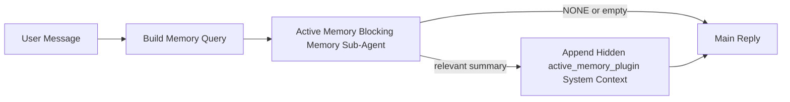

---
read_when:
    - Anda ingin memahami untuk apa memori aktif digunakan
    - Anda ingin mengaktifkan memori aktif untuk agen percakapan
    - Anda ingin menyesuaikan perilaku memori aktif tanpa mengaktifkannya di mana-mana
summary: Sub-agen memori pemblokiran milik plugin yang menyuntikkan memori yang relevan ke dalam sesi chat interaktif
title: Memori Aktif
x-i18n:
    generated_at: "2026-04-11T09:03:47Z"
    model: gpt-5.4
    provider: openai
    source_hash: e8b0e6539e09678e9e8def68795f8bcb992f98509423da3da3123eda88ec1dd5
    source_path: concepts/active-memory.md
    workflow: 15
---

# Memori Aktif

Memori aktif adalah sub-agen memori pemblokiran opsional milik plugin yang berjalan
sebelum balasan utama untuk sesi percakapan yang memenuhi syarat.

Ini ada karena sebagian besar sistem memori mampu tetapi reaktif. Mereka bergantung pada
agen utama untuk memutuskan kapan harus mencari memori, atau pada pengguna untuk mengatakan hal-hal
seperti "ingat ini" atau "cari memori". Pada saat itu, momen ketika memori seharusnya
membuat balasan terasa alami sudah terlewat.

Memori aktif memberi sistem satu kesempatan terbatas untuk memunculkan memori yang relevan
sebelum balasan utama dihasilkan.

## Tempelkan Ini ke Agen Anda

Tempelkan ini ke agen Anda jika Anda ingin mengaktifkan Memori Aktif dengan
pengaturan mandiri dan default aman:

```json5
{
  plugins: {
    entries: {
      "active-memory": {
        enabled: true,
        config: {
          enabled: true,
          agents: ["main"],
          allowedChatTypes: ["direct"],
          modelFallbackPolicy: "default-remote",
          queryMode: "recent",
          promptStyle: "balanced",
          timeoutMs: 15000,
          maxSummaryChars: 220,
          persistTranscripts: false,
          logging: true,
        },
      },
    },
  },
}
```

Ini menyalakan plugin untuk agen `main`, membuatnya tetap terbatas pada sesi
bergaya pesan langsung secara default, memungkinkannya mewarisi model sesi saat ini terlebih dahulu, dan
tetap mengizinkan fallback jarak jauh bawaan jika tidak ada model eksplisit atau
model turunan yang tersedia.

Setelah itu, mulai ulang gateway:

```bash
openclaw gateway
```

Untuk memeriksanya secara langsung dalam percakapan:

```text
/verbose on
```

## Aktifkan memori aktif

Pengaturan paling aman adalah:

1. aktifkan plugin
2. targetkan satu agen percakapan
3. biarkan logging aktif hanya saat melakukan penyesuaian

Mulailah dengan ini di `openclaw.json`:

```json5
{
  plugins: {
    entries: {
      "active-memory": {
        enabled: true,
        config: {
          agents: ["main"],
          allowedChatTypes: ["direct"],
          modelFallbackPolicy: "default-remote",
          queryMode: "recent",
          promptStyle: "balanced",
          timeoutMs: 15000,
          maxSummaryChars: 220,
          persistTranscripts: false,
          logging: true,
        },
      },
    },
  },
}
```

Lalu mulai ulang gateway:

```bash
openclaw gateway
```

Artinya:

- `plugins.entries.active-memory.enabled: true` menyalakan plugin
- `config.agents: ["main"]` hanya mengikutsertakan agen `main` ke memori aktif
- `config.allowedChatTypes: ["direct"]` membuat memori aktif tetap menyala hanya untuk sesi bergaya pesan langsung secara default
- jika `config.model` tidak disetel, memori aktif mewarisi model sesi saat ini terlebih dahulu
- `config.modelFallbackPolicy: "default-remote"` mempertahankan fallback jarak jauh bawaan sebagai default saat tidak ada model eksplisit atau model turunan yang tersedia
- `config.promptStyle: "balanced"` menggunakan gaya prompt default serbaguna untuk mode `recent`
- memori aktif tetap hanya berjalan pada sesi chat interaktif persisten yang memenuhi syarat

## Cara melihatnya

Memori aktif menyuntikkan konteks sistem tersembunyi untuk model. Ini tidak menampilkan
tag mentah `<active_memory_plugin>...</active_memory_plugin>` ke klien.

## Toggle sesi

Gunakan perintah plugin saat Anda ingin menjeda atau melanjutkan memori aktif untuk
sesi chat saat ini tanpa mengedit config:

```text
/active-memory status
/active-memory off
/active-memory on
```

Ini berlaku pada cakupan sesi. Ini tidak mengubah
`plugins.entries.active-memory.enabled`, penargetan agen, atau konfigurasi global
lainnya.

Jika Anda ingin perintah tersebut menulis config dan menjeda atau melanjutkan memori aktif untuk
semua sesi, gunakan bentuk global yang eksplisit:

```text
/active-memory status --global
/active-memory off --global
/active-memory on --global
```

Bentuk global menulis `plugins.entries.active-memory.config.enabled`. Ini tetap membiarkan
`plugins.entries.active-memory.enabled` menyala sehingga perintah tetap tersedia untuk
mengaktifkan kembali memori aktif nanti.

Jika Anda ingin melihat apa yang dilakukan memori aktif dalam sesi langsung, aktifkan mode
verbose untuk sesi tersebut:

```text
/verbose on
```

Dengan verbose diaktifkan, OpenClaw dapat menampilkan:

- baris status memori aktif seperti `Active Memory: ok 842ms recent 34 chars`
- ringkasan debug yang dapat dibaca seperti `Active Memory Debug: Lemon pepper wings with blue cheese.`

Baris-baris tersebut berasal dari proses memori aktif yang sama yang memberi konteks
sistem tersembunyi, tetapi diformat untuk manusia alih-alih menampilkan markup
prompt mentah.

Secara default, transkrip sub-agen memori pemblokiran bersifat sementara dan dihapus
setelah proses selesai.

Contoh alur:

```text
/verbose on
what wings should i order?
```

Bentuk balasan yang terlihat dan diharapkan:

```text
...balasan asisten normal...

🧩 Active Memory: ok 842ms recent 34 chars
🔎 Active Memory Debug: Lemon pepper wings with blue cheese.
```

## Kapan ini berjalan

Memori aktif menggunakan dua gerbang:

1. **Opt-in config**
   Plugin harus diaktifkan, dan id agen saat ini harus muncul di
   `plugins.entries.active-memory.config.agents`.
2. **Kelayakan runtime yang ketat**
   Bahkan saat diaktifkan dan ditargetkan, memori aktif hanya berjalan untuk
   sesi chat interaktif persisten yang memenuhi syarat.

Aturan sebenarnya adalah:

```text
plugin diaktifkan
+
id agen ditargetkan
+
jenis chat diizinkan
+
sesi chat interaktif persisten yang memenuhi syarat
=
memori aktif berjalan
```

Jika salah satu dari itu gagal, memori aktif tidak berjalan.

## Jenis sesi

`config.allowedChatTypes` mengontrol jenis percakapan apa saja yang boleh menjalankan Memori
Aktif.

Default-nya adalah:

```json5
allowedChatTypes: ["direct"]
```

Itu berarti Memori Aktif berjalan secara default dalam sesi bergaya pesan langsung, tetapi
tidak dalam sesi grup atau channel kecuali Anda secara eksplisit mengikutsertakannya.

Contoh:

```json5
allowedChatTypes: ["direct"]
```

```json5
allowedChatTypes: ["direct", "group"]
```

```json5
allowedChatTypes: ["direct", "group", "channel"]
```

## Di mana ini berjalan

Memori aktif adalah fitur pengayaan percakapan, bukan fitur inferensi
di seluruh platform.

| Surface                                                             | Menjalankan memori aktif?                               |
| ------------------------------------------------------------------- | ------------------------------------------------------- |
| Sesi persisten Control UI / web chat                                | Ya, jika plugin diaktifkan dan agen ditargetkan         |
| Sesi channel interaktif lain pada jalur chat persisten yang sama    | Ya, jika plugin diaktifkan dan agen ditargetkan         |
| Proses headless sekali jalan                                        | Tidak                                                   |
| Proses heartbeat/latar belakang                                     | Tidak                                                   |
| Jalur internal `agent-command` generik                              | Tidak                                                   |
| Eksekusi sub-agen/helper internal                                   | Tidak                                                   |

## Mengapa menggunakannya

Gunakan memori aktif ketika:

- sesi bersifat persisten dan berhadapan dengan pengguna
- agen memiliki memori jangka panjang yang bermakna untuk dicari
- kesinambungan dan personalisasi lebih penting daripada determinisme prompt mentah

Ini bekerja sangat baik untuk:

- preferensi yang stabil
- kebiasaan yang berulang
- konteks pengguna jangka panjang yang seharusnya muncul secara alami

Ini kurang cocok untuk:

- otomasi
- worker internal
- tugas API sekali jalan
- tempat di mana personalisasi tersembunyi akan terasa mengejutkan

## Cara kerjanya

Bentuk runtime-nya adalah:



Sub-agen memori pemblokiran hanya dapat menggunakan:

- `memory_search`
- `memory_get`

Jika koneksinya lemah, seharusnya mengembalikan `NONE`.

## Mode kueri

`config.queryMode` mengontrol seberapa banyak percakapan yang dilihat sub-agen memori pemblokiran.

## Gaya prompt

`config.promptStyle` mengontrol seberapa agresif atau ketat sub-agen memori pemblokiran
saat memutuskan apakah akan mengembalikan memori.

Gaya yang tersedia:

- `balanced`: default serbaguna untuk mode `recent`
- `strict`: paling tidak agresif; terbaik saat Anda ingin sangat sedikit kebocoran dari konteks sekitar
- `contextual`: paling ramah kesinambungan; terbaik saat riwayat percakapan harus lebih diperhatikan
- `recall-heavy`: lebih bersedia memunculkan memori pada kecocokan yang lebih lemah tetapi tetap masuk akal
- `precision-heavy`: secara agresif lebih memilih `NONE` kecuali kecocokannya jelas
- `preference-only`: dioptimalkan untuk favorit, kebiasaan, rutinitas, selera, dan fakta pribadi berulang

Pemetaan default saat `config.promptStyle` tidak disetel:

```text
message -> strict
recent -> balanced
full -> contextual
```

Jika Anda menyetel `config.promptStyle` secara eksplisit, override tersebut yang berlaku.

Contoh:

```json5
promptStyle: "preference-only"
```

## Kebijakan fallback model

Jika `config.model` tidak disetel, Memori Aktif mencoba menyelesaikan model dalam urutan ini:

```text
model plugin eksplisit
-> model sesi saat ini
-> model utama agen
-> fallback jarak jauh bawaan opsional
```

`config.modelFallbackPolicy` mengontrol langkah terakhir.

Default:

```json5
modelFallbackPolicy: "default-remote"
```

Opsi lainnya:

```json5
modelFallbackPolicy: "resolved-only"
```

Gunakan `resolved-only` jika Anda ingin Memori Aktif melewati recall alih-alih
fallback ke default jarak jauh bawaan saat tidak ada model eksplisit atau turunan
yang tersedia.

## Escape hatch lanjutan

Opsi-opsi ini sengaja tidak menjadi bagian dari pengaturan yang direkomendasikan.

`config.thinking` dapat mengganti tingkat thinking sub-agen memori pemblokiran:

```json5
thinking: "medium"
```

Default:

```json5
thinking: "off"
```

Jangan aktifkan ini secara default. Memori Aktif berjalan di jalur balasan, jadi waktu
thinking tambahan secara langsung menambah latensi yang terlihat oleh pengguna.

`config.promptAppend` menambahkan instruksi operator tambahan setelah prompt Memori
Aktif default dan sebelum konteks percakapan:

```json5
promptAppend: "Prefer stable long-term preferences over one-off events."
```

`config.promptOverride` mengganti prompt Memori Aktif default. OpenClaw
tetap menambahkan konteks percakapan setelahnya:

```json5
promptOverride: "You are a memory search agent. Return NONE or one compact user fact."
```

Kustomisasi prompt tidak direkomendasikan kecuali Anda sengaja menguji kontrak
recall yang berbeda. Prompt default disetel untuk mengembalikan `NONE`
atau konteks fakta pengguna yang ringkas untuk model utama.

### `message`

Hanya pesan pengguna terbaru yang dikirim.

```text
Hanya pesan pengguna terbaru
```

Gunakan ini ketika:

- Anda menginginkan perilaku tercepat
- Anda menginginkan bias terkuat terhadap recall preferensi yang stabil
- giliran tindak lanjut tidak memerlukan konteks percakapan

Timeout yang direkomendasikan:

- mulai sekitar `3000` hingga `5000` ms

### `recent`

Pesan pengguna terbaru ditambah sedikit ekor percakapan terbaru dikirim.

```text
Ekor percakapan terbaru:
user: ...
assistant: ...
user: ...

Pesan pengguna terbaru:
...
```

Gunakan ini ketika:

- Anda menginginkan keseimbangan yang lebih baik antara kecepatan dan landasan percakapan
- pertanyaan tindak lanjut sering bergantung pada beberapa giliran terakhir

Timeout yang direkomendasikan:

- mulai sekitar `15000` ms

### `full`

Percakapan lengkap dikirim ke sub-agen memori pemblokiran.

```text
Konteks percakapan lengkap:
user: ...
assistant: ...
user: ...
...
```

Gunakan ini ketika:

- kualitas recall terkuat lebih penting daripada latensi
- percakapan berisi penyiapan penting yang jauh di belakang dalam thread

Timeout yang direkomendasikan:

- tingkatkan secara signifikan dibandingkan `message` atau `recent`
- mulai sekitar `15000` ms atau lebih tinggi tergantung ukuran thread

Secara umum, timeout harus meningkat seiring ukuran konteks:

```text
message < recent < full
```

## Persistensi transkrip

Proses sub-agen memori pemblokiran Memori Aktif membuat transkrip `session.jsonl` nyata
selama panggilan sub-agen memori pemblokiran.

Secara default, transkrip tersebut bersifat sementara:

- ditulis ke direktori temp
- hanya digunakan untuk proses sub-agen memori pemblokiran
- dihapus segera setelah proses selesai

Jika Anda ingin menyimpan transkrip sub-agen memori pemblokiran tersebut di disk untuk debugging atau
inspeksi, aktifkan persistensi secara eksplisit:

```json5
{
  plugins: {
    entries: {
      "active-memory": {
        enabled: true,
        config: {
          agents: ["main"],
          persistTranscripts: true,
          transcriptDir: "active-memory",
        },
      },
    },
  },
}
```

Saat diaktifkan, memori aktif menyimpan transkrip dalam direktori terpisah di bawah
folder sesi agen target, bukan di jalur transkrip percakapan pengguna utama.

Tata letak default secara konseptual adalah:

```text
agents/<agent>/sessions/active-memory/<blocking-memory-sub-agent-session-id>.jsonl
```

Anda dapat mengubah subdirektori relatif dengan `config.transcriptDir`.

Gunakan ini dengan hati-hati:

- transkrip sub-agen memori pemblokiran dapat menumpuk dengan cepat pada sesi yang sibuk
- mode kueri `full` dapat menduplikasi banyak konteks percakapan
- transkrip ini berisi konteks prompt tersembunyi dan memori yang dipanggil kembali

## Konfigurasi

Semua konfigurasi memori aktif berada di bawah:

```text
plugins.entries.active-memory
```

Kolom yang paling penting adalah:

| Key                         | Type                                                                                                 | Arti                                                                                                  |
| --------------------------- | ---------------------------------------------------------------------------------------------------- | ----------------------------------------------------------------------------------------------------- |
| `enabled`                   | `boolean`                                                                                            | Mengaktifkan plugin itu sendiri                                                                       |
| `config.agents`             | `string[]`                                                                                           | ID agen yang dapat menggunakan memori aktif                                                           |
| `config.model`              | `string`                                                                                             | Referensi model sub-agen memori pemblokiran opsional; jika tidak disetel, memori aktif menggunakan model sesi saat ini |
| `config.queryMode`          | `"message" \| "recent" \| "full"`                                                                    | Mengontrol seberapa banyak percakapan yang dilihat sub-agen memori pemblokiran                        |
| `config.promptStyle`        | `"balanced" \| "strict" \| "contextual" \| "recall-heavy" \| "precision-heavy" \| "preference-only"` | Mengontrol seberapa agresif atau ketat sub-agen memori pemblokiran saat memutuskan apakah akan mengembalikan memori |
| `config.thinking`           | `"off" \| "minimal" \| "low" \| "medium" \| "high" \| "xhigh" \| "adaptive"`                         | Override thinking lanjutan untuk sub-agen memori pemblokiran; default `off` untuk kecepatan          |
| `config.promptOverride`     | `string`                                                                                             | Penggantian prompt penuh lanjutan; tidak direkomendasikan untuk penggunaan normal                     |
| `config.promptAppend`       | `string`                                                                                             | Instruksi tambahan lanjutan yang ditambahkan ke prompt default atau prompt override                   |
| `config.timeoutMs`          | `number`                                                                                             | Timeout keras untuk sub-agen memori pemblokiran                                                       |
| `config.maxSummaryChars`    | `number`                                                                                             | Jumlah total karakter maksimum yang diizinkan dalam ringkasan active-memory                           |
| `config.logging`            | `boolean`                                                                                            | Mengeluarkan log memori aktif saat penyesuaian                                                        |
| `config.persistTranscripts` | `boolean`                                                                                            | Menyimpan transkrip sub-agen memori pemblokiran di disk alih-alih menghapus file temp                |
| `config.transcriptDir`      | `string`                                                                                             | Direktori relatif transkrip sub-agen memori pemblokiran di bawah folder sesi agen                    |

Kolom penyesuaian yang berguna:

| Key                           | Type     | Arti                                                           |
| ----------------------------- | -------- | -------------------------------------------------------------- |
| `config.maxSummaryChars`      | `number` | Jumlah total karakter maksimum yang diizinkan dalam ringkasan active-memory |
| `config.recentUserTurns`      | `number` | Giliran pengguna sebelumnya yang disertakan saat `queryMode` adalah `recent` |
| `config.recentAssistantTurns` | `number` | Giliran asisten sebelumnya yang disertakan saat `queryMode` adalah `recent` |
| `config.recentUserChars`      | `number` | Maks karakter per giliran pengguna terbaru                     |
| `config.recentAssistantChars` | `number` | Maks karakter per giliran asisten terbaru                      |
| `config.cacheTtlMs`           | `number` | Penggunaan ulang cache untuk kueri identik yang berulang       |

## Pengaturan yang direkomendasikan

Mulailah dengan `recent`.

```json5
{
  plugins: {
    entries: {
      "active-memory": {
        enabled: true,
        config: {
          agents: ["main"],
          queryMode: "recent",
          promptStyle: "balanced",
          timeoutMs: 15000,
          maxSummaryChars: 220,
          logging: true,
        },
      },
    },
  },
}
```

Jika Anda ingin memeriksa perilaku langsung saat melakukan penyesuaian, gunakan `/verbose on` di
sesi tersebut alih-alih mencari perintah debug active-memory terpisah.

Lalu beralih ke:

- `message` jika Anda ingin latensi lebih rendah
- `full` jika Anda memutuskan konteks tambahan sepadan dengan sub-agen memori pemblokiran yang lebih lambat

## Debugging

Jika memori aktif tidak muncul di tempat yang Anda harapkan:

1. Konfirmasikan plugin diaktifkan di bawah `plugins.entries.active-memory.enabled`.
2. Konfirmasikan ID agen saat ini tercantum di `config.agents`.
3. Konfirmasikan Anda menguji melalui sesi chat interaktif persisten.
4. Aktifkan `config.logging: true` dan pantau log gateway.
5. Verifikasi bahwa pencarian memori itu sendiri berfungsi dengan `openclaw memory status --deep`.

Jika hasil memori terlalu berisik, perketat:

- `maxSummaryChars`

Jika memori aktif terlalu lambat:

- turunkan `queryMode`
- turunkan `timeoutMs`
- kurangi jumlah giliran terbaru
- kurangi batas karakter per giliran

## Halaman terkait

- [Pencarian Memori](/id/concepts/memory-search)
- [Referensi konfigurasi memori](/id/reference/memory-config)
- [Penyiapan Plugin SDK](/id/plugins/sdk-setup)
