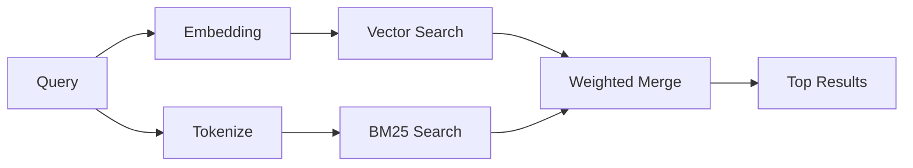

---
read_when:
    - Anda ingin memahami cara kerja `memory_search`
    - Anda ingin memilih penyedia embedding
    - Anda ingin menyetel kualitas pencarian
summary: Bagaimana pencarian memori menemukan catatan yang relevan menggunakan embedding dan pengambilan hibrida
title: Pencarian Memori
x-i18n:
    generated_at: "2026-04-12T23:28:18Z"
    model: gpt-5.4
    provider: openai
    source_hash: 71fde251b7d2dc455574aa458e7e09136f30613609ad8dafeafd53b2729a0310
    source_path: concepts/memory-search.md
    workflow: 15
---

# Pencarian Memori

`memory_search` menemukan catatan yang relevan dari file memori Anda, bahkan ketika
redaksinya berbeda dari teks aslinya. Fitur ini bekerja dengan mengindeks memori ke dalam potongan-potongan kecil
dan mencarinya menggunakan embedding, kata kunci, atau keduanya.

## Mulai cepat

Jika Anda telah mengonfigurasi kunci API OpenAI, Gemini, Voyage, atau Mistral, pencarian memori
akan bekerja secara otomatis. Untuk menetapkan penyedia secara eksplisit:

```json5
{
  agents: {
    defaults: {
      memorySearch: {
        provider: "openai", // atau "gemini", "local", "ollama", dll.
      },
    },
  },
}
```

Untuk embedding lokal tanpa kunci API, gunakan `provider: "local"` (memerlukan
node-llama-cpp).

## Penyedia yang didukung

| Penyedia | ID        | Perlu kunci API | Catatan                                              |
| -------- | --------- | --------------- | ---------------------------------------------------- |
| OpenAI   | `openai`  | Ya              | Terdeteksi otomatis, cepat                           |
| Gemini   | `gemini`  | Ya              | Mendukung pengindeksan gambar/audio                  |
| Voyage   | `voyage`  | Ya              | Terdeteksi otomatis                                  |
| Mistral  | `mistral` | Ya              | Terdeteksi otomatis                                  |
| Bedrock  | `bedrock` | Tidak           | Terdeteksi otomatis saat rantai kredensial AWS terselesaikan |
| Ollama   | `ollama`  | Tidak           | Lokal, harus ditetapkan secara eksplisit             |
| Local    | `local`   | Tidak           | Model GGUF, unduhan ~0,6 GB                          |

## Cara kerja pencarian

OpenClaw menjalankan dua jalur pengambilan secara paralel dan menggabungkan hasilnya:



- **Pencarian vektor** menemukan catatan dengan makna yang serupa ("gateway host" cocok dengan
  "mesin yang menjalankan OpenClaw").
- **Pencarian kata kunci BM25** menemukan kecocokan persis (ID, string error, kunci config
  ).

Jika hanya satu jalur yang tersedia (tidak ada embedding atau tidak ada FTS), jalur lainnya akan berjalan sendiri.

Ketika embedding tidak tersedia, OpenClaw tetap menggunakan pemeringkatan leksikal atas hasil FTS alih-alih hanya kembali ke urutan kecocokan persis mentah. Mode terdegradasi itu meningkatkan potongan dengan cakupan istilah kueri yang lebih kuat dan jalur file yang relevan, sehingga recall tetap berguna bahkan tanpa `sqlite-vec` atau penyedia embedding.

## Meningkatkan kualitas pencarian

Dua fitur opsional membantu ketika Anda memiliki riwayat catatan yang besar:

### Peluruhan temporal

Catatan lama secara bertahap kehilangan bobot peringkat sehingga informasi terbaru muncul lebih dulu.
Dengan half-life bawaan 30 hari, catatan dari bulan lalu mendapat skor 50% dari
bobot aslinya. File yang selalu relevan seperti `MEMORY.md` tidak pernah mengalami peluruhan.

<Tip>
Aktifkan peluruhan temporal jika agen Anda memiliki catatan harian selama berbulan-bulan dan informasi usang
terus mendapat peringkat lebih tinggi daripada konteks terbaru.
</Tip>

### MMR (keragaman)

Mengurangi hasil yang redundan. Jika lima catatan semuanya menyebut config router yang sama, MMR
memastikan hasil teratas mencakup topik yang berbeda alih-alih berulang.

<Tip>
Aktifkan MMR jika `memory_search` terus mengembalikan cuplikan yang hampir duplikat dari
catatan harian yang berbeda.
</Tip>

### Aktifkan keduanya

```json5
{
  agents: {
    defaults: {
      memorySearch: {
        query: {
          hybrid: {
            mmr: { enabled: true },
            temporalDecay: { enabled: true },
          },
        },
      },
    },
  },
}
```

## Memori multimodal

Dengan Gemini Embedding 2, Anda dapat mengindeks file gambar dan audio bersama
Markdown. Kueri pencarian tetap berupa teks, tetapi dapat cocok dengan konten visual dan audio.
Lihat [referensi konfigurasi Memori](/id/reference/memory-config) untuk
penyiapan.

## Pencarian memori sesi

Anda dapat secara opsional mengindeks transkrip sesi sehingga `memory_search` dapat mengingat
percakapan sebelumnya. Ini bersifat opt-in melalui
`memorySearch.experimental.sessionMemory`. Lihat
[referensi konfigurasi](/id/reference/memory-config) untuk detailnya.

## Pemecahan masalah

**Tidak ada hasil?** Jalankan `openclaw memory status` untuk memeriksa indeks. Jika kosong, jalankan
`openclaw memory index --force`.

**Hanya kecocokan kata kunci?** Penyedia embedding Anda mungkin belum dikonfigurasi. Periksa
`openclaw memory status --deep`.

**Teks CJK tidak ditemukan?** Bangun ulang indeks FTS dengan
`openclaw memory index --force`.

## Bacaan lebih lanjut

- [Active Memory](/id/concepts/active-memory) -- memori sub-agen untuk sesi chat interaktif
- [Memori](/id/concepts/memory) -- tata letak file, backend, alat
- [Referensi konfigurasi Memori](/id/reference/memory-config) -- semua pengaturan config
