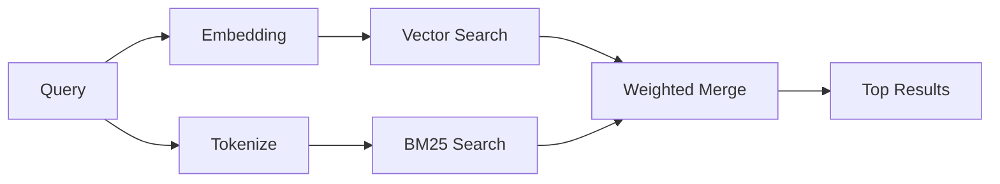

---
read_when:
    - Anda ingin memahami cara kerja memory_search
    - Anda ingin memilih penyedia embedding
    - Anda ingin menyetel kualitas pencarian
summary: Bagaimana pencarian memori menemukan catatan yang relevan menggunakan embedding dan pengambilan hibrida
title: Pencarian Memori
x-i18n:
    generated_at: "2026-04-15T14:40:35Z"
    model: gpt-5.4
    provider: openai
    source_hash: f5757aa8fe8f7fec30ef5c826f72230f591ce4cad591d81a091189d50d4262ed
    source_path: concepts/memory-search.md
    workflow: 15
---

# Pencarian Memori

`memory_search` menemukan catatan yang relevan dari file memori Anda, bahkan ketika
redaksinya berbeda dari teks aslinya. Fitur ini bekerja dengan mengindeks memori menjadi
potongan-potongan kecil lalu mencarinya menggunakan embedding, kata kunci, atau keduanya.

## Mulai cepat

Jika Anda memiliki langganan GitHub Copilot, kunci API OpenAI, Gemini, Voyage, atau Mistral yang dikonfigurasi, pencarian memori akan berfungsi secara otomatis. Untuk menetapkan penyedia
secara eksplisit:

```json5
{
  agents: {
    defaults: {
      memorySearch: {
        provider: "openai", // atau "gemini", "local", "ollama", dll.
      },
    },
  },
}
```

Untuk embedding lokal tanpa kunci API, gunakan `provider: "local"` (memerlukan
node-llama-cpp).

## Penyedia yang didukung

| Penyedia       | ID               | Perlu kunci API | Catatan                                              |
| -------------- | ---------------- | --------------- | ---------------------------------------------------- |
| Bedrock        | `bedrock`        | Tidak           | Terdeteksi otomatis ketika rantai kredensial AWS terselesaikan |
| Gemini         | `gemini`         | Ya              | Mendukung pengindeksan gambar/audio                  |
| GitHub Copilot | `github-copilot` | Tidak           | Terdeteksi otomatis, menggunakan langganan Copilot   |
| Local          | `local`          | Tidak           | Model GGUF, unduhan ~0.6 GB                          |
| Mistral        | `mistral`        | Ya              | Terdeteksi otomatis                                  |
| Ollama         | `ollama`         | Tidak           | Lokal, harus ditetapkan secara eksplisit             |
| OpenAI         | `openai`         | Ya              | Terdeteksi otomatis, cepat                           |
| Voyage         | `voyage`         | Ya              | Terdeteksi otomatis                                  |

## Cara kerja pencarian

OpenClaw menjalankan dua jalur pengambilan secara paralel dan menggabungkan hasilnya:



- **Pencarian vektor** menemukan catatan dengan makna yang serupa ("gateway host" cocok dengan
  "mesin yang menjalankan OpenClaw").
- **Pencarian kata kunci BM25** menemukan kecocokan yang persis (ID, string error, kunci
  konfigurasi).

Jika hanya satu jalur yang tersedia (tanpa embedding atau tanpa FTS), jalur lainnya berjalan sendiri.

Ketika embedding tidak tersedia, OpenClaw tetap menggunakan pemeringkatan leksikal atas hasil FTS alih-alih hanya kembali ke pengurutan kecocokan persis mentah. Mode degradasi itu meningkatkan potongan dengan cakupan istilah kueri yang lebih kuat dan jalur file yang relevan, sehingga recall tetap berguna bahkan tanpa `sqlite-vec` atau penyedia embedding.

## Meningkatkan kualitas pencarian

Dua fitur opsional membantu ketika Anda memiliki riwayat catatan yang besar:

### Temporal decay

Catatan lama secara bertahap kehilangan bobot pemeringkatan sehingga informasi terbaru muncul lebih dulu.
Dengan half-life bawaan 30 hari, catatan dari bulan lalu mendapat skor 50% dari
bobot aslinya. File evergreen seperti `MEMORY.md` tidak pernah mengalami decay.

<Tip>
Aktifkan temporal decay jika agen Anda memiliki catatan harian selama berbulan-bulan dan
informasi usang terus berada di atas konteks yang lebih baru.
</Tip>

### MMR (keberagaman)

Mengurangi hasil yang redundan. Jika lima catatan semuanya menyebut konfigurasi router yang sama, MMR
memastikan hasil teratas mencakup topik yang berbeda alih-alih berulang.

<Tip>
Aktifkan MMR jika `memory_search` terus mengembalikan cuplikan yang hampir duplikat dari
catatan harian yang berbeda.
</Tip>

### Aktifkan keduanya

```json5
{
  agents: {
    defaults: {
      memorySearch: {
        query: {
          hybrid: {
            mmr: { enabled: true },
            temporalDecay: { enabled: true },
          },
        },
      },
    },
  },
}
```

## Memori multimodal

Dengan Gemini Embedding 2, Anda dapat mengindeks file gambar dan audio bersama
Markdown. Kueri pencarian tetap berupa teks, tetapi akan cocok dengan konten visual dan audio. Lihat [referensi konfigurasi Memory](/id/reference/memory-config) untuk
penyiapan.

## Pencarian memori sesi

Anda dapat secara opsional mengindeks transkrip sesi sehingga `memory_search` dapat mengingat
percakapan sebelumnya. Ini bersifat opt-in melalui
`memorySearch.experimental.sessionMemory`. Lihat
[referensi konfigurasi](/id/reference/memory-config) untuk detail.

## Pemecahan masalah

**Tidak ada hasil?** Jalankan `openclaw memory status` untuk memeriksa indeks. Jika kosong, jalankan
`openclaw memory index --force`.

**Hanya kecocokan kata kunci?** Penyedia embedding Anda mungkin belum dikonfigurasi. Periksa
`openclaw memory status --deep`.

**Teks CJK tidak ditemukan?** Bangun ulang indeks FTS dengan
`openclaw memory index --force`.

## Bacaan lanjutan

- [Active Memory](/id/concepts/active-memory) -- memori sub-agen untuk sesi chat interaktif
- [Memory](/id/concepts/memory) -- tata letak file, backend, alat
- [Referensi konfigurasi Memory](/id/reference/memory-config) -- semua opsi konfigurasi
