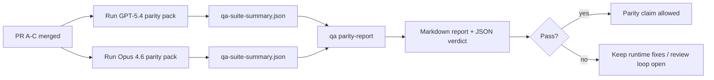

---
x-i18n:
    generated_at: "2026-04-11T15:15:49Z"
    model: gpt-5.4
    provider: openai
    source_hash: 910bcf7668becf182ef48185b43728bf2fa69629d6d50189d47d47b06f807a9e
    source_path: help/gpt54-codex-agentic-parity-maintainers.md
    workflow: 15
---

# Catatan Maintainer Paritas GPT-5.4 / Codex

Catatan ini menjelaskan cara meninjau program paritas GPT-5.4 / Codex sebagai empat unit penggabungan tanpa kehilangan arsitektur enam-kontrak asli.

## Unit penggabungan

### PR A: eksekusi agentik ketat

Mencakup:

- `executionContract`
- tindak lanjut giliran yang sama dengan prioritas GPT-5
- `update_plan` sebagai pelacakan progres non-terminal
- status terblokir yang eksplisit alih-alih berhenti diam-diam hanya dengan rencana

Tidak mencakup:

- klasifikasi kegagalan auth/runtime
- kejujuran izin
- desain ulang replay/continuation
- benchmarking paritas

### PR B: kejujuran runtime

Mencakup:

- kebenaran cakupan OAuth Codex
- klasifikasi kegagalan provider/runtime yang bertipe
- ketersediaan `/elevated full` yang jujur beserta alasan pemblokiran

Tidak mencakup:

- normalisasi skema tool
- status replay/liveness
- benchmark gating

### PR C: kebenaran eksekusi

Mencakup:

- kompatibilitas tool OpenAI/Codex yang dimiliki provider
- penanganan skema ketat tanpa parameter
- penampakan replay-invalid
- visibilitas status tugas panjang yang paused, blocked, dan abandoned

Tidak mencakup:

- continuation yang dipilih sendiri
- perilaku dialek Codex generik di luar hook provider
- benchmark gating

### PR D: harness paritas

Mencakup:

- paket skenario gelombang pertama GPT-5.4 vs Opus 4.6
- dokumentasi paritas
- laporan paritas dan mekanisme gerbang rilis

Tidak mencakup:

- perubahan perilaku runtime di luar QA-lab
- simulasi auth/proxy/DNS di dalam harness

## Pemetaan kembali ke enam kontrak asli

| Kontrak asli                              | Unit penggabungan |
| ----------------------------------------- | ----------------- |
| Kebenaran transport/auth provider         | PR B              |
| Kompatibilitas kontrak/skema tool         | PR C              |
| Eksekusi pada giliran yang sama           | PR A              |
| Kejujuran izin                            | PR B              |
| Kebenaran replay/continuation/liveness    | PR C              |
| Benchmark/gerbang rilis                   | PR D              |

## Urutan peninjauan

1. PR A
2. PR B
3. PR C
4. PR D

PR D adalah lapisan pembuktian. PR ini tidak seharusnya menjadi alasan PR kebenaran runtime tertunda.

## Hal yang perlu dicari

### PR A

- proses GPT-5 bertindak atau gagal secara fail-closed alih-alih berhenti pada commentary
- `update_plan` tidak lagi terlihat sebagai progres dengan sendirinya
- perilaku tetap berprioritas GPT-5 dan terbatas pada embedded-Pi

### PR B

- kegagalan auth/proxy/runtime tidak lagi runtuh menjadi penanganan generik “model failed”
- `/elevated full` hanya dideskripsikan sebagai tersedia saat benar-benar tersedia
- alasan pemblokiran terlihat oleh model maupun runtime yang berhadapan dengan pengguna

### PR C

- pendaftaran tool OpenAI/Codex yang ketat berperilaku secara dapat diprediksi
- tool tanpa parameter tidak gagal dalam pemeriksaan skema ketat
- hasil replay dan compaction mempertahankan status liveness yang jujur

### PR D

- paket skenario dapat dipahami dan direproduksi
- paket mencakup lane keamanan replay yang memodifikasi, bukan hanya alur baca-saja
- laporan dapat dibaca oleh manusia dan otomatisasi
- klaim paritas didukung bukti, bukan anekdotal

Artefak yang diharapkan dari PR D:

- `qa-suite-report.md` / `qa-suite-summary.json` untuk setiap eksekusi model
- `qa-agentic-parity-report.md` dengan perbandingan agregat dan tingkat skenario
- `qa-agentic-parity-summary.json` dengan verdict yang dapat dibaca mesin

## Gerbang rilis

Jangan mengklaim paritas atau keunggulan GPT-5.4 atas Opus 4.6 sampai:

- PR A, PR B, dan PR C telah digabungkan
- PR D menjalankan paket paritas gelombang pertama dengan bersih
- suite regresi runtime-truthfulness tetap hijau
- laporan paritas menunjukkan tidak ada kasus sukses palsu dan tidak ada regresi pada perilaku berhenti

Harness paritas bukan satu-satunya sumber bukti. Pertahankan pemisahan ini secara eksplisit dalam peninjauan:

- PR D memiliki perbandingan berbasis skenario GPT-5.4 vs Opus 4.6
- suite deterministik PR B tetap memiliki bukti auth/proxy/DNS dan kejujuran akses penuh

## Peta tujuan-ke-bukti

| Item gerbang penyelesaian                 | Pemilik utama | Artefak peninjauan                                                  |
| ----------------------------------------- | ------------- | ------------------------------------------------------------------- |
| Tidak ada kemacetan hanya-rencana         | PR A          | test runtime strict-agentic dan `approval-turn-tool-followthrough` |
| Tidak ada progres palsu atau penyelesaian tool palsu | PR A + PR D   | jumlah sukses palsu paritas plus detail laporan tingkat skenario    |
| Tidak ada panduan `/elevated full` yang salah | PR B          | suite runtime-truthfulness deterministik                            |
| Kegagalan replay/liveness tetap eksplisit | PR C + PR D   | suite lifecycle/replay plus `compaction-retry-mutating-tool`        |
| GPT-5.4 setara atau lebih baik dari Opus 4.6 | PR D          | `qa-agentic-parity-report.md` dan `qa-agentic-parity-summary.json`  |

## Singkatan untuk reviewer: sebelum vs sesudah

| Masalah yang terlihat pengguna sebelumnya                    | Sinyal peninjauan sesudah                                                                |
| ------------------------------------------------------------ | ---------------------------------------------------------------------------------------- |
| GPT-5.4 berhenti setelah membuat rencana                     | PR A menunjukkan perilaku bertindak-atau-terblokir alih-alih penyelesaian hanya commentary |
| Penggunaan tool terasa rapuh dengan skema OpenAI/Codex yang ketat | PR C menjaga pendaftaran tool dan pemanggilan tanpa parameter tetap dapat diprediksi     |
| Petunjuk `/elevated full` kadang menyesatkan                 | PR B mengaitkan panduan dengan kapabilitas runtime yang sebenarnya dan alasan pemblokiran |
| Tugas panjang bisa hilang dalam ambiguitas replay/compaction | PR C menghasilkan status paused, blocked, abandoned, dan replay-invalid yang eksplisit   |
| Klaim paritas bersifat anekdotal                             | PR D menghasilkan laporan plus verdict JSON dengan cakupan skenario yang sama pada kedua model |
