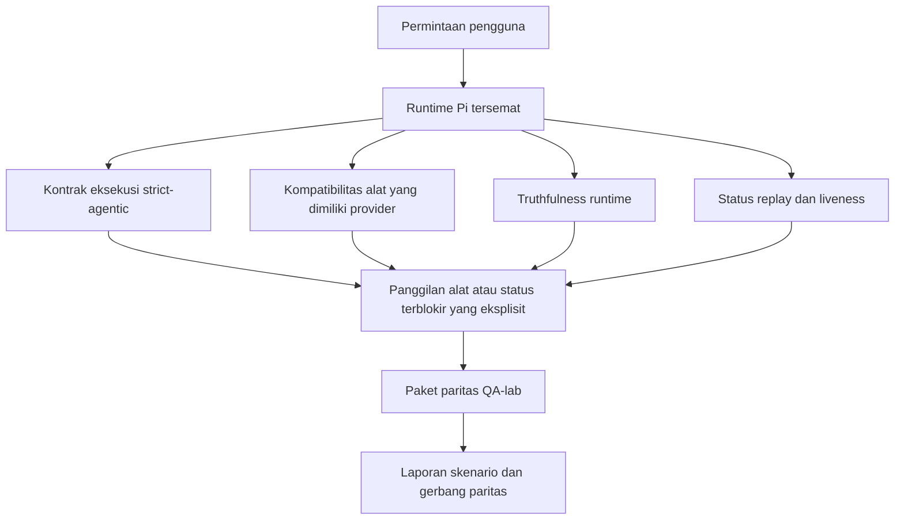
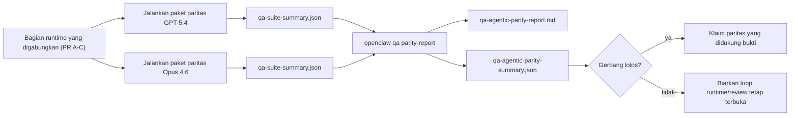

---
x-i18n:
    generated_at: "2026-04-11T15:15:49Z"
    model: gpt-5.4
    provider: openai
    source_hash: 7ee6b925b8a0f8843693cea9d50b40544657b5fb8a9e0860e2ff5badb273acb6
    source_path: help/gpt54-codex-agentic-parity.md
    workflow: 15
---

# Paritas Agentik GPT-5.4 / Codex di OpenClaw

OpenClaw sudah bekerja dengan baik dengan model frontier yang menggunakan alat, tetapi model bergaya GPT-5.4 dan Codex masih berkinerja kurang baik dalam beberapa hal praktis:

- mereka bisa berhenti setelah membuat rencana alih-alih mengerjakan tugasnya
- mereka bisa menggunakan skema alat OpenAI/Codex yang ketat secara tidak benar
- mereka bisa meminta `/elevated full` bahkan ketika akses penuh tidak mungkin
- mereka bisa kehilangan status tugas yang berjalan lama selama replay atau compaction
- klaim paritas terhadap Claude Opus 4.6 didasarkan pada anekdot, bukan skenario yang dapat diulang

Program paritas ini menutup kesenjangan tersebut dalam empat bagian yang dapat ditinjau.

## Apa yang berubah

### PR A: eksekusi strict-agentic

Bagian ini menambahkan kontrak eksekusi `strict-agentic` yang bersifat opt-in untuk run GPT-5 Pi tersemat.

Saat diaktifkan, OpenClaw berhenti menerima giliran yang hanya berisi rencana sebagai penyelesaian yang “cukup baik”. Jika model hanya menyatakan apa yang ingin dilakukannya dan tidak benar-benar menggunakan alat atau membuat kemajuan, OpenClaw akan mencoba lagi dengan arahan act-now lalu gagal secara tertutup dengan status terblokir yang eksplisit alih-alih mengakhiri tugas secara diam-diam.

Ini paling meningkatkan pengalaman GPT-5.4 pada:

- tindak lanjut singkat “oke lakukan”
- tugas kode ketika langkah pertama sudah jelas
- alur tempat `update_plan` seharusnya menjadi pelacakan kemajuan, bukan teks pengisi

### PR B: truthfulness runtime

Bagian ini membuat OpenClaw mengatakan kebenaran tentang dua hal:

- mengapa panggilan provider/runtime gagal
- apakah `/elevated full` benar-benar tersedia

Artinya GPT-5.4 mendapatkan sinyal runtime yang lebih baik untuk scope yang hilang, kegagalan refresh auth, kegagalan auth HTML 403, masalah proxy, kegagalan DNS atau timeout, dan mode full-access yang diblokir. Model jadi lebih kecil kemungkinannya untuk berhalusinasi tentang remediasi yang salah atau terus meminta mode izin yang tidak dapat disediakan runtime.

### PR C: correctness eksekusi

Bagian ini meningkatkan dua jenis correctness:

- kompatibilitas skema alat OpenAI/Codex yang dimiliki provider
- surfacing replay dan liveness tugas panjang

Pekerjaan kompatibilitas alat mengurangi friksi skema untuk registrasi alat OpenAI/Codex yang ketat, khususnya di sekitar alat tanpa parameter dan ekspektasi root objek yang ketat. Pekerjaan replay/liveness membuat tugas yang berjalan lama lebih mudah diamati, sehingga status paused, blocked, dan abandoned terlihat alih-alih menghilang ke dalam teks kegagalan generik.

### PR D: harness paritas

Bagian ini menambahkan paket paritas QA-lab gelombang pertama sehingga GPT-5.4 dan Opus 4.6 dapat diuji melalui skenario yang sama dan dibandingkan menggunakan bukti bersama.

Paket paritas adalah lapisan pembuktian. Ini sendiri tidak mengubah perilaku runtime.

Setelah Anda memiliki dua artefak `qa-suite-summary.json`, hasilkan perbandingan gerbang rilis dengan:

```bash
pnpm openclaw qa parity-report \
  --repo-root . \
  --candidate-summary .artifacts/qa-e2e/gpt54/qa-suite-summary.json \
  --baseline-summary .artifacts/qa-e2e/opus46/qa-suite-summary.json \
  --output-dir .artifacts/qa-e2e/parity
```

Perintah itu menulis:

- laporan Markdown yang dapat dibaca manusia
- verdict JSON yang dapat dibaca mesin
- hasil gerbang `pass` / `fail` yang eksplisit

## Mengapa ini meningkatkan GPT-5.4 dalam praktik

Sebelum pekerjaan ini, GPT-5.4 di OpenClaw bisa terasa kurang agentik dibanding Opus dalam sesi coding nyata karena runtime menoleransi perilaku yang sangat merugikan khususnya untuk model bergaya GPT-5:

- giliran yang hanya berisi komentar
- friksi skema di sekitar alat
- umpan balik izin yang samar
- kerusakan replay atau compaction yang diam-diam

Tujuannya bukan membuat GPT-5.4 meniru Opus. Tujuannya adalah memberi GPT-5.4 kontrak runtime yang memberi imbalan pada kemajuan nyata, menyediakan semantik alat dan izin yang lebih bersih, dan mengubah mode kegagalan menjadi status yang eksplisit dan dapat dibaca mesin maupun manusia.

Itu mengubah pengalaman pengguna dari:

- “model punya rencana yang bagus tapi berhenti”

menjadi:

- “model bertindak, atau OpenClaw menampilkan alasan pasti mengapa model tidak bisa”

## Sebelum vs sesudah untuk pengguna GPT-5.4

| Sebelum program ini                                                                            | Sesudah PR A-D                                                                          |
| ---------------------------------------------------------------------------------------------- | --------------------------------------------------------------------------------------- |
| GPT-5.4 bisa berhenti setelah rencana yang masuk akal tanpa mengambil langkah alat berikutnya  | PR A mengubah “hanya rencana” menjadi “bertindak sekarang atau tampilkan status terblokir” |
| Skema alat yang ketat bisa menolak alat tanpa parameter atau alat berbentuk OpenAI/Codex dengan cara yang membingungkan | PR C membuat registrasi dan pemanggilan alat yang dimiliki provider lebih dapat diprediksi |
| Panduan `/elevated full` bisa samar atau salah dalam runtime yang diblokir                     | PR B memberi GPT-5.4 dan pengguna petunjuk runtime dan izin yang jujur                 |
| Kegagalan replay atau compaction bisa terasa seperti tugas diam-diam menghilang                | PR C secara eksplisit menampilkan hasil paused, blocked, abandoned, dan replay-invalid |
| “GPT-5.4 terasa lebih buruk daripada Opus” sebagian besar bersifat anekdot                     | PR D mengubahnya menjadi paket skenario yang sama, metrik yang sama, dan gerbang pass/fail yang tegas |

## Arsitektur



## Alur rilis



## Paket skenario

Paket paritas gelombang pertama saat ini mencakup lima skenario:

### `approval-turn-tool-followthrough`

Memeriksa bahwa model tidak berhenti pada “Saya akan melakukannya” setelah persetujuan singkat. Model harus mengambil tindakan konkret pertama pada giliran yang sama.

### `model-switch-tool-continuity`

Memeriksa bahwa pekerjaan yang menggunakan alat tetap koheren di seluruh batas pergantian model/runtime alih-alih kembali menjadi komentar atau kehilangan konteks eksekusi.

### `source-docs-discovery-report`

Memeriksa bahwa model dapat membaca source dan docs, menyintesis temuan, dan melanjutkan tugas secara agentik alih-alih menghasilkan ringkasan tipis lalu berhenti terlalu dini.

### `image-understanding-attachment`

Memeriksa bahwa tugas mode campuran yang melibatkan lampiran tetap dapat ditindaklanjuti dan tidak runtuh menjadi narasi yang samar.

### `compaction-retry-mutating-tool`

Memeriksa bahwa tugas dengan penulisan mutatif nyata menjaga ketidakamanan replay tetap eksplisit alih-alih diam-diam tampak aman untuk replay jika run mengalami compact, retry, atau kehilangan status balasan di bawah tekanan.

## Matriks skenario

| Skenario                           | Yang diuji                               | Perilaku GPT-5.4 yang baik                                                    | Sinyal kegagalan                                                                |
| ---------------------------------- | ---------------------------------------- | ----------------------------------------------------------------------------- | ------------------------------------------------------------------------------- |
| `approval-turn-tool-followthrough` | Giliran persetujuan singkat setelah rencana | Memulai tindakan alat konkret pertama segera alih-alih mengulangi niat       | tindak lanjut yang hanya berisi rencana, tidak ada aktivitas alat, atau giliran terblokir tanpa penghambat nyata |
| `model-switch-tool-continuity`     | Pergantian runtime/model saat menggunakan alat | Mempertahankan konteks tugas dan terus bertindak secara koheren              | kembali menjadi komentar, kehilangan konteks alat, atau berhenti setelah pergantian |
| `source-docs-discovery-report`     | Pembacaan source + sintesis + tindakan   | Menemukan source, menggunakan alat, dan menghasilkan laporan yang berguna tanpa macet | ringkasan tipis, pekerjaan alat hilang, atau berhenti di giliran yang belum lengkap |
| `image-understanding-attachment`   | Pekerjaan agentik yang didorong lampiran | Menafsirkan lampiran, menghubungkannya ke alat, dan melanjutkan tugas        | narasi samar, lampiran diabaikan, atau tidak ada tindakan konkret berikutnya    |
| `compaction-retry-mutating-tool`   | Pekerjaan mutatif di bawah tekanan compaction | Melakukan penulisan nyata dan menjaga ketidakamanan replay tetap eksplisit setelah efek samping | penulisan mutatif terjadi tetapi keamanan replay diimplikasikan, hilang, atau kontradiktif |

## Gerbang rilis

GPT-5.4 hanya dapat dianggap setara atau lebih baik ketika runtime yang telah digabungkan lolos paket paritas dan regresi truthfulness runtime pada saat yang sama.

Hasil yang diwajibkan:

- tidak ada macet karena hanya membuat rencana ketika tindakan alat berikutnya jelas
- tidak ada penyelesaian palsu tanpa eksekusi nyata
- tidak ada panduan `/elevated full` yang salah
- tidak ada abandonment replay atau compaction yang diam-diam
- metrik paket paritas yang setidaknya sekuat baseline Opus 4.6 yang disepakati

Untuk harness gelombang pertama, gerbang membandingkan:

- tingkat penyelesaian
- tingkat berhenti yang tidak diinginkan
- tingkat panggilan alat yang valid
- jumlah fake-success

Bukti paritas sengaja dibagi di dua lapisan:

- PR D membuktikan perilaku GPT-5.4 vs Opus 4.6 pada skenario yang sama dengan QA-lab
- suite deterministik PR B membuktikan truthfulness auth, proxy, DNS, dan `/elevated full` di luar harness

## Matriks tujuan-ke-bukti

| Item gerbang penyelesaian                                | PR pemilik   | Sumber bukti                                                        | Sinyal lolos                                                                            |
| -------------------------------------------------------- | ------------ | ------------------------------------------------------------------- | --------------------------------------------------------------------------------------- |
| GPT-5.4 tidak lagi macet setelah membuat rencana         | PR A         | `approval-turn-tool-followthrough` ditambah suite runtime PR A      | giliran persetujuan memicu pekerjaan nyata atau status terblokir yang eksplisit        |
| GPT-5.4 tidak lagi memalsukan kemajuan atau penyelesaian alat palsu | PR A + PR D  | hasil skenario laporan paritas dan jumlah fake-success              | tidak ada hasil lolos yang mencurigakan dan tidak ada penyelesaian yang hanya berupa komentar |
| GPT-5.4 tidak lagi memberikan panduan `/elevated full` yang salah | PR B         | suite truthfulness deterministik                                    | alasan pemblokiran dan petunjuk full-access tetap akurat terhadap runtime               |
| Kegagalan replay/liveness tetap eksplisit                | PR C + PR D  | suite lifecycle/replay PR C ditambah `compaction-retry-mutating-tool` | pekerjaan mutatif menjaga ketidakamanan replay tetap eksplisit alih-alih diam-diam menghilang |
| GPT-5.4 menyamai atau melampaui Opus 4.6 pada metrik yang disepakati | PR D         | `qa-agentic-parity-report.md` dan `qa-agentic-parity-summary.json`  | cakupan skenario yang sama dan tidak ada regresi pada penyelesaian, perilaku berhenti, atau penggunaan alat yang valid |

## Cara membaca verdict paritas

Gunakan verdict dalam `qa-agentic-parity-summary.json` sebagai keputusan akhir yang dapat dibaca mesin untuk paket paritas gelombang pertama.

- `pass` berarti GPT-5.4 mencakup skenario yang sama seperti Opus 4.6 dan tidak mengalami regresi pada metrik agregat yang disepakati.
- `fail` berarti setidaknya satu gerbang keras terpicu: completion lebih lemah, unintended stop lebih buruk, penggunaan alat valid lebih lemah, ada kasus fake-success, atau cakupan skenario tidak cocok.
- “shared/base CI issue” bukanlah hasil paritas. Jika noise CI di luar PR D memblokir sebuah run, verdict harus menunggu eksekusi merged-runtime yang bersih alih-alih disimpulkan dari log era branch.
- Truthfulness auth, proxy, DNS, dan `/elevated full` tetap berasal dari suite deterministik PR B, jadi klaim rilis akhir membutuhkan keduanya: verdict paritas PR D yang lulus dan cakupan truthfulness PR B yang hijau.

## Siapa yang sebaiknya mengaktifkan `strict-agentic`

Gunakan `strict-agentic` ketika:

- agen diharapkan segera bertindak ketika langkah berikutnya sudah jelas
- model GPT-5.4 atau keluarga Codex adalah runtime utama
- Anda lebih memilih status terblokir yang eksplisit daripada balasan yang hanya berupa rekap yang “membantu”

Pertahankan kontrak default ketika:

- Anda menginginkan perilaku longgar yang sudah ada
- Anda tidak menggunakan model keluarga GPT-5
- Anda sedang menguji prompt, bukan penegakan runtime
