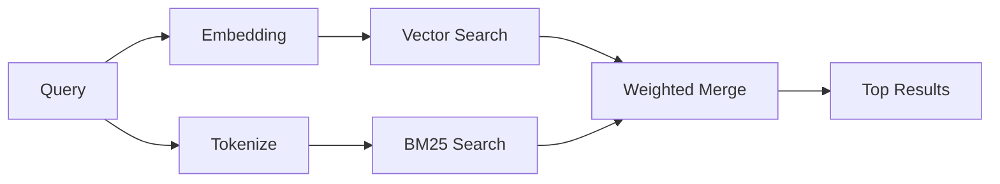

---
read_when:
    - Vuoi capire come funziona memory_search
    - Vuoi scegliere un provider di embeddings
    - Vuoi ottimizzare la qualità della ricerca
summary: Come la ricerca nella memoria trova note pertinenti usando embeddings e recupero ibrido
title: Ricerca nella memoria
x-i18n:
    generated_at: "2026-04-15T14:40:29Z"
    model: gpt-5.4
    provider: openai
    source_hash: f5757aa8fe8f7fec30ef5c826f72230f591ce4cad591d81a091189d50d4262ed
    source_path: concepts/memory-search.md
    workflow: 15
---

# Ricerca nella memoria

`memory_search` trova note pertinenti dai tuoi file di memoria, anche quando la
formulazione differisce dal testo originale. Funziona indicizzando la memoria in piccoli
blocchi e cercandoli usando embeddings, parole chiave o entrambi.

## Guida rapida

Se hai un abbonamento a GitHub Copilot, oppure una chiave API OpenAI, Gemini, Voyage o Mistral configurata, la ricerca nella memoria funziona automaticamente. Per impostare esplicitamente un provider:

```json5
{
  agents: {
    defaults: {
      memorySearch: {
        provider: "openai", // oppure "gemini", "local", "ollama", ecc.
      },
    },
  },
}
```

Per embeddings locali senza chiave API, usa `provider: "local"` (richiede
node-llama-cpp).

## Provider supportati

| Provider       | ID               | Richiede chiave API | Note                                                 |
| -------------- | ---------------- | ------------------- | ---------------------------------------------------- |
| Bedrock        | `bedrock`        | No                  | Rilevato automaticamente quando la catena di credenziali AWS si risolve |
| Gemini         | `gemini`         | Sì                  | Supporta l'indicizzazione di immagini/audio          |
| GitHub Copilot | `github-copilot` | No                  | Rilevato automaticamente, usa l'abbonamento Copilot  |
| Local          | `local`          | No                  | Modello GGUF, download di ~0,6 GB                    |
| Mistral        | `mistral`        | Sì                  | Rilevato automaticamente                             |
| Ollama         | `ollama`         | No                  | Locale, deve essere impostato esplicitamente         |
| OpenAI         | `openai`         | Sì                  | Rilevato automaticamente, veloce                     |
| Voyage         | `voyage`         | Sì                  | Rilevato automaticamente                             |

## Come funziona la ricerca

OpenClaw esegue due percorsi di recupero in parallelo e unisce i risultati:



- **La ricerca vettoriale** trova note con significato simile ("gateway host" corrisponde
  a "la macchina che esegue OpenClaw").
- **La ricerca per parole chiave BM25** trova corrispondenze esatte (ID, stringhe di errore, chiavi
  di configurazione).

Se è disponibile un solo percorso (nessun embeddings o nessun FTS), viene eseguito da solo l'altro.

Quando gli embeddings non sono disponibili, OpenClaw usa comunque il ranking lessicale sui risultati FTS invece di ripiegare solo sull'ordinamento grezzo per corrispondenza esatta. Questa modalità degradata aumenta il peso dei blocchi con una copertura più forte dei termini della query e percorsi file pertinenti, mantenendo utile il richiamo anche senza `sqlite-vec` o un provider di embeddings.

## Migliorare la qualità della ricerca

Due funzionalità opzionali aiutano quando hai una cronologia di note molto ampia:

### Decadimento temporale

Le note vecchie perdono gradualmente peso nel ranking, così le informazioni recenti emergono per prime.
Con l'emivita predefinita di 30 giorni, una nota del mese scorso ottiene un punteggio pari al 50% del
suo peso originale. I file evergreen come `MEMORY.md` non vengono mai penalizzati.

<Tip>
Abilita il decadimento temporale se il tuo agente ha mesi di note giornaliere e
le informazioni obsolete continuano a superare nel ranking il contesto recente.
</Tip>

### MMR (diversità)

Riduce i risultati ridondanti. Se cinque note menzionano tutte la stessa configurazione del router, MMR
fa in modo che i risultati principali coprano argomenti diversi invece di ripetersi.

<Tip>
Abilita MMR se `memory_search` continua a restituire frammenti quasi duplicati da
note giornaliere diverse.
</Tip>

### Abilitare entrambi

```json5
{
  agents: {
    defaults: {
      memorySearch: {
        query: {
          hybrid: {
            mmr: { enabled: true },
            temporalDecay: { enabled: true },
          },
        },
      },
    },
  },
}
```

## Memoria multimodale

Con Gemini Embedding 2, puoi indicizzare immagini e file audio insieme al
Markdown. Le query di ricerca restano testuali, ma trovano corrispondenze anche nel contenuto visivo e audio.
Consulta il [riferimento di configurazione della memoria](/it/reference/memory-config) per la configurazione.

## Ricerca nella memoria delle sessioni

Puoi facoltativamente indicizzare le trascrizioni delle sessioni in modo che `memory_search` possa richiamare
conversazioni precedenti. Questa funzione è attivabile esplicitamente tramite
`memorySearch.experimental.sessionMemory`. Consulta il
[riferimento di configurazione](/it/reference/memory-config) per i dettagli.

## Risoluzione dei problemi

**Nessun risultato?** Esegui `openclaw memory status` per controllare l'indice. Se è vuoto, esegui
`openclaw memory index --force`.

**Solo corrispondenze per parole chiave?** Il tuo provider di embeddings potrebbe non essere configurato. Controlla
`openclaw memory status --deep`.

**Testo CJK non trovato?** Ricostruisci l'indice FTS con
`openclaw memory index --force`.

## Ulteriori letture

- [Active Memory](/it/concepts/active-memory) -- memoria del sottoagente per sessioni di chat interattive
- [Memory](/it/concepts/memory) -- layout dei file, backend, strumenti
- [Riferimento di configurazione della memoria](/it/reference/memory-config) -- tutte le opzioni di configurazione
