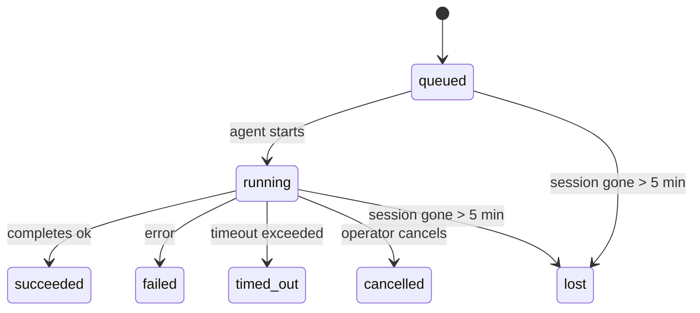

---
read_when:
    - 進行中または最近完了したバックグラウンド作業を確認している
    - 切り離されたエージェント実行の配信失敗をデバッグしている
    - バックグラウンド実行がセッション、cron、heartbeatとどう関係するかを理解している
summary: ACP実行、サブエージェント、分離されたcronジョブ、CLI操作のためのバックグラウンドタスク追跡
title: バックグラウンドタスク
x-i18n:
    generated_at: "2026-04-06T03:06:40Z"
    model: gpt-5.4
    provider: openai
    source_hash: 2f56c1ac23237907a090c69c920c09578a2f56f5d8bf750c7f2136c603c8a8ff
    source_path: automation/tasks.md
    workflow: 15
---

# バックグラウンドタスク

> **スケジューリングを探していますか？** 適切な仕組みを選ぶには [Automation & Tasks](/ja-JP/automation) を参照してください。このページではバックグラウンド作業の**追跡**を扱っており、スケジューリングは扱いません。

バックグラウンドタスクは、**メイン会話セッションの外側**で実行される作業を追跡します:
ACP実行、サブエージェントの起動、分離されたcronジョブ実行、CLIから開始された操作です。

タスクはセッション、cronジョブ、heartbeatを置き換えるものではありません。これらは、切り離された作業で何が起きたか、いつ起きたか、成功したかどうかを記録する**アクティビティ台帳**です。

<Note>
すべてのエージェント実行がタスクを作成するわけではありません。heartbeatターンと通常の対話チャットは作成しません。すべてのcron実行、ACP起動、サブエージェント起動、CLIエージェントコマンドは作成します。
</Note>

## 要点

- タスクはスケジューラではなく**記録**です。cronとheartbeatが作業の実行_時期_を決め、タスクは_何が起きたか_を追跡します。
- ACP、サブエージェント、すべてのcronジョブ、CLI操作はタスクを作成します。heartbeatターンは作成しません。
- 各タスクは `queued → running → terminal`（succeeded、failed、timed_out、cancelled、またはlost）を進みます。
- cronタスクは、cronランタイムがまだそのジョブを所有している間は存続します。チャットに紐づくCLIタスクは、所有する実行コンテキストがまだアクティブな間だけ存続します。
- 完了はプッシュ駆動です。切り離された作業は完了時に直接通知したり、リクエスターのセッション/heartbeatを起こしたりできるため、通常はステータスポーリングループは適した形ではありません。
- 分離されたcron実行とサブエージェント完了は、最終的なクリーンアップ記録処理の前に、子セッションの追跡中ブラウザタブ/プロセスをベストエフォートでクリーンアップします。
- 分離されたcron配信は、子孫サブエージェント作業がまだ排出中の間は古い中間親返信を抑制し、配信前に届いた場合は最終的な子孫出力を優先します。
- 完了通知はチャネルに直接配信されるか、次のheartbeatのためにキューに入れられます。
- `openclaw tasks list` はすべてのタスクを表示します。`openclaw tasks audit` は問題を明らかにします。
- 終了済みレコードは7日間保持され、その後自動的に削除されます。

## クイックスタート

```bash
# すべてのタスクを一覧表示（新しい順）
openclaw tasks list

# ランタイムまたはステータスで絞り込み
openclaw tasks list --runtime acp
openclaw tasks list --status running

# 特定のタスクの詳細を表示（ID、run ID、またはsession keyで指定）
openclaw tasks show <lookup>

# 実行中のタスクをキャンセル（子セッションを終了）
openclaw tasks cancel <lookup>

# タスクの通知ポリシーを変更
openclaw tasks notify <lookup> state_changes

# ヘルス監査を実行
openclaw tasks audit

# メンテナンスをプレビューまたは適用
openclaw tasks maintenance
openclaw tasks maintenance --apply

# TaskFlowの状態を確認
openclaw tasks flow list
openclaw tasks flow show <lookup>
openclaw tasks flow cancel <lookup>
```

## タスクを作成するもの

| ソース                 | ランタイム種別 | タスクレコードが作成されるタイミング                    | デフォルト通知ポリシー |
| ---------------------- | -------------- | ------------------------------------------------------ | ---------------------- |
| ACPバックグラウンド実行 | `acp`          | 子ACPセッションを起動するとき                           | `done_only`            |
| サブエージェントオーケストレーション | `subagent`     | `sessions_spawn` 経由でサブエージェントを起動するとき   | `done_only`            |
| Cronジョブ（全種別）   | `cron`         | cronの実行ごと（メインセッションと分離実行の両方）      | `silent`               |
| CLI操作                | `cli`          | Gateway経由で実行される `openclaw agent` コマンド       | `silent`               |
| エージェントのメディアジョブ | `cli`    | セッションに紐づく `video_generate` 実行                | `silent`               |

メインセッションのcronタスクは、デフォルトで `silent` 通知ポリシーを使用します。追跡のためにレコードは作成されますが、通知は生成しません。分離されたcronタスクもデフォルトで `silent` ですが、独自のセッションで実行されるため、より可視性があります。

セッションに紐づく `video_generate` 実行も `silent` 通知ポリシーを使用します。これらもタスクレコードを作成しますが、完了は内部ウェイクとして元のエージェントセッションに返され、エージェント自身がフォローアップメッセージを書き、完成した動画を添付できます。`tools.media.asyncCompletion.directSend` を有効にすると、非同期の `music_generate` と `video_generate` 完了は、リクエスターセッションを起こす経路にフォールバックする前に、まずチャネルへの直接配信を試みます。

セッションに紐づく `video_generate` タスクがまだアクティブな間、このツールはガードレールとしても機能します。同じセッションで `video_generate` を繰り返し呼び出すと、2つ目の同時生成を開始する代わりに、アクティブなタスクの状態を返します。エージェント側から明示的な進行状況/状態確認をしたい場合は `action: "status"` を使用してください。

**タスクを作成しないもの:**

- Heartbeatターン — メインセッション。詳細は [Heartbeat](/ja-JP/gateway/heartbeat) を参照
- 通常の対話チャットターン
- 直接の `/command` 応答

## タスクライフサイクル



| ステータス  | 意味                                                                       |
| ----------- | -------------------------------------------------------------------------- |
| `queued`    | 作成済みで、エージェントの開始待ち                                         |
| `running`   | エージェントターンが現在実行中                                             |
| `succeeded` | 正常に完了                                                                 |
| `failed`    | エラーで完了                                                               |
| `timed_out` | 設定されたタイムアウトを超過                                               |
| `cancelled` | オペレーターが `openclaw tasks cancel` で停止                             |
| `lost`      | 5分間の猶予期間後に、ランタイムが権威あるバックエンド状態を失った          |

遷移は自動的に行われます。関連するエージェント実行が終了すると、タスクステータスもそれに合わせて更新されます。

`lost` はランタイムを認識します:

- ACPタスク: バックエンドのACP子セッションメタデータが消えた。
- サブエージェントタスク: バックエンドの子セッションが対象エージェントストアから消えた。
- cronタスク: cronランタイムがそのジョブをアクティブとして追跡しなくなった。
- CLIタスク: 分離された子セッションタスクは子セッションを使い、チャットに紐づくCLIタスクは代わりにライブの実行コンテキストを使うため、残っているチャネル/グループ/ダイレクトのセッション行では存続しません。

## 配信と通知

タスクが終了状態に達すると、OpenClaw が通知します。配信経路は2つあります。

**直接配信** — タスクにチャネル宛先（`requesterOrigin`）がある場合、完了メッセージはそのチャネル（Telegram、Discord、Slackなど）へ直接送られます。サブエージェント完了では、OpenClaw は利用可能な場合に紐づいたスレッド/トピックのルーティングも保持し、直接配信を諦める前に、リクエスターセッションに保存されたルート（`lastChannel` / `lastTo` / `lastAccountId`）から不足している `to` / アカウントを補完できます。

**セッションキュー配信** — 直接配信に失敗した場合、または送信元が設定されていない場合、更新はリクエスターセッション内のシステムイベントとしてキューに入れられ、次のheartbeatで表示されます。

<Tip>
タスク完了は即座にheartbeatウェイクを引き起こすため、結果をすぐ確認できます。次に予定されたheartbeatティックまで待つ必要はありません。
</Tip>

つまり、通常のワークフローはプッシュベースです。切り離された作業を一度開始したら、完了時にランタイムが起こすか通知するのに任せます。タスク状態をポーリングするのは、デバッグ、介入、または明示的な監査が必要なときだけにしてください。

### 通知ポリシー

各タスクについて、どれだけ通知を受けるかを制御します。

| ポリシー              | 配信される内容                                                         |
| --------------------- | ---------------------------------------------------------------------- |
| `done_only` (default) | 終了状態（succeeded、failedなど）のみ — **これがデフォルトです**       |
| `state_changes`       | すべての状態遷移と進行状況更新                                         |
| `silent`              | 何も配信しない                                                         |

タスクの実行中にポリシーを変更します:

```bash
openclaw tasks notify <lookup> state_changes
```

## CLIリファレンス

### `tasks list`

```bash
openclaw tasks list [--runtime <acp|subagent|cron|cli>] [--status <status>] [--json]
```

出力列: Task ID、種類、ステータス、配信、Run ID、子セッション、概要。

### `tasks show`

```bash
openclaw tasks show <lookup>
```

lookupトークンには task ID、run ID、またはsession key を指定できます。タイミング、配信状態、エラー、終了時サマリーを含む完全なレコードを表示します。

### `tasks cancel`

```bash
openclaw tasks cancel <lookup>
```

ACPおよびサブエージェントタスクでは、これにより子セッションを終了します。ステータスは `cancelled` に遷移し、配信通知が送信されます。

### `tasks notify`

```bash
openclaw tasks notify <lookup> <done_only|state_changes|silent>
```

### `tasks audit`

```bash
openclaw tasks audit [--json]
```

運用上の問題を明らかにします。問題が検出されると、検出結果は `openclaw status` にも表示されます。

| 検出項目                  | 重大度 | トリガー                                              |
| ------------------------- | ------ | ----------------------------------------------------- |
| `stale_queued`            | warn   | 10分を超えてキュー状態                                |
| `stale_running`           | error  | 30分を超えて実行中                                    |
| `lost`                    | error  | ランタイムに支えられたタスク所有権が消失した          |
| `delivery_failed`         | warn   | 配信に失敗し、通知ポリシーが `silent` ではない        |
| `missing_cleanup`         | warn   | cleanupタイムスタンプがない終了済みタスク             |
| `inconsistent_timestamps` | warn   | タイムライン違反（例: 開始前に終了している）          |

### `tasks maintenance`

```bash
openclaw tasks maintenance [--json]
openclaw tasks maintenance --apply [--json]
```

これを使用して、タスクとTask Flow状態の照合、クリーンアップ記録、削除をプレビューまたは適用します。

照合はランタイムを認識します:

- ACP/サブエージェントタスクはバックエンドの子セッションを確認します。
- cronタスクは、cronランタイムがまだそのジョブを所有しているかを確認します。
- チャットに紐づくCLIタスクは、チャットセッション行だけではなく、所有するライブの実行コンテキストを確認します。

完了後のクリーンアップもランタイムを認識します:

- サブエージェント完了では、通知クリーンアップが続く前に、子セッションの追跡中ブラウザタブ/プロセスをベストエフォートで閉じます。
- 分離されたcron完了では、実行が完全に終了する前に、cronセッションの追跡中ブラウザタブ/プロセスをベストエフォートで閉じます。
- 分離されたcron配信は、必要に応じて子孫サブエージェントのフォローアップを待ち、古い親確認テキストを通知せずに抑制します。
- サブエージェント完了配信は、最新の可視アシスタントテキストを優先します。これが空なら、サニタイズされた最新のtool/toolResultテキストにフォールバックし、タイムアウトのみのtool-call実行は短い部分進捗サマリーに折りたたまれることがあります。
- クリーンアップ失敗によって、実際のタスク結果が隠されることはありません。

### `tasks flow list|show|cancel`

```bash
openclaw tasks flow list [--status <status>] [--json]
openclaw tasks flow show <lookup> [--json]
openclaw tasks flow cancel <lookup>
```

個々のバックグラウンドタスクレコードではなく、調整しているTask Flow自体が関心対象である場合にこれらを使います。

## チャットタスクボード（`/tasks`）

任意のチャットセッションで `/tasks` を使うと、そのセッションにリンクされたバックグラウンドタスクを確認できます。ボードには、アクティブなタスクと最近完了したタスクが、ランタイム、ステータス、タイミング、進行状況またはエラー詳細とともに表示されます。

現在のセッションに表示可能なリンク済みタスクがない場合、`/tasks` はエージェントローカルのタスク件数にフォールバックするため、他セッションの詳細を漏らさずに概要を確認できます。

オペレーター向けの完全な台帳については、CLIを使用してください: `openclaw tasks list`。

## Status統合（タスク圧力）

`openclaw status` には、ひと目で分かるタスクサマリーが含まれます:

```
Tasks: 3 queued · 2 running · 1 issues
```

サマリーが報告する内容:

- **active** — `queued` + `running` の件数
- **failures** — `failed` + `timed_out` + `lost` の件数
- **byRuntime** — `acp`、`subagent`、`cron`、`cli` ごとの内訳

`/status` と `session_status` ツールはどちらも、クリーンアップを考慮したタスクスナップショットを使います。アクティブなタスクが優先され、古い完了行は非表示になり、最近の失敗はアクティブな作業が残っていない場合にのみ表示されます。これにより、ステータスカードは今重要なことに集中できます。

## 保存とメンテナンス

### タスクの保存場所

タスクレコードは次のSQLiteに永続化されます:

```
$OPENCLAW_STATE_DIR/tasks/runs.sqlite
```

レジストリはGateway起動時にメモリへ読み込まれ、再起動をまたぐ耐久性のためにSQLiteへ書き込みを同期します。

### 自動メンテナンス

スイーパーは **60秒** ごとに実行され、3つのことを処理します。

1. **照合** — アクティブなタスクに、まだ権威あるランタイムの裏付けがあるかを確認します。ACP/サブエージェントタスクは子セッション状態を使い、cronタスクはアクティブジョブ所有権を使い、チャットに紐づくCLIタスクは所有する実行コンテキストを使います。その裏付け状態が5分を超えて失われている場合、タスクは `lost` としてマークされます。
2. **クリーンアップ記録** — 終了済みタスクに `cleanupAfter` タイムスタンプ（endedAt + 7日）を設定します。
3. **削除** — `cleanupAfter` 日付を過ぎたレコードを削除します。

**保持期間**: 終了済みタスクレコードは **7日間** 保持され、その後自動的に削除されます。設定は不要です。

## タスクと他のシステムとの関係

### タスクとTask Flow

[Task Flow](/ja-JP/automation/taskflow) は、バックグラウンドタスクの上位にあるフローオーケストレーション層です。1つのフローが、その存続期間中に managed または mirrored の同期モードを使って複数のタスクを調整することがあります。個々のタスクレコードを確認するには `openclaw tasks` を、調整しているフローを確認するには `openclaw tasks flow` を使います。

詳細は [Task Flow](/ja-JP/automation/taskflow) を参照してください。

### タスクとcron

cronジョブの**定義**は `~/.openclaw/cron/jobs.json` にあります。**すべての**cron実行はタスクレコードを作成します。メインセッションと分離実行の両方です。メインセッションのcronタスクはデフォルトで `silent` 通知ポリシーのため、通知は生成せずに追跡だけを行います。

[Cron Jobs](/ja-JP/automation/cron-jobs) を参照してください。

### タスクとheartbeat

heartbeat実行はメインセッションのターンであり、タスクレコードは作成しません。タスクが完了すると、結果をすぐ確認できるようにheartbeatウェイクを引き起こすことがあります。

[Heartbeat](/ja-JP/gateway/heartbeat) を参照してください。

### タスクとセッション

タスクは `childSessionKey`（作業が実行される場所）と `requesterSessionKey`（それを開始した人）を参照することがあります。セッションは会話コンテキストであり、タスクはその上にあるアクティビティ追跡です。

### タスクとエージェント実行

タスクの `runId` は、その作業を行うエージェント実行にリンクします。エージェントのライフサイクルイベント（開始、終了、エラー）は自動的にタスクステータスを更新するため、ライフサイクルを手動で管理する必要はありません。

## 関連

- [Automation & Tasks](/ja-JP/automation) — すべての自動化メカニズムをひと目で確認
- [Task Flow](/ja-JP/automation/taskflow) — タスクの上位にあるフローオーケストレーション
- [Scheduled Tasks](/ja-JP/automation/cron-jobs) — バックグラウンド作業のスケジューリング
- [Heartbeat](/ja-JP/gateway/heartbeat) — 定期的なメインセッションターン
- [CLI: Tasks](/cli/index#tasks) — CLIコマンドリファレンス
