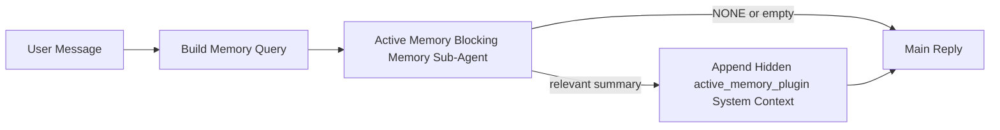

---
read_when:
    - アクティブメモリが何のためのものかを理解したい場合
    - 会話型エージェントでアクティブメモリを有効にしたい場合
    - どこでも有効にすることなく、アクティブメモリの動作を調整したい場合
summary: 対話型チャットセッションに関連するメモリを注入する、プラグイン所有のブロッキングメモリサブエージェント
title: アクティブメモリ
x-i18n:
    generated_at: "2026-04-11T04:31:47Z"
    model: gpt-5.4
    provider: openai
    source_hash: e8b0e6539e09678e9e8def68795f8bcb992f98509423da3da3123eda88ec1dd5
    source_path: concepts/active-memory.md
    workflow: 15
---

# アクティブメモリ

アクティブメモリは、対象となる会話セッションでメインの応答の前に実行される、オプションのプラグイン所有のブロッキングメモリサブエージェントです。

これは、ほとんどのメモリシステムが高機能ではあっても受動的だからです。メインエージェントがいつメモリを検索するかを判断することに依存していたり、ユーザーが「これを覚えて」や「メモリを検索して」のように言うことに依存していたりします。その時点では、メモリによって応答が自然に感じられるはずだった瞬間は、すでに過ぎています。

アクティブメモリは、メインの応答が生成される前に、関連するメモリをシステムが浮上させるための、制限された1回の機会を与えます。

## これをエージェントに貼り付ける

自己完結型で安全なデフォルト設定でアクティブメモリを有効にしたい場合は、これをエージェントに貼り付けてください。

```json5
{
  plugins: {
    entries: {
      "active-memory": {
        enabled: true,
        config: {
          enabled: true,
          agents: ["main"],
          allowedChatTypes: ["direct"],
          modelFallbackPolicy: "default-remote",
          queryMode: "recent",
          promptStyle: "balanced",
          timeoutMs: 15000,
          maxSummaryChars: 220,
          persistTranscripts: false,
          logging: true,
        },
      },
    },
  },
}
```

これにより、`main`エージェントでプラグインが有効になり、既定ではダイレクトメッセージ形式のセッションのみに限定され、まず現在のセッションモデルを継承し、明示的または継承されたモデルが利用できない場合でも組み込みのリモートフォールバックを使用できます。

その後、Gatewayを再起動します。

```bash
openclaw gateway
```

会話中にライブで確認するには、次を実行します。

```text
/verbose on
```

## アクティブメモリを有効にする

最も安全な設定は次のとおりです。

1. プラグインを有効にする
2. 1つの会話型エージェントを対象にする
3. 調整中のみログを有効にしておく

まず、`openclaw.json`にこれを追加します。

```json5
{
  plugins: {
    entries: {
      "active-memory": {
        enabled: true,
        config: {
          agents: ["main"],
          allowedChatTypes: ["direct"],
          modelFallbackPolicy: "default-remote",
          queryMode: "recent",
          promptStyle: "balanced",
          timeoutMs: 15000,
          maxSummaryChars: 220,
          persistTranscripts: false,
          logging: true,
        },
      },
    },
  },
}
```

次に、Gatewayを再起動します。

```bash
openclaw gateway
```

これが意味することは次のとおりです。

- `plugins.entries.active-memory.enabled: true` はプラグインを有効にします
- `config.agents: ["main"]` は `main` エージェントのみをアクティブメモリの対象にします
- `config.allowedChatTypes: ["direct"]` は、既定でダイレクトメッセージ形式のセッションでのみアクティブメモリを有効にします
- `config.model` が未設定の場合、アクティブメモリはまず現在のセッションモデルを継承します
- `config.modelFallbackPolicy: "default-remote"` は、明示的または継承されたモデルが利用できない場合に、組み込みのリモートフォールバックを既定として維持します
- `config.promptStyle: "balanced"` は、`recent` モードの既定の汎用プロンプトスタイルを使用します
- アクティブメモリは、対象となる対話型の永続チャットセッションでのみ引き続き実行されます

## 確認方法

アクティブメモリは、モデルに対して非表示のシステムコンテキストを注入します。生の `<active_memory_plugin>...</active_memory_plugin>` タグをクライアントに公開することはありません。

## セッショントグル

設定を編集せずに現在のチャットセッションでアクティブメモリを一時停止または再開したい場合は、プラグインコマンドを使用します。

```text
/active-memory status
/active-memory off
/active-memory on
```

これはセッションスコープです。`plugins.entries.active-memory.enabled`、エージェントの対象設定、その他のグローバル設定は変更しません。

設定を書き込み、すべてのセッションでアクティブメモリを一時停止または再開したい場合は、明示的なグローバル形式を使用します。

```text
/active-memory status --global
/active-memory off --global
/active-memory on --global
```

グローバル形式は `plugins.entries.active-memory.config.enabled` に書き込みます。後でコマンドでアクティブメモリを再度有効にできるように、`plugins.entries.active-memory.enabled` は有効なままにします。

ライブセッションでアクティブメモリが何をしているか確認したい場合は、そのセッションで詳細モードを有効にします。

```text
/verbose on
```

詳細表示を有効にすると、OpenClaw は次を表示できます。

- `Active Memory: ok 842ms recent 34 chars` のようなアクティブメモリのステータス行
- `Active Memory Debug: Lemon pepper wings with blue cheese.` のような読みやすいデバッグ要約

これらの行は、非表示のシステムコンテキストに渡されるのと同じアクティブメモリの処理から導出されますが、生のプロンプトマークアップを公開する代わりに、人間向けに整形されています。

既定では、このブロッキングメモリサブエージェントのトランスクリプトは一時的なもので、実行完了後に削除されます。

フロー例:

```text
/verbose on
what wings should i order?
```

想定される表示上の応答の形:

```text
...normal assistant reply...

🧩 Active Memory: ok 842ms recent 34 chars
🔎 Active Memory Debug: Lemon pepper wings with blue cheese.
```

## 実行されるタイミング

アクティブメモリは2つのゲートを使用します。

1. **設定によるオプトイン**  
   プラグインが有効であり、現在のエージェントIDが `plugins.entries.active-memory.config.agents` に含まれている必要があります。
2. **厳格なランタイム適格性**  
   有効化され対象指定されていても、アクティブメモリは対象となる対話型の永続チャットセッションでのみ実行されます。

実際のルールは次のとおりです。

```text
plugin enabled
+
agent id targeted
+
allowed chat type
+
eligible interactive persistent chat session
=
active memory runs
```

これらのいずれかが満たされない場合、アクティブメモリは実行されません。

## セッションタイプ

`config.allowedChatTypes` は、どの種類の会話でアクティブメモリをそもそも実行できるかを制御します。

既定値は次のとおりです。

```json5
allowedChatTypes: ["direct"]
```

つまり、アクティブメモリは既定ではダイレクトメッセージ形式のセッションで実行されますが、グループやチャネルのセッションでは、明示的にオプトインしない限り実行されません。

例:

```json5
allowedChatTypes: ["direct"]
```

```json5
allowedChatTypes: ["direct", "group"]
```

```json5
allowedChatTypes: ["direct", "group", "channel"]
```

## 実行される場所

アクティブメモリは、プラットフォーム全体の推論機能ではなく、会話を強化する機能です。

| Surface                                                             | アクティブメモリは実行されるか                              |
| ------------------------------------------------------------------- | ----------------------------------------------------------- |
| Control UI / web chat の永続セッション                              | はい。プラグインが有効で、エージェントが対象なら実行されます |
| 同じ永続チャットパス上の他の対話型チャネルセッション                | はい。プラグインが有効で、エージェントが対象なら実行されます |
| ヘッドレスなワンショット実行                                        | いいえ                                                      |
| Heartbeat/バックグラウンド実行                                      | いいえ                                                      |
| 汎用の内部 `agent-command` パス                                     | いいえ                                                      |
| サブエージェント/内部ヘルパー実行                                   | いいえ                                                      |

## 使う理由

次のような場合にアクティブメモリを使用します。

- セッションが永続的でユーザー向けである
- エージェントが検索すべき意味のある長期メモリを持っている
- 生のプロンプトの決定性よりも、一貫性とパーソナライズが重要である

特に次のようなものに効果的です。

- 安定した好み
- 繰り返される習慣
- 自然に表面化すべき長期的なユーザーコンテキスト

次のような用途には向いていません。

- 自動化
- 内部ワーカー
- ワンショットAPIタスク
- 非表示のパーソナライズが驚きになってしまう場所

## 仕組み

ランタイムの形は次のとおりです。



このブロッキングメモリサブエージェントが使用できるのは次のみです。

- `memory_search`
- `memory_get`

接続が弱い場合は、`NONE` を返すべきです。

## クエリモード

`config.queryMode` は、ブロッキングメモリサブエージェントがどれだけ会話を参照するかを制御します。

## プロンプトスタイル

`config.promptStyle` は、ブロッキングメモリサブエージェントがメモリを返すべきかどうかを判断する際に、どれだけ積極的または厳格になるかを制御します。

使用可能なスタイル:

- `balanced`: `recent` モード向けの汎用既定値
- `strict`: 最も控えめ。近接したコンテキストからのにじみをできるだけ抑えたい場合に最適
- `contextual`: 最も継続性に優しい。会話履歴をより重視すべき場合に最適
- `recall-heavy`: 弱めだがもっともらしい一致でも、より積極的にメモリを浮上させる
- `precision-heavy`: 一致が明白でない限り、積極的に `NONE` を優先する
- `preference-only`: お気に入り、習慣、日課、好み、繰り返し現れる個人的事実に最適化

`config.promptStyle` が未設定の場合の既定の対応:

```text
message -> strict
recent -> balanced
full -> contextual
```

`config.promptStyle` を明示的に設定した場合は、その上書き設定が優先されます。

例:

```json5
promptStyle: "preference-only"
```

## モデルフォールバックポリシー

`config.model` が未設定の場合、アクティブメモリは次の順序でモデルの解決を試みます。

```text
explicit plugin model
-> current session model
-> agent primary model
-> optional built-in remote fallback
```

`config.modelFallbackPolicy` は最後のステップを制御します。

既定値:

```json5
modelFallbackPolicy: "default-remote"
```

その他のオプション:

```json5
modelFallbackPolicy: "resolved-only"
```

明示的または継承されたモデルが利用できないときに、組み込みのリモート既定値へフォールバックする代わりにアクティブメモリでリコールをスキップしたい場合は、`resolved-only` を使用します。

## 高度なエスケープハッチ

これらのオプションは、意図的に推奨設定には含めていません。

`config.thinking` では、ブロッキングメモリサブエージェントの thinking レベルを上書きできます。

```json5
thinking: "medium"
```

既定値:

```json5
thinking: "off"
```

これは既定では有効にしないでください。アクティブメモリは応答経路で実行されるため、thinking 時間が増えると、そのままユーザーに見えるレイテンシが増加します。

`config.promptAppend` は、既定のアクティブメモリプロンプトの後、会話コンテキストの前に、追加の運用者向け指示を加えます。

```json5
promptAppend: "Prefer stable long-term preferences over one-off events."
```

`config.promptOverride` は、既定のアクティブメモリプロンプトを置き換えます。OpenClaw はその後も会話コンテキストを追加します。

```json5
promptOverride: "You are a memory search agent. Return NONE or one compact user fact."
```

プロンプトのカスタマイズは、異なるリコール契約を意図的にテストしている場合を除き、推奨されません。既定のプロンプトは、`NONE` またはメインモデル向けのコンパクトなユーザー事実コンテキストを返すように調整されています。

### `message`

最新のユーザーメッセージのみが送信されます。

```text
Latest user message only
```

このモードを使うのは次のような場合です。

- 最速の動作にしたい
- 安定した好みのリコールに最も強く寄せたい
- フォローアップのターンで会話コンテキストが不要

推奨タイムアウト:

- `3000` 〜 `5000` ms 前後から始める

### `recent`

最新のユーザーメッセージに加えて、直近の会話の短い末尾が送信されます。

```text
Recent conversation tail:
user: ...
assistant: ...
user: ...

Latest user message:
...
```

このモードを使うのは次のような場合です。

- 速度と会話の文脈づけのバランスをより良くしたい
- フォローアップの質問が直近の数ターンに依存することが多い

推奨タイムアウト:

- `15000` ms 前後から始める

### `full`

会話全体がブロッキングメモリサブエージェントに送信されます。

```text
Full conversation context:
user: ...
assistant: ...
user: ...
...
```

このモードを使うのは次のような場合です。

- レイテンシよりも、できるだけ高いリコール品質が重要
- 会話スレッドのかなり前方に重要な前提情報が含まれている

推奨タイムアウト:

- `message` や `recent` と比べて大幅に増やす
- スレッドサイズに応じて `15000` ms 以上から始める

一般に、タイムアウトはコンテキストサイズに応じて増やすべきです。

```text
message < recent < full
```

## トランスクリプトの永続化

アクティブメモリのブロッキングメモリサブエージェント実行では、ブロッキングメモリサブエージェント呼び出し中に実際の `session.jsonl` トランスクリプトが作成されます。

既定では、そのトランスクリプトは一時的なものです:

- 一時ディレクトリに書き込まれます
- ブロッキングメモリサブエージェントの実行にのみ使用されます
- 実行完了直後に削除されます

デバッグや確認のために、それらのブロッキングメモリサブエージェントのトランスクリプトをディスク上に保持したい場合は、永続化を明示的に有効にしてください。

```json5
{
  plugins: {
    entries: {
      "active-memory": {
        enabled: true,
        config: {
          agents: ["main"],
          persistTranscripts: true,
          transcriptDir: "active-memory",
        },
      },
    },
  },
}
```

有効にすると、アクティブメモリは、対象エージェントのセッションフォルダー配下の別ディレクトリにトランスクリプトを保存し、メインのユーザー会話トランスクリプトのパスには保存しません。

既定のレイアウトは概念的には次のとおりです。

```text
agents/<agent>/sessions/active-memory/<blocking-memory-sub-agent-session-id>.jsonl
```

相対サブディレクトリは `config.transcriptDir` で変更できます。

これは慎重に使用してください。

- ブロッキングメモリサブエージェントのトランスクリプトは、セッションが多忙だとすぐに蓄積する可能性があります
- `full` クエリモードでは、大量の会話コンテキストが重複する可能性があります
- これらのトランスクリプトには、非表示のプロンプトコンテキストとリコールされたメモリが含まれます

## 設定

すべてのアクティブメモリ設定は次の配下にあります。

```text
plugins.entries.active-memory
```

最も重要なフィールドは次のとおりです。

| Key                         | Type                                                                                                 | 意味                                                                                                   |
| --------------------------- | ---------------------------------------------------------------------------------------------------- | ------------------------------------------------------------------------------------------------------ |
| `enabled`                   | `boolean`                                                                                            | プラグイン自体を有効にします                                                                           |
| `config.agents`             | `string[]`                                                                                           | アクティブメモリを使用できるエージェントID                                                              |
| `config.model`              | `string`                                                                                             | オプションのブロッキングメモリサブエージェントモデル参照。未設定の場合、アクティブメモリは現在のセッションモデルを使用します |
| `config.queryMode`          | `"message" \| "recent" \| "full"`                                                                    | ブロッキングメモリサブエージェントがどれだけ会話を参照するかを制御します                               |
| `config.promptStyle`        | `"balanced" \| "strict" \| "contextual" \| "recall-heavy" \| "precision-heavy" \| "preference-only"` | ブロッキングメモリサブエージェントがメモリを返すべきか判断する際に、どれだけ積極的または厳格になるかを制御します |
| `config.thinking`           | `"off" \| "minimal" \| "low" \| "medium" \| "high" \| "xhigh" \| "adaptive"`                         | ブロッキングメモリサブエージェント向けの高度な thinking 上書き。速度のため既定は `off`                 |
| `config.promptOverride`     | `string`                                                                                             | 高度な完全プロンプト置換。通常の用途には推奨されません                                                 |
| `config.promptAppend`       | `string`                                                                                             | 既定または上書きされたプロンプトに追加される高度な追加指示                                             |
| `config.timeoutMs`          | `number`                                                                                             | ブロッキングメモリサブエージェントのハードタイムアウト                                                 |
| `config.maxSummaryChars`    | `number`                                                                                             | active-memory 要約で許可される合計最大文字数                                                           |
| `config.logging`            | `boolean`                                                                                            | 調整中にアクティブメモリのログを出力します                                                             |
| `config.persistTranscripts` | `boolean`                                                                                            | 一時ファイルを削除せず、ブロッキングメモリサブエージェントのトランスクリプトをディスクに保持します     |
| `config.transcriptDir`      | `string`                                                                                             | エージェントのセッションフォルダー配下に置かれる、相対的なブロッキングメモリサブエージェント用トランスクリプトディレクトリ |

便利な調整用フィールド:

| Key                           | Type     | 意味                                                            |
| ----------------------------- | -------- | --------------------------------------------------------------- |
| `config.maxSummaryChars`      | `number` | active-memory 要約で許可される合計最大文字数                    |
| `config.recentUserTurns`      | `number` | `queryMode` が `recent` のときに含める直前のユーザーターン数    |
| `config.recentAssistantTurns` | `number` | `queryMode` が `recent` のときに含める直前のアシスタントターン数 |
| `config.recentUserChars`      | `number` | 各最近のユーザーターンあたりの最大文字数                        |
| `config.recentAssistantChars` | `number` | 各最近のアシスタントターンあたりの最大文字数                    |
| `config.cacheTtlMs`           | `number` | 同一クエリの繰り返しに対するキャッシュ再利用                    |

## 推奨設定

まずは `recent` から始めてください。

```json5
{
  plugins: {
    entries: {
      "active-memory": {
        enabled: true,
        config: {
          agents: ["main"],
          queryMode: "recent",
          promptStyle: "balanced",
          timeoutMs: 15000,
          maxSummaryChars: 220,
          logging: true,
        },
      },
    },
  },
}
```

調整中にライブの動作を確認したい場合は、別個の active-memory デバッグコマンドを探すのではなく、セッションで `/verbose on` を使ってください。

その後、次のように移行します。

- レイテンシを下げたい場合は `message`
- 追加コンテキストにより、より遅いブロッキングメモリサブエージェントでも価値があると判断した場合は `full`

## デバッグ

期待した場所でアクティブメモリが表示されない場合:

1. `plugins.entries.active-memory.enabled` でプラグインが有効になっていることを確認します。
2. 現在のエージェントIDが `config.agents` に含まれていることを確認します。
3. 対話型の永続チャットセッション経由でテストしていることを確認します。
4. `config.logging: true` を有効にして、Gatewayログを確認します。
5. `openclaw memory status --deep` でメモリ検索自体が機能していることを検証します。

メモリヒットのノイズが多い場合は、次を厳しくします。

- `maxSummaryChars`

アクティブメモリが遅すぎる場合は、次を検討します。

- `queryMode` を下げる
- `timeoutMs` を下げる
- 最近のターン数を減らす
- ターンごとの文字数上限を減らす

## 関連ページ

- [メモリ検索](/ja-JP/concepts/memory-search)
- [メモリ設定リファレンス](/ja-JP/reference/memory-config)
- [Plugin SDK セットアップ](/ja-JP/plugins/sdk-setup)
