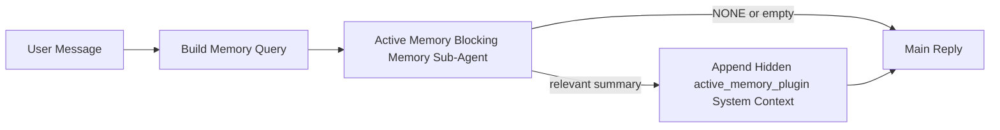

---
read_when:
    - アクティブメモリが何のためのものかを理解したい場合
    - 会話型エージェントでアクティブメモリを有効にしたい場合
    - どこでも有効にすることなく、アクティブメモリの動作を調整したい場合
summary: インタラクティブなチャットセッションに関連するメモリを注入する、プラグイン所有のブロッキングメモリサブエージェント
title: アクティブメモリ
x-i18n:
    generated_at: "2026-04-12T04:43:46Z"
    model: gpt-5.4
    provider: openai
    source_hash: 59456805c28daaab394ba2a7f87e1104a1334a5cf32dbb961d5d232d9c471d84
    source_path: concepts/active-memory.md
    workflow: 15
---

# アクティブメモリ

アクティブメモリは、対象となる会話セッションにおいてメインの返信の前に実行される、オプションのプラグイン所有ブロッキングメモリサブエージェントです。

これは、ほとんどのメモリシステムが高機能であっても受動的だからです。メインエージェントがいつメモリを検索するかを決めることに依存していたり、ユーザーが「これを覚えて」や「メモリを検索して」のように言うことに依存していたりします。その時点では、メモリによって返信が自然に感じられたはずのタイミングはすでに過ぎています。

アクティブメモリは、メインの返信が生成される前に関連するメモリを表に出すための、制限された1回の機会をシステムに与えます。

## これをエージェントに貼り付ける

自己完結型で安全なデフォルト設定によりアクティブメモリを有効にしたい場合は、これをエージェントに貼り付けてください。

```json5
{
  plugins: {
    entries: {
      "active-memory": {
        enabled: true,
        config: {
          enabled: true,
          agents: ["main"],
          allowedChatTypes: ["direct"],
          modelFallback: "google/gemini-3-flash",
          queryMode: "recent",
          promptStyle: "balanced",
          timeoutMs: 15000,
          maxSummaryChars: 220,
          persistTranscripts: false,
          logging: true,
        },
      },
    },
  },
}
```

これにより、`main` エージェントでプラグインが有効になり、デフォルトではダイレクトメッセージ形式のセッションに限定され、まず現在のセッションモデルを継承し、明示的または継承されたモデルが利用できない場合にのみ設定済みのフォールバックモデルを使用します。

その後、Gateway を再起動します。

```bash
openclaw gateway
```

会話の中でライブ確認するには、次を使います。

```text
/verbose on
```

## アクティブメモリを有効にする

最も安全なセットアップは次のとおりです。

1. プラグインを有効にする
2. 1つの会話型エージェントを対象にする
3. 調整中のみロギングを有効にしておく

`openclaw.json` では次の設定から始めてください。

```json5
{
  plugins: {
    entries: {
      "active-memory": {
        enabled: true,
        config: {
          agents: ["main"],
          allowedChatTypes: ["direct"],
          modelFallback: "google/gemini-3-flash",
          queryMode: "recent",
          promptStyle: "balanced",
          timeoutMs: 15000,
          maxSummaryChars: 220,
          persistTranscripts: false,
          logging: true,
        },
      },
    },
  },
}
```

その後、Gateway を再起動します。

```bash
openclaw gateway
```

これが意味すること:

- `plugins.entries.active-memory.enabled: true` はプラグインを有効にします
- `config.agents: ["main"]` は `main` エージェントだけをアクティブメモリの対象にします
- `config.allowedChatTypes: ["direct"]` は、デフォルトでアクティブメモリをダイレクトメッセージ形式のセッションのみに制限します
- `config.model` が未設定の場合、アクティブメモリはまず現在のセッションモデルを継承します
- `config.modelFallback` は、必要に応じてリコール用の独自のフォールバック provider/model を指定します
- `config.promptStyle: "balanced"` は、`recent` モード向けのデフォルトの汎用プロンプトスタイルを使用します
- アクティブメモリは、対象となるインタラクティブな永続チャットセッションでのみ実行されます

## これを確認する方法

アクティブメモリは、モデルに対して非表示のシステムコンテキストを注入します。生の `<active_memory_plugin>...</active_memory_plugin>` タグをクライアントに公開することはありません。

## セッショントグル

設定を編集せずに現在のチャットセッションでアクティブメモリを一時停止または再開したい場合は、プラグインコマンドを使用します。

```text
/active-memory status
/active-memory off
/active-memory on
```

これはセッションスコープです。`plugins.entries.active-memory.enabled`、エージェントの対象指定、その他のグローバル設定は変更しません。

すべてのセッションに対して設定を書き込み、アクティブメモリを一時停止または再開したい場合は、明示的なグローバル形式を使用します。

```text
/active-memory status --global
/active-memory off --global
/active-memory on --global
```

グローバル形式は `plugins.entries.active-memory.config.enabled` に書き込みます。後でコマンドから再度アクティブメモリを有効にできるように、`plugins.entries.active-memory.enabled` は有効のままにします。

ライブセッションでアクティブメモリが何をしているか確認したい場合は、そのセッションで verbose モードを有効にします。

```text
/verbose on
```

verbose を有効にすると、OpenClaw は次を表示できます。

- `Active Memory: ok 842ms recent 34 chars` のようなアクティブメモリのステータス行
- `Active Memory Debug: Lemon pepper wings with blue cheese.` のような読みやすいデバッグ要約

これらの行は、非表示のシステムコンテキストに渡されるものと同じアクティブメモリのパスから生成されますが、生のプロンプトマークアップを公開する代わりに、人間が読める形式に整形されています。

デフォルトでは、ブロッキングメモリサブエージェントのトランスクリプトは一時的なもので、実行完了後に削除されます。

フロー例:

```text
/verbose on
what wings should i order?
```

想定される表示上の返信の形:

```text
...normal assistant reply...

🧩 Active Memory: ok 842ms recent 34 chars
🔎 Active Memory Debug: Lemon pepper wings with blue cheese.
```

## 実行されるタイミング

アクティブメモリは2つのゲートを使います。

1. **設定によるオプトイン**
   プラグインが有効であり、現在のエージェント id が
   `plugins.entries.active-memory.config.agents` に含まれている必要があります。
2. **厳密な実行時適格性**
   有効化され対象指定されていても、アクティブメモリは対象となる
   インタラクティブな永続チャットセッションでのみ実行されます。

実際のルールは次のとおりです。

```text
plugin enabled
+
agent id targeted
+
allowed chat type
+
eligible interactive persistent chat session
=
active memory runs
```

これらのいずれかが満たされない場合、アクティブメモリは実行されません。

## セッションタイプ

`config.allowedChatTypes` は、どの種類の会話でアクティブメモリを実行できるかを制御します。

デフォルトは次のとおりです。

```json5
allowedChatTypes: ["direct"]
```

これは、アクティブメモリはデフォルトではダイレクトメッセージ形式のセッションで実行される一方で、明示的にオプトインしない限りグループやチャンネルのセッションでは実行されないことを意味します。

例:

```json5
allowedChatTypes: ["direct"]
```

```json5
allowedChatTypes: ["direct", "group"]
```

```json5
allowedChatTypes: ["direct", "group", "channel"]
```

## 実行される場所

アクティブメモリは会話体験を強化する機能であり、プラットフォーム全体の推論機能ではありません。

| Surface                                                             | アクティブメモリは実行されるか?                           |
| ------------------------------------------------------------------- | -------------------------------------------------------- |
| Control UI / web chat の永続セッション                              | はい。プラグインが有効で、エージェントが対象なら実行されます |
| 同じ永続チャット経路上のその他のインタラクティブなチャネルセッション | はい。プラグインが有効で、エージェントが対象なら実行されます |
| ヘッドレスなワンショット実行                                         | いいえ                                                   |
| Heartbeat/バックグラウンド実行                                      | いいえ                                                   |
| 汎用の内部 `agent-command` 経路                                     | いいえ                                                   |
| サブエージェント/内部ヘルパー実行                                   | いいえ                                                   |

## これを使う理由

次の場合にアクティブメモリを使用します。

- セッションが永続的でユーザー向けである
- エージェントに検索する価値のある長期メモリがある
- 生のプロンプト決定性よりも、連続性とパーソナライズが重要である

特に次のような場合に効果的です。

- 安定した好み
- 繰り返される習慣
- 自然に表に出るべき長期的なユーザーコンテキスト

次のような用途には向いていません。

- 自動化
- 内部ワーカー
- ワンショット API タスク
- 非表示のパーソナライズが意外に感じられる場所

## 仕組み

実行時の形は次のとおりです。



ブロッキングメモリサブエージェントが使用できるのは次だけです。

- `memory_search`
- `memory_get`

接続が弱い場合は、`NONE` を返すべきです。

## クエリモード

`config.queryMode` は、ブロッキングメモリサブエージェントがどの程度の会話を参照するかを制御します。

## プロンプトスタイル

`config.promptStyle` は、ブロッキングメモリサブエージェントがメモリを返すかどうかを判断する際に、どの程度積極的または厳格にするかを制御します。

使用可能なスタイル:

- `balanced`: `recent` モード向けの汎用デフォルト
- `strict`: 最も慎重。近くのコンテキストからのにじみを極力少なくしたい場合に最適
- `contextual`: 最も連続性を重視。会話履歴をより重視したい場合に最適
- `recall-heavy`: 弱めでも十分あり得る一致に対して、より積極的にメモリを表に出す
- `precision-heavy`: 一致が明白でない限り、積極的に `NONE` を優先する
- `preference-only`: お気に入り、習慣、ルーティン、好み、繰り返される個人的事実向けに最適化

`config.promptStyle` が未設定の場合のデフォルト対応:

```text
message -> strict
recent -> balanced
full -> contextual
```

`config.promptStyle` を明示的に設定した場合は、その上書きが優先されます。

例:

```json5
promptStyle: "preference-only"
```

## モデルフォールバックポリシー

`config.model` が未設定の場合、アクティブメモリは次の順序でモデル解決を試みます。

```text
explicit plugin model
-> current session model
-> agent primary model
-> optional configured fallback model
```

`config.modelFallback` は、設定済みフォールバックのステップを制御します。

任意のカスタムフォールバック:

```json5
modelFallback: "google/gemini-3-flash"
```

明示的なモデル、継承されたモデル、または設定済みのフォールバックモデルのいずれも解決できない場合、アクティブメモリはそのターンのリコールをスキップします。

`config.modelFallbackPolicy` は、古い設定との互換性のためだけに残されている非推奨フィールドです。現在は実行時の動作を変更しません。

## 高度なエスケープハッチ

これらのオプションは、意図的に推奨セットアップには含めていません。

`config.thinking` は、ブロッキングメモリサブエージェントの thinking レベルを上書きできます。

```json5
thinking: "medium"
```

デフォルト:

```json5
thinking: "off"
```

これはデフォルトでは有効にしないでください。アクティブメモリは返信経路で実行されるため、thinking 時間が増えると、ユーザーに見える待ち時間が直接増加します。

`config.promptAppend` は、デフォルトのアクティブメモリプロンプトの後、会話コンテキストの前に追加の運用者向け指示を加えます。

```json5
promptAppend: "Prefer stable long-term preferences over one-off events."
```

`config.promptOverride` は、デフォルトのアクティブメモリプロンプトを置き換えます。OpenClaw はその後ろに引き続き会話コンテキストを追加します。

```json5
promptOverride: "You are a memory search agent. Return NONE or one compact user fact."
```

プロンプトのカスタマイズは、別のリコール契約を意図的にテストしているのでなければ推奨されません。デフォルトのプロンプトは、`NONE` またはメインモデル向けの簡潔なユーザー事実コンテキストを返すように調整されています。

### `message`

最新のユーザーメッセージのみが送信されます。

```text
Latest user message only
```

これは次の場合に使います。

- 最速の動作がほしい
- 安定した嗜好のリコールに最も強いバイアスをかけたい
- フォローアップのターンに会話コンテキストが不要

推奨タイムアウト:

- `3000`〜`5000` ms 程度から始める

### `recent`

最新のユーザーメッセージに加えて、直近の小さな会話テールが送信されます。

```text
Recent conversation tail:
user: ...
assistant: ...
user: ...

Latest user message:
...
```

これは次の場合に使います。

- 速度と会話上のグラウンディングのより良いバランスがほしい
- フォローアップの質問が直前の数ターンに依存することが多い

推奨タイムアウト:

- `15000` ms 程度から始める

### `full`

会話全体がブロッキングメモリサブエージェントに送信されます。

```text
Full conversation context:
user: ...
assistant: ...
user: ...
...
```

これは次の場合に使います。

- 待ち時間よりも、できる限り高いリコール品質が重要
- 会話に、スレッドのかなり前にある重要な前提情報が含まれている

推奨タイムアウト:

- `message` や `recent` と比べて大幅に増やす
- スレッドサイズに応じて、`15000` ms 以上から始める

一般に、タイムアウトはコンテキストサイズに応じて増やすべきです。

```text
message < recent < full
```

## トランスクリプトの永続化

アクティブメモリのブロッキングメモリサブエージェント実行では、ブロッキングメモリサブエージェント呼び出し中に実際の `session.jsonl` トランスクリプトが作成されます。

デフォルトでは、そのトランスクリプトは一時的なものです:

- 一時ディレクトリに書き込まれる
- ブロッキングメモリサブエージェント実行でのみ使用される
- 実行終了直後に削除される

デバッグや確認のためにそれらのブロッキングメモリサブエージェントのトランスクリプトをディスク上に保持したい場合は、永続化を明示的に有効にしてください。

```json5
{
  plugins: {
    entries: {
      "active-memory": {
        enabled: true,
        config: {
          agents: ["main"],
          persistTranscripts: true,
          transcriptDir: "active-memory",
        },
      },
    },
  },
}
```

有効にすると、アクティブメモリはトランスクリプトを、メインのユーザー会話トランスクリプトのパスではなく、対象エージェントの sessions フォルダー配下の別ディレクトリに保存します。

デフォルトのレイアウトの概念は次のとおりです。

```text
agents/<agent>/sessions/active-memory/<blocking-memory-sub-agent-session-id>.jsonl
```

相対サブディレクトリは `config.transcriptDir` で変更できます。

これは慎重に使用してください。

- ブロッキングメモリサブエージェントのトランスクリプトは、セッションが多いとすぐに蓄積する可能性があります
- `full` クエリモードでは大量の会話コンテキストが重複することがあります
- これらのトランスクリプトには、非表示のプロンプトコンテキストとリコールされたメモリが含まれます

## 設定

アクティブメモリの設定はすべて次の配下にあります。

```text
plugins.entries.active-memory
```

最も重要なフィールドは次のとおりです。

| Key                         | Type                                                                                                 | 意味                                                                                             |
| --------------------------- | ---------------------------------------------------------------------------------------------------- | ------------------------------------------------------------------------------------------------ |
| `enabled`                   | `boolean`                                                                                            | プラグイン自体を有効にします                                                                     |
| `config.agents`             | `string[]`                                                                                           | アクティブメモリを使用できるエージェント id                                                      |
| `config.model`              | `string`                                                                                             | オプションのブロッキングメモリサブエージェントモデル参照。未設定時はアクティブメモリは現在のセッションモデルを使用します |
| `config.queryMode`          | `"message" \| "recent" \| "full"`                                                                    | ブロッキングメモリサブエージェントがどの程度の会話を見るかを制御します                           |
| `config.promptStyle`        | `"balanced" \| "strict" \| "contextual" \| "recall-heavy" \| "precision-heavy" \| "preference-only"` | ブロッキングメモリサブエージェントがメモリを返すかどうかを判断する際の積極性または厳格さを制御します |
| `config.thinking`           | `"off" \| "minimal" \| "low" \| "medium" \| "high" \| "xhigh" \| "adaptive"`                         | ブロッキングメモリサブエージェント向けの高度な thinking 上書き。速度のためデフォルトは `off`    |
| `config.promptOverride`     | `string`                                                                                             | 高度な完全プロンプト置き換え。通常の使用には推奨されません                                       |
| `config.promptAppend`       | `string`                                                                                             | デフォルトまたは上書きされたプロンプトに追加される高度な追加指示                                 |
| `config.timeoutMs`          | `number`                                                                                             | ブロッキングメモリサブエージェントのハードタイムアウト                                           |
| `config.maxSummaryChars`    | `number`                                                                                             | active-memory 要約で許可される合計文字数の最大値                                                 |
| `config.logging`            | `boolean`                                                                                            | 調整中にアクティブメモリのログを出力します                                                       |
| `config.persistTranscripts` | `boolean`                                                                                            | 一時ファイルを削除せず、ブロッキングメモリサブエージェントのトランスクリプトをディスク上に保持します |
| `config.transcriptDir`      | `string`                                                                                             | エージェントの sessions フォルダー配下の、ブロッキングメモリサブエージェントの相対トランスクリプトディレクトリ |

便利な調整フィールド:

| Key                           | Type     | 意味                                                      |
| ----------------------------- | -------- | --------------------------------------------------------- |
| `config.maxSummaryChars`      | `number` | active-memory 要約で許可される合計文字数の最大値         |
| `config.recentUserTurns`      | `number` | `queryMode` が `recent` のときに含める過去のユーザーターン数 |
| `config.recentAssistantTurns` | `number` | `queryMode` が `recent` のときに含める過去のアシスタントターン数 |
| `config.recentUserChars`      | `number` | 最近の各ユーザーターンあたりの最大文字数                 |
| `config.recentAssistantChars` | `number` | 最近の各アシスタントターンあたりの最大文字数             |
| `config.cacheTtlMs`           | `number` | 同一クエリが繰り返された場合のキャッシュ再利用時間       |

## 推奨セットアップ

`recent` から始めてください。

```json5
{
  plugins: {
    entries: {
      "active-memory": {
        enabled: true,
        config: {
          agents: ["main"],
          queryMode: "recent",
          promptStyle: "balanced",
          timeoutMs: 15000,
          maxSummaryChars: 220,
          logging: true,
        },
      },
    },
  },
}
```

調整中にライブの動作を確認したい場合は、別の active-memory デバッグコマンドを探すのではなく、セッション内で `/verbose on` を使用してください。

その後、次の方向に移行します。

- 待ち時間を短くしたい場合は `message`
- 追加のコンテキストに、より遅いブロッキングメモリサブエージェントの価値があると判断した場合は `full`

## デバッグ

アクティブメモリが想定した場所で表示されない場合:

1. `plugins.entries.active-memory.enabled` でプラグインが有効になっていることを確認します。
2. 現在のエージェント id が `config.agents` に含まれていることを確認します。
3. インタラクティブな永続チャットセッション経由でテストしていることを確認します。
4. `config.logging: true` を有効にし、Gateway のログを確認します。
5. `openclaw memory status --deep` でメモリ検索自体が動作することを確認します。

メモリヒットがノイジーな場合は、次を厳しくします。

- `maxSummaryChars`

アクティブメモリが遅すぎる場合:

- `queryMode` を下げる
- `timeoutMs` を下げる
- recent ターン数を減らす
- 各ターンの文字数上限を減らす

## 関連ページ

- [メモリ検索](/ja-JP/concepts/memory-search)
- [メモリ設定リファレンス](/ja-JP/reference/memory-config)
- [Plugin SDK セットアップ](/ja-JP/plugins/sdk-setup)
