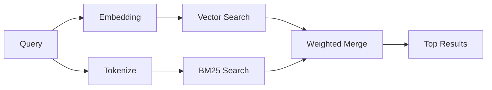

---
read_when:
    - '`memory_search` がどのように動作するかを理解したい。'
    - 埋め込みプロバイダーを選びたい。
    - 検索品質を調整したい。
summary: 埋め込みとハイブリッド検索を使用してメモリ検索が関連するメモを見つける方法
title: メモリ検索
x-i18n:
    generated_at: "2026-04-15T14:40:28Z"
    model: gpt-5.4
    provider: openai
    source_hash: f5757aa8fe8f7fec30ef5c826f72230f591ce4cad591d81a091189d50d4262ed
    source_path: concepts/memory-search.md
    workflow: 15
---

# メモリ検索

`memory_search` は、元の文章と表現が異なる場合でも、メモリファイルから関連するメモを見つけます。これは、メモリを小さなチャンクにインデックス化し、埋め込み、キーワード、またはその両方を使って検索することで動作します。

## クイックスタート

GitHub Copilot のサブスクリプション、OpenAI、Gemini、Voyage、または Mistral の API キーが設定されている場合、メモリ検索は自動的に動作します。プロバイダーを明示的に設定するには、次のようにします。

```json5
{
  agents: {
    defaults: {
      memorySearch: {
        provider: "openai", // または "gemini"、"local"、"ollama" など。
      },
    },
  },
}
```

API キーなしでローカル埋め込みを使うには、`provider: "local"` を使用します（`node-llama-cpp` が必要です）。

## サポートされているプロバイダー

| プロバイダー | ID               | API キーが必要 | 備考                                             |
| ------------ | ---------------- | -------------- | ------------------------------------------------ |
| Bedrock      | `bedrock`        | いいえ         | AWS 認証情報チェーンが解決されると自動検出されます |
| Gemini       | `gemini`         | はい           | 画像/音声のインデックス化をサポートします        |
| GitHub Copilot | `github-copilot` | いいえ       | 自動検出され、Copilot サブスクリプションを使用します |
| Local        | `local`          | いいえ         | GGUF モデル、約 0.6 GB のダウンロード            |
| Mistral      | `mistral`        | はい           | 自動検出されます                                 |
| Ollama       | `ollama`         | いいえ         | ローカル、明示的に設定する必要があります         |
| OpenAI       | `openai`         | はい           | 自動検出され、高速です                           |
| Voyage       | `voyage`         | はい           | 自動検出されます                                 |

## 検索の仕組み

OpenClaw は 2 つの検索経路を並列に実行し、その結果をマージします。



- **ベクトル検索** は、意味が似ているメモを見つけます（「gateway host」が「OpenClaw を実行しているマシン」に一致するなど）。
- **BM25 キーワード検索** は、正確な一致を見つけます（ID、エラー文字列、設定キーなど）。

片方の経路しか利用できない場合（埋め込みがない、または FTS がない場合）は、利用可能な方のみが実行されます。

埋め込みが利用できない場合でも、OpenClaw は生の完全一致順だけにフォールバックするのではなく、FTS 結果に対する語彙ランキングを引き続き使用します。この劣化モードでは、クエリ語のカバレッジが高いチャンクや関連するファイルパスを持つチャンクが優先されるため、`sqlite-vec` や埋め込みプロバイダーがなくても有用な再現率を維持できます。

## 検索品質の改善

大量のメモ履歴がある場合は、2 つのオプション機能が役立ちます。

### 時間減衰

古いメモのランキング重みを徐々に下げることで、最近の情報が先に表示されるようにします。デフォルトの半減期は 30 日で、先月のメモは元の重みの 50% になります。`MEMORY.md` のような永続的なファイルには減衰は適用されません。

<Tip>
エージェントに数か月分の日次メモがあり、古い情報が最近のコンテキストより上位に来続ける場合は、時間減衰を有効にしてください。
</Tip>

### MMR（多様性）

重複した結果を減らします。5 つのメモがすべて同じルーター設定に言及している場合でも、MMR によって上位結果が繰り返しではなく異なるトピックをカバーするようになります。

<Tip>
`memory_search` が異なる日次メモからほぼ重複したスニペットばかり返す場合は、MMR を有効にしてください。
</Tip>

### 両方を有効にする

```json5
{
  agents: {
    defaults: {
      memorySearch: {
        query: {
          hybrid: {
            mmr: { enabled: true },
            temporalDecay: { enabled: true },
          },
        },
      },
    },
  },
}
```

## マルチモーダルメモリ

Gemini Embedding 2 を使うと、Markdown と一緒に画像ファイルや音声ファイルもインデックス化できます。検索クエリ自体はテキストのままですが、視覚コンテンツや音声コンテンツにも一致します。セットアップについては、[メモリ設定リファレンス](/ja-JP/reference/memory-config) を参照してください。

## セッションメモリ検索

必要に応じてセッショントランスクリプトをインデックス化し、`memory_search` が過去の会話を思い出せるようにできます。これは `memorySearch.experimental.sessionMemory` によるオプトイン機能です。詳細は [設定リファレンス](/ja-JP/reference/memory-config) を参照してください。

## トラブルシューティング

**結果が出ない場合** `openclaw memory status` を実行してインデックスを確認してください。空の場合は、`openclaw memory index --force` を実行してください。

**キーワード一致しか出ない場合** 埋め込みプロバイダーが設定されていない可能性があります。`openclaw memory status --deep` を確認してください。

**CJK テキストが見つからない場合** `openclaw memory index --force` で FTS インデックスを再構築してください。

## 参考情報

- [Active Memory](/ja-JP/concepts/active-memory) -- 対話型チャットセッション向けのサブエージェントメモリ
- [メモリ](/ja-JP/concepts/memory) -- ファイルレイアウト、バックエンド、ツール
- [メモリ設定リファレンス](/ja-JP/reference/memory-config) -- すべての設定項目
