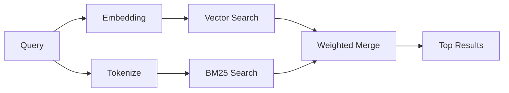

---
read_when:
    - memory_search の動作を理解したい
    - 埋め込みプロバイダーを選びたい
    - 検索品質を調整したい
summary: 埋め込みとハイブリッド検索を使ってメモリ検索が関連ノートを見つける仕組み
title: メモリ検索
x-i18n:
    generated_at: "2026-04-06T03:06:31Z"
    model: gpt-5.4
    provider: openai
    source_hash: b6541cd702bff41f9a468dad75ea438b70c44db7c65a4b793cbacaf9e583c7e9
    source_path: concepts/memory-search.md
    workflow: 15
---

# メモリ検索

`memory_search` は、元の文言と異なっていても、メモリファイルから関連するノートを見つけます。これは、メモリを小さなチャンクに索引化し、埋め込み、キーワード、またはその両方を使って検索することで動作します。

## クイックスタート

OpenAI、Gemini、Voyage、または Mistral の API キーが設定されていれば、メモリ検索は自動的に動作します。プロバイダーを明示的に設定するには、次のようにします。

```json5
{
  agents: {
    defaults: {
      memorySearch: {
        provider: "openai", // or "gemini", "local", "ollama", etc.
      },
    },
  },
}
```

API キーなしでローカル埋め込みを使うには、`provider: "local"` を使用します（`node-llama-cpp` が必要です）。

## サポートされているプロバイダー

| プロバイダー | ID        | API キーが必要 | 注記 |
| -------- | --------- | ------------- | ---------------------------------------------------- |
| OpenAI   | `openai`  | はい          | 自動検出、高速 |
| Gemini   | `gemini`  | はい          | 画像/音声のインデックス作成をサポート |
| Voyage   | `voyage`  | はい          | 自動検出 |
| Mistral  | `mistral` | はい          | 自動検出 |
| Bedrock  | `bedrock` | いいえ        | AWS 認証情報チェーンが解決されると自動検出 |
| Ollama   | `ollama`  | いいえ        | ローカル、明示的な設定が必要 |
| Local    | `local`   | いいえ        | GGUF モデル、約 0.6 GB のダウンロード |

## 検索の仕組み

OpenClaw は 2 つの検索パスを並列に実行し、結果を統合します。



- **ベクトル検索** は意味が近いノートを見つけます（「gateway host」が「OpenClaw を実行しているマシン」に一致するなど）。
- **BM25 キーワード検索** は完全一致を見つけます（ID、エラー文字列、設定キー）。

どちらか一方のパスしか利用できない場合（埋め込みなし、または FTS なし）は、利用可能な方だけが実行されます。

## 検索品質の改善

ノート履歴が大きい場合は、2 つの任意機能が役立ちます。

### 時間減衰

古いノートはランキングの重みを徐々に失うため、最近の情報が先に浮上します。デフォルトの半減期 30 日では、先月のノートは元の重みの 50% でスコア付けされます。`MEMORY.md` のような恒常的なファイルは減衰しません。

<Tip>
エージェントに数か月分のデイリーノートがあり、古い情報が最近のコンテキストより上位に来続ける場合は、時間減衰を有効にしてください。
</Tip>

### MMR（多様性）

冗長な結果を減らします。5 つのノートすべてが同じルーター設定に言及している場合、MMR は上位結果が繰り返しではなく異なるトピックをカバーするようにします。

<Tip>
`memory_search` が異なるデイリーノートからほぼ重複するスニペットばかり返す場合は、MMR を有効にしてください。
</Tip>

### 両方を有効にする

```json5
{
  agents: {
    defaults: {
      memorySearch: {
        query: {
          hybrid: {
            mmr: { enabled: true },
            temporalDecay: { enabled: true },
          },
        },
      },
    },
  },
}
```

## マルチモーダルメモリ

Gemini Embedding 2 では、Markdown と並べて画像ファイルや音声ファイルを索引化できます。検索クエリは引き続きテキストですが、視覚コンテンツや音声コンテンツに対して一致します。設定方法は [メモリ設定リファレンス](/ja-JP/reference/memory-config) を参照してください。

## セッションメモリ検索

`memory_search` が過去の会話を呼び出せるように、セッショントランスクリプトを任意で索引化できます。これは `memorySearch.experimental.sessionMemory` によるオプトインです。詳細は [設定リファレンス](/ja-JP/reference/memory-config) を参照してください。

## トラブルシューティング

**結果が出ない場合** `openclaw memory status` を実行してインデックスを確認してください。空であれば、`openclaw memory index --force` を実行してください。

**キーワード一致しか出ない場合** 埋め込みプロバイダーが設定されていない可能性があります。`openclaw memory status --deep` を確認してください。

**CJK テキストが見つからない場合** `openclaw memory index --force` で FTS インデックスを再構築してください。

## さらに読む

- [メモリ](/ja-JP/concepts/memory) -- ファイルレイアウト、バックエンド、ツール
- [メモリ設定リファレンス](/ja-JP/reference/memory-config) -- すべての設定項目
