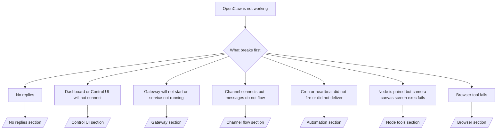

---
read_when:
    - OpenClaw が動作しておらず、最短で解決する方法が必要な場合
    - 詳細な手順に入る前にトリアージの流れを確認したい場合
summary: OpenClaw の症状別トラブルシューティングハブ
title: 一般的なトラブルシューティング
x-i18n:
    generated_at: "2026-04-08T02:16:48Z"
    model: gpt-5.4
    provider: openai
    source_hash: 8abda90ef80234c2f91a51c5e1f2c004d4a4da12a5d5631b5927762550c6d5e3
    source_path: help/troubleshooting.md
    workflow: 15
---

# トラブルシューティング

2 分しかない場合は、このページをトリアージの入口として使ってください。

## 最初の 60 秒

この順番どおりに、次のコマンドを実行してください。

```bash
openclaw status
openclaw status --all
openclaw gateway probe
openclaw gateway status
openclaw doctor
openclaw channels status --probe
openclaw logs --follow
```

良い出力の目安:

- `openclaw status` → 設定済みチャネルが表示され、明らかな認証エラーがない。
- `openclaw status --all` → 完全なレポートが表示され、共有可能である。
- `openclaw gateway probe` → 想定している Gateway ターゲットに到達できる（`Reachable: yes`）。`RPC: limited - missing scope: operator.read` は診断機能の劣化であり、接続失敗ではありません。
- `openclaw gateway status` → `Runtime: running` と `RPC probe: ok`。
- `openclaw doctor` → ブロッキングな設定 / サービスエラーがない。
- `openclaw channels status --probe` → 到達可能な Gateway は、アカウントごとの live な
  transport 状態に加えて、`works` や `audit ok` などの probe / audit 結果を返します。Gateway に到達できない場合、このコマンドは設定のみのサマリーにフォールバックします。
- `openclaw logs --follow` → 安定したアクティビティがあり、繰り返す致命的エラーがない。

## Anthropic の長いコンテキストでの 429

次のエラーが表示される場合:
`HTTP 429: rate_limit_error: Extra usage is required for long context requests`
[/gateway/troubleshooting#anthropic-429-extra-usage-required-for-long-context](/ja-JP/gateway/troubleshooting#anthropic-429-extra-usage-required-for-long-context) を参照してください。

## ローカルの OpenAI 互換バックエンドは直接では動くが、OpenClaw では失敗する

ローカルまたはセルフホストの `/v1` バックエンドが、小さな直接の
`/v1/chat/completions` プローブには応答するのに、`openclaw infer model run` や通常の
エージェントターンでは失敗する場合:

1. エラーに `messages[].content` が文字列であることを期待するとある場合は、
   `models.providers.<provider>.models[].compat.requiresStringContent: true` を設定してください。
2. それでも OpenClaw のエージェントターンでのみバックエンドが失敗する場合は、
   `models.providers.<provider>.models[].compat.supportsTools: false` を設定して再試行してください。
3. 小さな直接呼び出しは依然として動作するのに、より大きな OpenClaw プロンプトでバックエンドがクラッシュする場合は、
   残る問題を上流のモデル / サーバーの制限として扱い、詳細な手順に進んでください:
   [/gateway/troubleshooting#local-openai-compatible-backend-passes-direct-probes-but-agent-runs-fail](/ja-JP/gateway/troubleshooting#local-openai-compatible-backend-passes-direct-probes-but-agent-runs-fail)

## openclaw extensions の不足でプラグインのインストールに失敗する

`package.json missing openclaw.extensions` でインストールが失敗する場合、そのプラグインパッケージは
OpenClaw が現在受け付けない古い形式を使っています。

プラグインパッケージでの修正方法:

1. `package.json` に `openclaw.extensions` を追加します。
2. エントリをビルド済みランタイムファイル（通常は `./dist/index.js`）に向けます。
3. プラグインを再公開し、`openclaw plugins install <package>` を再度実行します。

例:

```json
{
  "name": "@openclaw/my-plugin",
  "version": "1.2.3",
  "openclaw": {
    "extensions": ["./dist/index.js"]
  }
}
```

参考: [プラグインアーキテクチャ](/ja-JP/plugins/architecture)

## 決定木



<AccordionGroup>
  <Accordion title="返信がない">
    ```bash
    openclaw status
    openclaw gateway status
    openclaw channels status --probe
    openclaw pairing list --channel <channel> [--account <id>]
    openclaw logs --follow
    ```

    良い出力の目安:

    - `Runtime: running`
    - `RPC probe: ok`
    - 対象チャネルで transport connected が表示され、サポートされている場合は `channels status --probe` に `works` または `audit ok` が表示される
    - 送信者が承認済みである（または DM ポリシーが open / allowlist である）

    よくあるログシグネチャ:

    - `drop guild message (mention required` → Discord で mention gating によりメッセージがブロックされた。
    - `pairing request` → 送信者が未承認で、DM pairing 承認待ちになっている。
    - チャネルログ内の `blocked` / `allowlist` → 送信者、room、または group がフィルタリングされている。

    詳細ページ:

    - [/gateway/troubleshooting#no-replies](/ja-JP/gateway/troubleshooting#no-replies)
    - [/channels/troubleshooting](/ja-JP/channels/troubleshooting)
    - [/channels/pairing](/ja-JP/channels/pairing)

  </Accordion>

  <Accordion title="Dashboard または Control UI が接続できない">
    ```bash
    openclaw status
    openclaw gateway status
    openclaw logs --follow
    openclaw doctor
    openclaw channels status --probe
    ```

    良い出力の目安:

    - `openclaw gateway status` に `Dashboard: http://...` が表示される
    - `RPC probe: ok`
    - ログに認証ループがない

    よくあるログシグネチャ:

    - `device identity required` → HTTP / 非セキュアコンテキストでは device auth を完了できない。
    - `origin not allowed` → ブラウザの `Origin` が Control UI の
      Gateway ターゲットで許可されていない。
    - `AUTH_TOKEN_MISMATCH` と再試行ヒント（`canRetryWithDeviceToken=true`）→ 信頼済み device-token による再試行が 1 回だけ自動で行われることがある。
    - そのキャッシュ済みトークン再試行では、ペアリング済み
      device token と一緒に保存されたキャッシュ済みスコープセットが再利用される。明示的な `deviceToken` / 明示的な `scopes` の呼び出し元は、要求したスコープセットをそのまま維持する。
    - 非同期 Tailscale Serve の Control UI 経路では、同じ
      `{scope, ip}` に対する失敗試行は、limiter が失敗を記録する前に直列化されるため、2 回目の同時の不正な再試行でもすでに `retry later` が表示されることがある。
    - localhost の
      ブラウザ origin からの `too many failed authentication attempts (retry later)` → 同じ `Origin` からの繰り返し失敗は一時的にロックアウトされる。別の localhost origin は別バケットを使用する。
    - その再試行後も繰り返される `unauthorized` → トークン / パスワードの誤り、認証モード不一致、または古いペアリング済み device token。
    - `gateway connect failed:` → UI が誤った URL / ポートを参照しているか、Gateway に到達できない。

    詳細ページ:

    - [/gateway/troubleshooting#dashboard-control-ui-connectivity](/ja-JP/gateway/troubleshooting#dashboard-control-ui-connectivity)
    - [/web/control-ui](/web/control-ui)
    - [/gateway/authentication](/ja-JP/gateway/authentication)

  </Accordion>

  <Accordion title="Gateway が起動しない、またはサービスはインストール済みだが動作していない">
    ```bash
    openclaw status
    openclaw gateway status
    openclaw logs --follow
    openclaw doctor
    openclaw channels status --probe
    ```

    良い出力の目安:

    - `Service: ... (loaded)`
    - `Runtime: running`
    - `RPC probe: ok`

    よくあるログシグネチャ:

    - `Gateway start blocked: set gateway.mode=local` または `existing config is missing gateway.mode` → gateway モードが remote になっているか、設定ファイルに local-mode の印がなく、修復が必要。
    - `refusing to bind gateway ... without auth` → 有効な Gateway 認証経路（token / password、または設定済み trusted-proxy）がない状態で non-loopback bind をしようとしている。
    - `another gateway instance is already listening` または `EADDRINUSE` → ポートがすでに使用されている。

    詳細ページ:

    - [/gateway/troubleshooting#gateway-service-not-running](/ja-JP/gateway/troubleshooting#gateway-service-not-running)
    - [/gateway/background-process](/ja-JP/gateway/background-process)
    - [/gateway/configuration](/ja-JP/gateway/configuration)

  </Accordion>

  <Accordion title="チャネルは接続するがメッセージが流れない">
    ```bash
    openclaw status
    openclaw gateway status
    openclaw logs --follow
    openclaw doctor
    openclaw channels status --probe
    ```

    良い出力の目安:

    - チャネル transport が接続されている。
    - Pairing / allowlist チェックが通る。
    - 必要な場所で mention が検出される。

    よくあるログシグネチャ:

    - `mention required` → group mention gating により処理がブロックされた。
    - `pairing` / `pending` → DM 送信者がまだ承認されていない。
    - `not_in_channel`, `missing_scope`, `Forbidden`, `401/403` → チャネル権限トークンの問題。

    詳細ページ:

    - [/gateway/troubleshooting#channel-connected-messages-not-flowing](/ja-JP/gateway/troubleshooting#channel-connected-messages-not-flowing)
    - [/channels/troubleshooting](/ja-JP/channels/troubleshooting)

  </Accordion>

  <Accordion title="Cron または heartbeat が起動しない、または配信されない">
    ```bash
    openclaw status
    openclaw gateway status
    openclaw cron status
    openclaw cron list
    openclaw cron runs --id <jobId> --limit 20
    openclaw logs --follow
    ```

    良い出力の目安:

    - `cron.status` が有効で、次回 wake が表示される。
    - `cron runs` に最近の `ok` エントリが表示される。
    - Heartbeat が有効で、active hours の外ではない。

    よくあるログシグネチャ:

- `cron: scheduler disabled; jobs will not run automatically` → cron が無効。
- `heartbeat skipped` with `reason=quiet-hours` → 設定された active hours の外。
- `heartbeat skipped` with `reason=empty-heartbeat-file` → `HEARTBEAT.md` は存在するが、空行またはヘッダーのみのひな形しか含まれていない。
- `heartbeat skipped` with `reason=no-tasks-due` → `HEARTBEAT.md` のタスクモードは有効だが、まだどのタスク間隔も期限になっていない。
- `heartbeat skipped` with `reason=alerts-disabled` → heartbeat の可視性がすべて無効（`showOk`、`showAlerts`、`useIndicator` がすべてオフ）。
- `requests-in-flight` → メインレーンがビジー。heartbeat wake は延期された。 - `unknown accountId` → heartbeat 配信先のアカウントが存在しない。

      詳細ページ:

      - [/gateway/troubleshooting#cron-and-heartbeat-delivery](/ja-JP/gateway/troubleshooting#cron-and-heartbeat-delivery)
      - [/automation/cron-jobs#troubleshooting](/ja-JP/automation/cron-jobs#troubleshooting)
      - [/gateway/heartbeat](/ja-JP/gateway/heartbeat)

    </Accordion>

    <Accordion title="Node はペアリング済みだが、camera canvas screen exec ツールが失敗する">
      ```bash
      openclaw status
      openclaw gateway status
      openclaw nodes status
      openclaw nodes describe --node <idOrNameOrIp>
      openclaw logs --follow
      ```

      良い出力の目安:

      - Node が role `node` で接続済みかつペアリング済みとして表示される。
      - 呼び出しているコマンドの capability が存在する。
      - ツールの permission state が許可済みである。

      よくあるログシグネチャ:

      - `NODE_BACKGROUND_UNAVAILABLE` → node アプリをフォアグラウンドにしてください。
      - `*_PERMISSION_REQUIRED` → OS 権限が拒否されたか不足している。
      - `SYSTEM_RUN_DENIED: approval required` → exec 承認待ち。
      - `SYSTEM_RUN_DENIED: allowlist miss` → コマンドが exec allowlist にない。

      詳細ページ:

      - [/gateway/troubleshooting#node-paired-tool-fails](/ja-JP/gateway/troubleshooting#node-paired-tool-fails)
      - [/nodes/troubleshooting](/ja-JP/nodes/troubleshooting)
      - [/tools/exec-approvals](/ja-JP/tools/exec-approvals)

    </Accordion>

    <Accordion title="Exec が急に承認を求めるようになった">
      ```bash
      openclaw config get tools.exec.host
      openclaw config get tools.exec.security
      openclaw config get tools.exec.ask
      openclaw gateway restart
      ```

      何が変わったのか:

      - `tools.exec.host` が未設定の場合、デフォルトは `auto`。
      - `host=auto` は、sandbox ランタイムが有効なときは `sandbox`、それ以外は `gateway` に解決される。
      - `host=auto` はルーティングのみ。確認なしの「YOLO」動作は、gateway / node 上の `security=full` と `ask=off` によるもの。
      - `gateway` と `node` では、未設定の `tools.exec.security` のデフォルトは `full`。
      - 未設定の `tools.exec.ask` のデフォルトは `off`。
      - 結果として、承認が表示されている場合は、何らかのホストローカルまたはセッション単位のポリシーが、現在のデフォルトよりも exec を厳しくしたことを意味する。

      現在のデフォルトの承認不要動作に戻す:

      ```bash
      openclaw config set tools.exec.host gateway
      openclaw config set tools.exec.security full
      openclaw config set tools.exec.ask off
      openclaw gateway restart
      ```

      より安全な代替案:

      - ホストルーティングを安定させたいだけなら `tools.exec.host=gateway` のみを設定する。
      - ホスト exec を使いつつ allowlist ミス時に確認もしたい場合は、`security=allowlist` と `ask=on-miss` を使う。
      - `host=auto` を再び `sandbox` に解決させたい場合は、sandbox モードを有効にする。

      よくあるログシグネチャ:

      - `Approval required.` → コマンドが `/approve ...` を待っている。
      - `SYSTEM_RUN_DENIED: approval required` → node-host exec の承認待ち。
      - `exec host=sandbox requires a sandbox runtime for this session` → 暗黙的または明示的に sandbox が選択されているが、sandbox モードがオフ。

      詳細ページ:

      - [/tools/exec](/ja-JP/tools/exec)
      - [/tools/exec-approvals](/ja-JP/tools/exec-approvals)
      - [/gateway/security#runtime-expectation-drift](/ja-JP/gateway/security#runtime-expectation-drift)

    </Accordion>

    <Accordion title="Browser ツールが失敗する">
      ```bash
      openclaw status
      openclaw gateway status
      openclaw browser status
      openclaw logs --follow
      openclaw doctor
      ```

      良い出力の目安:

      - Browser status に `running: true` と、選択された browser / profile が表示される。
      - `openclaw` が起動する、または `user` がローカルの Chrome タブを確認できる。

      よくあるログシグネチャ:

      - `unknown command "browser"` または `unknown command 'browser'` → `plugins.allow` が設定されており、`browser` が含まれていない。
      - `Failed to start Chrome CDP on port` → ローカル browser の起動に失敗した。
      - `browser.executablePath not found` → 設定されたバイナリパスが誤っている。
      - `browser.cdpUrl must be http(s) or ws(s)` → 設定された CDP URL がサポートされないスキームを使っている。
      - `browser.cdpUrl has invalid port` → 設定された CDP URL のポートが不正または範囲外。
      - `No Chrome tabs found for profile="user"` → Chrome MCP attach profile に開いているローカル Chrome タブがない。
      - `Remote CDP for profile "<name>" is not reachable` → 設定された remote CDP endpoint にこのホストから到達できない。
      - `Browser attachOnly is enabled ... not reachable` または `Browser attachOnly is enabled and CDP websocket ... is not reachable` → attach-only profile に live な CDP ターゲットがない。
      - attach-only または remote CDP profile で viewport / dark-mode / locale / offline の上書きが古いまま残っている → `openclaw browser stop --browser-profile <name>` を実行して、Gateway を再起動せずにアクティブな control session を閉じ、emulation state を解放してください。

      詳細ページ:

      - [/gateway/troubleshooting#browser-tool-fails](/ja-JP/gateway/troubleshooting#browser-tool-fails)
      - [/tools/browser#missing-browser-command-or-tool](/ja-JP/tools/browser#missing-browser-command-or-tool)
      - [/tools/browser-linux-troubleshooting](/ja-JP/tools/browser-linux-troubleshooting)
      - [/tools/browser-wsl2-windows-remote-cdp-troubleshooting](/ja-JP/tools/browser-wsl2-windows-remote-cdp-troubleshooting)

    </Accordion>
  </AccordionGroup>

## 関連

- [FAQ](/ja-JP/help/faq) — よくある質問
- [Gateway Troubleshooting](/ja-JP/gateway/troubleshooting) — Gateway 固有の問題
- [Doctor](/ja-JP/gateway/doctor) — 自動ヘルスチェックと修復
- [Channel Troubleshooting](/ja-JP/channels/troubleshooting) — チャネル接続の問題
- [Automation Troubleshooting](/ja-JP/automation/cron-jobs#troubleshooting) — cron と heartbeat の問題
