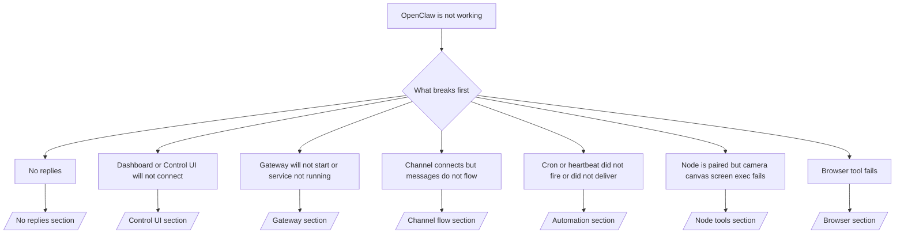

---
read_when:
    - OpenClaw が動作しておらず、最も早く解決する方法が必要です
    - 詳細なランブックに入る前にトリアージフローが必要です
summary: OpenClaw の症状別トラブルシューティングハブ
title: 一般的なトラブルシューティング
x-i18n:
    generated_at: "2026-04-11T02:46:01Z"
    model: gpt-5.4
    provider: openai
    source_hash: 16b38920dbfdc8d4a79bbb5d6fab2c67c9f218a97c36bb4695310d7db9c4614a
    source_path: help/troubleshooting.md
    workflow: 15
---

# トラブルシューティング

2 分しかない場合は、このページをトリアージの入口として使ってください。

## 最初の 60 秒

次の手順をこの順番でそのまま実行してください。

```bash
openclaw status
openclaw status --all
openclaw gateway probe
openclaw gateway status
openclaw doctor
openclaw channels status --probe
openclaw logs --follow
```

良好な出力の目安:

- `openclaw status` → 設定済みの channels が表示され、明らかな認証エラーがない。
- `openclaw status --all` → 完全なレポートが表示され、共有可能な状態である。
- `openclaw gateway probe` → 想定される gateway target に到達できる（`Reachable: yes`）。`RPC: limited - missing scope: operator.read` は診断機能の劣化であり、接続失敗ではありません。
- `openclaw gateway status` → `Runtime: running` かつ `RPC probe: ok`。
- `openclaw doctor` → 起動を妨げる config/service エラーがない。
- `openclaw channels status --probe` → 到達可能な gateway では、account ごとの live な
  transport 状態に加え、`works` や `audit ok` などの probe/audit 結果が返ります。gateway に到達できない場合、
  このコマンドは config のみの要約にフォールバックします。
- `openclaw logs --follow` → 安定したアクティビティがあり、繰り返し発生する致命的エラーがない。

## Anthropic long context 429

次の表示が出る場合:
`HTTP 429: rate_limit_error: Extra usage is required for long context requests`
[/gateway/troubleshooting#anthropic-429-extra-usage-required-for-long-context](/ja-JP/gateway/troubleshooting#anthropic-429-extra-usage-required-for-long-context) に進んでください。

## ローカルの OpenAI 互換バックエンドは直接では動くが OpenClaw では失敗する

ローカルまたはセルフホストの `/v1` バックエンドが、小さな直接の
`/v1/chat/completions` プローブには応答するものの、`openclaw infer model run` や通常の
agent ターンでは失敗する場合:

1. エラーに `messages[].content` が文字列を期待していると出る場合は、
   `models.providers.<provider>.models[].compat.requiresStringContent: true` を設定します。
2. それでも OpenClaw の agent ターンでのみバックエンドが失敗する場合は、
   `models.providers.<provider>.models[].compat.supportsTools: false` を設定して再試行します。
3. 小さな直接呼び出しは依然として成功するのに、大きな OpenClaw プロンプトでバックエンドがクラッシュする場合、
   残る問題は upstream の model/server の制限として扱い、
   詳細ランブックに進んでください:
   [/gateway/troubleshooting#local-openai-compatible-backend-passes-direct-probes-but-agent-runs-fail](/ja-JP/gateway/troubleshooting#local-openai-compatible-backend-passes-direct-probes-but-agent-runs-fail)

## Plugin のインストールが openclaw extensions 不足で失敗する

インストールが `package.json missing openclaw.extensions` で失敗する場合、その plugin package
は OpenClaw が現在受け付けない古い形式を使用しています。

plugin package 側で修正する内容:

1. `package.json` に `openclaw.extensions` を追加します。
2. エントリをビルド済み runtime ファイル（通常は `./dist/index.js`）に向けます。
3. plugin を再公開し、`openclaw plugins install <package>` を再実行します。

例:

```json
{
  "name": "@openclaw/my-plugin",
  "version": "1.2.3",
  "openclaw": {
    "extensions": ["./dist/index.js"]
  }
}
```

参考: [Plugin architecture](/ja-JP/plugins/architecture)

## デシジョンツリー



<AccordionGroup>
  <Accordion title="応答がない">
    ```bash
    openclaw status
    openclaw gateway status
    openclaw channels status --probe
    openclaw pairing list --channel <channel> [--account <id>]
    openclaw logs --follow
    ```

    良好な出力の目安:

    - `Runtime: running`
    - `RPC probe: ok`
    - 使用中の channel が transport connected を示し、サポートされる場合は `channels status --probe` に `works` または `audit ok` が表示される
    - 送信者が承認済みとして表示される（または DM policy が open/allowlist になっている）

    よくあるログシグネチャ:

    - `drop guild message (mention required` → Discord でメンションゲートによりメッセージ処理がブロックされた。
    - `pairing request` → 送信者が未承認で、DM pairing 承認待ちである。
    - channel ログ内の `blocked` / `allowlist` → 送信者、room、または group がフィルタされている。

    詳細ページ:

    - [/gateway/troubleshooting#no-replies](/ja-JP/gateway/troubleshooting#no-replies)
    - [/channels/troubleshooting](/ja-JP/channels/troubleshooting)
    - [/channels/pairing](/ja-JP/channels/pairing)

  </Accordion>

  <Accordion title="Dashboard または Control UI に接続できない">
    ```bash
    openclaw status
    openclaw gateway status
    openclaw logs --follow
    openclaw doctor
    openclaw channels status --probe
    ```

    良好な出力の目安:

    - `openclaw gateway status` に `Dashboard: http://...` が表示される
    - `RPC probe: ok`
    - ログに認証ループがない

    よくあるログシグネチャ:

    - `device identity required` → HTTP/非セキュアコンテキストでは device auth を完了できない。
    - `origin not allowed` → browser の `Origin` がその Control UI
      gateway target で許可されていない。
    - `AUTH_TOKEN_MISMATCH` と再試行ヒント（`canRetryWithDeviceToken=true`）→ 信頼済み device-token による再試行が 1 回、自動で行われることがあります。
    - そのキャッシュ済み token の再試行では、ペアリング済み
      device token とともに保存されたキャッシュ済みスコープセットが再利用されます。明示的な `deviceToken` / 明示的な `scopes` を使う呼び出し元は、要求したスコープセットがそのまま維持されます。
    - 非同期の Tailscale Serve Control UI パスでは、同じ
      `{scope, ip}` に対する失敗した試行は、limiter が失敗を記録する前に直列化されるため、2 回目の同時不正再試行でもすでに `retry later` が表示されることがあります。
    - localhost browser origin からの `too many failed authentication attempts (retry later)` → 同じ `Origin` からの繰り返し失敗は一時的にロックアウトされます。別の localhost origin は別バケットを使用します。
    - その再試行後も `unauthorized` が繰り返される → token/password の誤り、auth mode の不一致、または古い paired device token。
    - `gateway connect failed:` → UI が誤った URL/port を向いているか、gateway に到達できません。

    詳細ページ:

    - [/gateway/troubleshooting#dashboard-control-ui-connectivity](/ja-JP/gateway/troubleshooting#dashboard-control-ui-connectivity)
    - [/web/control-ui](/web/control-ui)
    - [/gateway/authentication](/ja-JP/gateway/authentication)

  </Accordion>

  <Accordion title="Gateway が起動しない、または service はインストール済みだが動作していない">
    ```bash
    openclaw status
    openclaw gateway status
    openclaw logs --follow
    openclaw doctor
    openclaw channels status --probe
    ```

    良好な出力の目安:

    - `Service: ... (loaded)`
    - `Runtime: running`
    - `RPC probe: ok`

    よくあるログシグネチャ:

    - `Gateway start blocked: set gateway.mode=local` または `existing config is missing gateway.mode` → gateway mode が remote、または config file に local-mode の印がなく、修復が必要。
    - `refusing to bind gateway ... without auth` → 有効な gateway auth パス（token/password、または設定されている trusted-proxy）なしで non-loopback bind をしようとしている。
    - `another gateway instance is already listening` または `EADDRINUSE` → その port はすでに使用中。

    詳細ページ:

    - [/gateway/troubleshooting#gateway-service-not-running](/ja-JP/gateway/troubleshooting#gateway-service-not-running)
    - [/gateway/background-process](/ja-JP/gateway/background-process)
    - [/gateway/configuration](/ja-JP/gateway/configuration)

  </Accordion>

  <Accordion title="Channel は接続するがメッセージが流れない">
    ```bash
    openclaw status
    openclaw gateway status
    openclaw logs --follow
    openclaw doctor
    openclaw channels status --probe
    ```

    良好な出力の目安:

    - Channel transport が接続されている。
    - Pairing/allowlist チェックに合格している。
    - 必要な場合にメンションが検出されている。

    よくあるログシグネチャ:

    - `mention required` → group mention ゲートにより処理がブロックされた。
    - `pairing` / `pending` → DM の送信者がまだ承認されていない。
    - `not_in_channel`, `missing_scope`, `Forbidden`, `401/403` → channel 権限 token の問題。

    詳細ページ:

    - [/gateway/troubleshooting#channel-connected-messages-not-flowing](/ja-JP/gateway/troubleshooting#channel-connected-messages-not-flowing)
    - [/channels/troubleshooting](/ja-JP/channels/troubleshooting)

  </Accordion>

  <Accordion title="Cron または heartbeat が発火しなかった、または配信されなかった">
    ```bash
    openclaw status
    openclaw gateway status
    openclaw cron status
    openclaw cron list
    openclaw cron runs --id <jobId> --limit 20
    openclaw logs --follow
    ```

    良好な出力の目安:

    - `cron.status` が有効状態で次回 wake を示している。
    - `cron runs` に最近の `ok` エントリが表示される。
    - Heartbeat が有効で、active hours の外ではない。

    よくあるログシグネチャ:

    - `cron: scheduler disabled; jobs will not run automatically` → cron が無効。
    - `heartbeat skipped` と `reason=quiet-hours` → 設定された active hours の外。
    - `heartbeat skipped` と `reason=empty-heartbeat-file` → `HEARTBEAT.md` は存在するが、空白またはヘッダーのみの足場しか含まれていない。
    - `heartbeat skipped` と `reason=no-tasks-due` → `HEARTBEAT.md` の task モードが有効だが、まだ期限の来ている task interval がない。
    - `heartbeat skipped` と `reason=alerts-disabled` → heartbeat の可視性がすべて無効（`showOk`、`showAlerts`、`useIndicator` がすべて off）。
    - `requests-in-flight` → main レーンがビジーで、heartbeat wake が延期された。
    - `unknown accountId` → heartbeat の配信先 account が存在しない。

    詳細ページ:

    - [/gateway/troubleshooting#cron-and-heartbeat-delivery](/ja-JP/gateway/troubleshooting#cron-and-heartbeat-delivery)
    - [/automation/cron-jobs#troubleshooting](/ja-JP/automation/cron-jobs#troubleshooting)
    - [/gateway/heartbeat](/ja-JP/gateway/heartbeat)

    </Accordion>

    <Accordion title="Node は paired だが tool の camera canvas screen exec が失敗する">
      ```bash
      openclaw status
      openclaw gateway status
      openclaw nodes status
      openclaw nodes describe --node <idOrNameOrIp>
      openclaw logs --follow
      ```

      良好な出力の目安:

      - Node が接続済みかつ role `node` で paired として一覧表示される。
      - 呼び出しているコマンドに対する capability が存在する。
      - その tool の permission state が許可済みである。

      よくあるログシグネチャ:

      - `NODE_BACKGROUND_UNAVAILABLE` → node app をフォアグラウンドに戻す。
      - `*_PERMISSION_REQUIRED` → OS 権限が拒否されている、または不足している。
      - `SYSTEM_RUN_DENIED: approval required` → exec approval が保留中。
      - `SYSTEM_RUN_DENIED: allowlist miss` → コマンドが exec allowlist にない。

      詳細ページ:

      - [/gateway/troubleshooting#node-paired-tool-fails](/ja-JP/gateway/troubleshooting#node-paired-tool-fails)
      - [/nodes/troubleshooting](/ja-JP/nodes/troubleshooting)
      - [/tools/exec-approvals](/ja-JP/tools/exec-approvals)

    </Accordion>

    <Accordion title="Exec が突然 approval を求めるようになった">
      ```bash
      openclaw config get tools.exec.host
      openclaw config get tools.exec.security
      openclaw config get tools.exec.ask
      openclaw gateway restart
      ```

      何が変わったか:

      - `tools.exec.host` が未設定の場合、デフォルトは `auto` です。
      - `host=auto` は、sandbox runtime がアクティブなときは `sandbox` に、そうでない場合は `gateway` に解決されます。
      - `host=auto` はルーティングだけの設定です。プロンプトなしの「YOLO」動作は、gateway/node 上の `security=full` と `ask=off` によって決まります。
      - `gateway` と `node` では、未設定の `tools.exec.security` のデフォルトは `full` です。
      - 未設定の `tools.exec.ask` のデフォルトは `off` です。
      - したがって、approval が表示されているなら、現在のデフォルトから外れるように host ローカルまたはセッション単位の policy が強化されたことを意味します。

      現在のデフォルトである approval なしの動作を復元する:

      ```bash
      openclaw config set tools.exec.host gateway
      openclaw config set tools.exec.security full
      openclaw config set tools.exec.ask off
      openclaw gateway restart
      ```

      より安全な代替案:

      - host ルーティングを安定させたいだけなら、`tools.exec.host=gateway` のみを設定します。
      - host exec を使いつつ allowlist ミス時にはレビューしたい場合は、`security=allowlist` と `ask=on-miss` を使います。
      - `host=auto` が再び `sandbox` に解決されるようにしたい場合は、sandbox mode を有効にします。

      よくあるログシグネチャ:

      - `Approval required.` → コマンドが `/approve ...` を待っています。
      - `SYSTEM_RUN_DENIED: approval required` → node-host exec approval が保留中です。
      - `exec host=sandbox requires a sandbox runtime for this session` → 暗黙または明示的に sandbox が選択されているが、sandbox mode が無効です。

      詳細ページ:

      - [/tools/exec](/ja-JP/tools/exec)
      - [/tools/exec-approvals](/ja-JP/tools/exec-approvals)
      - [/gateway/security#what-the-audit-checks-high-level](/ja-JP/gateway/security#what-the-audit-checks-high-level)

    </Accordion>

    <Accordion title="Browser tool が失敗する">
      ```bash
      openclaw status
      openclaw gateway status
      openclaw browser status
      openclaw logs --follow
      openclaw doctor
      ```

      良好な出力の目安:

      - Browser status に `running: true` と選択された browser/profile が表示される。
      - `openclaw` が起動する、または `user` がローカルの Chrome タブを確認できる。

      よくあるログシグネチャ:

      - `unknown command "browser"` または `unknown command 'browser'` → `plugins.allow` が設定されており、`browser` が含まれていません。
      - `Failed to start Chrome CDP on port` → ローカル browser の起動に失敗しました。
      - `browser.executablePath not found` → 設定されたバイナリパスが誤っています。
      - `browser.cdpUrl must be http(s) or ws(s)` → 設定された CDP URL に未対応のスキームが使われています。
      - `browser.cdpUrl has invalid port` → 設定された CDP URL の port が不正または範囲外です。
      - `No Chrome tabs found for profile="user"` → Chrome MCP attach profile に開いているローカル Chrome タブがありません。
      - `Remote CDP for profile "<name>" is not reachable` → 設定されたリモート CDP エンドポイントにこのホストから到達できません。
      - `Browser attachOnly is enabled ... not reachable` または `Browser attachOnly is enabled and CDP websocket ... is not reachable` → attach-only profile に有効な CDP target がありません。
      - attach-only または remote CDP profile で viewport / dark-mode / locale / offline の上書き状態が残っている → gateway を再起動せずに `openclaw browser stop --browser-profile <name>` を実行して、アクティブな制御セッションを閉じ、エミュレーション状態を解放します。

      詳細ページ:

      - [/gateway/troubleshooting#browser-tool-fails](/ja-JP/gateway/troubleshooting#browser-tool-fails)
      - [/tools/browser#missing-browser-command-or-tool](/ja-JP/tools/browser#missing-browser-command-or-tool)
      - [/tools/browser-linux-troubleshooting](/ja-JP/tools/browser-linux-troubleshooting)
      - [/tools/browser-wsl2-windows-remote-cdp-troubleshooting](/ja-JP/tools/browser-wsl2-windows-remote-cdp-troubleshooting)

    </Accordion>

  </AccordionGroup>

## 関連

- [FAQ](/ja-JP/help/faq) — よくある質問
- [Gateway Troubleshooting](/ja-JP/gateway/troubleshooting) — Gateway 固有の問題
- [Doctor](/ja-JP/gateway/doctor) — 自動ヘルスチェックと修復
- [Channel Troubleshooting](/ja-JP/channels/troubleshooting) — channel 接続の問題
- [Automation Troubleshooting](/ja-JP/automation/cron-jobs#troubleshooting) — cron と heartbeat の問題
