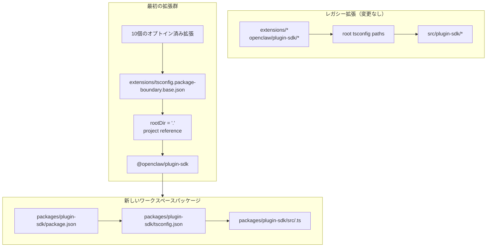

# リファクタリング: plugin-sdkを段階的に本物のワークスペースパッケージにする

## 概要

この計画では、`packages/plugin-sdk`にplugin SDK用の本物のワークスペースパッケージを導入し、それを使って小規模な最初の拡張群を、コンパイラーによって強制されるパッケージ境界へオプトインさせます。目的は、選択した一部のバンドル済みプロバイダー拡張について、不正な相対インポートが通常の`tsc`で失敗するようにすることであり、リポジトリ全体の移行や巨大なマージ競合面を強いることではありません。

重要な段階的変更は、しばらくの間2つのモードを並行して動かすことです。

| Mode | Import shape | Who uses it | Enforcement |
| ----------- | ------------------------ | ------------------------------------ | -------------------------------------------- |
| Legacy mode | `openclaw/plugin-sdk/*`  | まだオプトインしていない既存のすべての拡張 | 現在の許容的な挙動を維持 |
| Opt-in mode | `@openclaw/plugin-sdk/*` | 最初の拡張群のみ | パッケージローカルの`rootDir` + project references |

## 問題の枠組み

現在のリポジトリは大きな公開plugin SDKサーフェスをエクスポートしていますが、それは本物のワークスペースパッケージではありません。代わりに:

- ルートの`tsconfig.json`が`openclaw/plugin-sdk/*`を直接
  `src/plugin-sdk/*.ts`へマップしている
- 以前の実験にオプトインしなかった拡張は、依然としてその
  グローバルなソースエイリアス挙動を共有している
- `rootDir`を追加しても、許可されたSDKインポートが生の
  リポジトリソースへ解決されなくなって初めて機能する

つまり、リポジトリは望ましい境界ポリシーを説明できても、TypeScriptはその大半の拡張に対してそれをきれいには強制できません。

求められているのは、次のような段階的な道筋です。

- `plugin-sdk`を本物にする
- SDKを`@openclaw/plugin-sdk`というワークスペースパッケージへ移行する
- 最初のPRで変更する拡張は約10個にとどめる
- 拡張ツリーの残りは、後のクリーンアップまで旧方式のままにする
- 最初の拡張群の展開において、主要な仕組みとして
  `tsconfig.plugin-sdk.dts.json` + postinstall生成の宣言ワークフローを避ける

## 要件トレース

- R1. `packages/`配下にSDK用の本物のワークスペースパッケージを作成する。
- R2. 新しいパッケージ名を`@openclaw/plugin-sdk`にする。
- R3. 新しいSDKパッケージに専用の`package.json`と`tsconfig.json`を持たせる。
- R4. 移行期間中、まだオプトインしていない拡張向けにレガシーな
  `openclaw/plugin-sdk/*`インポートを機能させ続ける。
- R5. 最初のPRでは、小規模な最初の拡張群だけをオプトインさせる。
- R6. 最初の拡張群では、パッケージルートを出る相対インポートが
  フェイルクローズしなければならない。
- R7. 最初の拡張群は、ルート`paths`エイリアスではなく、
  パッケージ依存関係とTS project referenceを通じてSDKを消費しなければならない。
- R8. この計画は、エディターの正しさのためにリポジトリ全体で必須となる
  postinstall生成ステップを避けなければならない。
- R9. 最初の拡張群の展開は、リポジトリ全体に及ぶ300ファイル超のリファクタリングではなく、
  レビュー可能でマージ可能な中規模PRでなければならない。

## スコープ境界

- 最初のPRで、すべてのバンドル済み拡張を完全移行しない。
- 最初のPRで`src/plugin-sdk`を削除する必要はない。
- 最初のPRで、すべてのルートビルドやテストパスをただちに新パッケージへ
  配線し直す必要はない。
- まだオプトインしていないすべての拡張に対して、VS Codeの波線を強制しようとしない。
- 拡張ツリーの残りに対して広範なlintクリーンアップを行わない。
- オプトインした拡張に対するインポート解決、パッケージ所有権、
  境界強制を超える大きなランタイム挙動変更は行わない。

## コンテキストと調査

### 関連コードとパターン

- `pnpm-workspace.yaml`にはすでに`packages/*`と`extensions/*`が含まれているため、
  `packages/plugin-sdk`配下の新しいワークスペースパッケージは既存のリポジトリ
  レイアウトに適合する。
- `packages/memory-host-sdk/package.json`や`packages/plugin-package-contract/package.json`のような既存のワークスペースパッケージは、すでに
  `src/*.ts`を起点とするパッケージローカルの`exports`マップを使っている。
- ルートの`package.json`は現在、`./plugin-sdk`
  と`./plugin-sdk/*`のexportsを通じてSDKサーフェスを公開しており、それらは
  `dist/plugin-sdk/*.js`と`dist/plugin-sdk/*.d.ts`に裏付けられている。
- `src/plugin-sdk/entrypoints.ts`と`scripts/lib/plugin-sdk-entrypoints.json`は、すでにSDKサーフェスの正規エントリーポイント一覧として機能している。
- ルートの`tsconfig.json`は現在、次のようにマップしている:
  - `openclaw/plugin-sdk` -> `src/plugin-sdk/index.ts`
  - `openclaw/plugin-sdk/*` -> `src/plugin-sdk/*.ts`
- 以前の境界実験では、許可されたSDKインポートが拡張パッケージの外にある生ソースへ解決されなくなったあとで初めて、
  パッケージローカルの`rootDir`が不正な相対インポートに対して機能することが示された。

### 最初の拡張群

この計画では、最初の拡張群を、複雑なチャネルランタイムのエッジケースを引き込みにくい、プロバイダー中心のセットと仮定します。

- `extensions/anthropic`
- `extensions/exa`
- `extensions/firecrawl`
- `extensions/groq`
- `extensions/mistral`
- `extensions/openai`
- `extensions/perplexity`
- `extensions/tavily`
- `extensions/together`
- `extensions/xai`

### 最初の拡張群が使うSDKサーフェス一覧

最初の拡張群が現在インポートしているSDKサブパスは、管理可能な範囲にあります。初期の`@openclaw/plugin-sdk`パッケージがカバーすべきなのは、次のものだけです。

- `agent-runtime`
- `cli-runtime`
- `config-runtime`
- `core`
- `image-generation`
- `media-runtime`
- `media-understanding`
- `plugin-entry`
- `plugin-runtime`
- `provider-auth`
- `provider-auth-api-key`
- `provider-auth-login`
- `provider-auth-runtime`
- `provider-catalog-shared`
- `provider-entry`
- `provider-http`
- `provider-model-shared`
- `provider-onboard`
- `provider-stream-family`
- `provider-stream-shared`
- `provider-tools`
- `provider-usage`
- `provider-web-fetch`
- `provider-web-search`
- `realtime-transcription`
- `realtime-voice`
- `runtime-env`
- `secret-input`
- `security-runtime`
- `speech`
- `testing`

### 制度的な学び

- このワークツリーには関連する`docs/solutions/`エントリは存在しなかった。

### 外部参照

- この計画のために外部調査は不要だった。リポジトリにはすでに、関連する
  ワークスペースパッケージとSDKエクスポートのパターンが含まれている。

## 主要な技術的判断

- 新しいワークスペースパッケージとして`@openclaw/plugin-sdk`を導入しつつ、
  移行中はレガシーなルート`openclaw/plugin-sdk/*`サーフェスを維持する。
  根拠: これにより、最初の拡張群を本物のパッケージ解決へ移行しながら、
  すべての拡張とすべてのルートビルドパスを一度に変更せずに済む。

- すべての拡張向け既存ベースを置き換えるのではなく、
  `extensions/tsconfig.package-boundary.base.json`のような専用のオプトイン境界ベース設定を使う。
  根拠: リポジトリは移行中、レガシー拡張モードとオプトイン拡張モードの
  両方を同時にサポートする必要がある。

- 最初の拡張群から
  `packages/plugin-sdk/tsconfig.json`へのTS project referenceを使い、
  オプトイン境界モードでは
  `disableSourceOfProjectReferenceRedirect`を設定する。
  根拠: これにより、`tsc`に本物のパッケージグラフを与えつつ、エディターや
  コンパイラーが生ソース走査へフォールバックするのを抑制できる。

- 最初の段階では`@openclaw/plugin-sdk`をprivateのままにする。
  根拠: 当面の目標は、内部境界の強制と移行の安全性であり、
  サーフェスが安定する前に2つ目の外部SDK契約を公開することではない。

- 最初の実装スライスでは、最初の拡張群が使うSDKサブパスだけを移し、
  残りについては互換ブリッジを維持する。
  根拠: `src/plugin-sdk/*.ts`の315ファイルすべてを1つのPRで物理的に移動するのは、
  まさにこの計画が避けようとしているマージ競合面そのものである。

- 最初の拡張群については、
  `scripts/postinstall-bundled-plugins.mjs`に依存してSDK宣言をビルドしない。
  根拠: 明示的なビルド/参照フローの方が理解しやすく、
  リポジトリの挙動をより予測可能に保てる。

## 未解決事項

### 計画中に解決済み

- どの拡張を最初の拡張群に入れるべきか。
  上記の10個のprovider/web-search拡張を使う。より重いチャネルパッケージよりも
  構造的に分離されているためである。

- 最初のPRで拡張ツリー全体を置き換えるべきか。
  いいえ。最初のPRでは2つのモードを並行してサポートし、
  最初の拡張群だけをオプトインさせるべきである。

- 最初の拡張群でpostinstallによる宣言ビルドを必須にすべきか。
  いいえ。パッケージ/参照グラフは明示的であるべきであり、CIは
  関連するパッケージローカル型チェックを意図的に実行すべきである。

### 実装へ持ち越し

- 最初の拡張群のパッケージが、project referencesだけでパッケージローカルの`src/*.ts`を直接参照できるか、
  それとも`@openclaw/plugin-sdk`パッケージに対して小規模な宣言出力ステップが
  依然として必要かどうか。
  これは実装側で扱うTSグラフ検証の問題である。

- ルートの`openclaw`パッケージが、最初の拡張群のSDKサブパスをただちに
  `packages/plugin-sdk`出力へプロキシすべきか、それとも生成された
  `src/plugin-sdk`配下の互換シムを使い続けるべきか。
  これは、CIをグリーンに保つ最小実装パスに依存する
  互換性とビルド形状の詳細である。

## 高レベル技術設計

> これは意図したアプローチを示すものであり、レビューのための方向性ガイダンスであって、実装仕様ではありません。実装するエージェントは、これをコードとして再現すべきものではなく、コンテキストとして扱ってください。

## 実装ユニット

- [ ] **ユニット1: 本物の`@openclaw/plugin-sdk`ワークスペースパッケージを導入する**

**目標:** リポジトリ全体の移行を強いることなく、最初の拡張群のサブパスサーフェスを所有できる本物のSDKワークスペースパッケージを作成する。

**要件:** R1, R2, R3, R8, R9

**依存関係:** なし

**ファイル:**

- 作成: `packages/plugin-sdk/package.json`
- 作成: `packages/plugin-sdk/tsconfig.json`
- 作成: `packages/plugin-sdk/src/index.ts`
- 作成: 最初の拡張群のSDKサブパス用の`packages/plugin-sdk/src/*.ts`
- 修正: パッケージglob調整が必要な場合のみ`pnpm-workspace.yaml`
- 修正: `package.json`
- 修正: `src/plugin-sdk/entrypoints.ts`
- 修正: `scripts/lib/plugin-sdk-entrypoints.json`
- テスト: `src/plugins/contracts/plugin-sdk-workspace-package.contract.test.ts`

**アプローチ:**

- `@openclaw/plugin-sdk`という名前の新しいワークスペースパッケージを追加する。
- 対象は315ファイル全体ではなく、最初の拡張群が使うSDKサブパスのみから始める。
- ある最初の拡張群向けエントリーポイントを直接移動すると差分が大きくなりすぎる場合、
  最初のPRではそのサブパスをまず`packages/plugin-sdk/src`に薄い
  パッケージラッパーとして導入し、その後続PRでそのサブパスクラスタの
  ソースオブトゥルースをパッケージ側へ切り替えてよい。
- 既存のエントリーポイント一覧の仕組みを再利用し、
  最初の拡張群向けパッケージサーフェスを1つの正規の場所で宣言する。
- ルートパッケージのexportsはレガシーユーザー向けに維持しつつ、
  ワークスペースパッケージを新しいオプトイン契約にする。

**従うべきパターン:**

- `packages/memory-host-sdk/package.json`
- `packages/plugin-package-contract/package.json`
- `src/plugin-sdk/entrypoints.ts`

**テストシナリオ:**

- 正常系: ワークスペースパッケージが、計画に列挙された最初の拡張群向け
  すべてのSDKサブパスをエクスポートし、必要なエクスポートの欠落がない。
- エッジケース: 最初の拡張群向けエントリ一覧が再生成または正規一覧と比較されたときに、
  パッケージのexportメタデータが安定している。
- 統合: 新しいワークスペースパッケージ導入後も、
  ルートパッケージのレガシーSDK exportsが残っている。

**検証:**

- リポジトリには、有効な`@openclaw/plugin-sdk`ワークスペースパッケージが存在し、
  安定した最初の拡張群向けexportマップを持ち、ルート`package.json`内の
  レガシーexportに後退がない。

- [ ] **ユニット2: パッケージ強制拡張向けのオプトインTS境界モードを追加する**

**目標:** オプトインした拡張が使用するTS設定モードを定義しつつ、
他のすべての既存拡張のTS挙動は変更しない。

**要件:** R4, R6, R7, R8, R9

**依存関係:** ユニット1

**ファイル:**

- 作成: `extensions/tsconfig.package-boundary.base.json`
- 作成: `tsconfig.boundary-optin.json`
- 修正: `extensions/xai/tsconfig.json`
- 修正: `extensions/openai/tsconfig.json`
- 修正: `extensions/anthropic/tsconfig.json`
- 修正: `extensions/mistral/tsconfig.json`
- 修正: `extensions/groq/tsconfig.json`
- 修正: `extensions/together/tsconfig.json`
- 修正: `extensions/perplexity/tsconfig.json`
- 修正: `extensions/tavily/tsconfig.json`
- 修正: `extensions/exa/tsconfig.json`
- 修正: `extensions/firecrawl/tsconfig.json`
- テスト: `src/plugins/contracts/extension-package-project-boundaries.test.ts`
- テスト: `test/extension-package-tsc-boundary.test.ts`

**アプローチ:**

- レガシー拡張向けに`extensions/tsconfig.base.json`はそのまま残す。
- 新しいオプトイン用ベース設定を追加し、そこでは:
  - `rootDir: "."`を設定する
  - `packages/plugin-sdk`を参照する
  - `composite`を有効にする
  - 必要に応じてproject-referenceのsource redirectを無効にする
- 同じPRでルートリポジトリのTSプロジェクト形状を作り替えるのではなく、
  最初の拡張群向け型チェックグラフ専用のsolution configを追加する。

**実行メモ:** このパターンを10個すべてに広げる前に、
1つのオプトイン拡張に対する失敗するパッケージローカルcanary型チェックから始める。

**従うべきパターン:**

- 以前の境界作業における既存の
  パッケージローカル拡張`tsconfig.json`パターン
- `packages/memory-host-sdk`のワークスペースパッケージパターン

**テストシナリオ:**

- 正常系: 各オプトイン拡張が、パッケージ境界TS設定を通じて
  正しく型チェックできる。
- エラー系: オプトイン拡張における`../../src/cli/acp-cli.ts`への
  canary相対インポートが、`TS6059`で失敗する。
- 統合: まだオプトインしていない拡張は変更されず、
  新しいsolution configに参加する必要がない。

**検証:**

- 10個のオプトイン拡張向けに専用の型チェックグラフが存在し、
  それらの1つからの不正な相対インポートが通常の`tsc`で失敗する。

- [ ] **ユニット3: 最初の拡張群を`@openclaw/plugin-sdk`へ移行する**

**目標:** 最初の拡張群が、本物のSDKパッケージを
依存関係メタデータ、project references、パッケージ名インポートを通じて消費するよう変更する。

**要件:** R5, R6, R7, R9

**依存関係:** ユニット2

**ファイル:**

- 修正: `extensions/anthropic/package.json`
- 修正: `extensions/exa/package.json`
- 修正: `extensions/firecrawl/package.json`
- 修正: `extensions/groq/package.json`
- 修正: `extensions/mistral/package.json`
- 修正: `extensions/openai/package.json`
- 修正: `extensions/perplexity/package.json`
- 修正: `extensions/tavily/package.json`
- 修正: `extensions/together/package.json`
- 修正: `extensions/xai/package.json`
- 修正: 現在`openclaw/plugin-sdk/*`を参照している、
  10個の拡張ルート配下の本番用およびテスト用インポート

**アプローチ:**

- 最初の拡張群の`devDependencies`に
  `@openclaw/plugin-sdk: workspace:*`を追加する。
- それらのパッケージ内の`openclaw/plugin-sdk/*`インポートを
  `@openclaw/plugin-sdk/*`へ置き換える。
- 拡張内のローカルインポートは、`./api.ts`や`./runtime-api.ts`のような
  ローカルbarrelを使い続ける。
- このPRでは、まだオプトインしていない拡張は変更しない。

**従うべきパターン:**

- 既存の拡張ローカルimport barrel（`api.ts`, `runtime-api.ts`）
- 他の`@openclaw/*`ワークスペースパッケージで使われている
  パッケージ依存関係の形

**テストシナリオ:**

- 正常系: 各移行済み拡張が、インポート書き換え後も既存の
  pluginテストを通じて登録/ロードできる。
- エッジケース: オプトイン拡張群におけるテスト専用SDKインポートも、
  新しいパッケージを通じて正しく解決される。
- 統合: 移行済み拡張は、型チェックのためにルート
  `openclaw/plugin-sdk/*`エイリアスを必要としない。

**検証:**

- 最初の拡張群は、レガシーなルートSDKエイリアスパスを必要とせず、
  `@openclaw/plugin-sdk`に対してビルドとテストができる。

- [ ] **ユニット4: 移行が部分的な間もレガシー互換性を維持する**

**目標:** SDKがレガシー形態と新パッケージ形態の両方で存在する移行期間中も、
リポジトリ全体が動作し続けるようにする。

**要件:** R4, R8, R9

**依存関係:** ユニット1-3

**ファイル:**

- 修正: 必要に応じて、最初の拡張群向け互換シムとしての`src/plugin-sdk/*.ts`
- 修正: `package.json`
- 修正: SDK成果物を組み立てるビルドまたはexport配線
- テスト: `src/plugins/contracts/plugin-sdk-runtime-api-guardrails.test.ts`
- テスト: `src/plugins/contracts/plugin-sdk-index.bundle.test.ts`

**アプローチ:**

- ルートの`openclaw/plugin-sdk/*`は、まだオプトインしていない
  拡張と、まだ移行していない外部コンシューマー向けの互換サーフェスとして維持する。
- 移行済みの最初の拡張群サブパスについては、
  生成シムまたはルートexportプロキシ配線のいずれかを使う。
- この段階では、ルートSDKサーフェスの廃止を試みない。

**従うべきパターン:**

- `src/plugin-sdk/entrypoints.ts`による既存のルートSDK export生成
- ルート`package.json`における既存のパッケージexport互換性

**テストシナリオ:**

- 正常系: 新しいパッケージが存在しても、まだオプトインしていない
  拡張ではレガシーなルートSDKインポートが引き続き解決される。
- エッジケース: 最初の拡張群向けのサブパスが、
  移行期間中にレガシーなルートサーフェスと新パッケージサーフェスの両方から動作する。
- 統合: plugin-sdkのindex/bundle契約テストが、
  一貫した公開サーフェスを引き続き認識する。

**検証:**

- リポジトリは、変更されていない拡張を壊すことなく、
  レガシーSDK消費モードとオプトインSDK消費モードの両方をサポートする。

- [ ] **ユニット5: スコープ付き強制を追加し、移行契約を文書化する**

**目標:** 拡張ツリー全体が移行済みであるかのように装うことなく、
最初の拡張群に対して新しい挙動を強制するCIとコントリビューター向けガイダンスを導入する。

**要件:** R5, R6, R8, R9

**依存関係:** ユニット1-4

**ファイル:**

- 修正: `package.json`
- 修正: オプトイン境界型チェックを実行すべきCIワークフローファイル
- 修正: `AGENTS.md`
- 修正: `docs/plugins/sdk-overview.md`
- 修正: `docs/plugins/sdk-entrypoints.md`
- 修正: `docs/plans/2026-04-05-001-refactor-extension-package-resolution-boundary-plan.md`

**アプローチ:**

- `packages/plugin-sdk`と10個のオプトイン拡張に対する専用の`tsc -b`
  solution runのような、明示的な最初の拡張群向けゲートを追加する。
- リポジトリが現在、レガシー拡張モードとオプトイン拡張モードの両方を
  サポートしており、新しい拡張境界作業では新パッケージ経路を優先すべきことを文書化する。
- 後続PRが、アーキテクチャを再び議論し直すことなく
  同じパッケージ/依存関係/referenceパターンに従って拡張を追加できるよう、
  次の拡張群への移行ルールを記録する。

**従うべきパターン:**

- `src/plugins/contracts/`配下の既存契約テスト
- 段階的移行を説明する既存のdocs更新

**テストシナリオ:**

- 正常系: ワークスペースパッケージとオプトイン拡張向けの
  新しい最初の拡張群型チェックゲートが通る。
- エラー系: オプトイン拡張に新たな不正相対インポートを導入すると、
  スコープ付き型チェックゲートで失敗する。
- 統合: CIは、まだオプトインしていない拡張に対して、
  新しいパッケージ境界モードの適合をまだ要求しない。

**検証:**

- 最初の拡張群向け強制パスが文書化され、テストされ、
  拡張ツリー全体の移行を強いずに実行可能になっている。

## システム全体への影響

- **相互作用グラフ:** この作業は、SDKのソースオブトゥルース、ルートパッケージの
  exports、拡張パッケージのメタデータ、TSグラフのレイアウト、CI検証に影響する。
- **エラー伝播:** 主な意図された失敗モードは、
  オプトイン拡張において、カスタムスクリプト専用の失敗ではなく
  コンパイル時のTSエラー（`TS6059`）になる。
- **状態ライフサイクルのリスク:** 二重サーフェスの移行は、
  ルート互換exportsと新ワークスペースパッケージの間にドリフトリスクを導入する。
- **APIサーフェスの同等性:** 最初の拡張群向けサブパスは、
  移行期間中、`openclaw/plugin-sdk/*`と`@openclaw/plugin-sdk/*`の両方を通じて
  意味的に同一でなければならない。
- **統合カバレッジ:** ユニットテストだけでは不十分であり、
  境界を証明するにはスコープ付きパッケージグラフ型チェックが必要である。
- **変更されない不変条件:** まだオプトインしていない拡張はPR 1でも現在の挙動を維持する。
  この計画は、リポジトリ全体のインポート境界強制を主張するものではない。

## リスクと依存関係

| リスク | 緩和策 |
| ------------------------------------------------------------------------------------------------------ | ----------------------------------------------------------------------------------------------------------------------- |
| 最初の拡張群向けパッケージが依然として生ソースへ解決され、`rootDir`が実際にはフェイルクローズしない | 最初の実装ステップを、1つのオプトイン拡張に対するパッケージ参照canaryにしてから、全体へ広げる |
| SDKソースを一度に動かしすぎると、もともとのマージ競合問題を再現してしまう | 最初のPRでは最初の拡張群向けサブパスだけを移動し、ルート互換ブリッジを維持する |
| レガシーSDKサーフェスと新SDKサーフェスが意味的にドリフトする | 単一のエントリーポイント一覧を維持し、互換契約テストを追加し、二重サーフェスの同等性を明示する |
| ルートリポジトリのビルド/テストパスが、新パッケージに制御不能な形で依存し始める | 専用のオプトインsolution configを使い、最初のPRではルート全体のTSトポロジ変更を避ける |

## 段階的提供

### フェーズ1

- `@openclaw/plugin-sdk`を導入する
- 最初の拡張群向けサブパスサーフェスを定義する
- 1つのオプトイン拡張が`rootDir`を通じてフェイルクローズできることを証明する

### フェーズ2

- 10個の最初の拡張群をオプトインさせる
- 他のすべてに対してルート互換性を維持する

### フェーズ3

- 後続PRでさらに拡張を追加する
- より多くのSDKサブパスをワークスペースパッケージへ移す
- レガシー拡張セットがなくなった後で初めて、ルート互換性を廃止する

## ドキュメント / 運用メモ

- 最初のPRでは、自身をリポジトリ全体の強制完了ではなく、
  二重モード移行であると明示的に説明すべきである。
- 移行ガイドは、後続PRが同じパッケージ/依存関係/referenceパターンに従って
  追加の拡張を簡単に導入できるようにすべきである。

## ソースと参照

- 以前の計画: `docs/plans/2026-04-05-001-refactor-extension-package-resolution-boundary-plan.md`
- ワークスペース設定: `pnpm-workspace.yaml`
- 既存のSDKエントリーポイント一覧: `src/plugin-sdk/entrypoints.ts`
- 既存のルートSDK exports: `package.json`
- 既存のワークスペースパッケージパターン:
  - `packages/memory-host-sdk/package.json`
  - `packages/plugin-package-contract/package.json`
