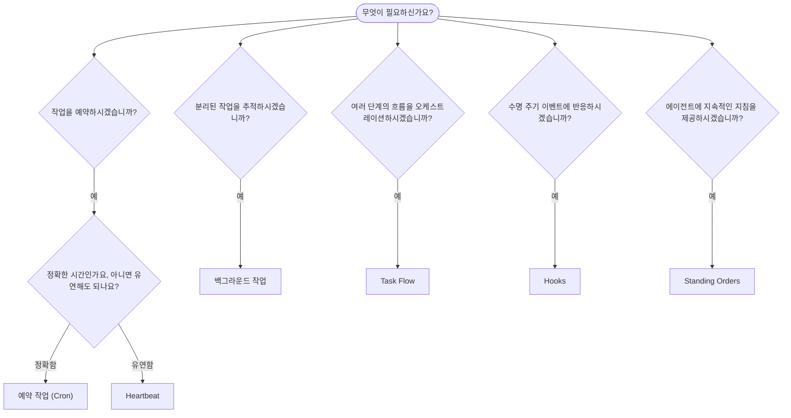

---
read_when:
    - OpenClaw로 작업을 자동화하는 방법을 결정할 때
    - heartbeat, cron, hooks, standing orders 중에서 선택할 때
    - 적절한 자동화 진입점을 찾고 있을 때
summary: '자동화 메커니즘 개요: 작업, cron, hooks, standing orders, Task Flow'
title: 자동화 및 작업
x-i18n:
    generated_at: "2026-04-05T12:34:17Z"
    model: gpt-5.4
    provider: openai
    source_hash: 13cd05dcd2f38737f7bb19243ad1136978bfd727006fd65226daa3590f823afe
    source_path: automation/index.md
    workflow: 15
---

# 자동화 및 작업

OpenClaw는 작업, 예약 작업, 이벤트 hooks, 상시 지시를 통해 백그라운드에서 작업을 실행합니다. 이 페이지는 적절한 메커니즘을 선택하고 이들이 어떻게 함께 작동하는지 이해하는 데 도움을 줍니다.

## 빠른 결정 가이드

| 사용 사례 | 권장 항목 | 이유 |
| --------------------------------------- | ---------------------- | ------------------------------------------------ |
| 매일 오전 9시에 정확히 일일 보고서 전송 | 예약 작업 (Cron) | 정확한 시간, 격리된 실행 |
| 20분 후에 알림 보내기 | 예약 작업 (Cron) | 정밀한 시간의 일회성 작업 (`--at`) |
| 매주 심층 분석 실행 | 예약 작업 (Cron) | 독립형 작업, 다른 모델 사용 가능 |
| 30분마다 받은편지함 확인 | Heartbeat | 다른 점검과 일괄 처리, 컨텍스트 인식 |
| 예정된 이벤트가 있는지 캘린더 모니터링 | Heartbeat | 주기적 인식에 자연스럽게 적합 |
| 서브에이전트 또는 ACP 실행 상태 점검 | 백그라운드 작업 | 작업 원장이 모든 분리된 작업을 추적 |
| 무엇이 언제 실행되었는지 감사 | 백그라운드 작업 | `openclaw tasks list` 및 `openclaw tasks audit` |
| 여러 단계의 조사 후 요약 | Task Flow | 리비전 추적이 포함된 내구성 있는 오케스트레이션 |
| 세션 재설정 시 스크립트 실행 | Hooks | 이벤트 기반, 수명 주기 이벤트에서 실행됨 |
| 모든 도구 호출마다 코드 실행 | Hooks | Hooks는 이벤트 유형으로 필터링 가능 |
| 응답 전에 항상 규정 준수 확인 | Standing Orders | 모든 세션에 자동으로 주입됨 |

### 예약 작업 (Cron)과 Heartbeat 비교

| 차원 | 예약 작업 (Cron) | Heartbeat |
| --------------- | ----------------------------------- | ------------------------------------- |
| 타이밍 | 정확함 (cron 표현식, 일회성) | 대략적임 (기본 30분마다) |
| 세션 컨텍스트 | 새로 시작됨 (격리됨) 또는 공유됨 | 전체 메인 세션 컨텍스트 |
| 작업 기록 | 항상 생성됨 | 생성되지 않음 |
| 전달 | 채널, webhook 또는 무음 | 메인 세션 내 인라인 |
| 가장 적합한 용도 | 보고서, 알림, 백그라운드 작업 | 받은편지함 확인, 캘린더, 알림 |

정확한 타이밍이나 격리된 실행이 필요할 때는 예약 작업 (Cron)을 사용하세요. 전체 세션 컨텍스트의 이점을 활용할 수 있고 대략적인 타이밍이면 충분할 때는 Heartbeat를 사용하세요.

## 핵심 개념

### 예약 작업 (cron)

Cron은 정확한 타이밍을 위한 Gateway의 내장 스케줄러입니다. 작업을 지속적으로 저장하고, 적절한 시간에 에이전트를 깨우며, 출력을 채팅 채널이나 webhook 엔드포인트로 전달할 수 있습니다. 일회성 알림, 반복 표현식, 인바운드 webhook 트리거를 지원합니다.

[예약 작업](/automation/cron-jobs)을 참조하세요.

### 작업

백그라운드 작업 원장은 모든 분리된 작업을 추적합니다: ACP 실행, 서브에이전트 생성, 격리된 cron 실행, CLI 작업. 작업은 스케줄러가 아니라 기록입니다. 이를 검사하려면 `openclaw tasks list` 및 `openclaw tasks audit`를 사용하세요.

[백그라운드 작업](/automation/tasks)을 참조하세요.

### Task Flow

Task Flow는 백그라운드 작업 위에 있는 흐름 오케스트레이션 기반입니다. 관리형 및 미러링 동기화 모드, 리비전 추적, 그리고 검사용 `openclaw tasks flow list|show|cancel`을 통해 내구성 있는 여러 단계의 흐름을 관리합니다.

[Task Flow](/automation/taskflow)를 참조하세요.

### 상시 지시

상시 지시는 정의된 프로그램에 대해 에이전트에 영구적인 운영 권한을 부여합니다. 이는 워크스페이스 파일(일반적으로 `AGENTS.md`)에 저장되며 모든 세션에 주입됩니다. 시간 기반 강제를 위해 cron과 함께 결합하세요.

[Standing Orders](/automation/standing-orders)를 참조하세요.

### Hooks

Hooks는 에이전트 수명 주기 이벤트(` /new`, `/reset`, `/stop`), 세션 압축, gateway 시작, 메시지 흐름, 도구 호출에 의해 트리거되는 이벤트 기반 스크립트입니다. Hooks는 디렉터리에서 자동으로 검색되며 `openclaw hooks`로 관리할 수 있습니다.

[Hooks](/automation/hooks)를 참조하세요.

### Heartbeat

Heartbeat는 주기적인 메인 세션 턴입니다(기본값: 30분마다). 전체 세션 컨텍스트를 사용해 여러 점검(받은편지함, 캘린더, 알림)을 하나의 에이전트 턴으로 일괄 처리합니다. Heartbeat 턴은 작업 기록을 생성하지 않습니다. 작은 체크리스트에는 `HEARTBEAT.md`를 사용하고, heartbeat 자체 내에서 기한이 된 주기적 점검만 원할 때는 `tasks:` 블록을 사용하세요. 비어 있는 heartbeat 파일은 `empty-heartbeat-file`로 건너뛰고, 기한 기반 전용 작업 모드는 `no-tasks-due`로 건너뜁니다.

[Heartbeat](/gateway/heartbeat)를 참조하세요.

## 함께 작동하는 방식

- **Cron**은 정확한 일정(일일 보고서, 주간 검토)과 일회성 알림을 처리합니다. 모든 cron 실행은 작업 기록을 생성합니다.
- **Heartbeat**는 30분마다 한 번의 일괄 턴으로 일상적인 모니터링(받은편지함, 캘린더, 알림)을 처리합니다.
- **Hooks**는 특정 이벤트(도구 호출, 세션 재설정, 압축)에 맞춰 사용자 지정 스크립트로 반응합니다.
- **상시 지시**는 에이전트에 지속적인 컨텍스트와 권한 경계를 제공합니다.
- **Task Flow**는 개별 작업 위에서 여러 단계의 흐름을 조정합니다.
- **작업**은 모든 분리된 작업을 자동으로 추적하므로 이를 검사하고 감사할 수 있습니다.

## 관련 문서

- [예약 작업](/automation/cron-jobs) — 정확한 예약과 일회성 알림
- [백그라운드 작업](/automation/tasks) — 모든 분리된 작업을 위한 작업 원장
- [Task Flow](/automation/taskflow) — 내구성 있는 다단계 흐름 오케스트레이션
- [Hooks](/automation/hooks) — 이벤트 기반 수명 주기 스크립트
- [Standing Orders](/automation/standing-orders) — 지속적인 에이전트 지침
- [Heartbeat](/gateway/heartbeat) — 주기적인 메인 세션 턴
- [구성 참조](/gateway/configuration-reference) — 모든 구성 키
