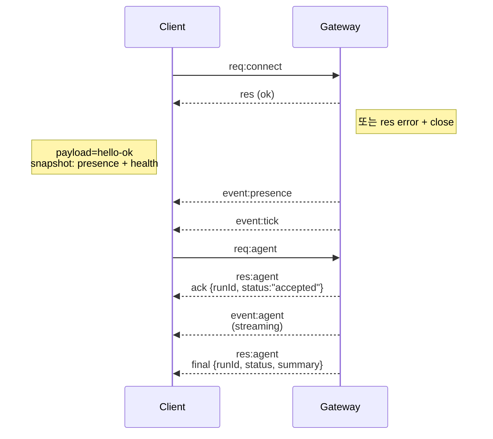

---
read_when:
    - 게이트웨이 프로토콜, 클라이언트 또는 전송 계층을 작업할 때
summary: WebSocket 게이트웨이 아키텍처, 구성 요소 및 클라이언트 흐름
title: Gateway 아키텍처
x-i18n:
    generated_at: "2026-04-05T12:39:32Z"
    model: gpt-5.4
    provider: openai
    source_hash: 2b12a2a29e94334c6d10787ac85c34b5b046f9a14f3dd53be453368ca4a7547d
    source_path: concepts/architecture.md
    workflow: 15
---

# Gateway 아키텍처

## 개요

- 하나의 장기 실행 **Gateway**가 모든 메시징 표면을 소유합니다(WhatsApp via
  Baileys, Telegram via grammY, Slack, Discord, Signal, iMessage, WebChat).
- 제어 평면 클라이언트(macOS 앱, CLI, 웹 UI, 자동화)는 구성된 바인드 호스트(기본값
  `127.0.0.1:18789`)에서 **WebSocket**을 통해
  Gateway에 연결합니다.
- **Nodes**(macOS/iOS/Android/headless)도 **WebSocket**을 통해 연결하지만,
  명시적인 caps/commands와 함께 `role: node`를 선언합니다.
- 호스트당 하나의 Gateway만 존재하며, WhatsApp 세션을 여는 유일한 위치입니다.
- **canvas host**는 Gateway HTTP 서버에서 다음 경로로 제공됩니다.
  - `/__openclaw__/canvas/` (에이전트가 편집 가능한 HTML/CSS/JS)
  - `/__openclaw__/a2ui/` (A2UI 호스트)
    이는 Gateway와 같은 포트(기본값 `18789`)를 사용합니다.

## 구성 요소 및 흐름

### Gateway (daemon)

- provider 연결을 유지합니다.
- 타입이 지정된 WS API(요청, 응답, 서버 푸시 이벤트)를 노출합니다.
- 들어오는 프레임을 JSON Schema에 따라 검증합니다.
- `agent`, `chat`, `presence`, `health`, `heartbeat`, `cron` 같은 이벤트를 내보냅니다.

### Clients (mac app / CLI / web admin)

- 클라이언트당 하나의 WS 연결을 사용합니다.
- 요청(`health`, `status`, `send`, `agent`, `system-presence`)을 보냅니다.
- 이벤트(`tick`, `agent`, `presence`, `shutdown`)를 구독합니다.

### Nodes (macOS / iOS / Android / headless)

- `role: node`와 함께 **같은 WS 서버**에 연결합니다.
- `connect`에서 장치 ID를 제공하며, pairing은 **장치 기반**(role `node`)이고
  승인은 장치 pairing 저장소에 유지됩니다.
- `canvas.*`, `camera.*`, `screen.record`, `location.get` 같은 명령을 노출합니다.

프로토콜 세부 사항:

- [Gateway protocol](/gateway/protocol)

### WebChat

- 채팅 기록과 전송을 위해 Gateway WS API를 사용하는 정적 UI입니다.
- 원격 설정에서는 다른
  클라이언트와 동일한 SSH/Tailscale 터널을 통해 연결됩니다.

## 연결 수명 주기(단일 클라이언트)



## 와이어 프로토콜(요약)

- 전송 계층: WebSocket, JSON payload를 포함한 텍스트 프레임.
- 첫 번째 프레임은 **반드시** `connect`여야 합니다.
- 핸드셰이크 이후:
  - 요청: `{type:"req", id, method, params}` → `{type:"res", id, ok, payload|error}`
  - 이벤트: `{type:"event", event, payload, seq?, stateVersion?}`
- `hello-ok.features.methods` / `events`는
  검색 메타데이터이며, 호출 가능한 모든 helper route의 생성된 덤프가 아닙니다.
- 공유 시크릿 인증은 구성된 gateway 인증 모드에 따라
  `connect.params.auth.token` 또는
  `connect.params.auth.password`를 사용합니다.
- Tailscale Serve
  (`gateway.auth.allowTailscale: true`) 같은 ID 기반 모드나 non-loopback
  `gateway.auth.mode: "trusted-proxy"`는 `connect.params.auth.*` 대신
  요청 헤더에서 인증을 충족합니다.
- private-ingress `gateway.auth.mode: "none"`은 공유 시크릿 인증을
  완전히 비활성화합니다. 이 모드는 공개/비신뢰 ingress에서는 사용하지 마세요.
- 부작용이 있는 메서드(`send`, `agent`)에는
  안전한 재시도를 위해 idempotency key가 필요합니다. 서버는 짧은 수명의 dedupe 캐시를 유지합니다.
- Nodes는 `connect`에 `role: "node"`와 caps/commands/permissions를 포함해야 합니다.

## pairing + 로컬 신뢰

- 모든 WS 클라이언트(운영자 + node)는 `connect`에 **장치 ID**를 포함합니다.
- 새 장치 ID는 pairing 승인이 필요하며, Gateway는 이후 연결을 위해 **device token**을 발급합니다.
- 직접적인 로컬 loopback 연결은 동일 호스트 UX를 부드럽게 유지하기 위해 자동 승인될 수 있습니다.
- OpenClaw에는 신뢰된 공유 시크릿 helper 흐름을 위한
  좁은 범위의 backend/container-local self-connect 경로도 있습니다.
- same-host tailnet 바인드를 포함한 tailnet 및 LAN 연결은 여전히
  명시적인 pairing 승인이 필요합니다.
- 모든 연결은 `connect.challenge` nonce에 서명해야 합니다.
- 서명 payload `v3`는 `platform` + `deviceFamily`도 바인딩하며, gateway는 재연결 시 pairing된 메타데이터를 고정하고
  메타데이터 변경 시 복구 pairing을 요구합니다.
- **비로컬** 연결은 여전히 명시적인 승인이 필요합니다.
- Gateway 인증(`gateway.auth.*`)은 로컬이든
  원격이든 **모든** 연결에 계속 적용됩니다.

세부 사항: [Gateway protocol](/gateway/protocol), [Pairing](/channels/pairing),
[Security](/gateway/security).

## 프로토콜 타이핑 및 코드 생성

- TypeBox 스키마가 프로토콜을 정의합니다.
- JSON Schema는 이러한 스키마에서 생성됩니다.
- Swift 모델은 JSON Schema에서 생성됩니다.

## 원격 액세스

- 권장: Tailscale 또는 VPN.
- 대안: SSH 터널

  ```bash
  ssh -N -L 18789:127.0.0.1:18789 user@host
  ```

- 같은 핸드셰이크 + 인증 토큰이 터널 위에서도 적용됩니다.
- 원격 설정의 WS에는 TLS + 선택적 pinning을 활성화할 수 있습니다.

## 운영 스냅샷

- 시작: `openclaw gateway` (포그라운드, 로그는 stdout으로 출력).
- 상태 확인: WS를 통한 `health` (`hello-ok`에도 포함됨).
- 감독: 자동 재시작을 위한 launchd/systemd.

## 불변 조건

- 정확히 하나의 Gateway가 호스트당 하나의 Baileys 세션을 제어합니다.
- 핸드셰이크는 필수이며, JSON이 아니거나 `connect`가 아닌 첫 프레임은 즉시 연결 종료됩니다.
- 이벤트는 재생되지 않으므로, 클라이언트는 누락이 있으면 새로고침해야 합니다.

## 관련

- [Agent Loop](/concepts/agent-loop) — 자세한 에이전트 실행 주기
- [Gateway Protocol](/gateway/protocol) — WebSocket 프로토콜 계약
- [Queue](/concepts/queue) — 명령 큐 및 동시성
- [Security](/gateway/security) — 신뢰 모델 및 보안 강화
