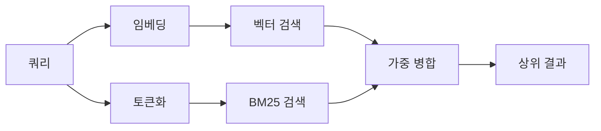

---
read_when:
    - '`memory_search`가 어떻게 작동하는지 이해하려는 경우'
    - 임베딩 provider를 선택하려는 경우
    - 검색 품질을 조정하려는 경우
summary: 메모리 검색이 임베딩과 하이브리드 검색을 사용해 관련 메모를 찾는 방법
title: 메모리 검색
x-i18n:
    generated_at: "2026-04-05T12:40:05Z"
    model: gpt-5.4
    provider: openai
    source_hash: 87b1cb3469c7805f95bca5e77a02919d1e06d626ad3633bbc5465f6ab9db12a2
    source_path: concepts/memory-search.md
    workflow: 15
---

# 메모리 검색

`memory_search`는 원문과 표현이 다르더라도 메모리 파일에서 관련 메모를 찾습니다. 이를 위해 메모리를 작은 청크로 인덱싱하고, 임베딩, 키워드 또는 둘 다를 사용해 검색합니다.

## 빠른 시작

OpenAI, Gemini, Voyage 또는 Mistral API 키가 구성되어 있으면 메모리 검색은 자동으로 작동합니다. provider를 명시적으로 설정하려면 다음과 같이 하세요.

```json5
{
  agents: {
    defaults: {
      memorySearch: {
        provider: "openai", // 또는 "gemini", "local", "ollama" 등
      },
    },
  },
}
```

API 키 없이 로컬 임베딩을 사용하려면 `provider: "local"`을 사용하세요(`node-llama-cpp` 필요).

## 지원되는 provider

| Provider | ID        | API 키 필요 | 참고 |
| -------- | --------- | ----------- | ---- |
| OpenAI   | `openai`  | 예          | 자동 감지, 빠름 |
| Gemini   | `gemini`  | 예          | 이미지/오디오 인덱싱 지원 |
| Voyage   | `voyage`  | 예          | 자동 감지 |
| Mistral  | `mistral` | 예          | 자동 감지 |
| Ollama   | `ollama`  | 아니요      | 로컬, 명시적으로 설정해야 함 |
| Local    | `local`   | 아니요      | GGUF 모델, 약 0.6 GB 다운로드 |

## 검색 작동 방식

OpenClaw는 두 개의 검색 경로를 병렬로 실행하고 결과를 병합합니다.



- **벡터 검색**은 의미가 비슷한 메모를 찾습니다(예: "gateway host"와 "OpenClaw를 실행하는 머신" 매칭).
- **BM25 키워드 검색**은 정확한 일치를 찾습니다(ID, 오류 문자열, config 키).

한 경로만 사용 가능한 경우(임베딩 없음 또는 FTS 없음), 다른 하나만 단독으로 실행됩니다.

## 검색 품질 개선

메모 기록이 많을 때 도움이 되는 두 가지 선택 기능이 있습니다.

### 시간 감쇠

오래된 메모는 순위 가중치가 점차 줄어들어 최근 정보가 먼저 표시됩니다.
기본 반감기 30일 기준으로 지난달 메모는 원래 가중치의 50% 점수를 가집니다.
`MEMORY.md` 같은 상시 유지 파일은 감쇠되지 않습니다.

<Tip>
에이전트에 수개월치 일일 메모가 있고 오래된 정보가 최근 컨텍스트보다 계속 더 높게 순위화된다면 시간 감쇠를 활성화하세요.
</Tip>

### MMR(다양성)

중복 결과를 줄입니다. 다섯 개의 메모가 모두 같은 라우터 config를 언급하는 경우, MMR은 상위 결과가 반복되지 않고 서로 다른 주제를 다루도록 보장합니다.

<Tip>
`memory_search`가 서로 다른 일일 메모에서 거의 중복된 스니펫을 계속 반환한다면 MMR을 활성화하세요.
</Tip>

### 둘 다 활성화

```json5
{
  agents: {
    defaults: {
      memorySearch: {
        query: {
          hybrid: {
            mmr: { enabled: true },
            temporalDecay: { enabled: true },
          },
        },
      },
    },
  },
}
```

## 멀티모달 메모리

Gemini Embedding 2를 사용하면 Markdown과 함께 이미지 및 오디오 파일도 인덱싱할 수 있습니다.
검색 쿼리는 여전히 텍스트이지만 시각 및 오디오 콘텐츠와 일치합니다. 설정은 [메모리 구성 참조](/reference/memory-config)를 참조하세요.

## 세션 메모리 검색

선택적으로 세션 트랜스크립트를 인덱싱하여 `memory_search`가 이전 대화를 회상하도록 할 수 있습니다. 이것은 `memorySearch.experimental.sessionMemory`를 통한 옵트인 기능입니다. 자세한 내용은 [구성 참조](/reference/memory-config)를 참조하세요.

## 문제 해결

**결과가 없나요?** 인덱스를 확인하려면 `openclaw memory status`를 실행하세요. 비어 있으면 `openclaw memory index --force`를 실행하세요.

**키워드 일치만 나오나요?** 임베딩 provider가 구성되지 않았을 수 있습니다. `openclaw memory status --deep`를 확인하세요.

**CJK 텍스트를 찾지 못하나요?** `openclaw memory index --force`로 FTS 인덱스를 다시 빌드하세요.

## 추가 읽기

- [메모리](/concepts/memory) -- 파일 레이아웃, 백엔드, 도구
- [메모리 구성 참조](/reference/memory-config) -- 모든 config 옵션
