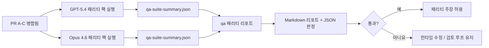

---
x-i18n:
    generated_at: "2026-04-11T15:15:47Z"
    model: gpt-5.4
    provider: openai
    source_hash: 910bcf7668becf182ef48185b43728bf2fa69629d6d50189d47d47b06f807a9e
    source_path: help/gpt54-codex-agentic-parity-maintainers.md
    workflow: 15
---

# GPT-5.4 / Codex 패리티 유지보수 메모

이 메모는 원래의 6개 계약 아키텍처를 유지하면서 GPT-5.4 / Codex 패리티 프로그램을 4개의 병합 단위로 검토하는 방법을 설명합니다.

## 병합 단위

### PR A: 엄격한 에이전트형 실행

담당 범위:

- `executionContract`
- GPT-5 우선 동일 턴 후속 실행
- 비종결형 진행 추적으로서의 `update_plan`
- 계획만 제시한 뒤 조용히 멈추는 대신 명시적 차단 상태

담당하지 않는 범위:

- 인증/런타임 실패 분류
- 권한 관련 진실성
- 재생/이어가기 재설계
- 패리티 벤치마킹

### PR B: 런타임 진실성

담당 범위:

- Codex OAuth 스코프 정확성
- 타입화된 제공자/런타임 실패 분류
- `/elevated full` 사용 가능 여부와 차단 사유의 진실한 표시

담당하지 않는 범위:

- 도구 스키마 정규화
- 재생/활성 상태
- 벤치마크 게이팅

### PR C: 실행 정확성

담당 범위:

- 제공자 소유 OpenAI/Codex 도구 호환성
- 매개변수 없는 엄격한 스키마 처리
- replay-invalid 노출
- 일시 중지됨, 차단됨, 중단됨 장기 작업 상태 가시성

담당하지 않는 범위:

- 자체 선택 이어가기
- 제공자 훅 밖의 일반적인 Codex 방언 동작
- 벤치마크 게이팅

### PR D: 패리티 하네스

담당 범위:

- 1차 GPT-5.4 vs Opus 4.6 시나리오 팩
- 패리티 문서화
- 패리티 리포트 및 릴리스 게이트 메커니즘

담당하지 않는 범위:

- QA-lab 밖의 런타임 동작 변경
- 하네스 내부의 인증/프록시/DNS 시뮬레이션

## 원래 6개 계약으로 다시 매핑

| 원래 계약 | 병합 단위 |
| ---------------------------------------- | ---------- |
| 제공자 전송/인증 정확성 | PR B |
| 도구 계약/스키마 호환성 | PR C |
| 동일 턴 실행 | PR A |
| 권한 관련 진실성 | PR B |
| 재생/이어가기/활성 상태 정확성 | PR C |
| 벤치마크/릴리스 게이트 | PR D |

## 검토 순서

1. PR A
2. PR B
3. PR C
4. PR D

PR D는 증명 계층입니다. 런타임 정확성 PR들이 지연되는 이유가 되어서는 안 됩니다.

## 확인할 사항

### PR A

- GPT-5 실행이 설명만 하다 멈추는 대신 실제로 동작하거나 실패 시 닫힌 형태로 종료되는지
- `update_plan` 자체만으로는 더 이상 진행처럼 보이지 않는지
- 동작이 여전히 GPT-5 우선이며 임베디드 Pi 범위로 제한되는지

### PR B

- 인증/프록시/런타임 실패가 더 이상 일반적인 “모델 실패” 처리로 뭉뚱그려지지 않는지
- `/elevated full`이 실제로 사용 가능할 때만 사용 가능하다고 설명되는지
- 차단 사유가 모델과 사용자 대상 런타임 모두에 표시되는지

### PR C

- 엄격한 OpenAI/Codex 도구 등록이 예측 가능하게 동작하는지
- 매개변수 없는 도구가 엄격한 스키마 검사에서 실패하지 않는지
- 재생 및 압축 결과가 진실한 활성 상태를 유지하는지

### PR D

- 시나리오 팩이 이해하기 쉽고 재현 가능한지
- 팩에 읽기 전용 흐름만이 아니라 변경을 수반하는 재생 안전성 레인이 포함되는지
- 리포트가 사람과 자동화 모두가 읽기 쉬운지
- 패리티 주장이 일화가 아니라 근거로 뒷받침되는지

PR D의 예상 산출물:

- 각 모델 실행에 대한 `qa-suite-report.md` / `qa-suite-summary.json`
- 집계 및 시나리오별 비교가 담긴 `qa-agentic-parity-report.md`
- 기계가 읽을 수 있는 판정이 담긴 `qa-agentic-parity-summary.json`

## 릴리스 게이트

다음 조건을 충족하기 전까지는 GPT-5.4가 Opus 4.6과 동등하거나 더 낫다고 주장하지 마세요:

- PR A, PR B, PR C가 병합됨
- PR D가 1차 패리티 팩을 문제 없이 실행함
- 런타임 진실성 회귀 스위트가 계속 녹색 상태를 유지함
- 패리티 리포트에 가짜 성공 사례가 없고 중단 동작 회귀도 없음

패리티 하네스만이 유일한 근거 출처는 아닙니다. 검토 시 이 구분을 명확히 유지하세요:

- PR D는 GPT-5.4 vs Opus 4.6의 시나리오 기반 비교를 담당합니다
- PR B의 결정적 스위트는 여전히 인증/프록시/DNS 및 전체 접근 진실성 근거를 담당합니다

## 목표-근거 매핑

| 완료 게이트 항목 | 주 담당 | 검토 산출물 |
| ---------------------------------------- | ------------- | ------------------------------------------------------------------- |
| 계획만 제시하고 멈추는 현상 없음 | PR A | 엄격한 에이전트형 런타임 테스트 및 `approval-turn-tool-followthrough` |
| 가짜 진행이나 가짜 도구 완료 없음 | PR A + PR D | 패리티 가짜 성공 수 및 시나리오별 리포트 세부사항 |
| 잘못된 `/elevated full` 안내 없음 | PR B | 결정적 런타임 진실성 스위트 |
| 재생/활성 상태 실패가 계속 명시적으로 유지됨 | PR C + PR D | 라이프사이클/재생 스위트 및 `compaction-retry-mutating-tool` |
| GPT-5.4가 Opus 4.6과 같거나 더 우수함 | PR D | `qa-agentic-parity-report.md` 및 `qa-agentic-parity-summary.json` |

## 검토자용 요약: 변경 전 vs 변경 후

| 변경 전 사용자에게 보이던 문제 | 변경 후 검토 신호 |
| ----------------------------------------------------------- | --------------------------------------------------------------------------------------- |
| GPT-5.4가 계획만 세운 뒤 멈췄음 | PR A가 설명만으로 끝나는 완료 대신 행동 또는 차단 동작을 보여줌 |
| 엄격한 OpenAI/Codex 스키마에서 도구 사용이 불안정하게 느껴졌음 | PR C가 도구 등록과 매개변수 없는 호출을 예측 가능하게 유지함 |
| `/elevated full` 힌트가 때때로 오해의 소지가 있었음 | PR B가 안내를 실제 런타임 기능 및 차단 사유와 연결함 |
| 장기 작업이 재생/압축의 모호함 속으로 사라질 수 있었음 | PR C가 일시 중지됨, 차단됨, 중단됨, replay-invalid 상태를 명시적으로 표시함 |
| 패리티 주장이 일화 수준이었음 | PR D가 두 모델에 동일한 시나리오 범위를 적용한 리포트와 JSON 판정을 생성함 |
