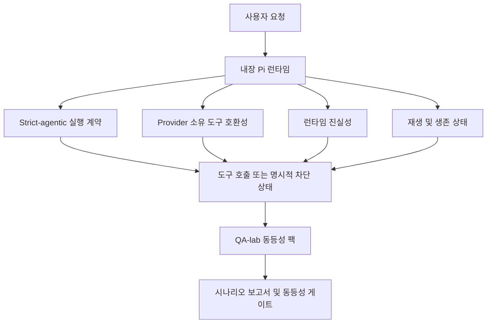
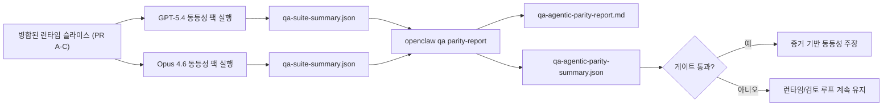

---
x-i18n:
    generated_at: "2026-04-11T15:15:47Z"
    model: gpt-5.4
    provider: openai
    source_hash: 7ee6b925b8a0f8843693cea9d50b40544657b5fb8a9e0860e2ff5badb273acb6
    source_path: help/gpt54-codex-agentic-parity.md
    workflow: 15
---

# OpenClaw에서의 GPT-5.4 / Codex 에이전트 동등성

OpenClaw는 이미 도구를 사용하는 프런티어 모델과 잘 작동했지만, GPT-5.4 및 Codex 스타일 모델은 여전히 몇 가지 실무적인 측면에서 성능이 부족했습니다.

- 작업을 수행하지 않고 계획만 세운 뒤 멈출 수 있었습니다
- 엄격한 OpenAI/Codex 도구 스키마를 잘못 사용할 수 있었습니다
- 전체 액세스가 불가능한 경우에도 `/elevated full`을 요청할 수 있었습니다
- 재생 또는 압축 중 장기 실행 작업 상태를 잃을 수 있었습니다
- Claude Opus 4.6과의 동등성 주장이 반복 가능한 시나리오가 아니라 일화에 기반하고 있었습니다

이 동등성 프로그램은 이러한 격차를 검토 가능한 네 개의 슬라이스로 해결합니다.

## 변경 사항

### PR A: strict-agentic 실행

이 슬라이스는 내장 Pi GPT-5 실행을 위한 옵트인 `strict-agentic` 실행 계약을 추가합니다.

활성화되면 OpenClaw는 계획만 말하는 턴을 더 이상 “충분히 좋은” 완료로 받아들이지 않습니다. 모델이 하려는 일만 말하고 실제로 도구를 사용하거나 진전을 만들지 않으면, OpenClaw는 즉시 행동하라는 지시와 함께 재시도한 다음 작업을 조용히 끝내는 대신 명시적인 차단 상태로 안전하게 실패 처리합니다.

이 변경은 특히 다음 상황에서 GPT-5.4 경험을 개선합니다.

- 짧은 “좋아, 해” 후속 요청
- 첫 단계가 명확한 코드 작업
- `update_plan`이 채우기용 텍스트가 아니라 진행 추적이어야 하는 흐름

### PR B: 런타임 진실성

이 슬라이스는 OpenClaw가 두 가지 사항에 대해 사실대로 말하도록 합니다.

- provider/runtime 호출이 실패한 이유
- `/elevated full`이 실제로 사용 가능한지 여부

즉, GPT-5.4는 누락된 범위, 인증 갱신 실패, HTML 403 인증 실패, 프록시 문제, DNS 또는 타임아웃 실패, 차단된 전체 액세스 모드에 대해 더 나은 런타임 신호를 받게 됩니다. 모델은 잘못된 해결책을 지어내거나 런타임이 제공할 수 없는 권한 모드를 계속 요구할 가능성이 줄어듭니다.

### PR C: 실행 정확성

이 슬라이스는 두 종류의 정확성을 개선합니다.

- provider 소유 OpenAI/Codex 도구 스키마 호환성
- 재생 및 장기 작업 생존 상태 노출

도구 호환성 작업은 특히 매개변수 없는 도구와 엄격한 객체 루트 기대치 주변에서 엄격한 OpenAI/Codex 도구 등록을 위한 스키마 마찰을 줄입니다. 재생/생존 상태 작업은 장기 실행 작업을 더 잘 관찰할 수 있게 하여, 일시 중지됨, 차단됨, 방치됨 상태가 일반적인 실패 텍스트 속으로 사라지지 않도록 합니다.

### PR D: 동등성 하네스

이 슬라이스는 GPT-5.4와 Opus 4.6을 동일한 시나리오로 실행하고 공통 증거를 사용해 비교할 수 있도록 첫 번째 QA-lab 동등성 팩을 추가합니다.

동등성 팩은 증명 계층입니다. 자체적으로 런타임 동작을 변경하지는 않습니다.

`qa-suite-summary.json` 아티팩트 두 개가 준비되면 다음 명령으로 릴리스 게이트 비교를 생성합니다.

```bash
pnpm openclaw qa parity-report \
  --repo-root . \
  --candidate-summary .artifacts/qa-e2e/gpt54/qa-suite-summary.json \
  --baseline-summary .artifacts/qa-e2e/opus46/qa-suite-summary.json \
  --output-dir .artifacts/qa-e2e/parity
```

이 명령은 다음을 생성합니다.

- 사람이 읽을 수 있는 Markdown 보고서
- 기계가 읽을 수 있는 JSON 판정
- 명시적인 `pass` / `fail` 게이트 결과

## 이것이 실제로 GPT-5.4를 어떻게 개선하는가

이 작업 이전에는 OpenClaw에서의 GPT-5.4가 실제 코딩 세션에서 Opus보다 덜 에이전트적으로 느껴질 수 있었습니다. 런타임이 특히 GPT-5 스타일 모델에 해로운 동작을 허용했기 때문입니다.

- 설명만 하는 턴
- 도구 주변의 스키마 마찰
- 모호한 권한 피드백
- 조용한 재생 또는 압축 손상

목표는 GPT-5.4가 Opus를 모방하게 만드는 것이 아닙니다. 목표는 GPT-5.4에 실제 진전을 보상하고, 더 깔끔한 도구 및 권한 의미 체계를 제공하며, 실패 모드를 기계와 사람 모두가 읽을 수 있는 명시적 상태로 바꾸는 런타임 계약을 제공하는 것입니다.

이로써 사용자 경험은 다음과 같이 바뀝니다.

- “모델이 좋은 계획은 세웠지만 멈췄다”

에서

- “모델이 실제로 행동했거나, OpenClaw가 왜 할 수 없었는지 정확한 이유를 드러냈다”

로 바뀝니다.

## GPT-5.4 사용자를 위한 이전과 이후

| 이 프로그램 이전                                                                 | PR A-D 이후                                                                      |
| --------------------------------------------------------------------------------- | -------------------------------------------------------------------------------- |
| GPT-5.4는 합리적인 계획 후 다음 도구 단계를 수행하지 않고 멈출 수 있었습니다     | PR A는 “계획만”을 “지금 행동하거나 차단 상태를 드러내기”로 바꿉니다              |
| 엄격한 도구 스키마가 매개변수 없는 도구나 OpenAI/Codex 형태의 도구를 혼란스럽게 거부할 수 있었습니다 | PR C는 provider 소유 도구 등록과 호출을 더 예측 가능하게 만듭니다               |
| `/elevated full` 안내가 차단된 런타임에서 모호하거나 틀릴 수 있었습니다           | PR B는 GPT-5.4와 사용자에게 사실에 기반한 런타임 및 권한 힌트를 제공합니다       |
| 재생 또는 압축 실패가 작업이 조용히 사라진 것처럼 느껴질 수 있었습니다            | PR C는 일시 중지됨, 차단됨, 방치됨, 재생 무효 결과를 명시적으로 드러냅니다       |
| “GPT-5.4가 Opus보다 나쁘게 느껴진다”는 주장은 대부분 일화 수준이었습니다          | PR D는 이를 동일한 시나리오 팩, 동일한 지표, 명확한 pass/fail 게이트로 바꿉니다 |

## 아키텍처



## 릴리스 흐름



## 시나리오 팩

현재 첫 번째 동등성 팩은 다섯 가지 시나리오를 다룹니다.

### `approval-turn-tool-followthrough`

짧은 승인 후 “제가 하겠습니다”에서 멈추지 않는지 확인합니다. 같은 턴 안에서 첫 번째 구체적 행동을 수행해야 합니다.

### `model-switch-tool-continuity`

도구를 사용하는 작업이 모델/런타임 전환 경계를 넘을 때 설명으로 되돌아가거나 실행 맥락을 잃지 않고 일관되게 유지되는지 확인합니다.

### `source-docs-discovery-report`

모델이 소스와 문서를 읽고, 결과를 종합하고, 얇은 요약만 내놓고 일찍 멈추지 않으면서 에이전트적으로 작업을 계속할 수 있는지 확인합니다.

### `image-understanding-attachment`

첨부 파일이 포함된 혼합 모드 작업이 계속 실행 가능하게 유지되고 모호한 서술로 무너지지 않는지 확인합니다.

### `compaction-retry-mutating-tool`

실제 변경 쓰기를 포함하는 작업이 압축, 재시도 또는 압박 상황에서 응답 상태를 잃더라도 재생 비안전성을 명시적으로 유지하는지, 조용히 재생 안전한 것처럼 보이지 않는지 확인합니다.

## 시나리오 매트릭스

| 시나리오                           | 테스트 대상                              | 바람직한 GPT-5.4 동작                                                         | 실패 신호                                                                        |
| ---------------------------------- | ---------------------------------------- | ----------------------------------------------------------------------------- | -------------------------------------------------------------------------------- |
| `approval-turn-tool-followthrough` | 계획 후 짧은 승인 턴                     | 의도를 다시 말하는 대신 즉시 첫 번째 구체적인 도구 작업을 시작함             | 계획만 하는 후속 응답, 도구 활동 없음, 또는 실제 차단 사유 없는 차단 턴         |
| `model-switch-tool-continuity`     | 도구 사용 중 런타임/모델 전환            | 작업 맥락을 보존하고 일관되게 계속 행동함                                    | 설명으로 재설정됨, 도구 맥락 상실, 또는 전환 후 멈춤                            |
| `source-docs-discovery-report`     | 소스 읽기 + 종합 + 행동                  | 소스를 찾고, 도구를 사용하고, 멈추지 않으면서 유용한 보고서를 생성함         | 얇은 요약, 도구 작업 누락, 또는 불완전한 턴 중단                                |
| `image-understanding-attachment`   | 첨부 파일 기반 에이전트 작업             | 첨부 파일을 해석하고, 이를 도구와 연결하며, 작업을 계속 진행함               | 모호한 서술, 첨부 파일 무시, 또는 구체적인 다음 행동 없음                       |
| `compaction-retry-mutating-tool`   | 압축 압박 하의 변경 작업                 | 실제 쓰기를 수행하고, 부작용 이후에도 재생 비안전성을 명시적으로 유지함      | 변경 쓰기는 발생했지만 재생 안전성이 암시되거나, 누락되거나, 모순됨             |

## 릴리스 게이트

GPT-5.4는 병합된 런타임이 동등성 팩과 런타임 진실성 회귀를 동시에 통과할 때에만 동등 이상으로 간주할 수 있습니다.

필수 결과:

- 다음 도구 작업이 명확할 때 계획만 세우고 멈추지 않음
- 실제 실행 없이 거짓 완료가 없음
- 잘못된 `/elevated full` 안내가 없음
- 조용한 재생 또는 압축 방치가 없음
- 합의된 Opus 4.6 기준선과 같거나 더 강한 동등성 팩 지표

첫 번째 하네스에서 게이트는 다음을 비교합니다.

- 완료율
- 의도치 않은 중단율
- 유효한 도구 호출율
- 가짜 성공 수

동등성 증거는 의도적으로 두 계층으로 나뉩니다.

- PR D는 QA-lab을 통해 동일 시나리오에서의 GPT-5.4 대 Opus 4.6 동작을 증명합니다
- PR B의 결정적 스위트는 하네스 외부에서 인증, 프록시, DNS, `/elevated full` 진실성을 증명합니다

## 목표-증거 매트릭스

| 완료 게이트 항목                                      | 담당 PR     | 증거 출처                                                          | 통과 신호                                                                                |
| ----------------------------------------------------- | ----------- | ------------------------------------------------------------------ | ---------------------------------------------------------------------------------------- |
| GPT-5.4가 더 이상 계획 후 멈추지 않음                 | PR A        | `approval-turn-tool-followthrough` 및 PR A 런타임 스위트          | 승인 턴이 실제 작업 또는 명시적 차단 상태를 유발함                                      |
| GPT-5.4가 더 이상 가짜 진전 또는 가짜 도구 완료를 만들지 않음 | PR A + PR D | 동등성 보고서 시나리오 결과 및 가짜 성공 수                       | 의심스러운 통과 결과가 없고 설명만 하는 완료도 없음                                     |
| GPT-5.4가 더 이상 거짓 `/elevated full` 안내를 주지 않음 | PR B        | 결정적 진실성 스위트                                               | 차단 사유와 전체 액세스 힌트가 런타임에 대해 정확하게 유지됨                            |
| 재생/생존 실패가 계속 명시적으로 유지됨               | PR C + PR D | PR C 수명 주기/재생 스위트 및 `compaction-retry-mutating-tool`    | 변경 작업이 조용히 사라지는 대신 재생 비안전성을 명시적으로 유지함                      |
| GPT-5.4가 합의된 지표에서 Opus 4.6과 같거나 더 나음   | PR D        | `qa-agentic-parity-report.md` 및 `qa-agentic-parity-summary.json` | 동일한 시나리오 범위를 보장하고 완료, 중단 동작, 유효한 도구 사용에서 회귀가 없음      |

## 동등성 판정을 읽는 방법

첫 번째 동등성 팩의 최종 기계 판독 가능 결정으로 `qa-agentic-parity-summary.json`의 판정을 사용하세요.

- `pass`는 GPT-5.4가 Opus 4.6과 동일한 시나리오를 처리했고, 합의된 집계 지표에서 회귀하지 않았음을 의미합니다.
- `fail`은 하나 이상의 하드 게이트가 발동되었음을 의미합니다. 더 낮은 완료율, 더 나쁜 의도치 않은 중단, 더 약한 유효 도구 사용, 하나라도 있는 가짜 성공 사례, 또는 일치하지 않는 시나리오 범위가 여기에 해당합니다.
- “공유/기본 CI 이슈”는 그 자체로 동등성 결과가 아닙니다. PR D 외부의 CI 잡음이 실행을 막는 경우, 브랜치 시절 로그에서 추론하는 대신 정리된 병합 런타임 실행을 기다려 판정을 내려야 합니다.
- 인증, 프록시, DNS, `/elevated full` 진실성은 여전히 PR B의 결정적 스위트에서 나오므로, 최종 릴리스 주장은 두 가지를 모두 필요로 합니다. 즉, 통과한 PR D 동등성 판정과 녹색인 PR B 진실성 커버리지입니다.

## 누가 `strict-agentic`을 활성화해야 하는가

다음과 같은 경우 `strict-agentic`을 사용하세요.

- 다음 단계가 명확할 때 에이전트가 즉시 행동해야 하는 경우
- GPT-5.4 또는 Codex 계열 모델이 주 런타임인 경우
- “도움이 되는” 요약만 하는 응답보다 명시적인 차단 상태를 선호하는 경우

다음과 같은 경우 기본 계약을 유지하세요.

- 기존의 더 느슨한 동작을 원하는 경우
- GPT-5 계열 모델을 사용하지 않는 경우
- 런타임 강제가 아니라 프롬프트를 테스트하는 경우
