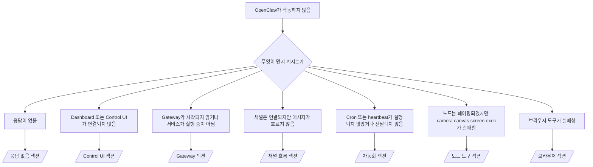

---
read_when:
    - OpenClaw가 작동하지 않아 가장 빠른 해결 경로가 필요한 경우
    - 심층 실행 가이드로 들어가기 전에 분류 흐름이 필요한 경우
summary: OpenClaw를 위한 증상 우선 문제 해결 허브
title: 일반 문제 해결
x-i18n:
    generated_at: "2026-04-05T12:45:23Z"
    model: gpt-5.4
    provider: openai
    source_hash: 23ae9638af5edf5a5e0584ccb15ba404223ac3b16c2d62eb93b2c9dac171c252
    source_path: help/troubleshooting.md
    workflow: 15
---

# 문제 해결

2분밖에 없다면, 이 페이지를 분류용 첫 관문으로 사용하세요.

## 처음 60초

정확히 다음 순서대로 실행하세요:

```bash
openclaw status
openclaw status --all
openclaw gateway probe
openclaw gateway status
openclaw doctor
openclaw channels status --probe
openclaw logs --follow
```

좋은 출력 한 줄 요약:

- `openclaw status` → 구성된 채널이 표시되고 뚜렷한 인증 오류가 없음.
- `openclaw status --all` → 전체 보고서가 존재하며 공유 가능함.
- `openclaw gateway probe` → 예상한 gateway 대상에 연결 가능함(`Reachable: yes`). `RPC: limited - missing scope: operator.read`는 연결 실패가 아니라 제한된 진단 상태입니다.
- `openclaw gateway status` → `Runtime: running` 및 `RPC probe: ok`.
- `openclaw doctor` → 차단하는 config/서비스 오류가 없음.
- `openclaw channels status --probe` → gateway에 연결 가능하면 계정별 실시간 전송 상태와 `works`, `audit ok` 같은 probe/audit 결과를 반환합니다. gateway에 연결할 수 없으면 이 명령은 config 전용 요약으로 대체됩니다.
- `openclaw logs --follow` → 활동이 안정적으로 보이며 반복되는 치명적 오류가 없음.

## Anthropic 긴 컨텍스트 429

다음이 보이면:
`HTTP 429: rate_limit_error: Extra usage is required for long context requests`,
[/gateway/troubleshooting#anthropic-429-extra-usage-required-for-long-context](/gateway/troubleshooting#anthropic-429-extra-usage-required-for-long-context)로 이동하세요.

## openclaw extensions 누락으로 plugin 설치 실패

설치가 `package.json missing openclaw.extensions`와 함께 실패하면, plugin 패키지가 더 이상 OpenClaw가 허용하지 않는 오래된 형식을 사용하고 있는 것입니다.

plugin 패키지에서 다음을 수정하세요:

1. `package.json`에 `openclaw.extensions`를 추가합니다.
2. 항목이 빌드된 런타임 파일(보통 `./dist/index.js`)을 가리키도록 합니다.
3. plugin을 다시 게시하고 `openclaw plugins install <package>`를 다시 실행합니다.

예시:

```json
{
  "name": "@openclaw/my-plugin",
  "version": "1.2.3",
  "openclaw": {
    "extensions": ["./dist/index.js"]
  }
}
```

참조: [Plugin architecture](/plugins/architecture)

## 결정 트리



<AccordionGroup>
  <Accordion title="응답 없음">
    ```bash
    openclaw status
    openclaw gateway status
    openclaw channels status --probe
    openclaw pairing list --channel <channel> [--account <id>]
    openclaw logs --follow
    ```

    좋은 출력 예시:

    - `Runtime: running`
    - `RPC probe: ok`
    - 채널에 전송 계층 연결 상태가 표시되고, 지원되는 경우 `channels status --probe`에 `works` 또는 `audit ok`가 표시됨
    - 발신자가 승인된 상태로 표시됨(또는 DM 정책이 open/allowlist임)

    일반적인 로그 시그니처:

    - `drop guild message (mention required` → Discord에서 멘션 게이팅이 메시지를 차단함.
    - `pairing request` → 발신자가 승인되지 않았으며 DM 페어링 승인을 기다리는 중.
    - 채널 로그의 `blocked` / `allowlist` → 발신자, 룸, 또는 그룹이 필터링됨.

    심화 페이지:

    - [/gateway/troubleshooting#no-replies](/gateway/troubleshooting#no-replies)
    - [/channels/troubleshooting](/channels/troubleshooting)
    - [/channels/pairing](/channels/pairing)

  </Accordion>

  <Accordion title="Dashboard 또는 Control UI가 연결되지 않음">
    ```bash
    openclaw status
    openclaw gateway status
    openclaw logs --follow
    openclaw doctor
    openclaw channels status --probe
    ```

    좋은 출력 예시:

    - `openclaw gateway status`에 `Dashboard: http://...`가 표시됨
    - `RPC probe: ok`
    - 로그에 인증 루프가 없음

    일반적인 로그 시그니처:

    - `device identity required` → HTTP/비보안 컨텍스트에서 장치 인증을 완료할 수 없음.
    - `origin not allowed` → 브라우저 `Origin`이 Control UI gateway 대상에 허용되지 않음.
    - 재시도 힌트(`canRetryWithDeviceToken=true`)가 있는 `AUTH_TOKEN_MISMATCH` → 신뢰된 device-token 재시도가 한 번 자동으로 발생할 수 있음.
    - 이 캐시된 토큰 재시도는 페어링된 장치 토큰과 함께 저장된 캐시된 범위 집합을 재사용합니다. 명시적 `deviceToken` / 명시적 `scopes` 호출자는 요청한 범위 집합을 유지합니다.
    - 비동기 Tailscale Serve Control UI 경로에서는 동일한 `{scope, ip}`에 대한 실패한 시도가 제한기에 실패를 기록하기 전에 직렬화되므로, 두 번째 잘못된 동시 재시도는 이미 `retry later`를 표시할 수 있습니다.
    - localhost 브라우저 origin에서 발생한 `too many failed authentication attempts (retry later)` → 같은 `Origin`에서 반복된 실패가 일시적으로 잠겼습니다. 다른 localhost origin은 별도 버킷을 사용합니다.
    - 그 재시도 이후 반복되는 `unauthorized` → 잘못된 토큰/비밀번호, 인증 모드 불일치, 또는 오래된 페어링 장치 토큰.
    - `gateway connect failed:` → UI가 잘못된 URL/포트를 대상으로 하거나 gateway에 연결할 수 없음.

    심화 페이지:

    - [/gateway/troubleshooting#dashboard-control-ui-connectivity](/gateway/troubleshooting#dashboard-control-ui-connectivity)
    - [/web/control-ui](/web/control-ui)
    - [/gateway/authentication](/gateway/authentication)

  </Accordion>

  <Accordion title="Gateway가 시작되지 않거나 서비스는 설치되었지만 실행 중이 아님">
    ```bash
    openclaw status
    openclaw gateway status
    openclaw logs --follow
    openclaw doctor
    openclaw channels status --probe
    ```

    좋은 출력 예시:

    - `Service: ... (loaded)`
    - `Runtime: running`
    - `RPC probe: ok`

    일반적인 로그 시그니처:

    - `Gateway start blocked: set gateway.mode=local` 또는 `existing config is missing gateway.mode` → gateway 모드가 remote이거나 config 파일에 local-mode 표시가 누락되어 복구가 필요함.
    - `refusing to bind gateway ... without auth` → 유효한 gateway 인증 경로(token/password 또는 구성된 경우 trusted-proxy) 없이 non-loopback bind를 시도함.
    - `another gateway instance is already listening` 또는 `EADDRINUSE` → 포트가 이미 사용 중임.

    심화 페이지:

    - [/gateway/troubleshooting#gateway-service-not-running](/gateway/troubleshooting#gateway-service-not-running)
    - [/gateway/background-process](/gateway/background-process)
    - [/gateway/configuration](/gateway/configuration)

  </Accordion>

  <Accordion title="채널은 연결되지만 메시지가 흐르지 않음">
    ```bash
    openclaw status
    openclaw gateway status
    openclaw logs --follow
    openclaw doctor
    openclaw channels status --probe
    ```

    좋은 출력 예시:

    - 채널 전송 계층이 연결되어 있음.
    - 페어링/allowlist 검사가 통과함.
    - 필요 시 멘션이 감지됨.

    일반적인 로그 시그니처:

    - `mention required` → 그룹 멘션 게이팅이 처리를 차단함.
    - `pairing` / `pending` → DM 발신자가 아직 승인되지 않음.
    - `not_in_channel`, `missing_scope`, `Forbidden`, `401/403` → 채널 권한 또는 토큰 문제.

    심화 페이지:

    - [/gateway/troubleshooting#channel-connected-messages-not-flowing](/gateway/troubleshooting#channel-connected-messages-not-flowing)
    - [/channels/troubleshooting](/channels/troubleshooting)

  </Accordion>

  <Accordion title="Cron 또는 heartbeat가 실행되지 않았거나 전달되지 않음">
    ```bash
    openclaw status
    openclaw gateway status
    openclaw cron status
    openclaw cron list
    openclaw cron runs --id <jobId> --limit 20
    openclaw logs --follow
    ```

    좋은 출력 예시:

    - `cron.status`가 활성화 상태이며 다음 실행 시각을 표시함.
    - `cron runs`가 최근 `ok` 항목을 표시함.
    - Heartbeat가 활성화되어 있고 비활성 시간대 밖에 있지 않음.

    일반적인 로그 시그니처:

- `cron: scheduler disabled; jobs will not run automatically` → cron이 비활성화됨.
- `heartbeat skipped`와 함께 `reason=quiet-hours` → 구성된 활성 시간대 밖임.
- `heartbeat skipped`와 함께 `reason=empty-heartbeat-file` → `HEARTBEAT.md`는 존재하지만 빈 내용 또는 헤더만 있는 스캐폴딩만 포함함.
- `heartbeat skipped`와 함께 `reason=no-tasks-due` → `HEARTBEAT.md` 작업 모드는 활성화되어 있지만 아직 어떤 작업 간격도 도래하지 않음.
- `heartbeat skipped`와 함께 `reason=alerts-disabled` → 모든 heartbeat 가시성이 비활성화됨(`showOk`, `showAlerts`, `useIndicator`가 모두 꺼짐).
- `requests-in-flight` → main lane이 바쁨. heartbeat 실행이 지연됨.
- `unknown accountId` → heartbeat 전달 대상 account가 존재하지 않음.

      심화 페이지:

      - [/gateway/troubleshooting#cron-and-heartbeat-delivery](/gateway/troubleshooting#cron-and-heartbeat-delivery)
      - [/automation/cron-jobs#troubleshooting](/automation/cron-jobs#troubleshooting)
      - [/gateway/heartbeat](/gateway/heartbeat)

    </Accordion>

    <Accordion title="노드는 페어링되었지만 도구가 camera canvas screen exec에서 실패함">
      ```bash
      openclaw status
      openclaw gateway status
      openclaw nodes status
      openclaw nodes describe --node <idOrNameOrIp>
      openclaw logs --follow
      ```

      좋은 출력 예시:

      - 노드가 role `node`에 대해 연결되고 페어링된 상태로 표시됨.
      - 호출 중인 명령에 대한 기능이 존재함.
      - 도구에 대한 권한 상태가 승인됨.

      일반적인 로그 시그니처:

      - `NODE_BACKGROUND_UNAVAILABLE` → 노드 앱을 포그라운드로 가져오세요.
      - `*_PERMISSION_REQUIRED` → OS 권한이 거부되었거나 누락됨.
      - `SYSTEM_RUN_DENIED: approval required` → exec 승인이 대기 중임.
      - `SYSTEM_RUN_DENIED: allowlist miss` → 명령이 exec allowlist에 없음.

      심화 페이지:

      - [/gateway/troubleshooting#node-paired-tool-fails](/gateway/troubleshooting#node-paired-tool-fails)
      - [/nodes/troubleshooting](/nodes/troubleshooting)
      - [/tools/exec-approvals](/tools/exec-approvals)

    </Accordion>

    <Accordion title="Exec가 갑자기 승인을 요청함">
      ```bash
      openclaw config get tools.exec.host
      openclaw config get tools.exec.security
      openclaw config get tools.exec.ask
      openclaw gateway restart
      ```

      무엇이 바뀌었는가:

      - `tools.exec.host`가 설정되지 않으면 기본값은 `auto`입니다.
      - `host=auto`는 샌드박스 런타임이 활성화되어 있으면 `sandbox`, 그렇지 않으면 `gateway`로 해석됩니다.
      - `host=auto`는 라우팅 전용입니다. 무확인 "YOLO" 동작은 gateway/node에서 `security=full` + `ask=off`에서 옵니다.
      - `gateway`와 `node`에서 설정되지 않은 `tools.exec.security` 기본값은 `full`입니다.
      - 설정되지 않은 `tools.exec.ask` 기본값은 `off`입니다.
      - 결과적으로 승인이 보인다면, 어떤 호스트 로컬 또는 세션별 정책이 현재 기본값보다 exec를 더 엄격하게 만든 것입니다.

      현재 기본 무승인 동작 복원:

      ```bash
      openclaw config set tools.exec.host gateway
      openclaw config set tools.exec.security full
      openclaw config set tools.exec.ask off
      openclaw gateway restart
      ```

      더 안전한 대안:

      - 안정적인 호스트 라우팅만 원한다면 `tools.exec.host=gateway`만 설정하세요.
      - 호스트 exec는 원하지만 allowlist 미스에는 검토를 원한다면 `security=allowlist`와 `ask=on-miss`를 사용하세요.
      - `host=auto`가 다시 `sandbox`로 해석되길 원한다면 샌드박스 모드를 활성화하세요.

      일반적인 로그 시그니처:

      - `Approval required.` → 명령이 `/approve ...`를 기다리는 중.
      - `SYSTEM_RUN_DENIED: approval required` → node-host exec 승인이 대기 중임.
      - `exec host=sandbox requires a sandbox runtime for this session` → 암시적/명시적 sandbox 선택이 되었지만 sandbox 모드가 꺼져 있음.

      심화 페이지:

      - [/tools/exec](/tools/exec)
      - [/tools/exec-approvals](/tools/exec-approvals)
      - [/gateway/security#runtime-expectation-drift](/gateway/security#runtime-expectation-drift)

    </Accordion>

    <Accordion title="브라우저 도구가 실패함">
      ```bash
      openclaw status
      openclaw gateway status
      openclaw browser status
      openclaw logs --follow
      openclaw doctor
      ```

      좋은 출력 예시:

      - Browser status에 `running: true`와 선택된 브라우저/프로필이 표시됨.
      - `openclaw`가 시작되었거나 `user`가 로컬 Chrome 탭을 볼 수 있음.

      일반적인 로그 시그니처:

      - `unknown command "browser"` 또는 `unknown command 'browser'` → `plugins.allow`가 설정되어 있고 `browser`를 포함하지 않음.
      - `Failed to start Chrome CDP on port` → 로컬 브라우저 시작 실패.
      - `browser.executablePath not found` → 구성된 바이너리 경로가 잘못됨.
      - `browser.cdpUrl must be http(s) or ws(s)` → 구성된 CDP URL이 지원되지 않는 스킴을 사용함.
      - `browser.cdpUrl has invalid port` → 구성된 CDP URL의 포트가 잘못되었거나 범위를 벗어남.
      - `No Chrome tabs found for profile="user"` → Chrome MCP attach 프로필에 열린 로컬 Chrome 탭이 없음.
      - `Remote CDP for profile "<name>" is not reachable` → 구성된 원격 CDP 엔드포인트에 이 호스트에서 연결할 수 없음.
      - `Browser attachOnly is enabled ... not reachable` 또는 `Browser attachOnly is enabled and CDP websocket ... is not reachable` → attach-only 프로필에 활성 CDP 대상이 없음.
      - attach-only 또는 원격 CDP 프로필에서 오래된 viewport / dark-mode / locale / offline 재정의 → `openclaw browser stop --browser-profile <name>`를 실행해 gateway를 재시작하지 않고 활성 제어 세션을 닫고 에뮬레이션 상태를 해제하세요.

      심화 페이지:

      - [/gateway/troubleshooting#browser-tool-fails](/gateway/troubleshooting#browser-tool-fails)
      - [/tools/browser#missing-browser-command-or-tool](/tools/browser#missing-browser-command-or-tool)
      - [/tools/browser-linux-troubleshooting](/tools/browser-linux-troubleshooting)
      - [/tools/browser-wsl2-windows-remote-cdp-troubleshooting](/tools/browser-wsl2-windows-remote-cdp-troubleshooting)

    </Accordion>
  </AccordionGroup>

## 관련 문서

- [FAQ](/help/faq) — 자주 묻는 질문
- [Gateway Troubleshooting](/gateway/troubleshooting) — Gateway 전용 문제
- [Doctor](/gateway/doctor) — 자동 상태 점검 및 복구
- [Channel Troubleshooting](/channels/troubleshooting) — 채널 연결 문제
- [Automation Troubleshooting](/automation/cron-jobs#troubleshooting) — cron 및 heartbeat 문제
