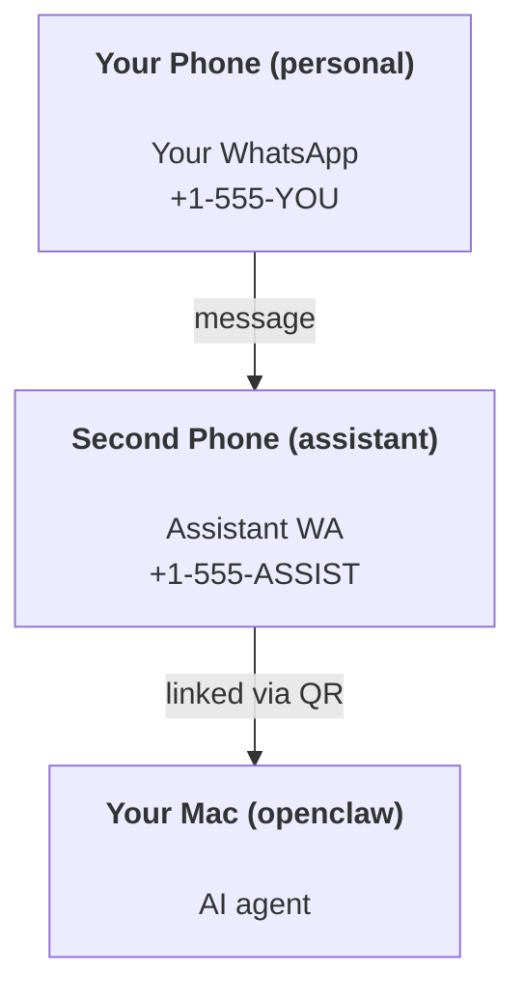

---
read_when:
    - 새 비서 인스턴스를 온보딩하는 경우
    - 안전/권한 관련 영향을 검토하는 경우
summary: 안전 주의 사항과 함께 OpenClaw를 개인 비서로 실행하기 위한 엔드투엔드 가이드
title: 개인 비서 설정
x-i18n:
    generated_at: "2026-04-05T12:55:56Z"
    model: gpt-5.4
    provider: openai
    source_hash: 02f10a9f7ec08f71143cbae996d91cbdaa19897a40f725d8ef524def41cf2759
    source_path: start/openclaw.md
    workflow: 15
---

# OpenClaw로 개인 비서 만들기

OpenClaw는 Discord, Google Chat, iMessage, Matrix, Microsoft Teams, Signal, Slack, Telegram, WhatsApp, Zalo 등을 AI 에이전트에 연결하는 셀프 호스팅 게이트웨이입니다. 이 가이드는 "개인 비서" 설정, 즉 항상 켜져 있는 AI 비서처럼 동작하는 전용 WhatsApp 번호 구성을 다룹니다.

## ⚠️ 안전이 최우선입니다

에이전트에게 다음과 같은 권한이 주어집니다:

- 사용자 도구 정책에 따라 컴퓨터에서 명령 실행
- 워크스페이스의 파일 읽기/쓰기
- WhatsApp/Telegram/Discord/Mattermost 및 기타 번들 채널을 통해 메시지를 다시 외부로 전송

처음에는 보수적으로 시작하세요:

- 항상 `channels.whatsapp.allowFrom`을 설정하세요(개인 Mac에서 누구에게나 열어 두고 실행하지 마세요).
- 비서용 전용 WhatsApp 번호를 사용하세요.
- Heartbeat는 이제 기본적으로 30분마다 실행됩니다. 설정을 신뢰하기 전까지는 `agents.defaults.heartbeat.every: "0m"`으로 설정해 비활성화하세요.

## 사전 요구 사항

- OpenClaw 설치 및 온보딩 완료 — 아직 하지 않았다면 [시작하기](/ko/start/getting-started)를 참조하세요
- 비서용 두 번째 전화번호(SIM/eSIM/선불 요금제)

## 두 대의 전화기 설정(권장)

원하는 구성은 다음과 같습니다:



개인 WhatsApp을 OpenClaw에 연결하면, 사용자에게 오는 모든 메시지가 “에이전트 입력”이 됩니다. 이는 대개 원하지 않는 방식입니다.

## 5분 빠른 시작

1. WhatsApp Web 페어링(QR 표시 후 비서용 전화기로 스캔):

```bash
openclaw channels login
```

2. Gateway 시작(계속 실행 상태로 유지):

```bash
openclaw gateway --port 18789
```

3. `~/.openclaw/openclaw.json`에 최소 구성 추가:

```json5
{
  gateway: { mode: "local" },
  channels: { whatsapp: { allowFrom: ["+15555550123"] } },
}
```

이제 allowlist에 포함된 휴대폰에서 비서 번호로 메시지를 보내세요.

온보딩이 끝나면 대시보드가 자동으로 열리고 깔끔한(토큰이 포함되지 않은) 링크가 출력됩니다. 인증을 요구하면 Control UI 설정에 구성된 공유 비밀을 붙여 넣으세요. 온보딩은 기본적으로 토큰(`gateway.auth.token`)을 사용하지만, `gateway.auth.mode`를 `password`로 변경했다면 비밀번호 인증도 작동합니다. 나중에 다시 열려면 `openclaw dashboard`를 사용하세요.

## 에이전트에 워크스페이스 제공하기(AGENTS)

OpenClaw는 워크스페이스 디렉터리에서 운영 지침과 “메모리”를 읽습니다.

기본적으로 OpenClaw는 `~/.openclaw/workspace`를 에이전트 워크스페이스로 사용하며, 설정 또는 첫 번째 에이전트 실행 시 자동으로 이를 만들고(시작용 `AGENTS.md`, `SOUL.md`, `TOOLS.md`, `IDENTITY.md`, `USER.md`, `HEARTBEAT.md` 포함) 초기화합니다. `BOOTSTRAP.md`는 워크스페이스가 완전히 새것일 때만 생성됩니다(삭제한 후 다시 생기지 않아야 함). `MEMORY.md`는 선택 사항이며 자동 생성되지 않습니다. 존재하면 일반 세션에서 로드됩니다. 하위 에이전트 세션에는 `AGENTS.md`와 `TOOLS.md`만 주입됩니다.

팁: 이 폴더를 OpenClaw의 “메모리”처럼 취급하고 git 저장소(가능하면 비공개)로 만들어 `AGENTS.md`와 메모리 파일을 백업하세요. git이 설치되어 있으면 완전히 새로운 워크스페이스는 자동으로 초기화됩니다.

```bash
openclaw setup
```

전체 워크스페이스 구조 및 백업 가이드: [에이전트 워크스페이스](/ko/concepts/agent-workspace)
메모리 워크플로: [메모리](/ko/concepts/memory)

선택 사항: `agents.defaults.workspace`로 다른 워크스페이스를 선택할 수 있습니다(`~` 지원).

```json5
{
  agent: {
    workspace: "~/.openclaw/workspace",
  },
}
```

이미 저장소에서 자체 워크스페이스 파일을 제공하고 있다면 bootstrap 파일 생성을 완전히 비활성화할 수 있습니다:

```json5
{
  agent: {
    skipBootstrap: true,
  },
}
```

## 이것을 "비서"로 만드는 구성

OpenClaw는 기본적으로 괜찮은 비서 설정을 제공하지만, 일반적으로 다음 항목을 조정하는 것이 좋습니다:

- [`SOUL.md`](/ko/concepts/soul)의 페르소나/지침
- thinking 기본값(필요한 경우)
- heartbeats(신뢰가 생긴 후)

예시:

```json5
{
  logging: { level: "info" },
  agent: {
    model: "anthropic/claude-opus-4-6",
    workspace: "~/.openclaw/workspace",
    thinkingDefault: "high",
    timeoutSeconds: 1800,
    // Start with 0; enable later.
    heartbeat: { every: "0m" },
  },
  channels: {
    whatsapp: {
      allowFrom: ["+15555550123"],
      groups: {
        "*": { requireMention: true },
      },
    },
  },
  routing: {
    groupChat: {
      mentionPatterns: ["@openclaw", "openclaw"],
    },
  },
  session: {
    scope: "per-sender",
    resetTriggers: ["/new", "/reset"],
    reset: {
      mode: "daily",
      atHour: 4,
      idleMinutes: 10080,
    },
  },
}
```

## 세션과 메모리

- 세션 파일: `~/.openclaw/agents/<agentId>/sessions/{{SessionId}}.jsonl`
- 세션 메타데이터(토큰 사용량, 마지막 라우트 등): `~/.openclaw/agents/<agentId>/sessions/sessions.json` (레거시: `~/.openclaw/sessions/sessions.json`)
- `/new` 또는 `/reset`은 해당 채팅에 대해 새 세션을 시작합니다(`resetTriggers`로 구성 가능). 단독으로 보내면 에이전트는 재설정을 확인하는 짧은 인사말로 응답합니다.
- `/compact [instructions]`는 세션 컨텍스트를 compaction하고 남은 컨텍스트 예산을 보고합니다.

## Heartbeats(능동 모드)

기본적으로 OpenClaw는 30분마다 다음 프롬프트로 heartbeat를 실행합니다:
`Read HEARTBEAT.md if it exists (workspace context). Follow it strictly. Do not infer or repeat old tasks from prior chats. If nothing needs attention, reply HEARTBEAT_OK.`
비활성화하려면 `agents.defaults.heartbeat.every: "0m"`으로 설정하세요.

- `HEARTBEAT.md`가 존재하지만 사실상 비어 있으면(빈 줄과 `# Heading` 같은 markdown 헤더만 있는 경우), OpenClaw는 API 호출을 절약하기 위해 heartbeat 실행을 건너뜁니다.
- 파일이 없으면 heartbeat는 계속 실행되며 모델이 수행할 작업을 결정합니다.
- 에이전트가 `HEARTBEAT_OK`로 응답하면(선택적으로 짧은 패딩 허용, `agents.defaults.heartbeat.ackMaxChars` 참조), OpenClaw는 해당 heartbeat에 대한 외부 전송을 억제합니다.
- 기본적으로 heartbeat의 DM 스타일 `user:<id>` 대상 전송은 허용됩니다. heartbeat 실행은 유지하면서 직접 대상 전송만 억제하려면 `agents.defaults.heartbeat.directPolicy: "block"`으로 설정하세요.
- Heartbeat는 전체 에이전트 턴으로 실행되므로 간격이 짧을수록 더 많은 토큰을 사용합니다.

```json5
{
  agent: {
    heartbeat: { every: "30m" },
  },
}
```

## 미디어 입출력

수신 첨부 파일(이미지/오디오/문서)은 템플릿을 통해 명령에 노출할 수 있습니다:

- `{{MediaPath}}`(로컬 임시 파일 경로)
- `{{MediaUrl}}`(의사 URL)
- `{{Transcript}}`(오디오 전사가 활성화된 경우)

에이전트의 발신 첨부 파일: 자체 줄에 `MEDIA:<path-or-url>`를 포함하세요(공백 없음). 예시:

```
Here’s the screenshot.
MEDIA:https://example.com/screenshot.png
```

OpenClaw는 이를 추출해 텍스트와 함께 미디어로 전송합니다.

로컬 경로 동작은 에이전트와 동일한 파일 읽기 신뢰 모델을 따릅니다:

- `tools.fs.workspaceOnly`가 `true`이면, 발신 `MEDIA:` 로컬 경로는 OpenClaw 임시 루트, 미디어 캐시, 에이전트 워크스페이스 경로, 샌드박스가 생성한 파일로 제한됩니다.
- `tools.fs.workspaceOnly`가 `false`이면, 발신 `MEDIA:`는 에이전트가 이미 읽을 수 있는 호스트 로컬 파일을 사용할 수 있습니다.
- 호스트 로컬 전송은 여전히 미디어 및 안전한 문서 형식(이미지, 오디오, 비디오, PDF, Office 문서)만 허용합니다. 일반 텍스트 및 비밀처럼 보이는 파일은 전송 가능한 미디어로 취급되지 않습니다.

즉, fs 정책이 이미 해당 읽기를 허용한다면 워크스페이스 외부에서 생성된 이미지/파일도 전송할 수 있으며, 임의의 호스트 텍스트 첨부 파일 유출을 다시 허용하지는 않습니다.

## 운영 체크리스트

```bash
openclaw status          # 로컬 상태(자격 증명, 세션, 대기 중인 이벤트)
openclaw status --all    # 전체 진단(읽기 전용, 붙여넣기 가능)
openclaw status --deep   # 지원되는 경우 채널 프로브와 함께 게이트웨이에 실시간 상태 프로브 요청
openclaw health --json   # 게이트웨이 상태 스냅샷(WS, 기본적으로 새로 고쳐진 캐시 스냅샷을 반환할 수 있음)
```

로그는 `/tmp/openclaw/` 아래에 저장됩니다(기본값: `openclaw-YYYY-MM-DD.log`).

## 다음 단계

- WebChat: [WebChat](/web/webchat)
- Gateway 운영: [Gateway runbook](/ko/gateway)
- Cron + wakeup: [Cron jobs](/ko/automation/cron-jobs)
- macOS 메뉴 막대 컴패니언: [OpenClaw macOS app](/ko/platforms/macos)
- iOS 노드 앱: [iOS app](/ko/platforms/ios)
- Android 노드 앱: [Android app](/ko/platforms/android)
- Windows 상태: [Windows (WSL2)](/ko/platforms/windows)
- Linux 상태: [Linux app](/ko/platforms/linux)
- 보안: [Security](/ko/gateway/security)
