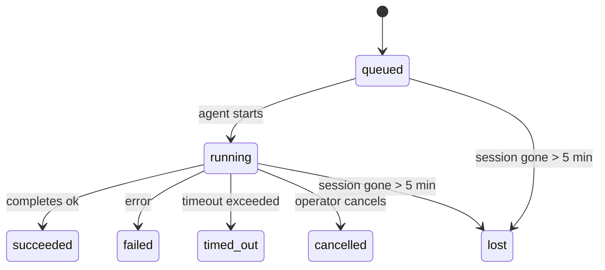

---
read_when:
    - Sprawdzanie trwających lub niedawno zakończonych zadań w tle
    - Debugowanie błędów dostarczania dla odłączonych uruchomień agentów
    - Zrozumienie, jak uruchomienia w tle są powiązane z sesjami, cron i heartbeat
summary: Śledzenie zadań w tle dla uruchomień ACP, subagentów, izolowanych zadań cron i operacji CLI
title: Zadania w tle
x-i18n:
    generated_at: "2026-04-06T03:07:01Z"
    model: gpt-5.4
    provider: openai
    source_hash: 2f56c1ac23237907a090c69c920c09578a2f56f5d8bf750c7f2136c603c8a8ff
    source_path: automation/tasks.md
    workflow: 15
---

# Zadania w tle

> **Szukasz planowania?** Zobacz [Automation & Tasks](/pl/automation), aby wybrać właściwy mechanizm. Ta strona dotyczy **śledzenia** pracy w tle, a nie jej planowania.

Zadania w tle śledzą pracę wykonywaną **poza główną sesją rozmowy**:
uruchomienia ACP, uruchomienia subagentów, wykonania izolowanych zadań cron oraz operacje inicjowane przez CLI.

Zadania **nie** zastępują sesji, zadań cron ani heartbeat — są **rejestrem aktywności**, który zapisuje, jaka odłączona praca została wykonana, kiedy i czy zakończyła się powodzeniem.

<Note>
Nie każde uruchomienie agenta tworzy zadanie. Tury heartbeat i zwykły interaktywny czat tego nie robią. Wszystkie wykonania cron, uruchomienia ACP, uruchomienia subagentów i polecenia agenta z CLI tworzą zadania.
</Note>

## TL;DR

- Zadania to **rekordy**, a nie harmonogramy — cron i heartbeat decydują, _kiedy_ praca jest uruchamiana, a zadania śledzą, _co się wydarzyło_.
- ACP, subagenty, wszystkie zadania cron i operacje CLI tworzą zadania. Tury heartbeat nie.
- Każde zadanie przechodzi przez `queued → running → terminal` (`succeeded`, `failed`, `timed_out`, `cancelled` lub `lost`).
- Zadania cron pozostają aktywne, dopóki środowisko uruchomieniowe cron nadal jest właścicielem zadania; zadania CLI oparte na czacie pozostają aktywne tylko wtedy, gdy ich kontekst uruchomienia właściciela nadal jest aktywny.
- Zakończenie jest sterowane przez push: odłączona praca może powiadomić bezpośrednio lub wybudzić
  sesję żądającą/heartbeat po zakończeniu, więc pętle odpytywania stanu
  zwykle nie są właściwym rozwiązaniem.
- Izolowane uruchomienia cron i zakończenia subagentów w trybie best-effort czyszczą śledzone karty/procesy przeglądarki dla swojej sesji podrzędnej przed końcowym rozliczeniem czyszczenia.
- Dostarczanie izolowanych uruchomień cron pomija nieaktualne pośrednie odpowiedzi nadrzędne, gdy
  praca potomnych subagentów nadal się opróżnia, i preferuje końcowe dane wyjściowe potomka,
  jeśli dotrą przed dostarczeniem.
- Powiadomienia o zakończeniu są dostarczane bezpośrednio do kanału lub umieszczane w kolejce do następnego heartbeat.
- `openclaw tasks list` pokazuje wszystkie zadania; `openclaw tasks audit` ujawnia problemy.
- Rekordy terminalne są przechowywane przez 7 dni, a następnie automatycznie usuwane.

## Szybki start

```bash
# Wyświetl wszystkie zadania (od najnowszych)
openclaw tasks list

# Filtruj według środowiska uruchomieniowego lub statusu
openclaw tasks list --runtime acp
openclaw tasks list --status running

# Pokaż szczegóły konkretnego zadania (według ID, ID uruchomienia lub klucza sesji)
openclaw tasks show <lookup>

# Anuluj działające zadanie (zabija sesję podrzędną)
openclaw tasks cancel <lookup>

# Zmień politykę powiadomień dla zadania
openclaw tasks notify <lookup> state_changes

# Uruchom audyt kondycji
openclaw tasks audit

# Wyświetl podgląd lub zastosuj konserwację
openclaw tasks maintenance
openclaw tasks maintenance --apply

# Sprawdź stan Task Flow
openclaw tasks flow list
openclaw tasks flow show <lookup>
openclaw tasks flow cancel <lookup>
```

## Co tworzy zadanie

| Źródło                 | Typ środowiska uruchomieniowego | Kiedy tworzony jest rekord zadania                     | Domyślna polityka powiadomień |
| ---------------------- | ------------------------------- | ------------------------------------------------------ | ----------------------------- |
| Uruchomienia ACP w tle | `acp`                           | Utworzenie podrzędnej sesji ACP                        | `done_only`                   |
| Orkiestracja subagentów | `subagent`                     | Uruchomienie subagenta przez `sessions_spawn`          | `done_only`                   |
| Zadania cron (wszystkie typy) | `cron`                  | Każde wykonanie cron (sesja główna i izolowana)        | `silent`                      |
| Operacje CLI           | `cli`                           | Polecenia `openclaw agent` uruchamiane przez gateway   | `silent`                      |
| Zadania mediów agenta  | `cli`                           | Uruchomienia `video_generate` powiązane z sesją        | `silent`                      |

Zadania cron w sesji głównej domyślnie używają polityki powiadomień `silent` — tworzą rekordy do śledzenia, ale nie generują powiadomień. Izolowane zadania cron również domyślnie używają `silent`, ale są bardziej widoczne, ponieważ działają we własnej sesji.

Uruchomienia `video_generate` powiązane z sesją również używają polityki powiadomień `silent`. Nadal tworzą rekordy zadań, ale zakończenie jest przekazywane z powrotem do oryginalnej sesji agenta jako wewnętrzne wybudzenie, aby agent mógł sam napisać wiadomość uzupełniającą i dołączyć gotowy film. Jeśli włączysz `tools.media.asyncCompletion.directSend`, asynchroniczne zakończenia `music_generate` i `video_generate` najpierw próbują bezpośredniego dostarczenia do kanału, a dopiero potem wracają do ścieżki wybudzenia sesji żądającej.

Gdy zadanie `video_generate` powiązane z sesją jest nadal aktywne, narzędzie działa też jako zabezpieczenie: powtarzane wywołania `video_generate` w tej samej sesji zwracają status aktywnego zadania zamiast uruchamiać drugie równoległe generowanie. Użyj `action: "status"`, gdy chcesz uzyskać jawne sprawdzenie postępu/statusu po stronie agenta.

**Co nie tworzy zadań:**

- Tury heartbeat — sesja główna; zobacz [Heartbeat](/pl/gateway/heartbeat)
- Zwykłe interaktywne tury czatu
- Bezpośrednie odpowiedzi `/command`

## Cykl życia zadania



| Status      | Co oznacza                                                                |
| ----------- | ------------------------------------------------------------------------- |
| `queued`    | Utworzone, oczekuje na uruchomienie przez agenta                          |
| `running`   | Tura agenta jest aktywnie wykonywana                                      |
| `succeeded` | Zakończone pomyślnie                                                      |
| `failed`    | Zakończone błędem                                                         |
| `timed_out` | Przekroczono skonfigurowany limit czasu                                   |
| `cancelled` | Zatrzymane przez operatora przez `openclaw tasks cancel`                  |
| `lost`      | Środowisko uruchomieniowe utraciło autorytatywny stan zaplecza po 5-minutowym okresie karencji |

Przejścia zachodzą automatycznie — gdy powiązane uruchomienie agenta się kończy, status zadania jest aktualizowany odpowiednio do wyniku.

`lost` jest zależne od środowiska uruchomieniowego:

- Zadania ACP: zniknęły metadane podrzędnej sesji ACP w zapleczu.
- Zadania subagentów: podrzędna sesja zniknęła z docelowego magazynu agenta.
- Zadania cron: środowisko uruchomieniowe cron nie śledzi już zadania jako aktywnego.
- Zadania CLI: izolowane zadania sesji podrzędnej używają sesji podrzędnej; zadania CLI oparte na czacie używają zamiast tego aktywnego kontekstu uruchomienia, więc pozostające wiersze sesji kanału/grupy/bezpośredniej nie utrzymują ich przy życiu.

## Dostarczanie i powiadomienia

Gdy zadanie osiągnie stan terminalny, OpenClaw Cię powiadomi. Istnieją dwie ścieżki dostarczania:

**Dostarczenie bezpośrednie** — jeśli zadanie ma cel kanałowy (`requesterOrigin`), wiadomość o zakończeniu trafia bezpośrednio do tego kanału (Telegram, Discord, Slack itd.). W przypadku zakończeń subagentów OpenClaw zachowuje też powiązane kierowanie do wątku/tematu, gdy jest dostępne, i może uzupełnić brakujące `to` / konto z zapisanej trasy sesji żądającej (`lastChannel` / `lastTo` / `lastAccountId`), zanim zrezygnuje z bezpośredniego dostarczenia.

**Dostarczenie w kolejce sesji** — jeśli bezpośrednie dostarczenie się nie powiedzie lub nie ustawiono źródła, aktualizacja jest umieszczana w kolejce jako zdarzenie systemowe w sesji żądającego i pojawia się przy następnym heartbeat.

<Tip>
Zakończenie zadania natychmiast wyzwala wybudzenie heartbeat, więc wynik zobaczysz szybko — nie musisz czekać na następny zaplanowany tick heartbeat.
</Tip>

Oznacza to, że typowy przepływ pracy opiera się na push: uruchom odłączoną pracę raz, a następnie pozwól
środowisku uruchomieniowemu wybudzić Cię lub powiadomić po zakończeniu. Odpytuj stan zadania tylko wtedy, gdy
potrzebujesz debugowania, interwencji lub jawnego audytu.

### Polityki powiadomień

Określają, jak dużo informacji otrzymujesz o każdym zadaniu:

| Polityka             | Co jest dostarczane                                                      |
| -------------------- | ------------------------------------------------------------------------ |
| `done_only` (domyślna) | Tylko stan terminalny (`succeeded`, `failed` itd.) — **to ustawienie domyślne** |
| `state_changes`      | Każda zmiana stanu i aktualizacja postępu                                |
| `silent`             | Nic                                                                      |

Zmień politykę, gdy zadanie jest uruchomione:

```bash
openclaw tasks notify <lookup> state_changes
```

## Dokumentacja CLI

### `tasks list`

```bash
openclaw tasks list [--runtime <acp|subagent|cron|cli>] [--status <status>] [--json]
```

Kolumny wyjściowe: ID zadania, rodzaj, status, dostarczenie, ID uruchomienia, sesja podrzędna, podsumowanie.

### `tasks show`

```bash
openclaw tasks show <lookup>
```

Token wyszukiwania akceptuje ID zadania, ID uruchomienia lub klucz sesji. Pokazuje pełny rekord zawierający czas, stan dostarczenia, błąd i podsumowanie terminalne.

### `tasks cancel`

```bash
openclaw tasks cancel <lookup>
```

W przypadku zadań ACP i subagentów powoduje to zabicie sesji podrzędnej. Status przechodzi do `cancelled`, a powiadomienie o dostarczeniu zostaje wysłane.

### `tasks notify`

```bash
openclaw tasks notify <lookup> <done_only|state_changes|silent>
```

### `tasks audit`

```bash
openclaw tasks audit [--json]
```

Ujawnia problemy operacyjne. Wyniki pojawiają się też w `openclaw status`, gdy zostaną wykryte problemy.

| Ustalenie                | Ważność | Wyzwalacz                                             |
| ------------------------ | ------- | ----------------------------------------------------- |
| `stale_queued`           | warn    | Oczekuje dłużej niż 10 minut                          |
| `stale_running`          | error   | Działa dłużej niż 30 minut                            |
| `lost`                   | error   | Zniknęło środowisko uruchomieniowe będące właścicielem zadania |
| `delivery_failed`        | warn    | Dostarczenie nie powiodło się, a polityka powiadomień nie jest `silent` |
| `missing_cleanup`        | warn    | Zadanie terminalne bez znacznika czasu czyszczenia    |
| `inconsistent_timestamps`| warn    | Naruszenie osi czasu (na przykład zakończono przed rozpoczęciem) |

### `tasks maintenance`

```bash
openclaw tasks maintenance [--json]
openclaw tasks maintenance --apply [--json]
```

Użyj tego, aby wyświetlić podgląd lub zastosować uzgadnianie, oznaczanie czyszczenia i przycinanie
dla zadań oraz stanu Task Flow.

Uzgadnianie jest zależne od środowiska uruchomieniowego:

- Zadania ACP/subagentów sprawdzają swoją podrzędną sesję zaplecza.
- Zadania cron sprawdzają, czy środowisko uruchomieniowe cron nadal jest właścicielem zadania.
- Zadania CLI oparte na czacie sprawdzają nadrzędny aktywny kontekst uruchomienia, a nie tylko wiersz sesji czatu.

Czyszczenie po zakończeniu jest również zależne od środowiska uruchomieniowego:

- Zakończenie subagenta w trybie best-effort zamyka śledzone karty/procesy przeglądarki dla sesji podrzędnej, zanim będzie kontynuowane czyszczenie po ogłoszeniu.
- Zakończenie izolowanego uruchomienia cron w trybie best-effort zamyka śledzone karty/procesy przeglądarki dla sesji cron, zanim uruchomienie zostanie całkowicie zakończone.
- Dostarczanie zakończenia izolowanego uruchomienia cron w razie potrzeby czeka na dalsze działania potomnych subagentów
  i pomija nieaktualny tekst potwierdzenia nadrzędnego zamiast go ogłaszać.
- Dostarczanie zakończenia subagenta preferuje najnowszy widoczny tekst asystenta; jeśli jest pusty, wraca do oczyszczonego najnowszego tekstu tool/toolResult, a uruchomienia wywołań narzędzi zakończone tylko przekroczeniem czasu mogą zostać zredukowane do krótkiego podsumowania częściowego postępu.
- Błędy czyszczenia nie maskują rzeczywistego wyniku zadania.

### `tasks flow list|show|cancel`

```bash
openclaw tasks flow list [--status <status>] [--json]
openclaw tasks flow show <lookup> [--json]
openclaw tasks flow cancel <lookup>
```

Użyj tych poleceń, gdy interesuje Cię orkiestrujący Task Flow,
a nie pojedynczy rekord zadania w tle.

## Tablica zadań na czacie (`/tasks`)

Użyj `/tasks` w dowolnej sesji czatu, aby zobaczyć zadania w tle powiązane z tą sesją. Tablica pokazuje
aktywne i niedawno zakończone zadania wraz ze środowiskiem uruchomieniowym, statusem, czasem oraz szczegółami postępu lub błędu.

Gdy bieżąca sesja nie ma widocznych powiązanych zadań, `/tasks` wraca do lokalnych dla agenta liczników zadań,
dzięki czemu nadal otrzymujesz przegląd bez ujawniania szczegółów innych sesji.

Aby zobaczyć pełny rejestr operatora, użyj CLI: `openclaw tasks list`.

## Integracja statusu (obciążenie zadaniami)

`openclaw status` zawiera szybkie podsumowanie zadań:

```
Tasks: 3 queued · 2 running · 1 issues
```

Podsumowanie raportuje:

- **active** — liczba `queued` + `running`
- **failures** — liczba `failed` + `timed_out` + `lost`
- **byRuntime** — podział według `acp`, `subagent`, `cron`, `cli`

Zarówno `/status`, jak i narzędzie `session_status` używają migawki zadań uwzględniającej czyszczenie: preferowane są aktywne zadania,
nieaktualne zakończone wiersze są ukrywane, a niedawne niepowodzenia pojawiają się tylko wtedy, gdy nie pozostała żadna aktywna praca.
Dzięki temu karta statusu skupia się na tym, co ma znaczenie w tej chwili.

## Przechowywanie i konserwacja

### Gdzie są przechowywane zadania

Rekordy zadań są przechowywane w SQLite pod adresem:

```
$OPENCLAW_STATE_DIR/tasks/runs.sqlite
```

Rejestr jest ładowany do pamięci podczas uruchamiania gateway i synchronizuje zapisy do SQLite, aby zapewnić trwałość po restarcie.

### Automatyczna konserwacja

Co **60 sekund** działa proces czyszczący, który obsługuje trzy rzeczy:

1. **Uzgadnianie** — sprawdza, czy aktywne zadania nadal mają autorytatywne zaplecze środowiska uruchomieniowego. Zadania ACP/subagentów używają stanu sesji podrzędnej, zadania cron używają własności aktywnego zadania, a zadania CLI oparte na czacie używają nadrzędnego kontekstu uruchomienia. Jeśli ten stan zaplecza zniknie na dłużej niż 5 minut, zadanie zostaje oznaczone jako `lost`.
2. **Oznaczanie czyszczenia** — ustawia znacznik czasu `cleanupAfter` dla zadań terminalnych (`endedAt + 7 days`).
3. **Przycinanie** — usuwa rekordy po dacie `cleanupAfter`.

**Retencja**: rekordy zadań terminalnych są przechowywane przez **7 dni**, a następnie automatycznie usuwane. Nie jest wymagana żadna konfiguracja.

## Jak zadania są powiązane z innymi systemami

### Zadania i Task Flow

[Task Flow](/pl/automation/taskflow) to warstwa orkiestracji przepływów nad zadaniami w tle. Pojedynczy przepływ może przez cały czas swojego życia koordynować wiele zadań, używając trybów synchronizacji zarządzanej lub lustrzanej. Użyj `openclaw tasks`, aby sprawdzić pojedyncze rekordy zadań, a `openclaw tasks flow`, aby sprawdzić orkiestrujący przepływ.

Szczegóły znajdziesz w [Task Flow](/pl/automation/taskflow).

### Zadania i cron

**Definicja** zadania cron znajduje się w `~/.openclaw/cron/jobs.json`. **Każde** wykonanie cron tworzy rekord zadania — zarówno w sesji głównej, jak i izolowanej. Zadania cron w sesji głównej domyślnie używają polityki powiadomień `silent`, aby śledzić bez generowania powiadomień.

Zobacz [Cron Jobs](/pl/automation/cron-jobs).

### Zadania i heartbeat

Uruchomienia heartbeat to tury sesji głównej — nie tworzą rekordów zadań. Gdy zadanie się kończy, może wywołać wybudzenie heartbeat, aby wynik był szybko widoczny.

Zobacz [Heartbeat](/pl/gateway/heartbeat).

### Zadania i sesje

Zadanie może odnosić się do `childSessionKey` (gdzie wykonywana jest praca) oraz `requesterSessionKey` (kto ją uruchomił). Sesje to kontekst rozmowy; zadania to warstwa śledzenia aktywności nad tym kontekstem.

### Zadania i uruchomienia agenta

Pole `runId` zadania wskazuje uruchomienie agenta wykonujące pracę. Zdarzenia cyklu życia agenta (start, koniec, błąd) automatycznie aktualizują status zadania — nie musisz zarządzać cyklem życia ręcznie.

## Powiązane

- [Automation & Tasks](/pl/automation) — wszystkie mechanizmy automatyzacji w skrócie
- [Task Flow](/pl/automation/taskflow) — orkiestracja przepływów nad zadaniami
- [Scheduled Tasks](/pl/automation/cron-jobs) — planowanie pracy w tle
- [Heartbeat](/pl/gateway/heartbeat) — okresowe tury sesji głównej
- [CLI: Tasks](/cli/index#tasks) — dokumentacja poleceń CLI
