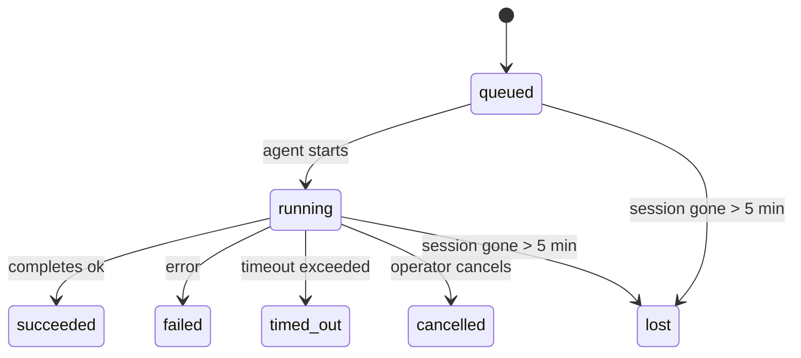

---
read_when:
    - Sprawdzanie trwających lub niedawno zakończonych zadań w tle
    - Debugowanie błędów dostarczania dla odłączonych uruchomień agentów
    - Zrozumienie, jak uruchomienia w tle odnoszą się do sesji, cron i heartbeat
summary: Śledzenie zadań w tle dla uruchomień ACP, podagentów, izolowanych zadań cron i operacji CLI
title: Zadania w tle
x-i18n:
    generated_at: "2026-04-10T09:44:53Z"
    model: gpt-5.4
    provider: openai
    source_hash: d7b5ba41f1025e0089986342ce85698bc62f676439c3ccf03f3ed146beb1b1ac
    source_path: automation/tasks.md
    workflow: 15
---

# Zadania w tle

> **Szukasz harmonogramowania?** Zobacz [Automatyzacja i zadania](/pl/automation), aby wybrać właściwy mechanizm. Ta strona dotyczy **śledzenia** pracy w tle, a nie jej harmonogramowania.

Zadania w tle śledzą pracę uruchamianą **poza główną sesją rozmowy**:
uruchomienia ACP, tworzenie podagentów, izolowane wykonania zadań cron oraz operacje inicjowane przez CLI.

Zadania **nie** zastępują sesji, zadań cron ani heartbeat — są **rejestrem aktywności**, który zapisuje, jaka odłączona praca została wykonana, kiedy i czy zakończyła się powodzeniem.

<Note>
Nie każde uruchomienie agenta tworzy zadanie. Tury heartbeat i zwykły interaktywny czat tego nie robią. Wszystkie wykonania cron, uruchomienia ACP, uruchomienia podagentów i polecenia agenta z CLI tworzą zadania.
</Note>

## W skrócie

- Zadania to **rekordy**, a nie harmonogramy — cron i heartbeat decydują, _kiedy_ praca jest uruchamiana, a zadania śledzą, _co się wydarzyło_.
- ACP, podagenci, wszystkie zadania cron i operacje CLI tworzą zadania. Tury heartbeat nie.
- Każde zadanie przechodzi przez `queued → running → terminal` (succeeded, failed, timed_out, cancelled lub lost).
- Zadania cron pozostają aktywne, dopóki środowisko uruchomieniowe cron nadal jest właścicielem zadania; zadania CLI powiązane z czatem pozostają aktywne tylko tak długo, jak długo aktywny jest ich kontekst uruchomienia.
- Zakończenie jest obsługiwane przez mechanizm push: odłączona praca może powiadomić bezpośrednio albo wybudzić sesję żądającą/heartbeat po zakończeniu, więc pętle odpytywania o status zwykle nie są właściwym rozwiązaniem.
- Izolowane uruchomienia cron i zakończenia podagentów w miarę możliwości porządkują śledzone karty/procesy przeglądarki dla swojej sesji podrzędnej przed końcowym rozliczeniem czyszczenia.
- Dostarczanie dla izolowanego cron pomija nieaktualne tymczasowe odpowiedzi nadrzędne, gdy praca podrzędnych podagentów nadal się kończy, i preferuje końcowe dane wyjściowe potomka, jeśli dotrą przed dostarczeniem.
- Powiadomienia o zakończeniu są dostarczane bezpośrednio do kanału lub kolejkowane do następnego heartbeat.
- `openclaw tasks list` pokazuje wszystkie zadania; `openclaw tasks audit` ujawnia problemy.
- Rekordy terminalne są przechowywane przez 7 dni, a następnie automatycznie usuwane.

## Szybki start

```bash
# Wyświetl wszystkie zadania (od najnowszych)
openclaw tasks list

# Filtruj według środowiska uruchomieniowego lub statusu
openclaw tasks list --runtime acp
openclaw tasks list --status running

# Pokaż szczegóły konkretnego zadania (według ID, ID uruchomienia lub klucza sesji)
openclaw tasks show <lookup>

# Anuluj uruchomione zadanie (zabija sesję podrzędną)
openclaw tasks cancel <lookup>

# Zmień politykę powiadomień dla zadania
openclaw tasks notify <lookup> state_changes

# Uruchom audyt kondycji
openclaw tasks audit

# Wyświetl podgląd lub zastosuj konserwację
openclaw tasks maintenance
openclaw tasks maintenance --apply

# Sprawdź stan TaskFlow
openclaw tasks flow list
openclaw tasks flow show <lookup>
openclaw tasks flow cancel <lookup>
```

## Co tworzy zadanie

| Źródło                 | Typ środowiska uruchomieniowego | Kiedy tworzony jest rekord zadania                     | Domyślna polityka powiadomień |
| ---------------------- | -------------------------------- | ------------------------------------------------------ | ----------------------------- |
| Uruchomienia ACP w tle | `acp`                            | Utworzenie podrzędnej sesji ACP                        | `done_only`                   |
| Orkiestracja podagentów | `subagent`                      | Utworzenie podagenta przez `sessions_spawn`            | `done_only`                   |
| Zadania cron (wszystkie typy) | `cron`                   | Każde wykonanie cron (sesja główna i izolowana)        | `silent`                      |
| Operacje CLI           | `cli`                            | Polecenia `openclaw agent` uruchamiane przez gateway   | `silent`                      |
| Zadania medialne agenta | `cli`                           | Uruchomienia `video_generate` powiązane z sesją        | `silent`                      |

Zadania cron w sesji głównej domyślnie używają polityki powiadomień `silent` — tworzą rekordy do śledzenia, ale nie generują powiadomień. Izolowane zadania cron również domyślnie używają `silent`, ale są bardziej widoczne, ponieważ działają we własnej sesji.

Uruchomienia `video_generate` powiązane z sesją także używają domyślnie polityki powiadomień `silent`. Nadal tworzą rekordy zadań, ale zakończenie jest przekazywane z powrotem do oryginalnej sesji agenta jako wewnętrzne wybudzenie, aby agent mógł sam napisać wiadomość uzupełniającą i dołączyć gotowy film. Jeśli włączysz `tools.media.asyncCompletion.directSend`, asynchroniczne zakończenia `music_generate` i `video_generate` najpierw próbują bezpośredniego dostarczenia do kanału, a dopiero potem wracają do ścieżki wybudzenia sesji żądającej.

Gdy zadanie `video_generate` powiązane z sesją jest nadal aktywne, narzędzie działa również jako zabezpieczenie: powtórzone wywołania `video_generate` w tej samej sesji zwracają status aktywnego zadania zamiast uruchamiać drugie równoległe generowanie. Użyj `action: "status"`, gdy chcesz wykonać jawne sprawdzenie postępu/statusu po stronie agenta.

**Co nie tworzy zadań:**

- Tury heartbeat — sesja główna; zobacz [Heartbeat](/pl/gateway/heartbeat)
- Zwykłe interaktywne tury czatu
- Bezpośrednie odpowiedzi `/command`

## Cykl życia zadania



| Status      | Co oznacza                                                               |
| ----------- | ------------------------------------------------------------------------ |
| `queued`    | Utworzone, oczekuje na uruchomienie przez agenta                         |
| `running`   | Tura agenta jest aktywnie wykonywana                                     |
| `succeeded` | Zakończone pomyślnie                                                     |
| `failed`    | Zakończone błędem                                                        |
| `timed_out` | Przekroczono skonfigurowany limit czasu                                  |
| `cancelled` | Zatrzymane przez operatora za pomocą `openclaw tasks cancel`             |
| `lost`      | Środowisko uruchomieniowe utraciło autorytatywny stan zaplecza po 5-minutowym okresie karencji |

Przejścia zachodzą automatycznie — gdy skojarzone uruchomienie agenta się kończy, status zadania aktualizuje się odpowiednio.

`lost` jest zależne od środowiska uruchomieniowego:

- Zadania ACP: zniknęły metadane podrzędnej sesji ACP.
- Zadania podagentów: podrzędna sesja zniknęła z docelowego magazynu agenta.
- Zadania cron: środowisko uruchomieniowe cron nie śledzi już zadania jako aktywnego.
- Zadania CLI: izolowane zadania sesji podrzędnej używają sesji podrzędnej; zadania CLI powiązane z czatem używają zamiast tego aktywnego kontekstu uruchomienia, więc utrzymujące się wiersze sesji kanału/grupy/wiadomości bezpośredniej nie podtrzymują ich aktywności.

## Dostarczanie i powiadomienia

Gdy zadanie osiągnie stan terminalny, OpenClaw Cię powiadomi. Istnieją dwie ścieżki dostarczania:

**Dostarczenie bezpośrednie** — jeśli zadanie ma docelowy kanał (`requesterOrigin`), wiadomość o zakończeniu trafia bezpośrednio do tego kanału (Telegram, Discord, Slack itd.). W przypadku zakończeń podagentów OpenClaw zachowuje również powiązane trasowanie wątku/tematu, jeśli jest dostępne, i może uzupełnić brakujące `to` / konto z zapisanej trasy sesji żądającej (`lastChannel` / `lastTo` / `lastAccountId`), zanim zrezygnuje z bezpośredniego dostarczenia.

**Dostarczenie kolejkowane do sesji** — jeśli dostarczenie bezpośrednie się nie powiedzie albo nie ustawiono źródła, aktualizacja jest kolejkowana jako zdarzenie systemowe w sesji żądającej i pojawia się przy następnym heartbeat.

<Tip>
Zakończenie zadania wywołuje natychmiastowe wybudzenie heartbeat, dzięki czemu szybko widzisz wynik — nie musisz czekać na następny zaplanowany tick heartbeat.
</Tip>

Oznacza to, że zwykły przepływ pracy jest oparty na mechanizmie push: uruchom odłączoną pracę raz, a następnie pozwól środowisku uruchomieniowemu wybudzić Cię lub powiadomić po zakończeniu. Odpytuj stan zadania tylko wtedy, gdy potrzebujesz debugowania, interwencji lub jawnego audytu.

### Polityki powiadomień

Kontrolują, jak dużo informacji otrzymujesz o każdym zadaniu:

| Polityka              | Co jest dostarczane                                                       |
| --------------------- | ------------------------------------------------------------------------- |
| `done_only` (domyślna) | Tylko stan terminalny (succeeded, failed itd.) — **to ustawienie domyślne** |
| `state_changes`       | Każda zmiana stanu i aktualizacja postępu                                 |
| `silent`              | Nic                                                                       |

Zmień politykę podczas działania zadania:

```bash
openclaw tasks notify <lookup> state_changes
```

## Dokumentacja CLI

### `tasks list`

```bash
openclaw tasks list [--runtime <acp|subagent|cron|cli>] [--status <status>] [--json]
```

Kolumny wyjściowe: ID zadania, rodzaj, status, dostarczenie, ID uruchomienia, sesja podrzędna, podsumowanie.

### `tasks show`

```bash
openclaw tasks show <lookup>
```

Token lookup akceptuje ID zadania, ID uruchomienia lub klucz sesji. Pokazuje pełny rekord, w tym czasy, stan dostarczenia, błąd i terminalne podsumowanie.

### `tasks cancel`

```bash
openclaw tasks cancel <lookup>
```

W przypadku zadań ACP i podagentów powoduje to zabicie sesji podrzędnej. W przypadku zadań śledzonych przez CLI anulowanie jest rejestrowane w rejestrze zadań (nie ma osobnego uchwytu środowiska uruchomieniowego podrzędnego). Status przechodzi na `cancelled`, a w razie potrzeby wysyłane jest powiadomienie o dostarczeniu.

### `tasks notify`

```bash
openclaw tasks notify <lookup> <done_only|state_changes|silent>
```

### `tasks audit`

```bash
openclaw tasks audit [--json]
```

Pokazuje problemy operacyjne. Ustalenia pojawiają się również w `openclaw status`, gdy wykryte zostaną problemy.

| Ustalenie                 | Ważność | Wyzwalacz                                            |
| ------------------------- | ------- | ---------------------------------------------------- |
| `stale_queued`            | warn    | Kolejka trwa dłużej niż 10 minut                     |
| `stale_running`           | error   | Uruchomione dłużej niż 30 minut                      |
| `lost`                    | error   | Zniknęła własność zadania oparta na środowisku uruchomieniowym |
| `delivery_failed`         | warn    | Dostarczenie nie powiodło się, a polityka powiadomień nie jest `silent` |
| `missing_cleanup`         | warn    | Zadanie terminalne bez znacznika czasu czyszczenia   |
| `inconsistent_timestamps` | warn    | Naruszenie osi czasu (na przykład zakończone przed rozpoczęciem) |

### `tasks maintenance`

```bash
openclaw tasks maintenance [--json]
openclaw tasks maintenance --apply [--json]
```

Użyj tego, aby wyświetlić podgląd lub zastosować uzgadnianie, oznaczanie czyszczenia i usuwanie przestarzałych danych dla zadań oraz stanu Task Flow.

Uzgadnianie jest zależne od środowiska uruchomieniowego:

- Zadania ACP/podagentów sprawdzają swoją podrzędną sesję zaplecza.
- Zadania cron sprawdzają, czy środowisko uruchomieniowe cron nadal jest właścicielem zadania.
- Zadania CLI powiązane z czatem sprawdzają właścicielski aktywny kontekst uruchomienia, a nie tylko wiersz sesji czatu.

Czyszczenie po zakończeniu jest również zależne od środowiska uruchomieniowego:

- Zakończenie podagenta w miarę możliwości zamyka śledzone karty/procesy przeglądarki dla sesji podrzędnej, zanim kontynuowane będzie czyszczenie ogłoszenia.
- Zakończenie izolowanego cron w miarę możliwości zamyka śledzone karty/procesy przeglądarki dla sesji cron, zanim uruchomienie zostanie całkowicie zakończone.
- Dostarczenie dla izolowanego cron czeka na zakończenie następczej pracy podrzędnych podagentów, gdy jest to potrzebne, i pomija nieaktualny tekst potwierdzenia nadrzędnego zamiast go ogłaszać.
- Dostarczenie zakończenia podagenta preferuje najnowszy widoczny tekst asystenta; jeśli jest pusty, używa oczyszczonego najnowszego tekstu tool/toolResult, a uruchomienia wyłącznie z wywołaniem narzędzia zakończone timeoutem mogą zostać zredukowane do krótkiego podsumowania częściowego postępu.
- Błędy czyszczenia nie maskują rzeczywistego wyniku zadania.

### `tasks flow list|show|cancel`

```bash
openclaw tasks flow list [--status <status>] [--json]
openclaw tasks flow show <lookup> [--json]
openclaw tasks flow cancel <lookup>
```

Używaj ich wtedy, gdy interesuje Cię orkiestrujący Task Flow, a nie pojedynczy rekord zadania w tle.

## Tablica zadań czatu (`/tasks`)

Użyj `/tasks` w dowolnej sesji czatu, aby zobaczyć zadania w tle powiązane z tą sesją. Tablica pokazuje
aktywne i niedawno zakończone zadania wraz ze środowiskiem uruchomieniowym, statusem, czasem oraz szczegółami postępu lub błędu.

Gdy bieżąca sesja nie ma widocznych powiązanych zadań, `/tasks` przełącza się na lokalne dla agenta liczniki zadań,
dzięki czemu nadal masz ogólny obraz bez ujawniania szczegółów innych sesji.

Aby zobaczyć pełny rejestr operatora, użyj CLI: `openclaw tasks list`.

## Integracja ze statusem (obciążenie zadaniami)

`openclaw status` zawiera skrócone podsumowanie zadań:

```
Tasks: 3 queued · 2 running · 1 issues
```

Podsumowanie raportuje:

- **active** — liczba `queued` + `running`
- **failures** — liczba `failed` + `timed_out` + `lost`
- **byRuntime** — podział według `acp`, `subagent`, `cron`, `cli`

Zarówno `/status`, jak i narzędzie `session_status` używają migawki zadań uwzględniającej czyszczenie: preferowane są aktywne zadania, nieaktualne zakończone wiersze są ukrywane, a ostatnie błędy są pokazywane tylko wtedy, gdy nie pozostała żadna aktywna praca. Dzięki temu karta statusu skupia się na tym, co jest teraz najważniejsze.

## Przechowywanie i konserwacja

### Gdzie przechowywane są zadania

Rekordy zadań są trwale zapisywane w SQLite pod adresem:

```
$OPENCLAW_STATE_DIR/tasks/runs.sqlite
```

Rejestr jest ładowany do pamięci przy uruchomieniu gateway i synchronizuje zapisy do SQLite, aby zapewnić trwałość po ponownym uruchomieniu.

### Automatyczna konserwacja

Proces czyszczący uruchamia się co **60 sekund** i obsługuje trzy rzeczy:

1. **Uzgadnianie** — sprawdza, czy aktywne zadania nadal mają autorytatywne zaplecze w środowisku uruchomieniowym. Zadania ACP/podagentów używają stanu sesji podrzędnej, zadania cron używają własności aktywnego zadania, a zadania CLI powiązane z czatem używają właścicielskiego kontekstu uruchomienia. Jeśli ten stan zaplecza nie istnieje dłużej niż 5 minut, zadanie zostaje oznaczone jako `lost`.
2. **Oznaczanie czyszczenia** — ustawia znacznik czasu `cleanupAfter` dla zadań terminalnych (`endedAt + 7 days`).
3. **Usuwanie** — usuwa rekordy po dacie `cleanupAfter`.

**Retencja**: terminalne rekordy zadań są przechowywane przez **7 dni**, a następnie automatycznie usuwane. Nie jest wymagana żadna konfiguracja.

## Jak zadania odnoszą się do innych systemów

### Zadania i Task Flow

[Task Flow](/pl/automation/taskflow) to warstwa orkiestracji przepływu ponad zadaniami w tle. Pojedynczy przepływ może w ciągu swojego cyklu życia koordynować wiele zadań, używając zarządzanych lub lustrzanych trybów synchronizacji. Użyj `openclaw tasks`, aby sprawdzić pojedyncze rekordy zadań, oraz `openclaw tasks flow`, aby sprawdzić orkiestrujący przepływ.

Szczegóły znajdziesz w [Task Flow](/pl/automation/taskflow).

### Zadania i cron

**Definicja** zadania cron znajduje się w `~/.openclaw/cron/jobs.json`. **Każde** wykonanie cron tworzy rekord zadania — zarówno w sesji głównej, jak i izolowanej. Zadania cron w sesji głównej domyślnie używają polityki powiadomień `silent`, dzięki czemu są śledzone bez generowania powiadomień.

Zobacz [Zadania cron](/pl/automation/cron-jobs).

### Zadania i heartbeat

Uruchomienia heartbeat są turami sesji głównej — nie tworzą rekordów zadań. Gdy zadanie się zakończy, może wywołać wybudzenie heartbeat, aby wynik był widoczny od razu.

Zobacz [Heartbeat](/pl/gateway/heartbeat).

### Zadania i sesje

Zadanie może odwoływać się do `childSessionKey` (gdzie wykonywana jest praca) oraz `requesterSessionKey` (kto ją uruchomił). Sesje to kontekst rozmowy; zadania to warstwa śledzenia aktywności nad tym kontekstem.

### Zadania i uruchomienia agentów

`runId` zadania łączy je z uruchomieniem agenta wykonującym pracę. Zdarzenia cyklu życia agenta (start, koniec, błąd) automatycznie aktualizują status zadania — nie trzeba zarządzać cyklem życia ręcznie.

## Powiązane

- [Automatyzacja i zadania](/pl/automation) — wszystkie mechanizmy automatyzacji w skrócie
- [Task Flow](/pl/automation/taskflow) — orkiestracja przepływu ponad zadaniami
- [Zaplanowane zadania](/pl/automation/cron-jobs) — harmonogramowanie pracy w tle
- [Heartbeat](/pl/gateway/heartbeat) — okresowe tury sesji głównej
- [CLI: Zadania](/cli/index#tasks) — dokumentacja poleceń CLI
