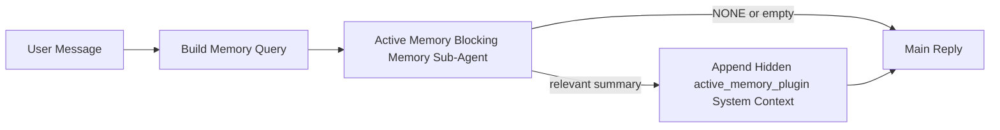

---
read_when:
    - Chcesz zrozumieć, do czego służy Active Memory
    - Chcesz włączyć Active Memory dla agenta konwersacyjnego
    - Chcesz dostroić zachowanie Active Memory bez włączania go wszędzie
summary: Należący do Plugin podagent blokującej pamięci, który wstrzykuje odpowiednią pamięć do interaktywnych sesji czatu
title: Active Memory
x-i18n:
    generated_at: "2026-04-12T09:33:34Z"
    model: gpt-5.4
    provider: openai
    source_hash: 59456805c28daaab394ba2a7f87e1104a1334a5cf32dbb961d5d232d9c471d84
    source_path: concepts/active-memory.md
    workflow: 15
---

# Active Memory

Active Memory to opcjonalny należący do Plugin blokujący podagent pamięci, który działa
przed główną odpowiedzią dla kwalifikujących się sesji konwersacyjnych.

Istnieje, ponieważ większość systemów pamięci jest zdolna do działania, ale reaktywna. Polegają one na
tym, że główny agent zdecyduje, kiedy przeszukać pamięć, albo na tym, że użytkownik powie
coś w rodzaju „zapamiętaj to” lub „przeszukaj pamięć”. Wtedy jednak moment, w którym pamięć
sprawiłaby, że odpowiedź brzmiałaby naturalnie, już minął.

Active Memory daje systemowi jedną ograniczoną szansę na wydobycie odpowiedniej pamięci
zanim zostanie wygenerowana główna odpowiedź.

## Wklej to do swojego agenta

Wklej to do swojego agenta, jeśli chcesz włączyć Active Memory z
samowystarczalną konfiguracją z bezpiecznymi ustawieniami domyślnymi:

```json5
{
  plugins: {
    entries: {
      "active-memory": {
        enabled: true,
        config: {
          enabled: true,
          agents: ["main"],
          allowedChatTypes: ["direct"],
          modelFallback: "google/gemini-3-flash",
          queryMode: "recent",
          promptStyle: "balanced",
          timeoutMs: 15000,
          maxSummaryChars: 220,
          persistTranscripts: false,
          logging: true,
        },
      },
    },
  },
}
```

To włącza plugin dla agenta `main`, domyślnie ogranicza go do sesji
w stylu wiadomości bezpośrednich, pozwala mu najpierw dziedziczyć bieżący model sesji i
używa skonfigurowanego modelu zapasowego tylko wtedy, gdy nie jest dostępny
żaden jawny ani dziedziczony model.

Następnie uruchom ponownie Gateway:

```bash
openclaw gateway
```

Aby obserwować to na żywo w rozmowie:

```text
/verbose on
```

## Włącz Active Memory

Najbezpieczniejsza konfiguracja to:

1. włączyć plugin
2. wskazać jednego agenta konwersacyjnego
3. pozostawić logowanie włączone tylko podczas dostrajania

Zacznij od tego w `openclaw.json`:

```json5
{
  plugins: {
    entries: {
      "active-memory": {
        enabled: true,
        config: {
          agents: ["main"],
          allowedChatTypes: ["direct"],
          modelFallback: "google/gemini-3-flash",
          queryMode: "recent",
          promptStyle: "balanced",
          timeoutMs: 15000,
          maxSummaryChars: 220,
          persistTranscripts: false,
          logging: true,
        },
      },
    },
  },
}
```

Następnie uruchom ponownie Gateway:

```bash
openclaw gateway
```

Co to oznacza:

- `plugins.entries.active-memory.enabled: true` włącza plugin
- `config.agents: ["main"]` włącza active memory tylko dla agenta `main`
- `config.allowedChatTypes: ["direct"]` domyślnie utrzymuje active memory tylko dla sesji w stylu wiadomości bezpośrednich
- jeśli `config.model` nie jest ustawione, active memory najpierw dziedziczy bieżący model sesji
- `config.modelFallback` opcjonalnie zapewnia własny zapasowy dostawcę/model do przywoływania pamięci
- `config.promptStyle: "balanced"` używa domyślnego stylu promptu ogólnego przeznaczenia dla trybu `recent`
- active memory nadal działa tylko w kwalifikujących się interaktywnych trwałych sesjach czatu

## Jak to zobaczyć

Active memory wstrzykuje ukryty kontekst systemowy dla modelu. Nie ujawnia
surowych tagów `<active_memory_plugin>...</active_memory_plugin>` klientowi.

## Przełącznik sesji

Użyj polecenia plugin, gdy chcesz wstrzymać lub wznowić active memory dla
bieżącej sesji czatu bez edytowania konfiguracji:

```text
/active-memory status
/active-memory off
/active-memory on
```

To działa w zakresie sesji. Nie zmienia
`plugins.entries.active-memory.enabled`, wskazania agenta ani innej globalnej
konfiguracji.

Jeśli chcesz, aby polecenie zapisywało konfigurację oraz wstrzymywało lub wznawiało active memory dla
wszystkich sesji, użyj jawnej formy globalnej:

```text
/active-memory status --global
/active-memory off --global
/active-memory on --global
```

Forma globalna zapisuje `plugins.entries.active-memory.config.enabled`. Pozostawia
`plugins.entries.active-memory.enabled` włączone, aby polecenie nadal było dostępne do
ponownego włączenia active memory później.

Jeśli chcesz zobaczyć, co active memory robi w sesji na żywo, włącz tryb verbose
dla tej sesji:

```text
/verbose on
```

Przy włączonym verbose OpenClaw może pokazać:

- wiersz stanu active memory, taki jak `Active Memory: ok 842ms recent 34 chars`
- czytelne podsumowanie debugowania, takie jak `Active Memory Debug: Lemon pepper wings with blue cheese.`

Te wiersze pochodzą z tego samego przebiegu active memory, który zasila ukryty
kontekst systemowy, ale są sformatowane dla ludzi zamiast ujawniać surowe
znaczniki promptu.

Domyślnie transkrypt blokującego podagenta pamięci jest tymczasowy i usuwany
po zakończeniu działania.

Przykładowy przebieg:

```text
/verbose on
what wings should i order?
```

Oczekiwany kształt widocznej odpowiedzi:

```text
...normal assistant reply...

🧩 Active Memory: ok 842ms recent 34 chars
🔎 Active Memory Debug: Lemon pepper wings with blue cheese.
```

## Kiedy działa

Active memory używa dwóch bramek:

1. **Jawne włączenie w konfiguracji**
   Plugin musi być włączony, a bieżący identyfikator agenta musi występować w
   `plugins.entries.active-memory.config.agents`.
2. **Ścisła kwalifikacja w czasie działania**
   Nawet gdy jest włączone i wskazane, active memory działa tylko dla kwalifikujących się
   interaktywnych trwałych sesji czatu.

Rzeczywista reguła wygląda tak:

```text
plugin enabled
+
agent id targeted
+
allowed chat type
+
eligible interactive persistent chat session
=
active memory runs
```

Jeśli którykolwiek z tych warunków nie jest spełniony, active memory nie działa.

## Typy sesji

`config.allowedChatTypes` kontroluje, w jakich rodzajach rozmów Active
Memory może w ogóle działać.

Domyślna wartość to:

```json5
allowedChatTypes: ["direct"]
```

Oznacza to, że Active Memory domyślnie działa w sesjach w stylu wiadomości bezpośrednich, ale
nie w sesjach grupowych ani kanałowych, chyba że jawnie je włączysz.

Przykłady:

```json5
allowedChatTypes: ["direct"]
```

```json5
allowedChatTypes: ["direct", "group"]
```

```json5
allowedChatTypes: ["direct", "group", "channel"]
```

## Gdzie działa

Active memory to funkcja wzbogacająca rozmowę, a nie ogólnoplatformowa
funkcja wnioskowania.

| Powierzchnia                                                        | Czy działa active memory?                               |
| ------------------------------------------------------------------- | ------------------------------------------------------- |
| Trwałe sesje Control UI / czatu webowego                            | Tak, jeśli plugin jest włączony i agent jest wskazany   |
| Inne interaktywne sesje kanałowe na tej samej trwałej ścieżce czatu | Tak, jeśli plugin jest włączony i agent jest wskazany   |
| Bezgłowe uruchomienia jednorazowe                                   | Nie                                                     |
| Uruchomienia Heartbeat/w tle                                        | Nie                                                     |
| Ogólne wewnętrzne ścieżki `agent-command`                           | Nie                                                     |
| Wykonanie podagenta/wewnętrznego pomocnika                          | Nie                                                     |

## Dlaczego warto tego używać

Używaj active memory, gdy:

- sesja jest trwała i skierowana do użytkownika
- agent ma istotną pamięć długoterminową do przeszukania
- ciągłość i personalizacja są ważniejsze niż surowy determinizm promptu

Działa to szczególnie dobrze dla:

- trwałych preferencji
- powtarzających się nawyków
- długoterminowego kontekstu użytkownika, który powinien naturalnie się ujawniać

Słabo nadaje się do:

- automatyzacji
- wewnętrznych workerów
- jednorazowych zadań API
- miejsc, w których ukryta personalizacja byłaby zaskakująca

## Jak to działa

Kształt działania w czasie wykonywania jest następujący:



Blokujący podagent pamięci może używać tylko:

- `memory_search`
- `memory_get`

Jeśli połączenie jest słabe, powinien zwrócić `NONE`.

## Tryby zapytań

`config.queryMode` kontroluje, jak dużą część rozmowy widzi blokujący podagent pamięci.

## Style promptu

`config.promptStyle` kontroluje, jak chętny lub restrykcyjny jest blokujący podagent pamięci
przy podejmowaniu decyzji, czy zwrócić pamięć.

Dostępne style:

- `balanced`: domyślny styl ogólnego przeznaczenia dla trybu `recent`
- `strict`: najmniej chętny; najlepszy, gdy chcesz bardzo małego przenikania z pobliskiego kontekstu
- `contextual`: najbardziej sprzyjający ciągłości; najlepszy, gdy historia rozmowy ma większe znaczenie
- `recall-heavy`: chętniej wydobywa pamięć przy słabszych, ale nadal prawdopodobnych dopasowaniach
- `precision-heavy`: zdecydowanie preferuje `NONE`, chyba że dopasowanie jest oczywiste
- `preference-only`: zoptymalizowany pod ulubione rzeczy, nawyki, rutyny, gust i powracające fakty osobiste

Mapowanie domyślne, gdy `config.promptStyle` nie jest ustawione:

```text
message -> strict
recent -> balanced
full -> contextual
```

Jeśli ustawisz `config.promptStyle` jawnie, to nadpisanie ma pierwszeństwo.

Przykład:

```json5
promptStyle: "preference-only"
```

## Zasady modelu zapasowego

Jeśli `config.model` nie jest ustawione, Active Memory próbuje rozwiązać model w tej kolejności:

```text
explicit plugin model
-> current session model
-> agent primary model
-> optional configured fallback model
```

`config.modelFallback` kontroluje krok skonfigurowanego modelu zapasowego.

Opcjonalny własny model zapasowy:

```json5
modelFallback: "google/gemini-3-flash"
```

Jeśli nie uda się rozwiązać żadnego jawnego, dziedziczonego ani skonfigurowanego modelu zapasowego, Active Memory
pomija przywoływanie pamięci dla tej tury.

`config.modelFallbackPolicy` jest zachowane wyłącznie jako przestarzałe pole zgodności
dla starszych konfiguracji. Nie zmienia już zachowania w czasie działania.

## Zaawansowane mechanizmy awaryjne

Te opcje celowo nie są częścią zalecanej konfiguracji.

`config.thinking` może nadpisać poziom myślenia blokującego podagenta pamięci:

```json5
thinking: "medium"
```

Wartość domyślna:

```json5
thinking: "off"
```

Nie włączaj tego domyślnie. Active Memory działa na ścieżce odpowiedzi, więc dodatkowy
czas myślenia bezpośrednio zwiększa opóźnienie widoczne dla użytkownika.

`config.promptAppend` dodaje dodatkowe instrukcje operatora po domyślnym prompcie Active
Memory i przed kontekstem rozmowy:

```json5
promptAppend: "Prefer stable long-term preferences over one-off events."
```

`config.promptOverride` zastępuje domyślny prompt Active Memory. OpenClaw
nadal dołącza potem kontekst rozmowy:

```json5
promptOverride: "You are a memory search agent. Return NONE or one compact user fact."
```

Dostosowywanie promptu nie jest zalecane, chyba że celowo testujesz
inny kontrakt przywoływania pamięci. Domyślny prompt jest dostrojony tak, aby zwracać albo `NONE`,
albo zwięzły kontekst faktów o użytkowniku dla głównego modelu.

### `message`

Wysyłana jest tylko najnowsza wiadomość użytkownika.

```text
Latest user message only
```

Użyj tego, gdy:

- chcesz najszybszego działania
- chcesz najsilniejszego ukierunkowania na przywoływanie trwałych preferencji
- kolejne tury nie wymagają kontekstu rozmowy

Zalecany limit czasu:

- zacznij od około `3000` do `5000` ms

### `recent`

Wysyłana jest najnowsza wiadomość użytkownika wraz z niewielkim ogonem ostatniej rozmowy.

```text
Recent conversation tail:
user: ...
assistant: ...
user: ...

Latest user message:
...
```

Użyj tego, gdy:

- chcesz lepszej równowagi między szybkością a osadzeniem w rozmowie
- pytania następcze często zależą od kilku ostatnich tur

Zalecany limit czasu:

- zacznij od około `15000` ms

### `full`

Cała rozmowa jest wysyłana do blokującego podagenta pamięci.

```text
Full conversation context:
user: ...
assistant: ...
user: ...
...
```

Użyj tego, gdy:

- najwyższa jakość przywoływania pamięci jest ważniejsza niż opóźnienie
- rozmowa zawiera ważne przygotowanie daleko wcześniej w wątku

Zalecany limit czasu:

- zwiększ go znacząco w porównaniu z `message` lub `recent`
- zacznij od około `15000` ms lub więcej w zależności od rozmiaru wątku

Ogólnie limit czasu powinien rosnąć wraz z rozmiarem kontekstu:

```text
message < recent < full
```

## Trwałość transkryptu

Uruchomienia blokującego podagenta pamięci Active Memory tworzą rzeczywisty transkrypt `session.jsonl`
podczas wywołania blokującego podagenta pamięci.

Domyślnie ten transkrypt jest tymczasowy:

- jest zapisywany w katalogu tymczasowym
- jest używany tylko na potrzeby działania blokującego podagenta pamięci
- jest usuwany natychmiast po zakończeniu działania

Jeśli chcesz zachować te transkrypty blokującego podagenta pamięci na dysku do debugowania lub
inspekcji, włącz trwałość jawnie:

```json5
{
  plugins: {
    entries: {
      "active-memory": {
        enabled: true,
        config: {
          agents: ["main"],
          persistTranscripts: true,
          transcriptDir: "active-memory",
        },
      },
    },
  },
}
```

Po włączeniu active memory zapisuje transkrypty w osobnym katalogu pod
folderem sesji docelowego agenta, a nie w głównej ścieżce transkryptu
rozmowy użytkownika.

Domyślny układ jest koncepcyjnie następujący:

```text
agents/<agent>/sessions/active-memory/<blocking-memory-sub-agent-session-id>.jsonl
```

Możesz zmienić względny podkatalog za pomocą `config.transcriptDir`.

Używaj tego ostrożnie:

- transkrypty blokującego podagenta pamięci mogą szybko się gromadzić w aktywnych sesjach
- tryb zapytań `full` może duplikować dużą część kontekstu rozmowy
- te transkrypty zawierają ukryty kontekst promptu i przywołane wspomnienia

## Konfiguracja

Cała konfiguracja active memory znajduje się pod:

```text
plugins.entries.active-memory
```

Najważniejsze pola to:

| Klucz                       | Typ                                                                                                  | Znaczenie                                                                                              |
| --------------------------- | ---------------------------------------------------------------------------------------------------- | ------------------------------------------------------------------------------------------------------ |
| `enabled`                   | `boolean`                                                                                            | Włącza sam plugin                                                                                      |
| `config.agents`             | `string[]`                                                                                           | Identyfikatory agentów, które mogą używać active memory                                                |
| `config.model`              | `string`                                                                                             | Opcjonalne odwołanie do modelu blokującego podagenta pamięci; gdy nie jest ustawione, active memory używa bieżącego modelu sesji |
| `config.queryMode`          | `"message" \| "recent" \| "full"`                                                                    | Kontroluje, jak dużą część rozmowy widzi blokujący podagent pamięci                                    |
| `config.promptStyle`        | `"balanced" \| "strict" \| "contextual" \| "recall-heavy" \| "precision-heavy" \| "preference-only"` | Kontroluje, jak chętny lub restrykcyjny jest blokujący podagent pamięci przy podejmowaniu decyzji, czy zwrócić pamięć |
| `config.thinking`           | `"off" \| "minimal" \| "low" \| "medium" \| "high" \| "xhigh" \| "adaptive"`                         | Zaawansowane nadpisanie poziomu myślenia dla blokującego podagenta pamięci; domyślnie `off` dla szybkości |
| `config.promptOverride`     | `string`                                                                                             | Zaawansowana pełna zamiana promptu; niezalecana do normalnego użycia                                   |
| `config.promptAppend`       | `string`                                                                                             | Zaawansowane dodatkowe instrukcje dołączane do domyślnego lub nadpisanego promptu                     |
| `config.timeoutMs`          | `number`                                                                                             | Twardy limit czasu dla blokującego podagenta pamięci                                                   |
| `config.maxSummaryChars`    | `number`                                                                                             | Maksymalna łączna liczba znaków dozwolona w podsumowaniu active-memory                                 |
| `config.logging`            | `boolean`                                                                                            | Emisja logów active memory podczas dostrajania                                                         |
| `config.persistTranscripts` | `boolean`                                                                                            | Zachowuje transkrypty blokującego podagenta pamięci na dysku zamiast usuwać pliki tymczasowe          |
| `config.transcriptDir`      | `string`                                                                                             | Względny katalog transkryptów blokującego podagenta pamięci pod folderem sesji agenta                 |

Przydatne pola do dostrajania:

| Klucz                         | Typ      | Znaczenie                                                    |
| ----------------------------- | -------- | ------------------------------------------------------------ |
| `config.maxSummaryChars`      | `number` | Maksymalna łączna liczba znaków dozwolona w podsumowaniu active-memory |
| `config.recentUserTurns`      | `number` | Poprzednie tury użytkownika do uwzględnienia, gdy `queryMode` ma wartość `recent` |
| `config.recentAssistantTurns` | `number` | Poprzednie tury asystenta do uwzględnienia, gdy `queryMode` ma wartość `recent` |
| `config.recentUserChars`      | `number` | Maksymalna liczba znaków na ostatnią turę użytkownika        |
| `config.recentAssistantChars` | `number` | Maksymalna liczba znaków na ostatnią turę asystenta          |
| `config.cacheTtlMs`           | `number` | Ponowne użycie pamięci podręcznej dla powtarzających się identycznych zapytań |

## Zalecana konfiguracja

Zacznij od `recent`.

```json5
{
  plugins: {
    entries: {
      "active-memory": {
        enabled: true,
        config: {
          agents: ["main"],
          queryMode: "recent",
          promptStyle: "balanced",
          timeoutMs: 15000,
          maxSummaryChars: 220,
          logging: true,
        },
      },
    },
  },
}
```

Jeśli chcesz obserwować zachowanie na żywo podczas dostrajania, użyj `/verbose on` w
sesji zamiast szukać osobnego polecenia debugowania active-memory.

Następnie przejdź do:

- `message`, jeśli chcesz mniejszego opóźnienia
- `full`, jeśli uznasz, że dodatkowy kontekst jest wart wolniejszego blokującego podagenta pamięci

## Debugowanie

Jeśli active memory nie pojawia się tam, gdzie się go spodziewasz:

1. Potwierdź, że plugin jest włączony pod `plugins.entries.active-memory.enabled`.
2. Potwierdź, że bieżący identyfikator agenta jest wymieniony w `config.agents`.
3. Potwierdź, że testujesz przez interaktywną trwałą sesję czatu.
4. Włącz `config.logging: true` i obserwuj logi Gateway.
5. Sprawdź, czy samo wyszukiwanie pamięci działa przy użyciu `openclaw memory status --deep`.

Jeśli trafienia pamięci są zbyt szumne, zaostrz:

- `maxSummaryChars`

Jeśli active memory jest zbyt wolne:

- obniż `queryMode`
- obniż `timeoutMs`
- zmniejsz liczbę ostatnich tur
- zmniejsz limity znaków na turę

## Powiązane strony

- [Wyszukiwanie w pamięci](/pl/concepts/memory-search)
- [Dokumentacja konfiguracji pamięci](/pl/reference/memory-config)
- [Konfiguracja Plugin SDK](/pl/plugins/sdk-setup)
