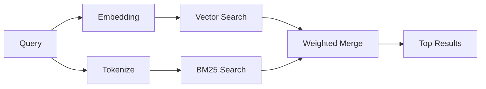

---
read_when:
    - Chcesz zrozumieć, jak działa `memory_search`
    - Chcesz wybrać dostawcę embeddingów
    - Chcesz dostroić jakość wyszukiwania
summary: Jak wyszukiwanie pamięci znajduje odpowiednie notatki za pomocą embeddingów i wyszukiwania hybrydowego
title: Wyszukiwanie w pamięci
x-i18n:
    generated_at: "2026-04-06T03:06:39Z"
    model: gpt-5.4
    provider: openai
    source_hash: b6541cd702bff41f9a468dad75ea438b70c44db7c65a4b793cbacaf9e583c7e9
    source_path: concepts/memory-search.md
    workflow: 15
---

# Wyszukiwanie w pamięci

`memory_search` znajduje odpowiednie notatki z Twoich plików pamięci, nawet gdy
sformułowania różnią się od oryginalnego tekstu. Działa przez indeksowanie pamięci w małych
fragmentach i przeszukiwanie ich za pomocą embeddingów, słów kluczowych lub obu tych metod.

## Szybki start

Jeśli masz skonfigurowany klucz API OpenAI, Gemini, Voyage lub Mistral, wyszukiwanie w pamięci
działa automatycznie. Aby jawnie ustawić dostawcę:

```json5
{
  agents: {
    defaults: {
      memorySearch: {
        provider: "openai", // or "gemini", "local", "ollama", etc.
      },
    },
  },
}
```

W przypadku lokalnych embeddingów bez klucza API użyj `provider: "local"` (wymaga
`node-llama-cpp`).

## Obsługiwani dostawcy

| Dostawca | ID        | Wymaga klucza API | Uwagi                                                |
| -------- | --------- | ------------- | ---------------------------------------------------- |
| OpenAI   | `openai`  | Tak           | Wykrywany automatycznie, szybki                                  |
| Gemini   | `gemini`  | Tak           | Obsługuje indeksowanie obrazów i dźwięku                        |
| Voyage   | `voyage`  | Tak           | Wykrywany automatycznie                                        |
| Mistral  | `mistral` | Tak           | Wykrywany automatycznie                                        |
| Bedrock  | `bedrock` | Nie            | Wykrywany automatycznie, gdy łańcuch poświadczeń AWS zostanie rozwiązany |
| Ollama   | `ollama`  | Nie            | Lokalny, musi być ustawiony jawnie                           |
| Local    | `local`   | Nie            | Model GGUF, pobieranie ~0.6 GB                         |

## Jak działa wyszukiwanie

OpenClaw uruchamia równolegle dwie ścieżki pobierania i scala wyniki:



- **Wyszukiwanie wektorowe** znajduje notatki o podobnym znaczeniu („gateway host” pasuje do
  „maszyna, na której działa OpenClaw”).
- **Wyszukiwanie słów kluczowych BM25** znajduje dokładne dopasowania (ID, ciągi błędów, klucze
  konfiguracji).

Jeśli dostępna jest tylko jedna ścieżka (brak embeddingów lub brak FTS), druga działa samodzielnie.

## Poprawianie jakości wyszukiwania

Dwie opcjonalne funkcje pomagają, gdy masz dużą historię notatek:

### Zanikanie czasowe

Stare notatki stopniowo tracą wagę w rankingu, dzięki czemu najpierw pojawiają się nowsze informacje.
Przy domyślnym okresie półtrwania wynoszącym 30 dni notatka z zeszłego miesiąca uzyskuje wynik równy 50%
swojej pierwotnej wagi. Stałe pliki, takie jak `MEMORY.md`, nigdy nie podlegają zanikaniu.

<Tip>
Włącz zanikanie czasowe, jeśli Twój agent ma wiele miesięcy codziennych notatek, a nieaktualne
informacje wciąż są wyżej w rankingu niż nowszy kontekst.
</Tip>

### MMR (różnorodność)

Ogranicza nadmiarowe wyniki. Jeśli pięć notatek wspomina tę samą konfigurację routera, MMR
sprawia, że najwyższe wyniki obejmują różne tematy zamiast się powtarzać.

<Tip>
Włącz MMR, jeśli `memory_search` ciągle zwraca niemal zduplikowane fragmenty z
różnych codziennych notatek.
</Tip>

### Włącz oba

```json5
{
  agents: {
    defaults: {
      memorySearch: {
        query: {
          hybrid: {
            mmr: { enabled: true },
            temporalDecay: { enabled: true },
          },
        },
      },
    },
  },
}
```

## Pamięć multimodalna

Dzięki Gemini Embedding 2 możesz indeksować obrazy i pliki audio razem z
Markdownem. Zapytania wyszukiwania nadal pozostają tekstowe, ale są dopasowywane do treści wizualnych i audio.
Instrukcje konfiguracji znajdziesz w [Dokumentacji konfiguracji pamięci](/pl/reference/memory-config).

## Wyszukiwanie pamięci sesji

Opcjonalnie możesz indeksować transkrypcje sesji, aby `memory_search` mogło przypominać sobie
wcześniejsze rozmowy. Jest to funkcja opcjonalna, włączana przez
`memorySearch.experimental.sessionMemory`. Szczegóły znajdziesz w
[dokumentacji konfiguracji](/pl/reference/memory-config).

## Rozwiązywanie problemów

**Brak wyników?** Uruchom `openclaw memory status`, aby sprawdzić indeks. Jeśli jest pusty, uruchom
`openclaw memory index --force`.

**Tylko dopasowania słów kluczowych?** Twój dostawca embeddingów może nie być skonfigurowany. Sprawdź
`openclaw memory status --deep`.

**Nie można znaleźć tekstu CJK?** Odbuduj indeks FTS za pomocą
`openclaw memory index --force`.

## Dalsza lektura

- [Pamięć](/pl/concepts/memory) -- układ plików, backendy, narzędzia
- [Dokumentacja konfiguracji pamięci](/pl/reference/memory-config) -- wszystkie opcje konfiguracji
