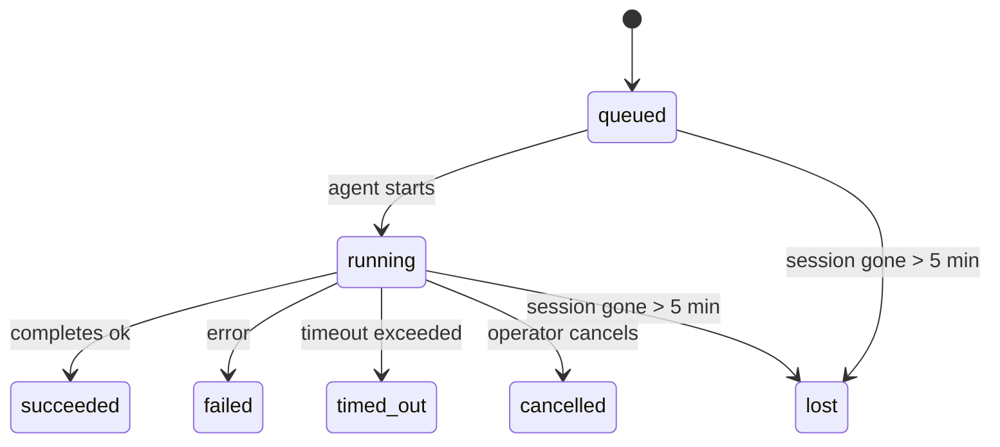

---
read_when:
    - Inspecionando trabalho em segundo plano em andamento ou concluído recentemente
    - Depurando falhas de entrega para execuções de agentes desanexadas
    - Entendendo como execuções em segundo plano se relacionam com sessões, cron e heartbeat
summary: Rastreamento de tarefas em segundo plano para execuções do ACP, subagentes, trabalhos cron isolados e operações da CLI
title: Tarefas em segundo plano
x-i18n:
    generated_at: "2026-04-10T05:34:12Z"
    model: gpt-5.4
    provider: openai
    source_hash: d7b5ba41f1025e0089986342ce85698bc62f676439c3ccf03f3ed146beb1b1ac
    source_path: automation/tasks.md
    workflow: 15
---

# Tarefas em segundo plano

> **Está procurando agendamento?** Veja [Automação e Tarefas](/pt-BR/automation) para escolher o mecanismo certo. Esta página cobre o **rastreamento** de trabalho em segundo plano, não o agendamento.

As tarefas em segundo plano rastreiam trabalhos executados **fora da sua sessão principal de conversa**:
execuções do ACP, inicializações de subagentes, execuções isoladas de trabalhos cron e operações iniciadas pela CLI.

As tarefas **não** substituem sessões, trabalhos cron ou heartbeats — elas são o **registro de atividade** que documenta que trabalho desanexado aconteceu, quando aconteceu e se foi bem-sucedido.

<Note>
Nem toda execução de agente cria uma tarefa. Turnos de heartbeat e chat interativo normal não criam. Todas as execuções cron, inicializações do ACP, inicializações de subagentes e comandos de agente da CLI criam.
</Note>

## Resumo rápido

- Tarefas são **registros**, não agendadores — cron e heartbeat decidem _quando_ o trabalho é executado, as tarefas rastreiam _o que aconteceu_.
- ACP, subagentes, todos os trabalhos cron e operações da CLI criam tarefas. Turnos de heartbeat não criam.
- Cada tarefa passa por `queued → running → terminal` (succeeded, failed, timed_out, cancelled ou lost).
- Tarefas cron permanecem ativas enquanto o runtime do cron ainda possuir o trabalho; tarefas da CLI com suporte de chat permanecem ativas apenas enquanto seu contexto de execução proprietário ainda estiver ativo.
- A conclusão é orientada por push: o trabalho desanexado pode notificar diretamente ou despertar a
  sessão/heartbeat solicitante quando terminar, então laços de polling de status
  geralmente não são o formato certo.
- Execuções cron isoladas e conclusões de subagentes fazem uma limpeza best-effort de abas/processos rastreados do navegador para sua sessão filha antes da limpeza final de bookkeeping.
- A entrega de cron isolado suprime respostas intermediárias obsoletas do pai enquanto
  o trabalho de subagentes descendentes ainda estiver sendo drenado, e prefere a saída final do descendente
  quando ela chega antes da entrega.
- As notificações de conclusão são entregues diretamente a um canal ou enfileiradas para o próximo heartbeat.
- `openclaw tasks list` mostra todas as tarefas; `openclaw tasks audit` exibe problemas.
- Registros terminais são mantidos por 7 dias e depois removidos automaticamente.

## Início rápido

```bash
# Liste todas as tarefas (mais novas primeiro)
openclaw tasks list

# Filtre por runtime ou status
openclaw tasks list --runtime acp
openclaw tasks list --status running

# Mostre detalhes de uma tarefa específica (por ID, ID de execução ou chave de sessão)
openclaw tasks show <lookup>

# Cancele uma tarefa em execução (encerra a sessão filha)
openclaw tasks cancel <lookup>

# Altere a política de notificação de uma tarefa
openclaw tasks notify <lookup> state_changes

# Execute uma auditoria de integridade
openclaw tasks audit

# Visualize ou aplique manutenção
openclaw tasks maintenance
openclaw tasks maintenance --apply

# Inspecione o estado do TaskFlow
openclaw tasks flow list
openclaw tasks flow show <lookup>
openclaw tasks flow cancel <lookup>
```

## O que cria uma tarefa

| Origem                 | Tipo de runtime | Quando um registro de tarefa é criado                 | Política de notificação padrão |
| ---------------------- | --------------- | ----------------------------------------------------- | ------------------------------ |
| Execuções em segundo plano do ACP | `acp`        | Ao iniciar uma sessão filha do ACP                    | `done_only`                    |
| Orquestração de subagentes | `subagent`   | Ao iniciar um subagente via `sessions_spawn`          | `done_only`                    |
| Trabalhos cron (todos os tipos) | `cron`       | Em cada execução cron (sessão principal e isolada)    | `silent`                       |
| Operações da CLI       | `cli`           | Comandos `openclaw agent` executados pelo gateway     | `silent`                       |
| Trabalhos de mídia do agente | `cli`      | Execuções `video_generate` com suporte de sessão      | `silent`                       |

As tarefas cron da sessão principal usam a política de notificação `silent` por padrão — elas criam registros para rastreamento, mas não geram notificações. Tarefas cron isoladas também usam `silent` por padrão, mas são mais visíveis porque são executadas na própria sessão.

Execuções `video_generate` com suporte de sessão também usam a política de notificação `silent`. Elas ainda criam registros de tarefa, mas a conclusão é devolvida à sessão original do agente como um despertar interno para que o agente possa escrever a mensagem de acompanhamento e anexar o vídeo concluído por conta própria. Se você optar por `tools.media.asyncCompletion.directSend`, conclusões assíncronas de `music_generate` e `video_generate` tentam primeiro a entrega direta ao canal antes de recorrer ao caminho de despertar da sessão solicitante.

Enquanto uma tarefa `video_generate` com suporte de sessão ainda estiver ativa, a ferramenta também atua como proteção: chamadas repetidas de `video_generate` nessa mesma sessão retornam o status da tarefa ativa em vez de iniciar uma segunda geração concorrente. Use `action: "status"` quando quiser uma consulta explícita de progresso/status pelo lado do agente.

**O que não cria tarefas:**

- Turnos de heartbeat — sessão principal; veja [Heartbeat](/pt-BR/gateway/heartbeat)
- Turnos normais de chat interativo
- Respostas diretas de `/command`

## Ciclo de vida da tarefa



| Status      | O que significa                                                            |
| ----------- | -------------------------------------------------------------------------- |
| `queued`    | Criada, aguardando o agente iniciar                                        |
| `running`   | O turno do agente está sendo executado ativamente                          |
| `succeeded` | Concluída com sucesso                                                      |
| `failed`    | Concluída com um erro                                                      |
| `timed_out` | Excedeu o tempo limite configurado                                         |
| `cancelled` | Interrompida pelo operador via `openclaw tasks cancel`                     |
| `lost`      | O runtime perdeu o estado de suporte autoritativo após um período de tolerância de 5 minutos |

As transições acontecem automaticamente — quando a execução do agente associada termina, o status da tarefa é atualizado para corresponder.

`lost` é sensível ao runtime:

- Tarefas do ACP: os metadados de suporte da sessão filha do ACP desapareceram.
- Tarefas de subagente: a sessão filha de suporte desapareceu do armazenamento do agente de destino.
- Tarefas cron: o runtime do cron não rastreia mais o trabalho como ativo.
- Tarefas da CLI: tarefas de sessão filha isolada usam a sessão filha; tarefas da CLI com suporte de chat usam o contexto de execução ativo no lugar, então linhas persistentes de sessão de canal/grupo/direta não as mantêm ativas.

## Entrega e notificações

Quando uma tarefa atinge um estado terminal, o OpenClaw notifica você. Há dois caminhos de entrega:

**Entrega direta** — se a tarefa tiver um destino de canal (o `requesterOrigin`), a mensagem de conclusão vai diretamente para esse canal (Telegram, Discord, Slack etc.). Para conclusões de subagentes, o OpenClaw também preserva o roteamento vinculado de thread/tópico quando disponível e pode preencher um `to` / conta ausente a partir da rota armazenada da sessão solicitante (`lastChannel` / `lastTo` / `lastAccountId`) antes de desistir da entrega direta.

**Entrega enfileirada na sessão** — se a entrega direta falhar ou nenhuma origem estiver definida, a atualização é enfileirada como um evento do sistema na sessão do solicitante e aparece no próximo heartbeat.

<Tip>
A conclusão da tarefa aciona um despertar imediato do heartbeat para que você veja o resultado rapidamente — você não precisa esperar pelo próximo tick agendado do heartbeat.
</Tip>

Isso significa que o fluxo de trabalho usual é orientado por push: inicie o trabalho desanexado uma vez e depois deixe
o runtime despertar ou notificar você quando ele terminar. Faça polling do estado da tarefa apenas quando
precisar de depuração, intervenção ou uma auditoria explícita.

### Políticas de notificação

Controle quanto você quer ouvir sobre cada tarefa:

| Política              | O que é entregue                                                        |
| --------------------- | ----------------------------------------------------------------------- |
| `done_only` (padrão)  | Apenas o estado terminal (succeeded, failed etc.) — **este é o padrão** |
| `state_changes`       | Toda transição de estado e atualização de progresso                     |
| `silent`              | Nada                                                                    |

Altere a política enquanto uma tarefa estiver em execução:

```bash
openclaw tasks notify <lookup> state_changes
```

## Referência da CLI

### `tasks list`

```bash
openclaw tasks list [--runtime <acp|subagent|cron|cli>] [--status <status>] [--json]
```

Colunas de saída: ID da tarefa, Tipo, Status, Entrega, ID da execução, Sessão filha, Resumo.

### `tasks show`

```bash
openclaw tasks show <lookup>
```

O token de lookup aceita um ID de tarefa, ID de execução ou chave de sessão. Mostra o registro completo, incluindo tempo, estado da entrega, erro e resumo terminal.

### `tasks cancel`

```bash
openclaw tasks cancel <lookup>
```

Para tarefas do ACP e de subagentes, isso encerra a sessão filha. Para tarefas rastreadas pela CLI, o cancelamento é registrado no registro de tarefas (não há um identificador de runtime filho separado). O status muda para `cancelled` e uma notificação de entrega é enviada quando aplicável.

### `tasks notify`

```bash
openclaw tasks notify <lookup> <done_only|state_changes|silent>
```

### `tasks audit`

```bash
openclaw tasks audit [--json]
```

Exibe problemas operacionais. Os achados também aparecem em `openclaw status` quando problemas são detectados.

| Achado                    | Severidade | Gatilho                                              |
| ------------------------- | ---------- | ---------------------------------------------------- |
| `stale_queued`            | warn       | Em fila por mais de 10 minutos                       |
| `stale_running`           | error      | Em execução por mais de 30 minutos                   |
| `lost`                    | error      | A propriedade da tarefa com suporte de runtime desapareceu |
| `delivery_failed`         | warn       | A entrega falhou e a política de notificação não é `silent` |
| `missing_cleanup`         | warn       | Tarefa terminal sem carimbo de data/hora de limpeza  |
| `inconsistent_timestamps` | warn       | Violação da linha do tempo (por exemplo, terminou antes de começar) |

### `tasks maintenance`

```bash
openclaw tasks maintenance [--json]
openclaw tasks maintenance --apply [--json]
```

Use isso para visualizar ou aplicar reconciliação, marcação de limpeza e remoção para
tarefas e estado do Task Flow.

A reconciliação é sensível ao runtime:

- Tarefas do ACP/subagente verificam sua sessão filha de suporte.
- Tarefas cron verificam se o runtime do cron ainda possui o trabalho.
- Tarefas da CLI com suporte de chat verificam o contexto de execução ativo proprietário, não apenas a linha da sessão de chat.

A limpeza de conclusão também é sensível ao runtime:

- A conclusão de subagente fecha, em best-effort, abas/processos rastreados do navegador para a sessão filha antes que a limpeza do anúncio continue.
- A conclusão de cron isolado fecha, em best-effort, abas/processos rastreados do navegador para a sessão cron antes que a execução seja totalmente desmontada.
- A entrega de cron isolado espera o acompanhamento de subagentes descendentes quando necessário e
  suprime texto obsoleto de confirmação do pai em vez de anunciá-lo.
- A entrega de conclusão de subagente prefere o texto visível mais recente do assistente; se estiver vazio, recorre ao texto mais recente saneado de tool/toolResult, e execuções apenas com chamada de ferramenta por timeout podem ser condensadas em um resumo curto de progresso parcial.
- Falhas de limpeza não mascaram o resultado real da tarefa.

### `tasks flow list|show|cancel`

```bash
openclaw tasks flow list [--status <status>] [--json]
openclaw tasks flow show <lookup> [--json]
openclaw tasks flow cancel <lookup>
```

Use esses comandos quando o Task Flow de orquestração for a coisa com a qual você se importa
em vez de um registro individual de tarefa em segundo plano.

## Painel de tarefas no chat (`/tasks`)

Use `/tasks` em qualquer sessão de chat para ver tarefas em segundo plano vinculadas a essa sessão. O painel mostra
tarefas ativas e concluídas recentemente com runtime, status, tempo e detalhes de progresso ou erro.

Quando a sessão atual não tem tarefas vinculadas visíveis, `/tasks` recorre a contagens de tarefas locais do agente
para que você ainda tenha uma visão geral sem expor detalhes de outras sessões.

Para o registro completo do operador, use a CLI: `openclaw tasks list`.

## Integração de status (pressão de tarefas)

`openclaw status` inclui um resumo rápido de tarefas:

```
Tasks: 3 queued · 2 running · 1 issues
```

O resumo informa:

- **active** — contagem de `queued` + `running`
- **failures** — contagem de `failed` + `timed_out` + `lost`
- **byRuntime** — detalhamento por `acp`, `subagent`, `cron`, `cli`

Tanto `/status` quanto a ferramenta `session_status` usam um snapshot de tarefas com reconhecimento de limpeza: tarefas ativas têm
preferência, linhas concluídas obsoletas são ocultadas e falhas recentes só aparecem quando não resta
trabalho ativo. Isso mantém o cartão de status focado no que importa agora.

## Armazenamento e manutenção

### Onde as tarefas ficam

Os registros de tarefa persistem em SQLite em:

```
$OPENCLAW_STATE_DIR/tasks/runs.sqlite
```

O registro é carregado em memória na inicialização do gateway e sincroniza gravações com o SQLite para durabilidade entre reinicializações.

### Manutenção automática

Um processo de varredura é executado a cada **60 segundos** e lida com três coisas:

1. **Reconciliação** — verifica se tarefas ativas ainda têm suporte autoritativo do runtime. Tarefas do ACP/subagente usam o estado da sessão filha, tarefas cron usam a propriedade do trabalho ativo e tarefas da CLI com suporte de chat usam o contexto de execução proprietário. Se esse estado de suporte desaparecer por mais de 5 minutos, a tarefa é marcada como `lost`.
2. **Marcação de limpeza** — define um timestamp `cleanupAfter` em tarefas terminais (`endedAt + 7 days`).
3. **Remoção** — exclui registros após a data `cleanupAfter`.

**Retenção**: registros de tarefas terminais são mantidos por **7 dias** e depois removidos automaticamente. Nenhuma configuração é necessária.

## Como as tarefas se relacionam com outros sistemas

### Tarefas e Task Flow

[Task Flow](/pt-BR/automation/taskflow) é a camada de orquestração de fluxos acima das tarefas em segundo plano. Um único fluxo pode coordenar várias tarefas ao longo de sua vida útil usando modos de sincronização gerenciados ou espelhados. Use `openclaw tasks` para inspecionar registros individuais de tarefas e `openclaw tasks flow` para inspecionar o fluxo de orquestração.

Veja [Task Flow](/pt-BR/automation/taskflow) para mais detalhes.

### Tarefas e cron

Uma **definição** de trabalho cron fica em `~/.openclaw/cron/jobs.json`. **Toda** execução cron cria um registro de tarefa — tanto na sessão principal quanto em execução isolada. Tarefas cron da sessão principal usam a política de notificação `silent` por padrão, para rastrear sem gerar notificações.

Veja [Trabalhos cron](/pt-BR/automation/cron-jobs).

### Tarefas e heartbeat

Execuções de heartbeat são turnos da sessão principal — elas não criam registros de tarefa. Quando uma tarefa é concluída, ela pode acionar um despertar do heartbeat para que você veja o resultado prontamente.

Veja [Heartbeat](/pt-BR/gateway/heartbeat).

### Tarefas e sessões

Uma tarefa pode referenciar um `childSessionKey` (onde o trabalho é executado) e um `requesterSessionKey` (quem a iniciou). Sessões são o contexto da conversa; tarefas são o rastreamento de atividade sobre esse contexto.

### Tarefas e execuções de agente

O `runId` de uma tarefa se vincula à execução do agente que está realizando o trabalho. Eventos do ciclo de vida do agente (início, término, erro) atualizam automaticamente o status da tarefa — você não precisa gerenciar o ciclo de vida manualmente.

## Relacionado

- [Automação e Tarefas](/pt-BR/automation) — todos os mecanismos de automação em resumo
- [Task Flow](/pt-BR/automation/taskflow) — orquestração de fluxos acima das tarefas
- [Tarefas agendadas](/pt-BR/automation/cron-jobs) — agendamento de trabalho em segundo plano
- [Heartbeat](/pt-BR/gateway/heartbeat) — turnos periódicos da sessão principal
- [CLI: Tarefas](/cli/index#tasks) — referência de comandos da CLI
