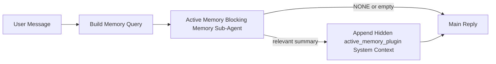

---
read_when:
    - Você quer entender para que serve a memória ativa
    - Você quer ativar a memória ativa para um agente conversacional
    - Você quer ajustar o comportamento da memória ativa sem ativá-la em todos os lugares
summary: Um subagente de memória de bloqueio controlado pelo plugin que injeta memória relevante em sessões de chat interativas
title: Memória ativa
x-i18n:
    generated_at: "2026-04-12T05:33:10Z"
    model: gpt-5.4
    provider: openai
    source_hash: 59456805c28daaab394ba2a7f87e1104a1334a5cf32dbb961d5d232d9c471d84
    source_path: concepts/active-memory.md
    workflow: 15
---

# Memória ativa

A memória ativa é um subagente opcional de memória de bloqueio controlado pelo plugin que é executado
antes da resposta principal em sessões conversacionais elegíveis.

Ela existe porque a maioria dos sistemas de memória é capaz, mas reativa. Eles dependem de
o agente principal decidir quando pesquisar a memória, ou de o usuário dizer coisas
como "lembre-se disso" ou "pesquise na memória". Quando isso acontece, o momento em que a memória
teria feito a resposta parecer natural já passou.

A memória ativa dá ao sistema uma chance limitada de trazer memória relevante
antes que a resposta principal seja gerada.

## Cole isto no seu agente

Cole isto no seu agente se quiser habilitar a Memória ativa com uma
configuração autocontida e segura por padrão:

```json5
{
  plugins: {
    entries: {
      "active-memory": {
        enabled: true,
        config: {
          enabled: true,
          agents: ["main"],
          allowedChatTypes: ["direct"],
          modelFallback: "google/gemini-3-flash",
          queryMode: "recent",
          promptStyle: "balanced",
          timeoutMs: 15000,
          maxSummaryChars: 220,
          persistTranscripts: false,
          logging: true,
        },
      },
    },
  },
}
```

Isso ativa o plugin para o agente `main`, o mantém limitado a sessões
no estilo de mensagem direta por padrão, permite que ele herde primeiro o modelo da sessão atual
e usa o modelo de fallback configurado apenas se nenhum modelo explícito ou herdado estiver disponível.

Depois disso, reinicie o gateway:

```bash
openclaw gateway
```

Para inspecioná-lo ao vivo em uma conversa:

```text
/verbose on
```

## Ative a memória ativa

A configuração mais segura é:

1. habilitar o plugin
2. direcioná-lo para um agente conversacional
3. manter o registro ativado apenas durante o ajuste

Comece com isto em `openclaw.json`:

```json5
{
  plugins: {
    entries: {
      "active-memory": {
        enabled: true,
        config: {
          agents: ["main"],
          allowedChatTypes: ["direct"],
          modelFallback: "google/gemini-3-flash",
          queryMode: "recent",
          promptStyle: "balanced",
          timeoutMs: 15000,
          maxSummaryChars: 220,
          persistTranscripts: false,
          logging: true,
        },
      },
    },
  },
}
```

Depois reinicie o gateway:

```bash
openclaw gateway
```

O que isso significa:

- `plugins.entries.active-memory.enabled: true` ativa o plugin
- `config.agents: ["main"]` habilita memória ativa apenas para o agente `main`
- `config.allowedChatTypes: ["direct"]` mantém a memória ativa habilitada apenas para sessões no estilo de mensagem direta por padrão
- se `config.model` não estiver definido, a memória ativa herda primeiro o modelo da sessão atual
- `config.modelFallback` opcionalmente fornece seu próprio provedor/modelo de fallback para recuperação
- `config.promptStyle: "balanced"` usa o estilo de prompt padrão de uso geral para o modo `recent`
- a memória ativa ainda é executada apenas em sessões de chat interativas persistentes elegíveis

## Como vê-la

A memória ativa injeta contexto de sistema oculto para o modelo. Ela não expõe
tags brutas `<active_memory_plugin>...</active_memory_plugin>` ao cliente.

## Alternância por sessão

Use o comando do plugin quando quiser pausar ou retomar a memória ativa para a
sessão de chat atual sem editar a configuração:

```text
/active-memory status
/active-memory off
/active-memory on
```

Isso é restrito à sessão. Não altera
`plugins.entries.active-memory.enabled`, o direcionamento do agente nem outra
configuração global.

Se quiser que o comando grave a configuração e pause ou retome a memória ativa para
todas as sessões, use a forma global explícita:

```text
/active-memory status --global
/active-memory off --global
/active-memory on --global
```

A forma global grava `plugins.entries.active-memory.config.enabled`. Ela mantém
`plugins.entries.active-memory.enabled` ativado para que o comando continue disponível para
reativar a memória ativa depois.

Se quiser ver o que a memória ativa está fazendo em uma sessão ao vivo, ative o modo
verbose para essa sessão:

```text
/verbose on
```

Com o verbose ativado, o OpenClaw pode mostrar:

- uma linha de status da memória ativa, como `Active Memory: ok 842ms recent 34 chars`
- um resumo de depuração legível, como `Active Memory Debug: Lemon pepper wings with blue cheese.`

Essas linhas são derivadas da mesma passagem de memória ativa que alimenta o contexto
oculto do sistema, mas são formatadas para humanos em vez de expor marcação bruta do prompt.

Por padrão, a transcrição do subagente de memória de bloqueio é temporária e é excluída
depois que a execução é concluída.

Fluxo de exemplo:

```text
/verbose on
what wings should i order?
```

Formato de resposta visível esperado:

```text
...normal assistant reply...

🧩 Active Memory: ok 842ms recent 34 chars
🔎 Active Memory Debug: Lemon pepper wings with blue cheese.
```

## Quando ela é executada

A memória ativa usa dois critérios:

1. **Adesão via configuração**
   O plugin deve estar habilitado, e o id do agente atual deve aparecer em
   `plugins.entries.active-memory.config.agents`.
2. **Elegibilidade estrita em tempo de execução**
   Mesmo quando habilitada e direcionada, a memória ativa é executada apenas em
   sessões de chat interativas persistentes elegíveis.

A regra real é:

```text
plugin enabled
+
agent id targeted
+
allowed chat type
+
eligible interactive persistent chat session
=
active memory runs
```

Se qualquer um desses falhar, a memória ativa não será executada.

## Tipos de sessão

`config.allowedChatTypes` controla em que tipos de conversa a Memória ativa pode ser executada.

O padrão é:

```json5
allowedChatTypes: ["direct"]
```

Isso significa que a Memória ativa é executada por padrão em sessões no estilo de mensagem direta, mas
não em sessões de grupo ou canal, a menos que você as habilite explicitamente.

Exemplos:

```json5
allowedChatTypes: ["direct"]
```

```json5
allowedChatTypes: ["direct", "group"]
```

```json5
allowedChatTypes: ["direct", "group", "channel"]
```

## Onde ela é executada

A memória ativa é um recurso de enriquecimento conversacional, não um recurso de
inferência em toda a plataforma.

| Superfície                                                          | Executa memória ativa?                                  |
| ------------------------------------------------------------------- | ------------------------------------------------------- |
| Sessões persistentes da Control UI / chat web                       | Sim, se o plugin estiver habilitado e o agente for direcionado |
| Outras sessões de canal interativas no mesmo caminho de chat persistente | Sim, se o plugin estiver habilitado e o agente for direcionado |
| Execuções avulsas sem interface                                     | Não                                                     |
| Execuções de heartbeat/background                                   | Não                                                     |
| Caminhos internos genéricos de `agent-command`                      | Não                                                     |
| Execução de subagente/auxiliar interno                              | Não                                                     |

## Por que usá-la

Use a memória ativa quando:

- a sessão for persistente e voltada ao usuário
- o agente tiver memória de longo prazo significativa para pesquisar
- continuidade e personalização importarem mais do que determinismo bruto do prompt

Ela funciona especialmente bem para:

- preferências estáveis
- hábitos recorrentes
- contexto de longo prazo do usuário que deve surgir naturalmente

Ela é uma escolha ruim para:

- automação
- workers internos
- tarefas de API avulsas
- lugares em que personalização oculta seria surpreendente

## Como funciona

O formato em tempo de execução é:



O subagente de memória de bloqueio pode usar apenas:

- `memory_search`
- `memory_get`

Se a conexão estiver fraca, ele deve retornar `NONE`.

## Modos de consulta

`config.queryMode` controla quanto da conversa o subagente de memória de bloqueio vê.

## Estilos de prompt

`config.promptStyle` controla o quão disposto ou rigoroso o subagente de memória de bloqueio é
ao decidir se deve retornar memória.

Estilos disponíveis:

- `balanced`: padrão de uso geral para o modo `recent`
- `strict`: menos disposto; melhor quando você quer pouquíssimo vazamento do contexto próximo
- `contextual`: mais favorável à continuidade; melhor quando o histórico da conversa deve importar mais
- `recall-heavy`: mais disposto a trazer memória em correspondências mais leves, mas ainda plausíveis
- `precision-heavy`: prefere agressivamente `NONE`, a menos que a correspondência seja óbvia
- `preference-only`: otimizado para favoritos, hábitos, rotinas, gostos e fatos pessoais recorrentes

Mapeamento padrão quando `config.promptStyle` não está definido:

```text
message -> strict
recent -> balanced
full -> contextual
```

Se você definir `config.promptStyle` explicitamente, essa substituição prevalece.

Exemplo:

```json5
promptStyle: "preference-only"
```

## Política de fallback de modelo

Se `config.model` não estiver definido, a Memória ativa tenta resolver um modelo nesta ordem:

```text
explicit plugin model
-> current session model
-> agent primary model
-> optional configured fallback model
```

`config.modelFallback` controla a etapa de fallback configurado.

Fallback personalizado opcional:

```json5
modelFallback: "google/gemini-3-flash"
```

Se nenhum modelo explícito, herdado ou de fallback configurado puder ser resolvido, a Memória ativa
ignora a recuperação nesse turno.

`config.modelFallbackPolicy` é mantido apenas como um campo de compatibilidade obsoleto
para configurações antigas. Ele não altera mais o comportamento em tempo de execução.

## Escapes avançados

Estas opções intencionalmente não fazem parte da configuração recomendada.

`config.thinking` pode substituir o nível de thinking do subagente de memória de bloqueio:

```json5
thinking: "medium"
```

Padrão:

```json5
thinking: "off"
```

Não habilite isso por padrão. A Memória ativa é executada no caminho da resposta, então tempo
extra de thinking aumenta diretamente a latência visível para o usuário.

`config.promptAppend` adiciona instruções extras do operador após o prompt padrão da Memória
ativa e antes do contexto da conversa:

```json5
promptAppend: "Prefer stable long-term preferences over one-off events."
```

`config.promptOverride` substitui o prompt padrão da Memória ativa. O OpenClaw
ainda acrescenta o contexto da conversa depois:

```json5
promptOverride: "You are a memory search agent. Return NONE or one compact user fact."
```

A personalização do prompt não é recomendada, a menos que você esteja testando deliberadamente um
contrato de recuperação diferente. O prompt padrão é ajustado para retornar `NONE`
ou contexto compacto de fatos do usuário para o modelo principal.

### `message`

Apenas a mensagem mais recente do usuário é enviada.

```text
Latest user message only
```

Use isso quando:

- você quiser o comportamento mais rápido
- você quiser a maior inclinação para recuperar preferências estáveis
- turnos de acompanhamento não precisarem de contexto conversacional

Tempo limite recomendado:

- comece em torno de `3000` a `5000` ms

### `recent`

A mensagem mais recente do usuário mais um pequeno trecho recente da conversa são enviados.

```text
Recent conversation tail:
user: ...
assistant: ...
user: ...

Latest user message:
...
```

Use isso quando:

- você quiser um melhor equilíbrio entre velocidade e embasamento conversacional
- perguntas de acompanhamento frequentemente dependerem dos últimos turnos

Tempo limite recomendado:

- comece em torno de `15000` ms

### `full`

A conversa completa é enviada ao subagente de memória de bloqueio.

```text
Full conversation context:
user: ...
assistant: ...
user: ...
...
```

Use isso quando:

- a melhor qualidade possível de recuperação importar mais do que a latência
- a conversa contiver preparação importante muito antes no fio

Tempo limite recomendado:

- aumente-o substancialmente em comparação com `message` ou `recent`
- comece em torno de `15000` ms ou mais, dependendo do tamanho do fio

Em geral, o tempo limite deve aumentar com o tamanho do contexto:

```text
message < recent < full
```

## Persistência de transcrição

As execuções do subagente de memória de bloqueio da memória ativa criam uma transcrição real `session.jsonl`
durante a chamada do subagente de memória de bloqueio.

Por padrão, essa transcrição é temporária:

- ela é gravada em um diretório temporário
- ela é usada apenas para a execução do subagente de memória de bloqueio
- ela é excluída imediatamente após o término da execução

Se você quiser manter essas transcrições do subagente de memória de bloqueio em disco para depuração ou
inspeção, ative a persistência explicitamente:

```json5
{
  plugins: {
    entries: {
      "active-memory": {
        enabled: true,
        config: {
          agents: ["main"],
          persistTranscripts: true,
          transcriptDir: "active-memory",
        },
      },
    },
  },
}
```

Quando habilitada, a memória ativa armazena transcrições em um diretório separado dentro da
pasta de sessões do agente de destino, e não no caminho principal da transcrição
da conversa do usuário.

O layout padrão é conceitualmente:

```text
agents/<agent>/sessions/active-memory/<blocking-memory-sub-agent-session-id>.jsonl
```

Você pode alterar o subdiretório relativo com `config.transcriptDir`.

Use isso com cuidado:

- as transcrições do subagente de memória de bloqueio podem se acumular rapidamente em sessões movimentadas
- o modo de consulta `full` pode duplicar muito contexto da conversa
- essas transcrições contêm contexto de prompt oculto e memórias recuperadas

## Configuração

Toda a configuração da memória ativa fica em:

```text
plugins.entries.active-memory
```

Os campos mais importantes são:

| Chave                       | Tipo                                                                                                 | Significado                                                                                             |
| --------------------------- | ---------------------------------------------------------------------------------------------------- | ------------------------------------------------------------------------------------------------------- |
| `enabled`                   | `boolean`                                                                                            | Habilita o próprio plugin                                                                               |
| `config.agents`             | `string[]`                                                                                           | IDs de agentes que podem usar memória ativa                                                             |
| `config.model`              | `string`                                                                                             | Referência opcional de modelo para o subagente de memória de bloqueio; quando não definido, a memória ativa usa o modelo da sessão atual |
| `config.queryMode`          | `"message" \| "recent" \| "full"`                                                                    | Controla quanto da conversa o subagente de memória de bloqueio vê                                      |
| `config.promptStyle`        | `"balanced" \| "strict" \| "contextual" \| "recall-heavy" \| "precision-heavy" \| "preference-only"` | Controla o quão disposto ou rigoroso o subagente de memória de bloqueio é ao decidir se retorna memória |
| `config.thinking`           | `"off" \| "minimal" \| "low" \| "medium" \| "high" \| "xhigh" \| "adaptive"`                         | Substituição avançada de thinking para o subagente de memória de bloqueio; padrão `off` por velocidade |
| `config.promptOverride`     | `string`                                                                                             | Substituição avançada completa do prompt; não recomendada para uso normal                               |
| `config.promptAppend`       | `string`                                                                                             | Instruções extras avançadas acrescentadas ao prompt padrão ou substituído                               |
| `config.timeoutMs`          | `number`                                                                                             | Tempo limite rígido para o subagente de memória de bloqueio                                             |
| `config.maxSummaryChars`    | `number`                                                                                             | Total máximo de caracteres permitido no resumo da memória ativa                                         |
| `config.logging`            | `boolean`                                                                                            | Emite logs da memória ativa durante o ajuste                                                            |
| `config.persistTranscripts` | `boolean`                                                                                            | Mantém em disco as transcrições do subagente de memória de bloqueio em vez de excluir arquivos temporários |
| `config.transcriptDir`      | `string`                                                                                             | Diretório relativo de transcrições do subagente de memória de bloqueio dentro da pasta de sessões do agente |

Campos úteis para ajuste:

| Chave                         | Tipo     | Significado                                                     |
| ----------------------------- | -------- | --------------------------------------------------------------- |
| `config.maxSummaryChars`      | `number` | Total máximo de caracteres permitido no resumo da memória ativa |
| `config.recentUserTurns`      | `number` | Turnos anteriores do usuário a incluir quando `queryMode` for `recent` |
| `config.recentAssistantTurns` | `number` | Turnos anteriores do assistente a incluir quando `queryMode` for `recent` |
| `config.recentUserChars`      | `number` | Máximo de caracteres por turno recente do usuário               |
| `config.recentAssistantChars` | `number` | Máximo de caracteres por turno recente do assistente            |
| `config.cacheTtlMs`           | `number` | Reutilização de cache para consultas idênticas repetidas        |

## Configuração recomendada

Comece com `recent`.

```json5
{
  plugins: {
    entries: {
      "active-memory": {
        enabled: true,
        config: {
          agents: ["main"],
          queryMode: "recent",
          promptStyle: "balanced",
          timeoutMs: 15000,
          maxSummaryChars: 220,
          logging: true,
        },
      },
    },
  },
}
```

Se você quiser inspecionar o comportamento ao vivo durante o ajuste, use `/verbose on` na
sessão em vez de procurar um comando de depuração separado da memória ativa.

Depois, mude para:

- `message` se quiser menor latência
- `full` se decidir que o contexto extra vale o subagente de memória de bloqueio mais lento

## Depuração

Se a memória ativa não estiver aparecendo onde você espera:

1. Confirme que o plugin está habilitado em `plugins.entries.active-memory.enabled`.
2. Confirme que o ID do agente atual está listado em `config.agents`.
3. Confirme que você está testando por meio de uma sessão de chat interativa persistente.
4. Ative `config.logging: true` e observe os logs do gateway.
5. Verifique se a própria pesquisa de memória funciona com `openclaw memory status --deep`.

Se os resultados da memória estiverem ruidosos, ajuste:

- `maxSummaryChars`

Se a memória ativa estiver lenta demais:

- reduza `queryMode`
- reduza `timeoutMs`
- reduza as contagens de turnos recentes
- reduza os limites de caracteres por turno

## Páginas relacionadas

- [Pesquisa de memória](/pt-BR/concepts/memory-search)
- [Referência de configuração de memória](/pt-BR/reference/memory-config)
- [Configuração do Plugin SDK](/pt-BR/plugins/sdk-setup)
