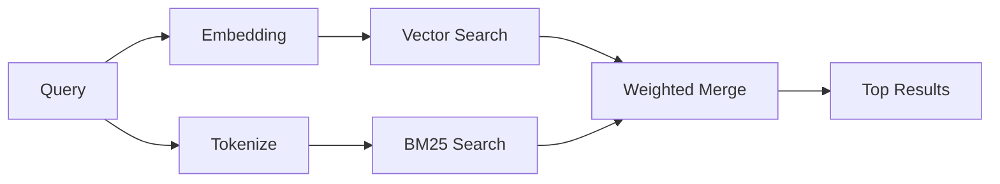

---
read_when:
    - Você quer entender como `memory_search` funciona
    - Você quer escolher um provedor de embedding
    - Você quer ajustar a qualidade da busca
summary: Como a busca de memória encontra notas relevantes usando embeddings e recuperação híbrida
title: Busca de memória
x-i18n:
    generated_at: "2026-04-15T14:40:29Z"
    model: gpt-5.4
    provider: openai
    source_hash: f5757aa8fe8f7fec30ef5c826f72230f591ce4cad591d81a091189d50d4262ed
    source_path: concepts/memory-search.md
    workflow: 15
---

# Busca de memória

`memory_search` encontra notas relevantes dos seus arquivos de memória, mesmo quando a
redação difere do texto original. Ela funciona indexando a memória em pequenos
blutos e pesquisando neles usando embeddings, palavras-chave ou ambos.

## Início rápido

Se você tiver uma assinatura do GitHub Copilot, uma chave de API da OpenAI, Gemini, Voyage ou Mistral
configurada, a busca de memória funciona automaticamente. Para definir um provedor
explicitamente:

```json5
{
  agents: {
    defaults: {
      memorySearch: {
        provider: "openai", // ou "gemini", "local", "ollama", etc.
      },
    },
  },
}
```

Para embeddings locais sem chave de API, use `provider: "local"` (requer
node-llama-cpp).

## Provedores compatíveis

| Provedor        | ID               | Precisa de chave de API | Observações                                          |
| --------------- | ---------------- | ----------------------- | ---------------------------------------------------- |
| Bedrock         | `bedrock`        | Não                     | Detectado automaticamente quando a cadeia de credenciais AWS é resolvida |
| Gemini          | `gemini`         | Sim                     | Oferece suporte a indexação de imagem/áudio          |
| GitHub Copilot  | `github-copilot` | Não                     | Detectado automaticamente, usa a assinatura do Copilot |
| Local           | `local`          | Não                     | Modelo GGUF, download de ~0,6 GB                     |
| Mistral         | `mistral`        | Sim                     | Detectado automaticamente                            |
| Ollama          | `ollama`         | Não                     | Local, deve ser definido explicitamente              |
| OpenAI          | `openai`         | Sim                     | Detectado automaticamente, rápido                    |
| Voyage          | `voyage`         | Sim                     | Detectado automaticamente                            |

## Como a busca funciona

O OpenClaw executa dois caminhos de recuperação em paralelo e mescla os resultados:



- **Busca vetorial** encontra notas com significado semelhante ("gateway host" corresponde a
  "a máquina que executa o OpenClaw").
- **Busca por palavra-chave BM25** encontra correspondências exatas (IDs, strings de erro, chaves de
  configuração).

Se apenas um caminho estiver disponível (sem embeddings ou sem FTS), o outro será executado sozinho.

Quando embeddings não estão disponíveis, o OpenClaw ainda usa classificação lexical sobre os resultados de FTS em vez de recorrer apenas à ordenação bruta por correspondência exata. Esse modo degradado prioriza chunks com cobertura mais forte dos termos da consulta e caminhos de arquivo relevantes, o que mantém um bom recall mesmo sem `sqlite-vec` ou um provedor de embedding.

## Como melhorar a qualidade da busca

Dois recursos opcionais ajudam quando você tem um histórico grande de notas:

### Decaimento temporal

Notas antigas perdem peso de classificação gradualmente para que informações recentes apareçam primeiro.
Com a meia-vida padrão de 30 dias, uma nota do mês passado pontua com 50% do
peso original. Arquivos perenes como `MEMORY.md` nunca sofrem decaimento.

<Tip>
Ative o decaimento temporal se o seu agente tiver meses de notas diárias e informações
desatualizadas continuarem aparecendo acima do contexto recente.
</Tip>

### MMR (diversidade)

Reduz resultados redundantes. Se cinco notas mencionarem a mesma configuração de roteador, o MMR
garante que os principais resultados cubram tópicos diferentes em vez de se repetirem.

<Tip>
Ative o MMR se `memory_search` continuar retornando trechos quase duplicados de
diferentes notas diárias.
</Tip>

### Ativar ambos

```json5
{
  agents: {
    defaults: {
      memorySearch: {
        query: {
          hybrid: {
            mmr: { enabled: true },
            temporalDecay: { enabled: true },
          },
        },
      },
    },
  },
}
```

## Memória multimodal

Com o Gemini Embedding 2, você pode indexar imagens e arquivos de áudio junto com
Markdown. As consultas de busca continuam sendo texto, mas correspondem a conteúdo
visual e de áudio. Consulte a [referência de configuração de memória](/pt-BR/reference/memory-config) para
a configuração.

## Busca na memória da sessão

Opcionalmente, você pode indexar transcrições de sessão para que `memory_search` possa recuperar
conversas anteriores. Isso é opt-in por meio de
`memorySearch.experimental.sessionMemory`. Consulte a
[referência de configuração](/pt-BR/reference/memory-config) para mais detalhes.

## Solução de problemas

**Sem resultados?** Execute `openclaw memory status` para verificar o índice. Se estiver vazio, execute
`openclaw memory index --force`.

**Apenas correspondências por palavra-chave?** Seu provedor de embedding pode não estar configurado. Verifique
`openclaw memory status --deep`.

**Texto em CJK não encontrado?** Recrie o índice FTS com
`openclaw memory index --force`.

## Leitura adicional

- [Active Memory](/pt-BR/concepts/active-memory) -- memória de subagente para sessões de chat interativas
- [Memory](/pt-BR/concepts/memory) -- layout de arquivos, backends, ferramentas
- [referência de configuração de memória](/pt-BR/reference/memory-config) -- todos os ajustes de configuração
