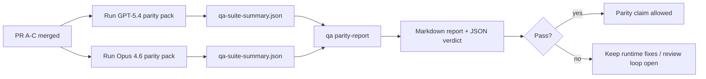

---
x-i18n:
    generated_at: "2026-04-11T15:15:56Z"
    model: gpt-5.4
    provider: openai
    source_hash: 910bcf7668becf182ef48185b43728bf2fa69629d6d50189d47d47b06f807a9e
    source_path: help/gpt54-codex-agentic-parity-maintainers.md
    workflow: 15
---

# Notas de manutenção sobre a paridade GPT-5.4 / Codex

Esta nota explica como revisar o programa de paridade GPT-5.4 / Codex como quatro unidades de merge sem perder a arquitetura original de seis contratos.

## Unidades de merge

### PR A: execução agentiva estrita

É responsável por:

- `executionContract`
- continuidade na mesma rodada com GPT-5 em primeiro lugar
- `update_plan` como acompanhamento de progresso não terminal
- estados explícitos de bloqueio em vez de paradas silenciosas apenas no plano

Não é responsável por:

- classificação de falhas de autenticação/runtime
- veracidade sobre permissões
- reformulação de replay/continuação
- benchmark de paridade

### PR B: veracidade de runtime

É responsável por:

- correção do escopo OAuth do Codex
- classificação tipada de falhas de provider/runtime
- veracidade sobre a disponibilidade de `/elevated full` e motivos de bloqueio

Não é responsável por:

- normalização do schema de ferramentas
- estado de replay/liveness
- benchmark gating

### PR C: correção de execução

É responsável por:

- compatibilidade de ferramentas OpenAI/Codex de propriedade do provider
- tratamento estrito de schema sem parâmetros
- exposição de replay inválido
- visibilidade do estado de tarefas longas pausadas, bloqueadas e abandonadas

Não é responsável por:

- continuação autoeleita
- comportamento genérico do dialeto Codex fora dos hooks do provider
- benchmark gating

### PR D: harness de paridade

É responsável por:

- primeiro pacote de cenários de GPT-5.4 vs Opus 4.6
- documentação de paridade
- mecânica do relatório de paridade e do gate de release

Não é responsável por:

- mudanças de comportamento em runtime fora do QA-lab
- simulação de autenticação/proxy/DNS dentro do harness

## Mapeamento de volta para os seis contratos originais

| Contrato original                         | Unidade de merge |
| ----------------------------------------- | ---------------- |
| Correção de transporte/autenticação do provider | PR B       |
| Compatibilidade de contrato/schema de ferramentas | PR C       |
| Execução na mesma rodada                  | PR A             |
| Veracidade sobre permissões               | PR B             |
| Correção de replay/continuação/liveness   | PR C             |
| Gate de benchmark/release                 | PR D             |

## Ordem de revisão

1. PR A
2. PR B
3. PR C
4. PR D

A PR D é a camada de comprovação. Ela não deve ser o motivo para atrasar PRs de correção de runtime.

## O que observar

### PR A

- execuções do GPT-5 agem ou falham de forma fechada em vez de parar em comentário
- `update_plan` não parece mais progresso por si só
- o comportamento continua com GPT-5 em primeiro lugar e com escopo limitado ao Pi embarcado

### PR B

- falhas de autenticação/proxy/runtime deixam de ser colapsadas em um tratamento genérico de “model failed”
- `/elevated full` só é descrito como disponível quando realmente está disponível
- os motivos de bloqueio ficam visíveis tanto para o modelo quanto para o runtime voltado ao usuário

### PR C

- o registro estrito de ferramentas OpenAI/Codex se comporta de forma previsível
- ferramentas sem parâmetros não falham nas verificações estritas de schema
- resultados de replay e compactação preservam um estado de liveness verdadeiro

### PR D

- o pacote de cenários é compreensível e reproduzível
- o pacote inclui uma trilha mutável de segurança de replay, e não apenas fluxos somente leitura
- os relatórios são legíveis por humanos e automação
- as alegações de paridade são respaldadas por evidências, não anedóticas

Artefatos esperados da PR D:

- `qa-suite-report.md` / `qa-suite-summary.json` para cada execução de modelo
- `qa-agentic-parity-report.md` com comparação agregada e no nível de cenário
- `qa-agentic-parity-summary.json` com um veredito legível por máquina

## Gate de release

Não afirme paridade ou superioridade do GPT-5.4 sobre o Opus 4.6 até que:

- PR A, PR B e PR C tenham sido mergeadas
- PR D execute o primeiro pacote de paridade sem falhas
- as suítes de regressão de veracidade de runtime permaneçam verdes
- o relatório de paridade não mostre casos de falso sucesso nem regressão no comportamento de parada

O harness de paridade não é a única fonte de evidência. Mantenha essa separação explícita na revisão:

- a PR D é responsável pela comparação baseada em cenários entre GPT-5.4 e Opus 4.6
- as suítes determinísticas da PR B continuam sendo responsáveis pelas evidências de autenticação/proxy/DNS e de veracidade sobre acesso total

## Mapa de objetivo para evidência

| Item do gate de conclusão                 | Responsável principal | Artefato de revisão                                                  |
| ----------------------------------------- | --------------------- | -------------------------------------------------------------------- |
| Sem travamentos apenas no plano           | PR A                  | testes de runtime agentivo estrito e `approval-turn-tool-followthrough` |
| Sem progresso falso ou conclusão falsa de ferramenta | PR A + PR D   | contagem de falsos sucessos na paridade mais detalhes do relatório no nível de cenário |
| Sem orientação falsa sobre `/elevated full` | PR B                | suítes determinísticas de veracidade de runtime                      |
| Falhas de replay/liveness continuam explícitas | PR C + PR D      | suítes de ciclo de vida/replay mais `compaction-retry-mutating-tool` |
| GPT-5.4 iguala ou supera Opus 4.6         | PR D                  | `qa-agentic-parity-report.md` e `qa-agentic-parity-summary.json`     |

## Atalho para revisores: antes vs depois

| Problema visível para o usuário antes                       | Sinal de revisão depois                                                                  |
| ----------------------------------------------------------- | ---------------------------------------------------------------------------------------- |
| GPT-5.4 parava após planejar                                | A PR A mostra comportamento de agir-ou-bloquear em vez de conclusão apenas em comentário |
| O uso de ferramentas parecia frágil com schemas estritos do OpenAI/Codex | A PR C mantém previsível o registro de ferramentas e a invocação sem parâmetros |
| As dicas de `/elevated full` às vezes eram enganosas        | A PR B vincula a orientação à capacidade real do runtime e aos motivos de bloqueio       |
| Tarefas longas podiam desaparecer na ambiguidade de replay/compactação | A PR C emite estado explícito de pausado, bloqueado, abandonado e replay inválido |
| As alegações de paridade eram anedóticas                    | A PR D produz um relatório mais um veredito em JSON com a mesma cobertura de cenários em ambos os modelos |
