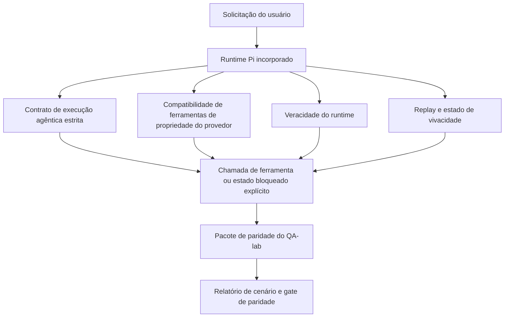
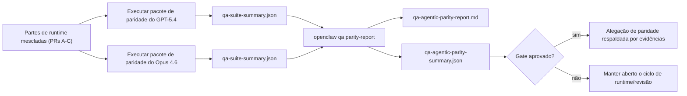

---
x-i18n:
    generated_at: "2026-04-11T15:15:56Z"
    model: gpt-5.4
    provider: openai
    source_hash: 7ee6b925b8a0f8843693cea9d50b40544657b5fb8a9e0860e2ff5badb273acb6
    source_path: help/gpt54-codex-agentic-parity.md
    workflow: 15
---

# Paridade Agêntica do GPT-5.4 / Codex no OpenClaw

O OpenClaw já funcionava bem com modelos de fronteira que usam ferramentas, mas os modelos GPT-5.4 e no estilo Codex ainda apresentavam desempenho inferior em alguns aspectos práticos:

- podiam parar após planejar em vez de fazer o trabalho
- podiam usar incorretamente esquemas de ferramentas estritos do OpenAI/Codex
- podiam pedir `/elevated full` mesmo quando o acesso total era impossível
- podiam perder o estado de tarefas longas durante replay ou compactação
- alegações de paridade em relação ao Claude Opus 4.6 eram baseadas em relatos anedóticos em vez de cenários repetíveis

Este programa de paridade corrige essas lacunas em quatro partes revisáveis.

## O que mudou

### PR A: execução agêntica estrita

Esta parte adiciona um contrato de execução `strict-agentic` opcional para execuções do GPT-5 incorporado no Pi.

Quando ativado, o OpenClaw deixa de aceitar turnos apenas com plano como conclusão “boa o suficiente”. Se o modelo apenas disser o que pretende fazer e não realmente usar ferramentas nem progredir, o OpenClaw tenta novamente com uma orientação para agir agora e depois falha de forma segura com um estado bloqueado explícito, em vez de encerrar a tarefa silenciosamente.

Isso melhora a experiência com GPT-5.4 principalmente em:

- acompanhamentos curtos como “ok, faça isso”
- tarefas de código em que a primeira etapa é óbvia
- fluxos em que `update_plan` deve servir para acompanhar progresso, e não como texto de preenchimento

### PR B: veracidade do runtime

Esta parte faz o OpenClaw dizer a verdade sobre duas coisas:

- por que a chamada ao provedor/runtime falhou
- se `/elevated full` está realmente disponível

Isso significa que o GPT-5.4 recebe sinais de runtime melhores para escopo ausente, falhas de renovação de autenticação, falhas de autenticação HTML 403, problemas de proxy, falhas de DNS ou timeout, e modos de acesso total bloqueados. O modelo fica menos propenso a inventar a remediação errada ou continuar pedindo um modo de permissão que o runtime não pode fornecer.

### PR C: correção de execução

Esta parte melhora dois tipos de correção:

- compatibilidade com esquemas de ferramentas OpenAI/Codex de propriedade do provedor
- visibilidade de replay e vivacidade de tarefas longas

O trabalho de compatibilidade com ferramentas reduz o atrito de esquema para registro estrito de ferramentas OpenAI/Codex, especialmente em torno de ferramentas sem parâmetros e expectativas estritas de objeto na raiz. O trabalho de replay/vivacidade torna tarefas longas mais observáveis, para que estados pausado, bloqueado e abandonado fiquem visíveis em vez de desaparecerem em um texto genérico de falha.

### PR D: harness de paridade

Esta parte adiciona o primeiro pacote de paridade do QA-lab, para que GPT-5.4 e Opus 4.6 possam ser exercitados nos mesmos cenários e comparados usando evidências compartilhadas.

O pacote de paridade é a camada de prova. Ele não altera o comportamento do runtime por si só.

Depois de ter dois artefatos `qa-suite-summary.json`, gere a comparação do gate de release com:

```bash
pnpm openclaw qa parity-report \
  --repo-root . \
  --candidate-summary .artifacts/qa-e2e/gpt54/qa-suite-summary.json \
  --baseline-summary .artifacts/qa-e2e/opus46/qa-suite-summary.json \
  --output-dir .artifacts/qa-e2e/parity
```

Esse comando grava:

- um relatório Markdown legível por humanos
- um veredito JSON legível por máquina
- um resultado de gate explícito `pass` / `fail`

## Por que isso melhora o GPT-5.4 na prática

Antes deste trabalho, o GPT-5.4 no OpenClaw podia parecer menos agêntico que o Opus em sessões reais de programação porque o runtime tolerava comportamentos especialmente prejudiciais para modelos no estilo GPT-5:

- turnos só com comentários
- atrito de esquema em torno de ferramentas
- feedback de permissão vago
- quebra silenciosa de replay ou compactação

O objetivo não é fazer o GPT-5.4 imitar o Opus. O objetivo é dar ao GPT-5.4 um contrato de runtime que recompense progresso real, forneça semântica mais limpa para ferramentas e permissões, e transforme modos de falha em estados explícitos, legíveis por máquina e por humanos.

Isso muda a experiência do usuário de:

- “o modelo tinha um bom plano, mas parou”

para:

- “o modelo ou agiu, ou o OpenClaw mostrou o motivo exato pelo qual ele não pôde agir”

## Antes vs. depois para usuários do GPT-5.4

| Antes deste programa                                                                        | Depois das PRs A-D                                                                      |
| ------------------------------------------------------------------------------------------- | --------------------------------------------------------------------------------------- |
| O GPT-5.4 podia parar após um plano razoável sem dar o próximo passo com ferramenta         | A PR A transforma “apenas plano” em “aja agora ou mostre um estado bloqueado”          |
| Esquemas estritos de ferramentas podiam rejeitar ferramentas sem parâmetros ou no formato OpenAI/Codex de maneiras confusas | A PR C torna o registro e a invocação de ferramentas de propriedade do provedor mais previsíveis |
| A orientação sobre `/elevated full` podia ser vaga ou incorreta em runtimes bloqueados      | A PR B dá ao GPT-5.4 e ao usuário dicas de runtime e permissões fiéis à realidade      |
| Falhas de replay ou compactação podiam dar a sensação de que a tarefa simplesmente sumiu    | A PR C mostra explicitamente resultados pausados, bloqueados, abandonados e inválidos para replay |
| “O GPT-5.4 parece pior que o Opus” era em grande parte anedótico                            | A PR D transforma isso no mesmo pacote de cenários, nas mesmas métricas e em um gate rígido de pass/fail |

## Arquitetura



## Fluxo de release



## Pacote de cenários

O pacote de paridade de primeira onda atualmente cobre cinco cenários:

### `approval-turn-tool-followthrough`

Verifica se o modelo não para em “vou fazer isso” após uma aprovação curta. Ele deve executar a primeira ação concreta no mesmo turno.

### `model-switch-tool-continuity`

Verifica se o trabalho com uso de ferramentas permanece coerente através de limites de troca de modelo/runtime, em vez de reiniciar em comentários ou perder o contexto de execução.

### `source-docs-discovery-report`

Verifica se o modelo consegue ler código-fonte e documentação, sintetizar conclusões e continuar a tarefa de forma agêntica, em vez de produzir um resumo superficial e parar cedo.

### `image-understanding-attachment`

Verifica se tarefas de modo misto que envolvem anexos permanecem acionáveis e não colapsam em uma narração vaga.

### `compaction-retry-mutating-tool`

Verifica se uma tarefa com uma gravação mutável real mantém a insegurança de replay explícita, em vez de parecer silenciosamente segura para replay quando a execução sofre compactação, retry ou perda de estado de resposta sob pressão.

## Matriz de cenários

| Cenário                            | O que testa                              | Bom comportamento do GPT-5.4                                                   | Sinal de falha                                                                  |
| ---------------------------------- | ---------------------------------------- | ------------------------------------------------------------------------------ | ------------------------------------------------------------------------------- |
| `approval-turn-tool-followthrough` | Turnos curtos de aprovação após um plano | Inicia imediatamente a primeira ação concreta com ferramenta, em vez de repetir a intenção | acompanhamento só com plano, nenhuma atividade de ferramenta, ou turno bloqueado sem um bloqueador real |
| `model-switch-tool-continuity`     | Troca de runtime/modelo durante uso de ferramentas | Preserva o contexto da tarefa e continua agindo de forma coerente              | reinicia em comentários, perde o contexto de ferramenta, ou para após a troca   |
| `source-docs-discovery-report`     | Leitura de código + síntese + ação       | Encontra fontes, usa ferramentas e produz um relatório útil sem travar         | resumo superficial, trabalho com ferramentas ausente, ou parada de turno incompleta |
| `image-understanding-attachment`   | Trabalho agêntico guiado por anexo       | Interpreta o anexo, conecta-o às ferramentas e continua a tarefa               | narração vaga, anexo ignorado, ou nenhuma próxima ação concreta                 |
| `compaction-retry-mutating-tool`   | Trabalho mutável sob pressão de compactação | Executa uma gravação real e mantém a insegurança de replay explícita após o efeito colateral | a gravação mutável acontece, mas a segurança de replay é implícita, ausente ou contraditória |

## Gate de release

O GPT-5.4 só pode ser considerado em paridade ou melhor quando o runtime mesclado passa no pacote de paridade e nas regressões de veracidade do runtime ao mesmo tempo.

Resultados obrigatórios:

- nenhum travamento em plano apenas quando a próxima ação com ferramenta é clara
- nenhuma conclusão falsa sem execução real
- nenhuma orientação incorreta sobre `/elevated full`
- nenhum abandono silencioso por replay ou compactação
- métricas do pacote de paridade pelo menos tão fortes quanto a baseline acordada do Opus 4.6

Para o harness de primeira onda, o gate compara:

- taxa de conclusão
- taxa de parada não intencional
- taxa de chamada de ferramenta válida
- contagem de sucesso falso

A evidência de paridade é intencionalmente dividida em duas camadas:

- a PR D comprova o comportamento do GPT-5.4 vs. Opus 4.6 nos mesmos cenários com o QA-lab
- as suítes determinísticas da PR B comprovam veracidade de autenticação, proxy, DNS e `/elevated full` fora do harness

## Matriz objetivo-evidência

| Item do gate de conclusão                               | PR responsável | Fonte de evidência                                                 | Sinal de aprovação                                                                     |
| ------------------------------------------------------- | -------------- | ------------------------------------------------------------------ | -------------------------------------------------------------------------------------- |
| O GPT-5.4 não trava mais após planejar                  | PR A           | `approval-turn-tool-followthrough` mais as suítes de runtime da PR A | turnos de aprovação disparam trabalho real ou um estado bloqueado explícito            |
| O GPT-5.4 não finge mais progresso nem conclusão falsa de ferramenta | PR A + PR D    | resultados de cenários do relatório de paridade e contagem de sucesso falso | nenhum resultado de aprovação suspeito e nenhuma conclusão apenas com comentários       |
| O GPT-5.4 não dá mais orientação falsa sobre `/elevated full` | PR B           | suítes determinísticas de veracidade                               | razões de bloqueio e dicas de acesso total permanecem fiéis ao runtime                 |
| Falhas de replay/vivacidade permanecem explícitas       | PR C + PR D    | suítes de ciclo de vida/replay da PR C mais `compaction-retry-mutating-tool` | trabalho mutável mantém a insegurança de replay explícita, em vez de desaparecer silenciosamente |
| O GPT-5.4 iguala ou supera o Opus 4.6 nas métricas acordadas | PR D           | `qa-agentic-parity-report.md` e `qa-agentic-parity-summary.json`   | mesma cobertura de cenários e nenhuma regressão em conclusão, comportamento de parada ou uso válido de ferramentas |

## Como ler o veredito de paridade

Use o veredito em `qa-agentic-parity-summary.json` como a decisão final legível por máquina para o pacote de paridade de primeira onda.

- `pass` significa que o GPT-5.4 cobriu os mesmos cenários que o Opus 4.6 e não regrediu nas métricas agregadas acordadas.
- `fail` significa que pelo menos um gate rígido foi acionado: conclusão mais fraca, paradas não intencionais piores, uso válido de ferramentas mais fraco, qualquer caso de sucesso falso, ou cobertura de cenários incompatível.
- “problema de CI compartilhado/base” não é, por si só, um resultado de paridade. Se ruído de CI fora da PR D bloquear uma execução, o veredito deve esperar por uma execução limpa do runtime mesclado, em vez de ser inferido a partir de logs da época do branch.
- A veracidade de autenticação, proxy, DNS e `/elevated full` continua vindo das suítes determinísticas da PR B, então a alegação final de release precisa dos dois: um veredito de paridade aprovando na PR D e cobertura de veracidade verde na PR B.

## Quem deve ativar `strict-agentic`

Use `strict-agentic` quando:

- espera-se que o agente aja imediatamente quando a próxima etapa for óbvia
- modelos GPT-5.4 ou da família Codex forem o runtime principal
- você preferir estados bloqueados explícitos em vez de respostas “úteis” apenas de recapitulação

Mantenha o contrato padrão quando:

- você quiser o comportamento atual mais flexível
- você não estiver usando modelos da família GPT-5
- você estiver testando prompts em vez da aplicação do runtime
